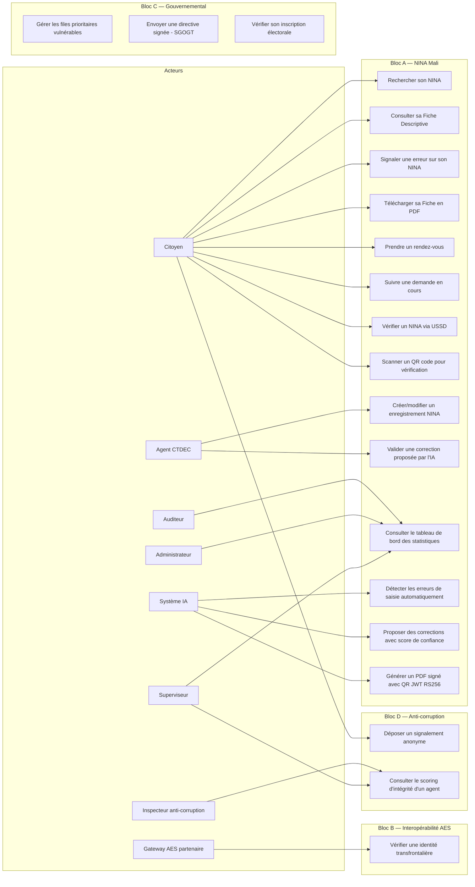

# 01 — Cahier des Charges : Spécifications Fonctionnelles et Non-Fonctionnelles

> **Bloc concerné** : Transversal (tous les blocs A → F) **Prérequis** : Document 00-README-INDEX.md
> lu et compris **Durée estimée** : 8 à 12 heures pour un étudiant seul **Livrables de cette étape**
> :
>
> - Ce document complété et validé par le professeur tuteur
> - Fichier `docs/adr/ADR-001-cahier-des-charges.md` dans le repo
> - Glossaire de référence du projet
> - Matrice de traçabilité exigences ↔ objectifs

---

## 1. Objectif pédagogique

Le cahier des charges est le **premier livrable formel** de tout projet logiciel professionnel. Il
répond à une question simple mais fondamentale : **que doit faire le système, et à quels critères
mesurables doit-il satisfaire ?**

Dans cette étape, on apprend à :

- **Distinguer exigences fonctionnelles et non-fonctionnelles** — Ce que le système _fait_
  (fonctionnel) versus _comment il le fait_ (non-fonctionnel : performance, sécurité,
  disponibilité).
- **Structurer les besoins par acteur** — Un citoyen, un agent CTDEC et un inspecteur
  anti-corruption n'ont pas les mêmes besoins. Chaque exigence doit être reliée à un acteur concret.
- **Définir des critères d'acceptation mesurables** — « Le système doit être rapide » n'est pas un
  critère. « Le temps de réponse de l'API de recherche NINA doit être inférieur à 500 ms au
  percentile 95 » en est un.
- **Prioriser avec la méthode MoSCoW** — Must have (indispensable), Should have (important), Could
  have (souhaitable), Won't have this time (hors périmètre actuel).

Ce document sert de **contrat implicite** entre l'étudiant et son professeur tuteur : il fixe ce qui
sera implémenté, évalué et démontré lors de la soutenance.

---

## 2. Technologies utilisées (avec versions à jour)

Le cahier des charges est un document d'analyse, pas de code. Les « technologies » ici sont des
**outils de modélisation et de documentation**.

| Technologie | Version    | Rôle dans cette étape                                   | Documentation officielle       |
| ----------- | ---------- | ------------------------------------------------------- | ------------------------------ |
| Mermaid     | 11+        | Diagrammes de cas d'utilisation, contexte système, flux | https://mermaid.js.org/intro/  |
| Markdown    | CommonMark | Rédaction structurée du cahier des charges              | https://commonmark.org/        |
| Git         | 2.47+      | Versionnement du document (chaque révision traçable)    | https://git-scm.com/doc        |
| VS Code     | 1.100+     | Rédaction avec extensions Markdown Preview et Mermaid   | https://code.visualstudio.com/ |

---

## 3. Architecture / Schéma

### 3.1 Diagramme de contexte système (vue C4 — niveau 1)

Ce diagramme montre la NINA-AES Platform au centre de son écosystème, avec les acteurs externes qui
interagissent avec elle.

```
┌─────────────────────────────────────────────────────────────────────────────┐
│                        ÉCOSYSTÈME NINA-AES PLATFORM                        │
│                                                                             │
│   ┌──────────┐     ┌──────────┐     ┌──────────┐     ┌──────────────────┐  │
│   │ Citoyen  │     │ Citoyen  │     │ Citoyen  │     │ Citoyen          │  │
│   │ (Web)    │     │ (Mobile) │     │ (USSD)   │     │ (Borne kiosque)  │  │
│   └────┬─────┘     └────┬─────┘     └────┬─────┘     └───────┬──────────┘  │
│        │                │                │                    │             │
│        ▼                ▼                ▼                    ▼             │
│  ┌─────────────────────────────────────────────────────────────────────┐    │
│  │                                                                     │    │
│  │                      NINA-AES PLATFORM                              │    │
│  │                                                                     │    │
│  │  ┌─────────────┐ ┌────────────┐ ┌───────────┐ ┌─────────────────┐  │    │
│  │  │ Portail     │ │ Dashboard  │ │ Portail   │ │ API Gateway     │  │    │
│  │  │ Citoyen     │ │ Admin      │ │ Gouv.     │ │ (11 services)   │  │    │
│  │  └─────────────┘ └────────────┘ └───────────┘ └─────────────────┘  │    │
│  │                                                                     │    │
│  └────────┬──────────────┬──────────────┬──────────────┬──────────────┘    │
│           │              │              │              │                    │
│           ▼              ▼              ▼              ▼                    │
│   ┌──────────┐   ┌──────────┐   ┌────────────┐  ┌──────────────┐          │
│   │ Agent    │   │ Supervi- │   │ Inspecteur │  │ Auditeur     │          │
│   │ CTDEC    │   │ seur     │   │ anti-corr. │  │              │          │
│   └──────────┘   └──────────┘   └────────────┘  └──────────────┘          │
│                                                                             │
│   ┌─────────────────────────────────────┐  ┌──────────────────────────┐    │
│   │ Systèmes externes                   │  │ Partenaires AES          │    │
│   │ ├── Africa's Talking (USSD/SMS)     │  │ ├── Gateway Niger        │    │
│   │ ├── Orange Mali API (SMS)           │  │ └── Gateway Burkina Faso │    │
│   │ └── Cloudflare (CDN)                │  │     (mTLS + Ed25519)     │    │
│   └─────────────────────────────────────┘  └──────────────────────────┘    │
│                                                                             │
└─────────────────────────────────────────────────────────────────────────────┘
```

### 3.2 Diagramme des cas d'utilisation principaux



---

## 4. Spécifications détaillées

### 4.1 Identification des acteurs du système

| ID     | Acteur                         | Description                                                                                               | Canal d'accès             | Authentification                       |
| ------ | ------------------------------ | --------------------------------------------------------------------------------------------------------- | ------------------------- | -------------------------------------- |
| ACT-01 | **Citoyen malien**             | Toute personne possédant ou demandant un NINA. Peut être au Mali ou dans la diaspora.                     | Web, Mobile, USSD, Borne  | Email/Téléphone + OTP SMS              |
| ACT-02 | **Agent CTDEC**                | Fonctionnaire du Centre de Traitement des Données de l'État Civil, saisit et corrige les enregistrements. | Web (Dashboard admin)     | Badge NFC + PIN + MFA TOTP             |
| ACT-03 | **Superviseur**                | Responsable d'une équipe d'agents. Valide les corrections critiques, consulte les statistiques.           | Web (Dashboard admin)     | Badge NFC + PIN + MFA TOTP             |
| ACT-04 | **Administrateur système**     | Gère la configuration technique, les utilisateurs, les rôles, les services.                               | Web (Dashboard admin)     | Keycloak + MFA TOTP obligatoire        |
| ACT-05 | **Auditeur**                   | Accès en lecture seule aux journaux d'audit et aux statistiques. Ne peut modifier aucune donnée.          | Web (Dashboard admin)     | Keycloak + MFA TOTP                    |
| ACT-06 | **Inspecteur anti-corruption** | Reçoit et traite les signalements anonymes. Accès au scoring d'intégrité des agents.                      | Web (Portail gouvernance) | Keycloak + MFA TOTP + clé privée SIGAC |
| ACT-07 | **Système IA**                 | Processus automatisé qui analyse la base NINA et propose des corrections. N'est pas un humain.            | API interne               | Clé de service (service account)       |
| ACT-08 | **Gateway AES partenaire**     | Système informatique d'un pays partenaire (Niger, Burkina Faso) qui vérifie une identité.                 | API inter-gouvernementale | mTLS + signature Ed25519               |
| ACT-09 | **Agent mobile de terrain**    | Agent équipé d'une tablette qui se déplace pour enrôler les personnes vulnérables à domicile.             | Tablette (mode offline)   | Badge NFC + PIN                        |

---

### 4.2 Exigences fonctionnelles — Bloc A (NINA Mali)

#### Module Identité (identity-service — port 3001)

| ID       | Exigence                                                                                                                                                                       | Priorité | Critère d'acceptation                                                               |
| -------- | ------------------------------------------------------------------------------------------------------------------------------------------------------------------------------ | -------- | ----------------------------------------------------------------------------------- |
| EF-A-001 | Le système doit permettre la **recherche d'un enregistrement NINA** par numéro exact (15 caractères).                                                                          | Must     | Recherche par NINA exact retourne le résultat en < 200 ms                           |
| EF-A-002 | Le système doit permettre la **recherche floue** par nom, prénom ou combinaison partielle.                                                                                     | Must     | Recherche floue « Mamadou » retrouve « Mohamed » avec score de similarité >= 0.75   |
| EF-A-003 | Le système doit **valider le format NINA** (14 chiffres + 1 lettre de contrôle) avant toute opération.                                                                         | Must     | Rejet immédiat avec message d'erreur clair si le format est invalide                |
| EF-A-004 | Le système doit **calculer automatiquement la lettre de contrôle** lors de la création d'un NINA.                                                                              | Must     | Lettre de contrôle recalculée et vérifiée à chaque lecture                          |
| EF-A-005 | Le système doit **valider les codes géographiques** (région, cercle, commune) contre le référentiel RAVEC.                                                                     | Must     | Code géographique inexistant → erreur 422 avec suggestion du code le plus proche    |
| EF-A-006 | Le système doit permettre la **création d'un enregistrement NINA** complet par un agent authentifié.                                                                           | Must     | Tous les champs obligatoires validés, audit log généré, code 201 retourné           |
| EF-A-007 | Le système doit permettre la **modification d'un enregistrement** avec justificatif obligatoire et approbation superviseur pour les champs critiques (nom, date de naissance). | Must     | Modification sans justificatif → rejet. Champ critique → file d'attente superviseur |
| EF-A-008 | Le système doit offrir une **pagination** et des **filtres avancés** (par région, par date d'enrôlement, par statut de correction).                                            | Should   | Liste paginée avec curseur, 50 résultats par page par défaut, filtres cumulables    |
| EF-A-009 | Le système doit gérer les **doublons potentiels** en alertant l'agent quand un enregistrement similaire existe déjà (même nom + même date de naissance + même commune).        | Should   | Alerte avec liste des doublons potentiels triés par score de similarité             |
| EF-A-010 | Le système doit supporter le **multilinguisme** dans les données : noms en caractères latins, arabes (translittération) et alphabets locaux.                                   | Could    | Champ `name_variants` JSON supportant plusieurs écritures du même nom               |

#### Module Authentification (auth-service — port 3002)

| ID       | Exigence                                                                                                     | Priorité | Critère d'acceptation                                                            |
| -------- | ------------------------------------------------------------------------------------------------------------ | -------- | -------------------------------------------------------------------------------- |
| EF-A-011 | Le système doit authentifier les **citoyens** via email ou numéro de téléphone + code OTP SMS.               | Must     | OTP envoyé en < 10 secondes, validité 5 minutes, 3 tentatives max                |
| EF-A-012 | Le système doit authentifier les **agents** via identifiant unique + mot de passe + MFA TOTP obligatoire.    | Must     | MFA obligatoire, session JWT RS256 expiration 15 min, refresh token 7 jours      |
| EF-A-013 | Le système doit implémenter **6 rôles RBAC** avec permissions granulaires.                                   | Must     | Matrice rôles/permissions documentée et testée unitairement                      |
| EF-A-014 | Le système doit **révoquer immédiatement** une session en cas de suspicion de compromission.                 | Must     | Endpoint `/auth/revoke` invalide tous les tokens d'un utilisateur en < 1 seconde |
| EF-A-015 | Le système doit intégrer **Keycloak** comme fournisseur d'identité centralisé (OAuth 2.0 + OIDC).            | Must     | Login flow via Keycloak fonctionnel sur les 3 apps Next.js                       |
| EF-A-016 | Le système doit **verrouiller un compte agent** après 5 tentatives échouées consécutives (délai progressif). | Should   | Verrouillage 15 min après 5 échecs, 1h après 10, notification au superviseur     |

#### Module Audit (audit-service — port 3007)

| ID       | Exigence                                                                                                    | Priorité | Critère d'acceptation                                                                                 |
| -------- | ----------------------------------------------------------------------------------------------------------- | -------- | ----------------------------------------------------------------------------------------------------- |
| EF-A-017 | Le système doit **enregistrer chaque action** de chaque utilisateur dans un journal immuable (append-only). | Must     | Toute action génère un audit log avec : acteur, action, ressource, timestamp, IP, payload avant/après |
| EF-A-018 | Le système doit former une **chaîne de hash Merkle** (SHA-256) à partir des entrées d'audit.                | Must     | Hash de l'entrée N dépend du hash de l'entrée N-1. Endpoint `/audit/verify` confirme l'intégrité      |
| EF-A-019 | Le système doit permettre la **recherche dans les logs** par acteur, action, ressource, plage de dates.     | Must     | Résultats paginés en < 500 ms sur 1 million d'entrées                                                 |
| EF-A-020 | Le système doit **conserver les logs** pendant un minimum de **10 ans** sans possibilité de suppression.    | Must     | Aucun endpoint DELETE sur les logs d'audit. Politique de rétention PostgreSQL configurée              |
| EF-A-021 | Le système doit exporter les logs d'audit en **format CSV ou JSON** pour les auditeurs externes.            | Should   | Export filtré par plage de dates, taille max 100 000 lignes par export                                |

#### Module Document (document-service — port 3004)

| ID       | Exigence                                                                                                                                                 | Priorité | Critère d'acceptation                                                                    |
| -------- | -------------------------------------------------------------------------------------------------------------------------------------------------------- | -------- | ---------------------------------------------------------------------------------------- |
| EF-A-022 | Le système doit **générer la Fiche Descriptive Individuelle** en PDF (format A4) conforme au modèle CTDEC.                                               | Must     | PDF généré avec tous les champs, photo, et mise en page fidèle au modèle officiel        |
| EF-A-023 | Le système doit inclure un **QR code JWT RS256** signé contenant : NINA, hash SHA-256 de l'empreinte biométrique, timestamp d'émission, signature CTDEC. | Must     | QR code scannable, JWT vérifiable avec la clé publique du CTDEC, expiration configurable |
| EF-A-024 | Le système doit offrir un **endpoint de vérification** : scanner un QR → valider la signature → retourner le statut d'authenticité.                      | Must     | Réponse `{ valid: true/false, nina: "...", issuedAt: "...", reason: "..." }` en < 300 ms |
| EF-A-025 | Le système doit stocker les documents générés dans **MinIO** (stockage objet compatible S3).                                                             | Must     | PDF stocké avec métadonnées (NINA, date, version), accessible via URL signée temporaire  |
| EF-A-026 | Le système doit permettre le **téléchargement** de la Fiche par le citoyen authentifié.                                                                  | Must     | Téléchargement via URL signée avec expiration 15 min, audit log de chaque téléchargement |

#### Module IA (ai-service — port 3003)

| ID       | Exigence                                                                                                                                                   | Priorité | Critère d'acceptation                                                                                |
| -------- | ---------------------------------------------------------------------------------------------------------------------------------------------------------- | -------- | ---------------------------------------------------------------------------------------------------- |
| EF-A-027 | Le module IA doit exécuter un **pipeline de détection en 5 étapes** : ingestion, normalisation, analyse, scoring, soumission.                              | Must     | Pipeline exécutable en batch (quotidien) et en temps réel (à la saisie)                              |
| EF-A-028 | Le module doit calculer une **distance de Jaro-Winkler** pour détecter les fautes de frappe dans les noms.                                                 | Must     | Détection de « Mamadou » / « Mamadu » avec score >= 0.90                                             |
| EF-A-029 | Le module doit utiliser un **matching phonétique** (Soundex/Metaphone) pour identifier les variantes entre langues.                                        | Must     | « Mohamed » ↔ « Mamadou » identifiés comme variantes phonétiques                                     |
| EF-A-030 | Le module doit produire un **score de confiance XGBoost** (0–100) pour chaque correction proposée.                                                         | Must     | AUC-ROC > 0.90 sur le dataset de test synthétique                                                    |
| EF-A-031 | Le module doit **soumettre les corrections** à la validation humaine selon trois seuils : automatique (>= 85%), revue manuelle (60–84%), log seul (< 60%). | Must     | Corrections >= 85% apparaissent dans la file de validation agent avec bouton « Approuver / Rejeter » |
| EF-A-032 | Le module doit fournir un **dataset synthétique** de 10 000 enregistrements NINA avec erreurs intentionnelles couvrant tous les types documentés.          | Must     | Dataset versionné dans `ai-models/datasets/`, reproductible via script Python                        |
| EF-A-033 | Le module doit **valider les codes géographiques** par croisement avec le référentiel des régions, cercles et communes du Mali.                            | Should   | Code invalide détecté et correction la plus probable proposée                                        |
| EF-A-034 | Le module doit pouvoir traiter un **OCR** sur les actes de naissance manuscrits scannés (Tesseract).                                                       | Could    | Taux de reconnaissance > 92% sur documents de qualité standard                                       |

#### Portail Citoyen (apps/citizen — port 4000)

| ID       | Exigence                                                                                                                        | Priorité | Critère d'acceptation                                                                |
| -------- | ------------------------------------------------------------------------------------------------------------------------------- | -------- | ------------------------------------------------------------------------------------ |
| EF-A-035 | Le portail doit proposer un **écran d'accueil** (PC-01) avec barre de recherche NINA et accès rapide aux services principaux.   | Must     | Page d'accueil chargée en < 2 secondes (Lighthouse score >= 90)                      |
| EF-A-036 | Le portail doit afficher un **écran de résultat** (PC-02) montrant les données NINA du citoyen avec indicateur de qualité IA.   | Must     | Données affichées en lecture seule, score IA visible, bouton « Signaler une erreur » |
| EF-A-037 | Le portail doit proposer un **formulaire de correction** (PC-03) avec upload de justificatifs (photo d'acte, pièce d'identité). | Must     | Upload accepte JPEG/PNG/PDF, taille max 5 Mo, prévisualisation avant envoi           |
| EF-A-038 | Le portail doit offrir une **prise de rendez-vous** (PC-04) dans les centres d'enrôlement avec calendrier interactif.           | Must     | Créneaux disponibles affichés par centre, confirmation SMS après réservation         |
| EF-A-039 | Le portail doit afficher un **écran de suivi** (PC-05) avec timeline de l'avancement de chaque demande.                         | Should   | Statuts : Soumis → En cours de revue → Approuvé/Rejeté → Appliqué                    |
| EF-A-040 | Le portail doit proposer un **formulaire de signalement** (PC-06) pour les problèmes de corruption ou dysfonctionnements.       | Should   | Signalement chiffré côté client avant envoi, token de suivi anonyme remis            |
| EF-A-041 | Le portail doit être disponible en **5 langues minimum** : français, bambara, songhaï, tamasheq, peul.                          | Must     | Sélecteur de langue persistant, traductions complètes (pas de fallback anglais)      |
| EF-A-042 | Le portail doit être une **Progressive Web Application** (PWA) installable sur smartphone.                                      | Should   | Manifest PWA valide, service worker pour cache offline des pages consultées          |

#### Dashboard Administrateur (apps/admin — port 4001)

| ID       | Exigence                                                                                                                                                                                | Priorité | Critère d'acceptation                                                          |
| -------- | --------------------------------------------------------------------------------------------------------------------------------------------------------------------------------------- | -------- | ------------------------------------------------------------------------------ |
| EF-A-043 | Le dashboard doit afficher un **tableau de bord** (AD-01) avec statistiques en temps réel : enregistrements totaux, corrections en attente, score IA moyen, alertes.                    | Must     | Données rafraîchies toutes les 30 secondes via WebSocket ou polling            |
| EF-A-044 | Le dashboard doit offrir une **interface de gestion des corrections** (AD-02) proposées par l'IA, avec détails avant/après, score de confiance, et boutons Approuver/Rejeter/Escalader. | Must     | Agent voit la correction proposée, les justificatifs, peut approuver en 1 clic |
| EF-A-045 | Le dashboard doit inclure un **écran SIGAC** (AD-03) avec liste des agents et leur scoring d'intégrité (visible uniquement par superviseurs et inspecteurs).                            | Should   | Score d'intégrité mis à jour quotidiennement, alerte si score < 40             |

#### Application Mobile (apps/mobile)

| ID       | Exigence                                                                                                              | Priorité | Critère d'acceptation                                                                     |
| -------- | --------------------------------------------------------------------------------------------------------------------- | -------- | ----------------------------------------------------------------------------------------- |
| EF-A-046 | L'app doit permettre le **scan du QR code** d'une Fiche Descriptive pour vérification instantanée.                    | Must     | Caméra activée, QR décodé, JWT vérifié, résultat affiché en < 3 secondes                  |
| EF-A-047 | L'app doit supporter l'**authentification biométrique locale** (FaceID / empreinte digitale).                         | Should   | Fallback PIN si biométrie indisponible                                                    |
| EF-A-048 | L'app doit fonctionner en **mode offline partiel** : consultation des données chargées lors de la dernière connexion. | Should   | Données cachées localement (AsyncStorage), indicateur « Dernière synchro : il y a X min » |
| EF-A-049 | L'app doit envoyer des **notifications push** pour informer le citoyen de l'avancement de ses demandes.               | Could    | Notification reçue dans les 60 secondes suivant un changement de statut                   |

#### Interface USSD (*123*NINA#)

| ID       | Exigence                                                                                                                       | Priorité | Critère d'acceptation                                                      |
| -------- | ------------------------------------------------------------------------------------------------------------------------------ | -------- | -------------------------------------------------------------------------- |
| EF-A-050 | L'interface USSD doit proposer un **menu principal** en 8 langues nationales.                                                  | Must     | Menu affiché dans la langue choisie, mémoire de la préférence linguistique |
| EF-A-051 | L'option « Vérifier mon NINA » doit permettre la saisie du numéro et retourner les informations de base (nom, prénom, statut). | Must     | Réponse en < 5 secondes, texte limité à 160 caractères (contrainte USSD)   |
| EF-A-052 | L'option « Prendre un rendez-vous » doit proposer la liste des centres les plus proches avec créneaux disponibles.             | Should   | Maximum 3 centres proposés, confirmation par SMS                           |
| EF-A-053 | L'option « Suivre ma demande » doit retourner le statut actuel avec le token de suivi.                                         | Must     | Statut affiché en texte court dans la langue choisie                       |
| EF-A-054 | L'option « Signaler un problème » doit permettre un signalement en texte libre.                                                | Should   | Texte limité à 300 caractères, chiffré avant stockage                      |
| EF-A-055 | Les **sessions USSD** doivent être stockées dans Redis avec un TTL de 5 minutes.                                               | Must     | Session expirée → menu principal réaffiché proprement                      |

---

### 4.3 Exigences fonctionnelles — Bloc B (Interopérabilité AES)

| ID       | Exigence                                                                                                                                           | Priorité | Critère d'acceptation                                                                       |
| -------- | -------------------------------------------------------------------------------------------------------------------------------------------------- | -------- | ------------------------------------------------------------------------------------------- |
| EF-B-001 | Le système doit exposer un **endpoint de vérification transfrontalière** accessible uniquement via mTLS.                                           | Must     | Requête sans certificat client valide → rejet 403                                           |
| EF-B-002 | Le protocole doit utiliser un modèle **requête-réponse minimal** : envoi (NINA + nom + date) → réponse (vérifié/non vérifié + score de confiance). | Must     | Aucune donnée personnelle complète transmise. Pas de photo, pas d'adresse, pas de biométrie |
| EF-B-003 | Chaque requête doit être **signée Ed25519** par le gateway émetteur.                                                                               | Must     | Signature vérifiée côté récepteur, rejet si invalide                                        |
| EF-B-004 | Le système doit appliquer un **rate limiting** de 1 000 requêtes par heure par pays partenaire.                                                    | Must     | Requête 1 001 → erreur 429 avec header `Retry-After`                                        |
| EF-B-005 | Chaque échange doit être **enregistré** dans `aes_verification_logs` avec signature.                                                               | Must     | Log consultable par les auditeurs, intégrité vérifiable                                     |

---

### 4.4 Exigences fonctionnelles — Bloc C (Modules gouvernementaux)

#### C1 — Personnes vulnérables (vulnerability-service — port 3011)

| ID       | Exigence                                                                                                                                                                                                | Priorité | Critère d'acceptation                                                                |
| -------- | ------------------------------------------------------------------------------------------------------------------------------------------------------------------------------------------------------- | -------- | ------------------------------------------------------------------------------------ |
| EF-C-001 | Le système doit identifier et classifier les **personnes vulnérables** selon 6 catégories : personnes âgées (60+), personnes handicapées, femmes enceintes, malades chroniques, analphabètes, diaspora. | Must     | Chaque catégorie a une priorité P1/P2/P3 et des adaptations documentées              |
| EF-C-002 | Le système doit gérer des **files d'attente prioritaires** dans les centres d'enrôlement.                                                                                                               | Must     | Vulnérables P1 passent avant P2 qui passent avant standard, visualisation temps réel |
| EF-C-003 | Le système doit coordonner les **agents mobiles** avec kits d'enrôlement fonctionnant hors-ligne.                                                                                                       | Should   | Kit synchronise les données collectées au retour de la connexion en < 5 min          |
| EF-C-004 | Le système doit envoyer une **confirmation SMS** sur téléphone basique après enrôlement.                                                                                                                | Must     | SMS envoyé en < 30 secondes, texte dans la langue du citoyen                         |

#### C2 — Gouvernance traçable (governance-service — port 3010)

| ID       | Exigence                                                                                                                | Priorité | Critère d'acceptation                                                                    |
| -------- | ----------------------------------------------------------------------------------------------------------------------- | -------- | ---------------------------------------------------------------------------------------- |
| EF-C-005 | Le système doit fournir une **messagerie officielle sécurisée** (MOS) avec horodatage serveur et signature numérique.   | Must     | Chaque message signé, horodaté, archivé 10 ans, non modifiable après envoi               |
| EF-C-006 | Le système doit transformer chaque directive en un **ticket traçable** avec deadline, statuts, et escalade automatique. | Must     | Directive non traitée dans le délai → notification automatique au supérieur hiérarchique |
| EF-C-007 | Le système doit offrir une **vue Kanban** des directives par service et par statut.                                     | Should   | Colonnes : Nouveau → En cours → En attente → Terminé → Archivé                           |

#### C3 — Intégrité électorale

| ID       | Exigence                                                                                                                           | Priorité | Critère d'acceptation                                                                              |
| -------- | ---------------------------------------------------------------------------------------------------------------------------------- | -------- | -------------------------------------------------------------------------------------------------- |
| EF-C-008 | Le système doit maintenir un **fichier électoral dynamique** synchronisé avec la base d'identité.                                  | Must     | Tout changement de données NINA reflété dans le fichier électoral en < 24h                         |
| EF-C-009 | Le système doit **inscrire automatiquement** tout citoyen atteignant 18 ans sur les listes électorales.                            | Must     | Inscription automatique le jour des 18 ans, notification SMS au citoyen                            |
| EF-C-010 | Le système doit permettre la **vérification d'inscription** via USSD et portail web.                                               | Must     | Citoyen saisit son NINA → réponse « Inscrit au bureau de vote X » ou « Non inscrit, raison : ... » |
| EF-C-011 | Le système doit tracer la **chaîne de distribution** des cartes biométriques : production → expédition → centre → retrait citoyen. | Should   | Notification SMS à chaque étape, statut consultable par NINA                                       |

---

### 4.5 Exigences fonctionnelles — Bloc D (SIGAC Anti-corruption)

| ID       | Exigence                                                                                                          | Priorité | Critère d'acceptation                                                                     |
| -------- | ----------------------------------------------------------------------------------------------------------------- | -------- | ----------------------------------------------------------------------------------------- |
| EF-D-001 | Le système doit calculer un **scoring d'intégrité** (0–100) pour chaque agent, basé sur 5 facteurs pondérés.      | Must     | Score recalculé quotidiennement. Score < 40 → alerte critique + suspension préventive     |
| EF-D-002 | Le système doit détecter les **comportements anormaux** via Isolation Forest (anomalies multidimensionnelles).    | Must     | Précision > 80% sur le dataset de test des comportements simulés                          |
| EF-D-003 | Le système doit analyser les **séquences temporelles** d'actions via LSTM pour détecter les patterns suspects.    | Should   | Détection d'un agent traitant toujours les dossiers du même village, ou hors horaires     |
| EF-D-004 | Le système doit offrir un **canal de signalement anonyme** via USSD (`*123*ALERTE#`), web et téléphone.           | Must     | Signalement chiffré asymétriquement, token de suivi anonyme, zéro métadonnée identifiante |
| EF-D-005 | Le système doit permettre au dénonciateur de **suivre son signalement** avec son token sans révéler son identité. | Must     | Statuts : Reçu → En investigation → Résolu/Classé                                         |

---

### 4.6 Exigences fonctionnelles — Bloc E (Bornes kiosque)

| ID       | Exigence                                                                                                            | Priorité | Critère d'acceptation                                                         |
| -------- | ------------------------------------------------------------------------------------------------------------------- | -------- | ----------------------------------------------------------------------------- |
| EF-E-001 | L'application Electron doit fonctionner en **mode kiosque verrouillé** (plein écran, pas d'accès au bureau).        | Must     | Pas de raccourci clavier pour sortir du mode kiosque sans code administrateur |
| EF-E-002 | L'interface doit utiliser des **pictogrammes** et une navigation simplifiée pour les utilisateurs peu alphabétisés. | Must     | Test utilisabilité avec personas analphabètes validé                          |
| EF-E-003 | La borne doit pouvoir **imprimer un récépissé** avec QR code après chaque opération.                                | Should   | Impression sur imprimante thermique USB en < 10 secondes                      |

---

### 4.7 Exigences fonctionnelles — Bloc F (Biométrie)

| ID       | Exigence                                                                                                             | Priorité | Critère d'acceptation                                                  |
| -------- | -------------------------------------------------------------------------------------------------------------------- | -------- | ---------------------------------------------------------------------- |
| EF-F-001 | Le système doit capturer les **empreintes digitales** et les stocker sous forme de **hash irréversible** uniquement. | Must     | Aucune empreinte brute stockée. Hash Argon2id avec sel unique          |
| EF-F-002 | Le système doit supporter la **vérification 1:1** (« est-ce que cette empreinte correspond à ce NINA ? »).           | Must     | Taux de faux rejet < 1%, taux de fausse acceptation < 0.01%            |
| EF-F-003 | Les données biométriques ne doivent **jamais quitter le territoire national** du pays concerné.                      | Must     | Vérification AES = envoi du hash uniquement, pas de la biométrie brute |

---

### 4.8 Exigences non-fonctionnelles

#### Performance

| ID      | Exigence                                                   | Métrique               | Cible        |
| ------- | ---------------------------------------------------------- | ---------------------- | ------------ |
| ENF-001 | Temps de réponse API (recherche NINA par numéro exact)     | Latence P95            | < 200 ms     |
| ENF-002 | Temps de réponse API (recherche floue par nom)             | Latence P95            | < 500 ms     |
| ENF-003 | Temps de génération PDF (Fiche Descriptive)                | Latence P95            | < 3 secondes |
| ENF-004 | Temps de réponse pipeline IA (analyse d'un enregistrement) | Latence P95            | < 2 secondes |
| ENF-005 | Temps de réponse USSD (bout en bout)                       | Latence P95            | < 5 secondes |
| ENF-006 | Temps de réponse vérification AES transfrontalière         | Latence P95            | < 500 ms     |
| ENF-007 | Chargement de la page d'accueil citoyen                    | Lighthouse Performance | >= 90        |
| ENF-008 | Débit soutenu en pointe (enrôlement massif)                | Requêtes/seconde       | >= 100 req/s |

#### Disponibilité et fiabilité

| ID      | Exigence                           | Métrique              | Cible                                                          |
| ------- | ---------------------------------- | --------------------- | -------------------------------------------------------------- |
| ENF-009 | Disponibilité annuelle du système  | Uptime                | 99,9 % (< 8h45 d'indisponibilité/an)                           |
| ENF-010 | Objectif de temps de reprise (RTO) | Temps de restauration | < 4 heures                                                     |
| ENF-011 | Objectif de point de reprise (RPO) | Perte de données max  | < 1 heure                                                      |
| ENF-012 | Tolérance aux pannes partielles    | Dégradation gracieuse | Si un microservice tombe, les autres continuent de fonctionner |

#### Sécurité

| ID      | Exigence                           | Métrique     | Cible                                                   |
| ------- | ---------------------------------- | ------------ | ------------------------------------------------------- |
| ENF-013 | Chiffrement des données au repos   | Algorithme   | AES-256-GCM (PostgreSQL TDE + LUKS)                     |
| ENF-014 | Chiffrement des données en transit | Protocole    | TLS 1.3 obligatoire sur toutes les connexions           |
| ENF-015 | Hachage des mots de passe          | Algorithme   | Argon2id (mémoire 64 Mo, itérations 3, parallélisme 4)  |
| ENF-016 | Rotation des secrets               | Fréquence    | Tous les 90 jours (automatique via HashiCorp Vault)     |
| ENF-017 | Vulnérabilités OWASP Top 10        | Nombre       | 0 vulnérabilité ouverte de sévérité haute ou critique   |
| ENF-018 | Scan de sécurité des conteneurs    | Outil        | Trivy — 0 CVE critique, 0 CVE haute non mitigée         |
| ENF-019 | Audit trail immuable               | Vérification | Hash Merkle vérifié quotidiennement par job automatique |

#### Scalabilité

| ID      | Exigence                                  | Métrique                 | Cible                                                           |
| ------- | ----------------------------------------- | ------------------------ | --------------------------------------------------------------- |
| ENF-020 | Capacité de la base d'identité            | Nombre d'enregistrements | Jusqu'à 25 millions de NINA (population malienne projetée 2030) |
| ENF-021 | Scalabilité horizontale des microservices | Réplicas                 | Chaque service déployable en 2+ instances via K3s               |
| ENF-022 | Élasticité sous charge                    | Auto-scaling             | Scaling horizontal automatique si CPU > 70% pendant 5 min       |

#### Inclusion et accessibilité

| ID      | Exigence                          | Métrique          | Cible                                                        |
| ------- | --------------------------------- | ----------------- | ------------------------------------------------------------ |
| ENF-023 | Support linguistique              | Nombre de langues | 8 langues nationales minimum (USSD), 5 langues (portail web) |
| ENF-024 | Accessibilité web                 | Standard          | WCAG 2.1 niveau AA sur le portail citoyen                    |
| ENF-025 | Compatibilité téléphones basiques | Protocole         | USSD fonctionnel sur tout téléphone GSM (feature phone)      |
| ENF-026 | Mode hors-ligne                   | Fonctionnalité    | Consultation des données préchargées sans connexion internet |

#### Maintenabilité

| ID      | Exigence              | Métrique    | Cible                                                         |
| ------- | --------------------- | ----------- | ------------------------------------------------------------- |
| ENF-027 | Couverture de tests   | Pourcentage | >= 80% (lignes) sur le code backend                           |
| ENF-028 | Documentation API     | Standard    | OpenAPI 3.2 pour chaque microservice                          |
| ENF-029 | Commentaires de code  | Convention  | JSDoc sur chaque fonction publique (TS), Docstring (Python)   |
| ENF-030 | Convention de commits | Standard    | Conventional Commits (feat, fix, docs, chore, test, refactor) |

---

## 5. Matrice de traçabilité : Exigences → Objectifs → Services

Cette matrice permet de vérifier que chaque objectif est couvert par au moins une exigence, et que
chaque exigence est implémentée par un service identifié.

| Objectif                           | Exigences fonctionnelles                 | Exigences non-fonctionnelles         | Service(s) responsable(s)                   |
| ---------------------------------- | ---------------------------------------- | ------------------------------------ | ------------------------------------------- |
| **O1** — Moderniser NINA           | EF-A-001 → EF-A-010                      | ENF-001, ENF-008, ENF-009, ENF-020   | identity-service                            |
| **O2** — Module IA                 | EF-A-027 → EF-A-034                      | ENF-004                              | ai-service                                  |
| **O3** — Portail citoyen           | EF-A-035 → EF-A-049                      | ENF-007, ENF-024, ENF-026            | citizen, admin, mobile                      |
| **O4** — Interopérabilité AES      | EF-B-001 → EF-B-005                      | ENF-006                              | interop-service                             |
| **O5** — Anti-corruption           | EF-D-001 → EF-D-005                      | —                                    | anticorruption-service                      |
| **O6** — Gouvernance traçable      | EF-C-005 → EF-C-007                      | —                                    | governance-service                          |
| **O7** — Accessibilité vulnérables | EF-A-050 → EF-A-055, EF-C-001 → EF-C-004 | ENF-023, ENF-025                     | vulnerability-service, notification-service |
| **O8** — Sécurité                  | EF-A-011 → EF-A-021                      | ENF-013 → ENF-019                    | auth-service, audit-service                 |
| **O9** — Conformité                | —                                        | ENF-009 → ENF-012, ENF-027 → ENF-030 | Transversal                                 |

---

## 6. Glossaire de référence

| Terme                              | Définition                                                                                                     |
| ---------------------------------- | -------------------------------------------------------------------------------------------------------------- |
| **NINA**                           | Numéro d'Identification Nationale — identifiant unique de 15 caractères attribué à chaque citoyen malien       |
| **RAVEC**                          | Recensement Administratif à Vocation d'État Civil — programme lancé en 2009 pour recenser les citoyens maliens |
| **CTDEC**                          | Centre de Traitement des Données de l'État Civil — organisme de Bamako qui gère la base NINA                   |
| **DNEC**                           | Direction Nationale de l'État Civil — tutelle administrative du CTDEC                                          |
| **AES**                            | Alliance des États du Sahel — confédération Mali + Niger + Burkina Faso (depuis sept. 2023)                    |
| **BCID-AES**                       | Banque Confédérale d'Investissement et de Développement de l'AES (créée déc. 2025)                             |
| **Fiche Descriptive Individuelle** | Document papier A4 officiel du CTDEC contenant les données d'identité et le QR code                            |
| **SIGAC**                          | Système Intégré de Gouvernance Anti-Corruption — module de détection algorithmique des comportements corrompus |
| **SGOGT**                          | Système de Gouvernance et d'Organisation Traçable — messagerie officielle signée et horodatée                  |
| **MOS**                            | Messagerie Officielle Sécurisée — composant central du SGOGT                                                   |
| **USSD**                           | Unstructured Supplementary Service Data — protocole GSM permettant des menus texte sur téléphones basiques     |
| **mTLS**                           | Mutual TLS — authentification TLS bidirectionnelle où client et serveur présentent chacun un certificat        |
| **JWT RS256**                      | JSON Web Token signé avec l'algorithme RSA-SHA256 — utilisé pour les QR codes et l'authentification            |
| **Ed25519**                        | Algorithme de signature numérique à courbe elliptique — utilisé pour les échanges inter-AES                    |
| **Merkle tree**                    | Structure de données arborescente où chaque nœud contient le hash de ses enfants — garantit l'immutabilité     |
| **Isolation Forest**               | Algorithme d'apprentissage non supervisé pour la détection d'anomalies — utilisé dans le SIGAC                 |
| **Jaro-Winkler**                   | Algorithme de calcul de similarité entre chaînes de caractères — utilisé pour détecter les fautes de frappe    |
| **XGBoost**                        | Algorithme de gradient boosting — utilisé pour le scoring de confiance des corrections IA                      |
| **Keycloak**                       | Serveur d'identité open source (Red Hat) implémentant OAuth 2.0 et OpenID Connect                              |
| **K3s**                            | Distribution légère de Kubernetes certifiée CNCF — adaptée aux environnements à ressources limitées            |
| **OTP**                            | One-Time Password — code à usage unique envoyé par SMS pour l'authentification citoyen                         |
| **RBAC**                           | Role-Based Access Control — contrôle d'accès basé sur les rôles                                                |
| **ADR**                            | Architecture Decision Record — document justifiant un choix technique                                          |
| **MoSCoW**                         | Méthode de priorisation : Must have, Should have, Could have, Won't have this time                             |
| **Feature phone**                  | Téléphone mobile basique sans accès internet mais supportant USSD et SMS                                       |
| **PWA**                            | Progressive Web Application — application web installable sur smartphone avec capacités offline                |

---

## 7. Pièges courants et dépannage

| Symptôme                                                         | Cause probable                                  | Solution                                                                   |
| ---------------------------------------------------------------- | ----------------------------------------------- | -------------------------------------------------------------------------- |
| Les exigences sont trop vagues (« le système doit être rapide ») | Absence de métrique mesurable                   | Reformuler avec une unité et un seuil : « latence P95 < 200 ms »           |
| Le périmètre grossit à chaque discussion                         | Syndrome du « tant qu'on y est » (scope creep)  | Revenir à la matrice MoSCoW. Tout ajout passe par une évaluation formelle  |
| Confusion entre exigence fonctionnelle et non-fonctionnelle      | Manque de clarté sur la distinction             | Fonctionnel = ce que le système fait. Non-fonctionnel = comment il le fait |
| Le cahier des charges ne correspond plus au code                 | Document rédigé une fois puis jamais mis à jour | Versionnement Git du document. Révision à chaque jalon                     |
| Trop d'exigences « Must » rendent le périmètre irréaliste        | Tout semble prioritaire                         | Règle : maximum 60% des exigences en « Must ». Le reste en Should/Could    |

---

## 8. Documentation à produire après cette étape

### Fichier `docs/adr/ADR-001-cahier-des-charges.md`

```markdown
# ADR-001 — Adoption d'un cahier des charges structuré par exigences numérotées

## Statut

Accepté — Avril 2026

## Contexte

Le projet NINA-AES Platform comporte 9 objectifs, 6 types d'acteurs, 11 microservices et 6 blocs
d'implémentation. Sans structure formelle, le risque de dérive de périmètre est élevé.

## Décision

Adoption d'un cahier des charges avec :

- Exigences numérotées (EF-X-NNN pour fonctionnelles, ENF-NNN pour non-fonctionnelles)
- Priorisation MoSCoW (Must / Should / Could / Won't)
- Critères d'acceptation mesurables pour chaque exigence
- Matrice de traçabilité exigences → objectifs → services

## Conséquences

- Chaque développement futur est traçable à une exigence précise
- Le professeur tuteur peut évaluer le périmètre réalisé vs. planifié
- Les tests d'acceptation découlent directement des critères définis ici
```

---

## 9. Mini-rapport d'étape (template)

```markdown
### Rapport — 01 Cahier des Charges — [Date]

- **Status** : ✅ Terminé / ⏳ En cours / ❌ Bloqué
- **Temps réel passé** : X heures
- **Nombre d'exigences fonctionnelles** : XX (Must: XX, Should: XX, Could: XX)
- **Nombre d'exigences non-fonctionnelles** : XX
- **Difficultés rencontrées** :
  - [ex: difficulté à définir des métriques de performance réalistes sans benchmark terrain]
- **Solutions trouvées** :
  - [ex: utilisation de benchmarks publiés pour des systèmes similaires (Aadhaar, Ghana Card)]
- **Décisions prises** :
  - [ex: la biométrie (Bloc F) est classée « Won't have this time » pour le périmètre universitaire]
- **Prochaines actions** :
  - Valider le cahier des charges avec le professeur tuteur
  - Passer au document 02-ARCHITECTURE-GLOBALE.md
```

---

## 10. Checklist de fin d'étape

- [ ] Toutes les exigences fonctionnelles du Bloc A ont un identifiant unique (EF-A-NNN)
- [ ] Toutes les exigences ont une priorité MoSCoW attribuée
- [ ] Toutes les exigences « Must » ont un critère d'acceptation mesurable
- [ ] La matrice de traçabilité couvre les 9 objectifs
- [ ] Le glossaire contient tous les acronymes utilisés dans le projet
- [ ] Le fichier `docs/adr/ADR-001-cahier-des-charges.md` est créé dans le repo
- [ ] Commit Git : `docs: add cahier des charges with numbered requirements`
- [ ] Mini-rapport rédigé
- [ ] Aucun secret en clair dans le document
- [ ] Document relu et validé par le professeur tuteur

---

## 11. Pour aller plus loin

### Lectures recommandées

- **IEEE 830-1998** — Standard pour la rédaction de spécifications logicielles (Software
  Requirements Specification). Bien que daté, ce standard reste la référence pour la structure d'un
  cahier des charges.
- **Volere Requirements Specification Template** — Template alternatif plus moderne, avec des
  catégories fines pour les exigences non-fonctionnelles.
- **Writing Effective Use Cases** — Alistair Cockburn (Addison-Wesley, 2001). La référence sur la
  rédaction de cas d'utilisation à plusieurs niveaux de détail.

### Alternatives techniques considérées

| Alternative                                                | Pourquoi elle n'a pas été retenue                                                                                                                                 |
| ---------------------------------------------------------- | ----------------------------------------------------------------------------------------------------------------------------------------------------------------- |
| User Stories (format Agile) au lieu d'exigences numérotées | Les user stories sont excellentes pour le développement itératif, mais moins adaptées à un document académique qui doit démontrer une vision complète et traçable |
| Spécification formelle (Z, B, TLA+)                        | Trop complexe pour le contexte du projet. La rigueur des exigences numérotées avec critères mesurables est suffisante                                             |
| Prototypage sans spécifications                            | Risque de dérive de périmètre et difficulté d'évaluation par le jury. Le cahier des charges est le filet de sécurité                                              |

---

_Document 01 — Version 1.0 — Avril 2026_ _NINA-AES Platform — UQAR — CONFIDENTIEL_
