# 02 — Architecture Globale

> ⚠️ **Mise à jour mai 2026** — les diagrammes UML canoniques sont désormais dans
> **`docs/diagrams/*.puml`** (8 fichiers PlantUML, 1 557 lignes, PROMPT 1.5) :
>
> - `01-use-cases.puml` — 9 acteurs · 8 packages · 26 cas d'utilisation
> - `02-classes.puml` — 13 entités · 8 enums · cardinalités
> - `03-sequence-correction-nina-ia.puml` — flux correction NINA + IA
> - `04-sequence-aes-verification.puml` — vérif transfrontalière mTLS+Ed25519
> - `05-sequence-vulnerable-person.puml` — USSD bambara → file P1 → domicile
> - `06-sequence-sigac-report.puml` — signalement anonyme + NLP + audit
> - `07-deployment.puml` — K3s on-premise CTDEC + gateways AES
> - `08-components.puml` — vue logicielle complète du monorepo
>
> Les sections Mermaid de ce document restent valables comme **complément textuel**, mais toute
> incohérence entre Mermaid (ce doc) et PlantUML (`diagrams/`) → les fichiers `.puml` font autorité.

> **Bloc concerné** : Transversal (tous les blocs A → F) **Prérequis** : Documents 00 et 01
> complétés **Durée estimée** : 6 à 10 heures pour un étudiant seul **Livrables de cette étape** :
>
> - Ce document avec tous les diagrammes validés
> - 7 ADR (Architecture Decision Records) dans `docs/adr/`
> - Diagramme de déploiement imprimable pour la soutenance

---

## 1. Objectif pédagogique

L'architecture logicielle est la **colonne vertébrale** d'un système. Un bon code dans une mauvaise
architecture produit un mauvais système. Ce document répond à la question : **comment les composants
du système s'organisent-ils pour satisfaire les 9 objectifs et les 85 exigences du cahier des
charges ?**

Dans cette étape, on apprend à :

- **Penser en niveaux d'abstraction** — Le modèle C4 (Context, Containers, Components, Code) permet
  de zoomer progressivement du plus général au plus détaillé. On ne montre pas le même diagramme au
  professeur tuteur, au jury de soutenance et à un développeur.
- **Justifier chaque choix technique** — Chaque technologie est choisie pour une raison documentée
  dans un ADR. « Parce que c'est populaire » n'est pas une raison valable. « Parce que NestJS offre
  un système de modules injectable qui simplifie le découplage entre services d'identité et d'audit
  » en est une.
- **Visualiser les flux de données** — Comprendre comment une requête citoyen traverse le système,
  du navigateur jusqu'à la base de données et retour.
- **Anticiper les points de défaillance** — Identifier les SPOF (Single Points of Failure) et
  concevoir des mécanismes de résilience.

---

## 2. Technologies utilisées (avec versions à jour)

| Technologie | Version    | Rôle dans cette étape                                       | Documentation officielle      |
| ----------- | ---------- | ----------------------------------------------------------- | ----------------------------- |
| Mermaid     | 11+        | Diagrammes d'architecture (C4, séquence, flux)              | https://mermaid.js.org/intro/ |
| PlantUML    | 2024.x     | Diagrammes UML complémentaires (cas d'utilisation, classes) | https://plantuml.com/         |
| Markdown    | CommonMark | Rédaction structurée des ADR                                | https://commonmark.org/       |
| draw.io     | 24+        | Diagrammes de déploiement détaillés (optionnel)             | https://www.drawio.com/       |

> **Versions infrastructure — source de vérité unique.** Les versions des dépendances **runtime**
> (bases de données, brokers, IdP) ne sont **pas** figées dans ce document : elles sont définies
> dans la table de référence du document **`00-README-INDEX.md` (§ Ports & versions)** et dans
> **`05-INFRASTRUCTURE-DOCKER-COMPOSE.md`**. Au 2026-06 la cible canonique est : **PostgreSQL 18**,
> **Redis 8.6**, **RabbitMQ 4.2**, **Elasticsearch 9.3**, **Keycloak 26.5**. Si un diagramme Mermaid
> ci-dessous affiche encore une version antérieure (`PostgreSQL 17`, `Redis 7`, `Elasticsearch 8`),
> c'est un **résidu de rédaction d'avril 2026** : la table du doc 00 fait foi, pas le label du nœud.
> Les libellés ont été réalignés dans les diagrammes des §3.2 et §7.

---

## 3. Architecture — Vue C4

Le modèle C4 organise l'architecture en 4 niveaux de zoom. Ce document couvre les niveaux 1
(Context), 2 (Containers) et 3 (Components).

### 3.1 Niveau 1 — Diagramme de contexte système

Ce diagramme montre la NINA-AES Platform comme une boîte noire, avec les acteurs et systèmes
externes qui interagissent avec elle. C'est le diagramme à montrer **en premier** lors de la
soutenance.

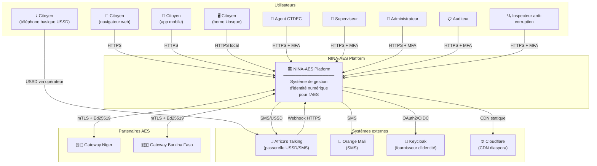

### 3.2 Niveau 2 — Diagramme de conteneurs

Ce diagramme ouvre la boîte noire et montre les composants déployables : 3 frontends, 11
microservices, 6 systèmes de stockage.

> **Décision — ports des frontends (contradiction tranchée).** Deux affectations circulaient : d'un
> côté le tableau d'état des apps du doc 00 (et le code réel `apps/citizen`) → **citizen 4001 ·
> admin 4002 · governance 4003** ; de l'autre la table « Ports & versions » du doc 00 (lignes
> 372-374) → citoyen 4000 · admin 4001 · gouvernance 4002. **Affectation canonique retenue ici et
> dans tout le doc 02 : `citizen=4001`, `admin=4002`, `governance=4003`** — elle reflète l'état
> livré (`apps/citizen` tourne bien sur 4001, PROMPT 5.1) et évite le port 4000. ⏳ **Reste-à-faire
> (hors périmètre doc 02)** : réaligner la table « Ports & versions » du doc 00 sur ce triplet pour
> lever le drift interne au doc 00.

> **Décision — handler USSD (affectation tranchée).** Les premières versions de ce document
> faisaient transiter le webhook USSD par `notification-service :3005`. **Le canon est désormais un
> microservice dédié `ussd-service` (NestJS, port 3014)** : webhook `POST /ussd`, sessions Redis TTL
> 5 min, menu 8 langues (cf. **doc 14 — USSD Africa's Talking** + **ADR-008**). Raison : l'USSD a un
> cycle de vie, un modèle de sécurité (allowlist IP + secret Africa's Talking) et une cadence de
> déploiement propres, qui ne doivent pas être couplés au service de notifications. `ussd-service`
> **appelle** ensuite `identity-service` (vérif NINA), `appointment-service` (RDV) et
> `notification-service` (SMS de confirmation) — d'où les arêtes sortantes ci-dessus.

```mermaid
graph TB
    subgraph "Frontends"
        FE_CIT["🌐 Portail Citoyen<br/>Next.js 16 — port 4001<br/>6 écrans + PWA"]
        FE_ADM["🌐 Dashboard Admin<br/>Next.js 16 — port 4002<br/>3 écrans"]
        FE_GOV["🌐 Portail Gouvernance<br/>Next.js 16 — port 4003<br/>2 écrans"]
        FE_MOB["📱 App Mobile<br/>React Native Expo<br/>Scan QR + Offline"]
        FE_USSD["📞 Interface USSD<br/>8 langues nationales<br/>*123*NINA#"]
    end

    subgraph "Couche API — Microservices"
        SVC_ID["identity-service<br/>NestJS — :3001<br/>CRUD NINA"]
        SVC_AUTH["auth-service<br/>NestJS — :3002<br/>JWT RS256 + RBAC"]
        SVC_AI["ai-service<br/>FastAPI — :3003<br/>Pipeline IA 5 étapes"]
        SVC_DOC["document-service<br/>NestJS — :3004<br/>PDF + QR signé"]
        SVC_NOTIF["notification-service<br/>NestJS — :3005<br/>SMS + Email"]
        SVC_INTER["interop-service<br/>NestJS — :3006<br/>Protocole BCID-AES"]
        SVC_AUDIT["audit-service<br/>NestJS — :3007<br/>Hash-chain SHA-256"]
        SVC_RDV["appointment-service<br/>NestJS — :3008<br/>Rendez-vous"]
        SVC_SIGAC["anticorruption-service<br/>FastAPI — :3009<br/>Isolation Forest"]
        SVC_GOUV["governance-service<br/>NestJS — :3010<br/>SGOGT"]
        SVC_VULN["vulnerability-service<br/>NestJS — :3011<br/>Personnes vulnérables"]
        SVC_USSD["ussd-service<br/>NestJS — :3014<br/>Webhook POST /ussd + sessions Redis"]
    end

    subgraph "Couche données"
        PG[("PostgreSQL 18<br/>:5432<br/>Données NINA + Audit")]
        RD[("Redis 8.6<br/>:6379<br/>Cache + Sessions USSD")]
        ES[("Elasticsearch 9.3<br/>:9200<br/>Recherche floue")]
        MIO[("MinIO<br/>:9000<br/>Photos + PDF")]
        RMQ[("RabbitMQ 4.2<br/>:5672<br/>Messages async")]
    end

    subgraph "Sécurité"
        KC_SVC["Keycloak 26.5<br/>:8080<br/>OAuth2 / OIDC"]
        VAULT["HashiCorp Vault<br/>:8200<br/>Secrets"]
    end

    FE_CIT --> SVC_ID
    FE_CIT --> SVC_AUTH
    FE_CIT --> SVC_DOC
    FE_CIT --> SVC_RDV
    FE_ADM --> SVC_ID
    FE_ADM --> SVC_AI
    FE_ADM --> SVC_SIGAC
    FE_GOV --> SVC_GOUV
    FE_MOB --> SVC_ID
    FE_MOB --> SVC_DOC
    FE_USSD --> SVC_USSD
    SVC_USSD --> SVC_ID
    SVC_USSD --> SVC_RDV
    SVC_USSD --> SVC_NOTIF

    SVC_ID --> PG
    SVC_ID --> ES
    SVC_AUTH --> KC_SVC
    SVC_AUTH --> PG
    SVC_AUTH --> RD
    SVC_AI --> PG
    SVC_DOC --> PG
    SVC_DOC --> MIO
    SVC_NOTIF --> RMQ
    SVC_AUDIT --> PG
    SVC_RDV --> PG
    SVC_RDV --> RD
    SVC_SIGAC --> PG
    SVC_GOUV --> PG
    SVC_VULN --> PG
    SVC_VULN --> RD
    SVC_USSD --> RD

    SVC_ID --> RMQ
    SVC_AUTH --> VAULT
    SVC_DOC --> VAULT

    SVC_INTER --> PG
```

### 3.3 Niveau 3 — Composants de l'identity-service (service central)

Ce diagramme zoome sur le service le plus critique : `identity-service`. Les autres services suivent
un pattern similaire.

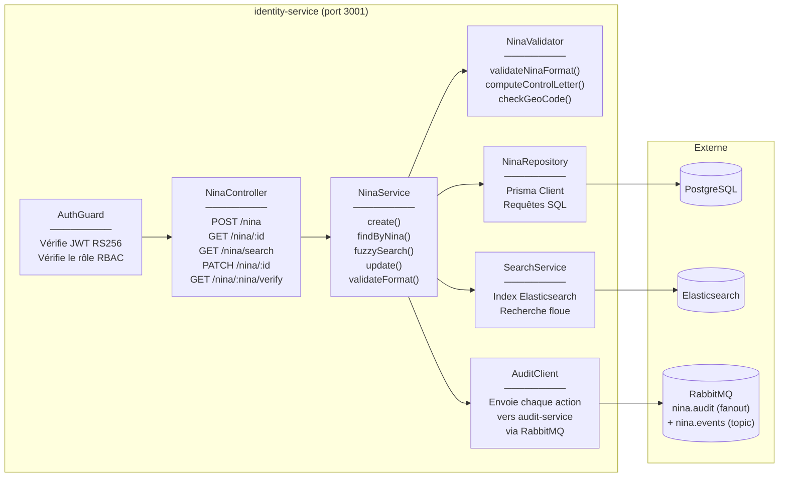

---

## 4. Flux de données — Diagrammes de séquence

### 4.1 Flux principal — Recherche NINA par un citoyen

Ce flux est le plus courant dans le système. Un citoyen recherche ses informations NINA depuis le
portail web.

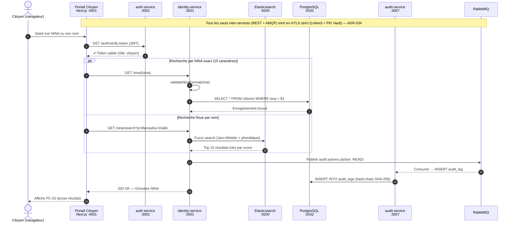

### 4.2 Flux de correction — Pipeline IA + validation humaine

Ce flux montre comment le module IA détecte une erreur et la soumet à la validation d'un agent.

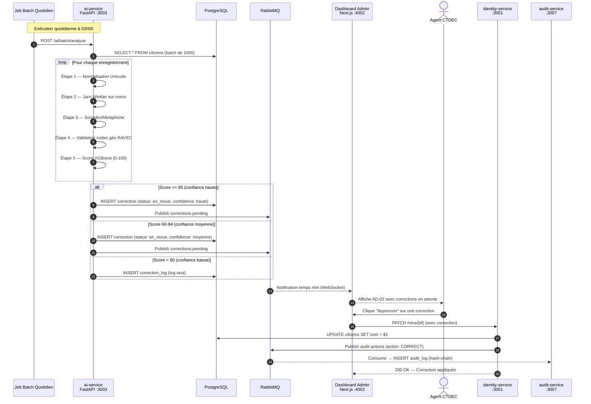

### 4.3 Flux QR code — Génération et vérification

> 🔐 **Signature via Vault Transit (ADR-026).** La clé privée RSA-3072 de signature du QR **n'est
> jamais extraite** de Vault : le `document-service` envoie un **hash SHA-256** à
> `transit/sign/nina-qr-signing/sha2-256` et reçoit la signature. Le service détient uniquement le
> droit `update` sur cet endpoint (jamais `read`/`export` de la clé). Toute compromission RCE ne
> permet donc que de **faire signer** pendant la fenêtre de compromission (détectable par pic
> `vault_audit_total`), pas d'**exfiltrer** la clé. Ne **pas** réintroduire un
> `GET secret/jwt-private-key` — c'est précisément l'anti-pattern rejeté par ADR-026. La signature
> audit (Ed25519) est un autre usage, **in-process** `@noble/ed25519` (doc 09), car Vault Transit ne
> supporte pas Ed25519.

```mermaid
sequenceDiagram
    autonumber
    actor C as Citoyen
    participant FE as Portail Citoyen<br/>:4001
    participant DOC as document-service<br/>:3004
    participant ID as identity-service<br/>:3001
    participant VAULT as HashiCorp Vault
    participant MINIO as MinIO

    Note over C,MINIO: Génération de la Fiche Descriptive

    C->>FE: Clique "Télécharger ma Fiche"
    FE->>DOC: GET /documents/fiche/{nina}
    DOC->>ID: GET /nina/{nina} (données complètes)
    ID-->>DOC: Données NINA + photo_url

    DOC->>DOC: Construit le payload JWT
    Note right of DOC: { nina, nom, prenoms,<br/>biometric_hash,<br/>issued_at, issuer: "CTDEC" }
    DOC->>DOC: Calcule SHA-256 de l'en-tête.payload
    DOC->>VAULT: POST transit/sign/nina-qr-signing/sha2-256 { hash }
    Note right of VAULT: ADR-026 — la clé privée RSA-3072 NE QUITTE JAMAIS Vault ;<br/>le service n'a que le droit `update` sur transit/sign
    VAULT-->>DOC: Signature RS256 (PKCS#1 v1.5) + key_version
    DOC->>DOC: Assemble le JWT signé (RS256)
    DOC->>DOC: Génère QR code (JWT encodé)
    DOC->>DOC: Génère PDF A4 (Puppeteer)

    DOC->>MINIO: PUT /nina-documents/{nina}/fiche.pdf
    MINIO-->>DOC: URL signée (15 min)

    DOC-->>FE: 200 OK + URL téléchargement
    FE-->>C: Télécharge le PDF

    Note over C,MINIO: Vérification du QR code (app mobile)

    actor V as Vérificateur
    participant MOB as App Mobile

    V->>MOB: Scanne le QR code
    MOB->>MOB: Décode le JWT
    MOB->>DOC: POST /documents/verify-qr { jwt }
    DOC->>VAULT: GET transit/keys/nina-qr-signing (clé PUBLIQUE, par key_version)
    VAULT-->>DOC: Clé publique RSA (exportable, jamais la privée)
    DOC->>DOC: Vérifie signature RS256 (key_version du header JWT)
    DOC->>DOC: Vérifie expiration
    DOC->>ID: GET /nina/{nina} (existence)
    ID-->>DOC: ✅ NINA existe

    DOC-->>MOB: { valid: true, nina, nom, prenoms }
    MOB-->>V: ✅ Document authentique
```

### 4.4 Flux USSD — Session citoyen sur téléphone basique

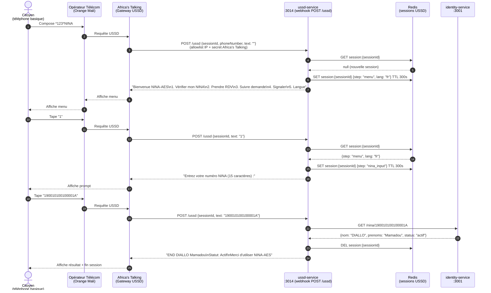

---

## 5. Patterns architecturaux

### 5.1 Communication inter-services

> **mTLS strict intra-cluster (ADR-034).** Toutes les arêtes inter-services ci-dessous — REST
> **comme** AMQP — transitent en **mTLS strict** appliqué par le **mesh Linkerd** : chaque pod
> reçoit une **identité cryptographique courte durée** (certificat émis par la **PKI Vault**,
> rotation automatique). Un pod compromis ne peut donc pas se faire passer pour un autre service par
> une simple requête HTTP nu. Le détail (politique `deny-by-default`, rotation des clés et du JWKS,
> cartographie OWASP, scans CI) est figé dans **ADR-034 — Durcissement sécurité** et le doc **15 —
> Security Hardening** ; les diagrammes de séquence ci-dessus n'affichent pas explicitement le
> handshake mTLS pour rester lisibles, mais il est **systématique** (aucune exception
> intra-cluster). ⏳ Linkerd + PKI Vault sont **conçus, déploiement à finaliser en Phase 2**
> (vérifiable : pas encore de manifeste `linkerd` appliqué dans `infrastructure/`).

Le système utilise **deux modes de communication** entre microservices :

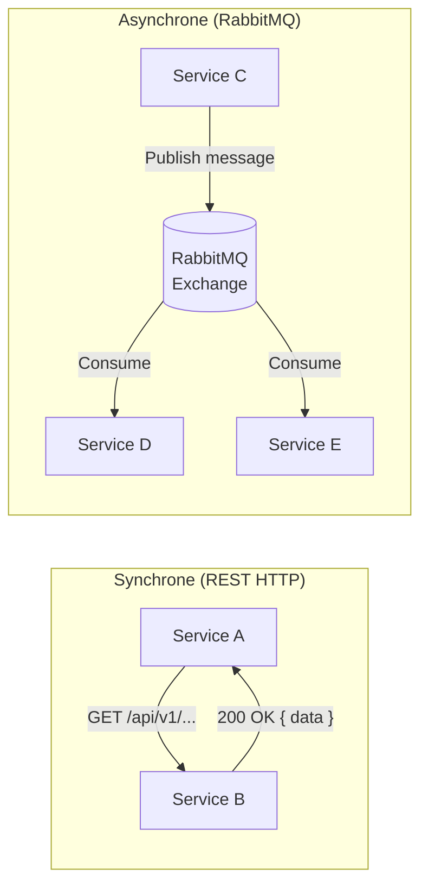

| Mode                      | Quand l'utiliser                                                                                         | Exemples                                                                                                                |
| ------------------------- | -------------------------------------------------------------------------------------------------------- | ----------------------------------------------------------------------------------------------------------------------- |
| **Synchrone (REST)**      | Quand le service appelant a besoin de la réponse immédiatement pour continuer son traitement             | `identity-service` → `auth-service` (vérification JWT), `document-service` → `identity-service` (données NINA pour PDF) |
| **Asynchrone (RabbitMQ)** | Quand l'action peut être traitée plus tard, ou quand plusieurs services doivent réagir au même événement | Audit logging, notifications SMS, indexation Elasticsearch, corrections IA                                              |

### 5.2 Exchanges et queues RabbitMQ

> ✅ **Topologie audit RabbitMQ (drift résolu côté code — note d'honnêteté).** Le diagramme
> ci-dessous reste la **cible logique** (libellés `audit.exchange` historiques). Dans le code livré,
> l'`audit-service` lie son consumer aux exchanges **`nina.events`** (topic) + **`nina.audit`**
> (fanout) — cf. doc 09 §«1 consumer RabbitMQ». Les publishers ont **déjà été réalignés** sur ces
> noms canoniques : `document-service` (`src/config/env.schema.ts` → `RABBITMQ_EVENTS_EXCHANGE`
> défaut `nina.events`, commentaire « Anciennement `audit.events` — exchange orphelin non consommé
> (drift corrigé) ») et `identity-service` (`RABBITMQ_EXCHANGE=nina.events`). L'exchange orphelin
> historique **`audit.events`** (et `nina-aes.events`) n'est **plus émis** par le code livré. **⏳
> Reste-à-faire purement documentaire** : les docs **09 / 10 / 11 et ADR-014** nomment encore par
> endroits l'exchange historique `audit.events` ; le code et `definitions.json` font foi
> (`nina.events`). Convention canonique : `nina.audit` (fanout) / `nina.events` (topic).

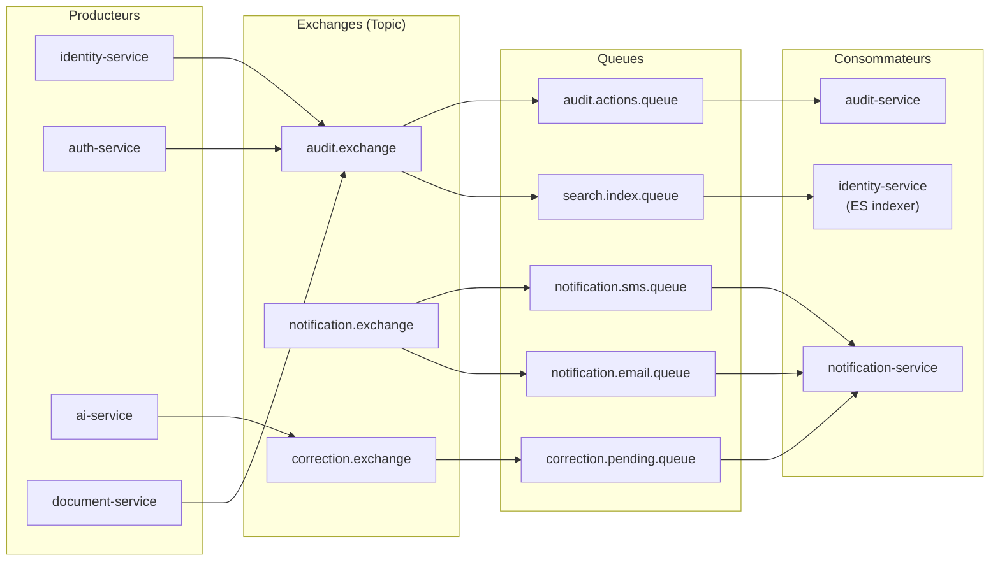

### 5.3 Pattern de sécurité — Authentification en couches

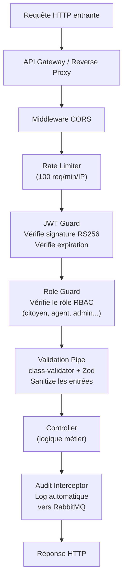

> Le périmètre **réseau** de cette chaîne (mTLS strict entre le reverse proxy et chaque service,
> rotation des certificats et du JWKS) relève de **ADR-034**, pas de ce diagramme applicatif.

### 5.4 Cartographie OWASP Top 10 (2021) — où chaque risque est traité

Cette table relie chaque catégorie **OWASP Top 10 : 2021** à la **défense architecturale**
correspondante dans NINA-AES. Elle synthétise des décisions figées ailleurs (**ADR-034**,
**ADR-006**, **ADR-007/014**, **ADR-013**) ; le détail opérationnel et les scans CI sont dans le doc
**15 — Security Hardening**. Statut honnête : ✅ = conçu **et** présent dans le code livré ; ⏳ =
conçu, **à finaliser en Phase 2** (vérifiable par Read/Grep).

| Risque OWASP 2021                      | Défense dans NINA-AES                                                                                                  | Réf. / statut                  |
| -------------------------------------- | ---------------------------------------------------------------------------------------------------------------------- | ------------------------------ |
| **A01 — Broken Access Control**        | `JWT Guard` (RS256) + `Role Guard` RBAC à chaque controller ; déni par défaut ; pas d'IDOR (UUID + contrôle de portée) | ADR-013 · ✅                   |
| **A02 — Cryptographic Failures**       | TLS partout ; **mTLS strict** intra-cluster ; secrets en **Vault** (jamais en `.env`) ; QR signé **RS256** (Transit)   | ADR-034 · ADR-006 · ⏳ mTLS    |
| **A03 — Injection**                    | Prisma (requêtes paramétrées, pas de SQL concaténé) ; `class-validator` + **Zod** ; `unaccent`/`pg_trgm` côté SQL géré | ADR-005 · ✅                   |
| **A04 — Insecure Design**              | Modèle de menace dédié (`docs/security/THREAT-MODEL.md`) ; audit hash-chain (ADR-007) ; database-per-service           | THREAT-MODEL · ✅              |
| **A05 — Security Misconfiguration**    | **En-têtes durcis** (HSTS, CSP, `X-Content-Type-Options`, `Referrer-Policy`) ; CORS allowlist ; images minimales       | ADR-034 · ⏳ (voir ci-dessous) |
| **A06 — Vulnerable Components**        | Scans **CI** (audit deps, image scan) ; pnpm lockfile gelé ; registry miroir CTDEC (souveraineté)                      | ADR-034 · ⏳                   |
| **A07 — Identification/Auth Failures** | **Keycloak** OIDC + **MFA** agents ; JWT courte durée ; rate-limit anti-bruteforce ; pas de secret long-lived          | ADR-013 · ADR-034 · ⏳         |
| **A08 — Software/Data Integrity**      | QR **JWT RS256** (ADR-006) ; audit **hash-chain + scellement Ed25519** (ADR-007) ; ⏳ ancrage tiers OCLEI              | ADR-006 · ADR-007 · ⏳         |
| **A09 — Logging/Monitoring Failures**  | `Audit Interceptor` → `audit-service` ; stack Prometheus/Grafana/Loki/Jaeger (namespace `nina-monitoring`)             | ADR-014 · ✅ partiel           |
| **A10 — SSRF**                         | Sorties réseau restreintes (allowlist passerelles AES + Africa's Talking) ; pas de fetch d'URL arbitraire utilisateur  | ADR-034 · ⏳                   |

#### En-têtes de sécurité HTTP (HSTS / CSP) — au reverse proxy + middleware NestJS

Ces en-têtes couvrent **A05** (misconfiguration) et durcissent **A02/A03** côté navigateur. Ils sont
posés à la fois par l'**ingress** (Nginx) et par un middleware applicatif (type `helmet`). **Statut
: conçu, ⏳ à appliquer/vérifier en Phase 2** (cf. doc 15).

```http
# Force HTTPS pendant 2 ans, sous-domaines inclus, éligible preload
Strict-Transport-Security: max-age=63072000; includeSubDomains; preload

# CSP verrouillée : tout par défaut depuis l'origine ; pas d'inline script ;
# images/data: autorisés (QR codes, photos NINA servies en data-URI ou MinIO signé)
Content-Security-Policy: default-src 'self'; script-src 'self'; object-src 'none';
  img-src 'self' data:; base-uri 'self'; frame-ancestors 'none'

X-Content-Type-Options: nosniff       # bloque le MIME-sniffing
Referrer-Policy: no-referrer          # ne fuite pas l'URL NINA vers des tiers
Permissions-Policy: geolocation=(), microphone=(), camera=()   # surface minimale
```

> Pourquoi `frame-ancestors 'none'` plutôt que `X-Frame-Options` ? `frame-ancestors` (CSP niveau 2)
> est la directive moderne anti-clickjacking ; elle remplace l'en-tête historique `X-Frame-Options`
> et couvre tous les navigateurs cibles. Pourquoi pas de `'unsafe-inline'` dans `script-src` ?
> Next.js 16 supporte les nonces/hash CSP ; autoriser l'inline rouvrirait une porte XSS (**A03**).

---

## 6. Architecture des données

### 6.1 Schéma relationnel simplifié

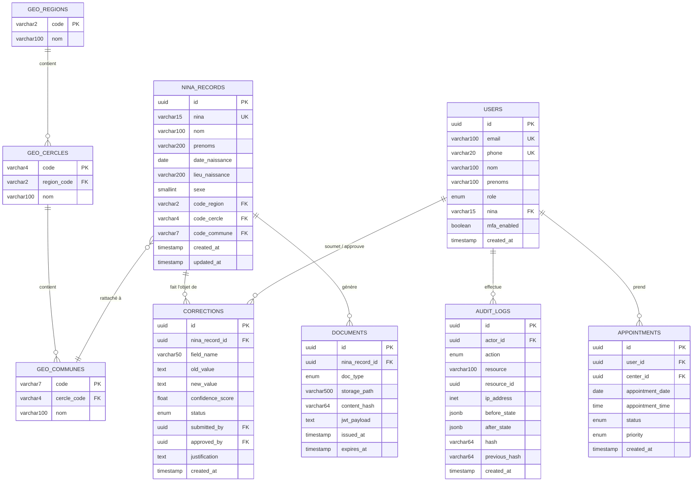

### 6.2 Stratégie de stockage par type de données

| Type de données                                        | Stockage            | Raison                                                                         |
| ------------------------------------------------------ | ------------------- | ------------------------------------------------------------------------------ |
| Enregistrements NINA, utilisateurs, corrections, audit | **PostgreSQL**      | Données relationnelles structurées, intégrité référentielle, transactions ACID |
| Sessions USSD, cache de recherche, sessions JWT        | **Redis**           | Accès rapide (< 1 ms), TTL natif, volatile par nature                          |
| Index de recherche floue sur les noms                  | **Elasticsearch**   | Full-text search, plugin phonétique, scoring de pertinence                     |
| Photos d'identité, PDF générés, documents scannés      | **MinIO**           | Stockage objet, compatible S3, pas de limite de taille, versionning            |
| Événements inter-services                              | **RabbitMQ**        | Découplage asynchrone, garantie de livraison, dead letter queues               |
| Secrets (clés JWT, credentials BDD, API keys)          | **HashiCorp Vault** | Chiffrement au repos, rotation automatique, audit des accès                    |
| Identités et sessions OAuth2                           | **Keycloak**        | Standard OIDC, RBAC intégré, MFA, fédération d'identité                        |

---

## 7. Architecture de déploiement

### 7.1 Environnement de développement local

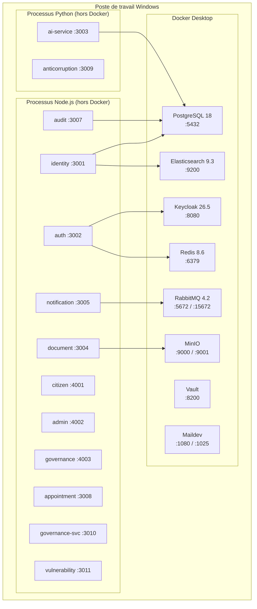

### 7.2 Environnement de production (cible)

> **Souveraineté — périmètre Cloudflare.** Cloudflare n'intervient **que** comme CDN d'**actifs
> statiques** pour la diaspora (JS/CSS/images publiques) ; il **ne termine pas le TLS du cœur** et
> ne voit **aucune donnée NINA ni biométrique** (le trafic applicatif entre par l'ingress Nginx +
> cert-manager au CTDEC). Aucune dépendance Cloudflare (ni AWS KMS) sur le chemin de données
> souverain on-premise. Auto-unseal Vault, ACME et registry restent internes/mirrorés CTDEC (cf.
> ADR-034).

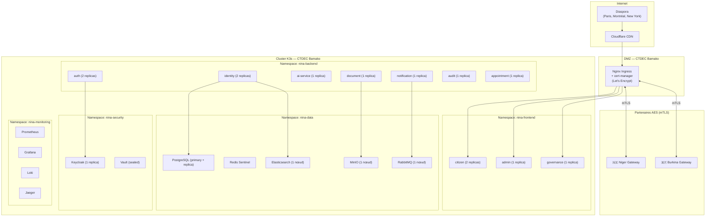

---

## 8. Architecture Decision Records (ADR)

Les ADR documentent les **raisons** derrière chaque choix technique. Ils suivent le format :
Contexte → Décision → Conséquences.

> **Ne pas dupliquer les ADR sécurité.** Ce document rappelle les ADR fondateurs (002→008). La
> sécurité transversale (**mTLS strict Linkerd + PKI Vault + rotation clés/JWKS + OWASP + scans
> CI**) est **déjà** figée dans **ADR-034** ; l'audit événementiel append-only dans **ADR-014** ; la
> signature QR via Transit dans **ADR-026**. **Référencer ces ADR existants** plutôt que d'en créer
> de nouveaux. Le périmètre ADR du dépôt est **ADR-001 → ADR-034** (ne pas proposer un doublon sans
> avoir vérifié son absence).

### ADR-002 — Microservices plutôt que monolithe

|                            |                                                                                                                                                                                                                         |
| -------------------------- | ----------------------------------------------------------------------------------------------------------------------------------------------------------------------------------------------------------------------- |
| **Statut**                 | Accepté — Avril 2026                                                                                                                                                                                                    |
| **Contexte**               | Le système NINA-AES couvre 9 objectifs hétérogènes : identité, IA, audit, anti-corruption, USSD, interopérabilité. Un monolithe mélangerait ces préoccupations dans une seule base de code.                             |
| **Décision**               | Décomposition en 11 microservices indépendants, chacun responsable d'un domaine métier précis (Domain-Driven Design).                                                                                                   |
| **Conséquences positives** | Chaque service peut être développé, testé et déployé indépendamment. L'IA (Python) et le backend (TypeScript) coexistent sans compromis technologique. Un service défaillant n'entraîne pas la chute du système entier. |
| **Conséquences négatives** | Complexité opérationnelle accrue (Docker, réseau, orchestration). Latence additionnelle des appels inter-services. Plus difficile pour un développeur seul.                                                             |
| **Justification**          | La diversité des technologies (NestJS + FastAPI), les exigences de résilience (ENF-012) et l'objectif pédagogique (démontrer une architecture distribuée) justifient ce surcoût.                                        |

### ADR-003 — NestJS pour les services TypeScript

|                           |                                                                                                                                                                                                                                                                                                                |
| ------------------------- | -------------------------------------------------------------------------------------------------------------------------------------------------------------------------------------------------------------------------------------------------------------------------------------------------------------- |
| **Statut**                | Accepté — Avril 2026                                                                                                                                                                                                                                                                                           |
| **Contexte**              | 9 des 11 microservices sont écrits en TypeScript. Plusieurs frameworks sont candidats : Express.js nu, Fastify, Hono, NestJS.                                                                                                                                                                                  |
| **Décision**              | NestJS 11.1+ pour tous les services TypeScript.                                                                                                                                                                                                                                                                |
| **Raisons**               | (1) Système de modules et d'injection de dépendances intégré — simplifie le découplage. (2) Guards, Interceptors, Pipes natifs — implémentent la sécurité et la validation par convention. (3) Intégration native avec Prisma, RabbitMQ, et les WebSockets. (4) Documentation exhaustive et communauté active. |
| **Alternatives rejetées** | Express nu (trop peu de structure pour 9 services). Hono (excellent pour les API légères, mais manque l'écosystème de modules NestJS).                                                                                                                                                                         |

### ADR-004 — FastAPI pour les services IA/ML

|                           |                                                                                                                                                                                                                                                        |
| ------------------------- | ------------------------------------------------------------------------------------------------------------------------------------------------------------------------------------------------------------------------------------------------------ |
| **Statut**                | Accepté — Avril 2026                                                                                                                                                                                                                                   |
| **Contexte**              | Les modules IA (ai-service) et anti-corruption (anticorruption-service) utilisent des bibliothèques Python (scikit-learn, XGBoost, spaCy, RapidFuzz).                                                                                                  |
| **Décision**              | FastAPI 0.135+ pour les 2 services Python.                                                                                                                                                                                                             |
| **Raisons**               | (1) Performances proches de Node.js grâce à Starlette/uvicorn (ASGI async). (2) Documentation OpenAPI automatique. (3) Validation Pydantic native (équivalent Python de Zod). (4) Écosystème Python ML intact — pas besoin de ponts TypeScript-Python. |
| **Alternatives rejetées** | Flask (synchrone, pas de validation intégrée). Django (trop lourd pour des microservices). Appel Python depuis NestJS via subprocess (fragile, non maintenable).                                                                                       |

### ADR-005 — PostgreSQL comme base de données principale

|                           |                                                                                                                                                                                                                                                                                                                                                                      |
| ------------------------- | -------------------------------------------------------------------------------------------------------------------------------------------------------------------------------------------------------------------------------------------------------------------------------------------------------------------------------------------------------------------- |
| **Statut**                | Accepté — Avril 2026                                                                                                                                                                                                                                                                                                                                                 |
| **Contexte**              | Les données NINA sont relationnelles (enregistrements, régions, corrections) et nécessitent des garanties ACID fortes (intégrité référentielle, transactions).                                                                                                                                                                                                       |
| **Décision**              | PostgreSQL comme base unique pour tous les services. _Version cible alignée 2026-06 : **PostgreSQL 18** (table de référence doc 00 + doc 05). Le « 17 » mentionné dans la rédaction d'origine (avril 2026) est obsolète._                                                                                                                                            |
| **Raisons**               | (1) Extensions critiques : `pg_trgm` pour la recherche floue, `unaccent` pour la normalisation des noms, `pgcrypto` pour le hachage. (2) TDE (Transparent Data Encryption) pour le chiffrement au repos (ENF-013). (3) Maturité — utilisé en production pour des systèmes gouvernementaux dans le monde entier. (4) Open source — conformité souveraineté numérique. |
| **Alternatives rejetées** | MongoDB (pas de garanties ACID, pas d'intégrité référentielle). MySQL (extensions moins riches). CockroachDB (surcoût opérationnel pour un projet universitaire).                                                                                                                                                                                                    |

### ADR-006 — JWT RS256 pour les QR codes de la Fiche Descriptive

|                           |                                                                                                                                                                                                                                                                                                                                                      |
| ------------------------- | ---------------------------------------------------------------------------------------------------------------------------------------------------------------------------------------------------------------------------------------------------------------------------------------------------------------------------------------------------- |
| **Statut**                | Accepté — Avril 2026                                                                                                                                                                                                                                                                                                                                 |
| **Contexte**              | La Fiche Descriptive actuelle contient un QR code avec le NINA brut — falsifiable par quiconque connaît le format (faille F1 du cahier des charges).                                                                                                                                                                                                 |
| **Décision**              | Remplacer le NINA brut par un JWT signé RS256 contenant : NINA, hash biométrique SHA-256, timestamp d'émission, identifiant de l'émetteur (CTDEC).                                                                                                                                                                                                   |
| **Raisons**               | (1) RS256 (asymétrique) permet la vérification sans partager la clé privée — n'importe qui avec la clé publique peut vérifier, mais seul le CTDEC peut signer. (2) Le timestamp rend chaque QR code unique et permet de détecter les reproductions. (3) Le hash biométrique lie le document à une personne physique sans exposer la biométrie brute. |
| **Alternatives rejetées** | HS256 (symétrique — la clé de vérification est la même que la clé de signature, trop risqué). QR code chiffré AES (nécessite la clé de déchiffrement pour toute vérification, pas pratique pour les agents de terrain).                                                                                                                              |

### ADR-007 — Chaîne de hash (hash-chain) SHA-256 pour l'audit

> ⚠️ **Correction terminologique (canon sécurité).** Ce mécanisme est une **chaîne de hash linéaire
> (hash-chain)**, **pas un arbre de Merkle**. Un arbre de Merkle agrège des feuilles en un arbre
> binaire dont seule la racine est publiée ; ici, chaque entrée référence simplement le hash de
> **l'entrée précédente** (`previous_hash`), formant une liste chaînée cryptographique. La rédaction
> d'origine parlait à tort de « Merkle » — le terme exact est **hash-chain**. Voir
> **`09-BACKEND-AUDIT-SERVICE.md`** (implémentation de référence) et **ADR-014** (audit append-only
> event-driven).

|                                |                                                                                                                                                                                                                                                                                                                                                                                                                                                                                                                                                                                                                                                                                                                                                                                                                                                                                                                        |
| ------------------------------ | ---------------------------------------------------------------------------------------------------------------------------------------------------------------------------------------------------------------------------------------------------------------------------------------------------------------------------------------------------------------------------------------------------------------------------------------------------------------------------------------------------------------------------------------------------------------------------------------------------------------------------------------------------------------------------------------------------------------------------------------------------------------------------------------------------------------------------------------------------------------------------------------------------------------------- |
| **Statut**                     | Accepté — Avril 2026 · _terminologie corrigée 2026-06 (hash-chain, pas Merkle)_                                                                                                                                                                                                                                                                                                                                                                                                                                                                                                                                                                                                                                                                                                                                                                                                                                        |
| **Contexte**                   | L'exigence EF-A-018 impose un journal d'audit immuable. Un attaquant (ou un agent corrompu ayant accès à la BDD) ne doit pas pouvoir modifier une entrée passée sans être détecté.                                                                                                                                                                                                                                                                                                                                                                                                                                                                                                                                                                                                                                                                                                                                     |
| **Décision**                   | Chaque entrée d'audit contient un hash SHA-256 = `SHA256(contenu_entrée ‖ previous_hash)`. Les entrées forment une **hash-chain linéaire** : chaque ligne scelle la précédente. La **racine de chaîne** est en outre **signée Ed25519 toutes les 60 min** (scellement horaire in-process, doc 09).                                                                                                                                                                                                                                                                                                                                                                                                                                                                                                                                                                                                                     |
| **Raisons**                    | (1) Modification d'une entrée passée → invalide tous les hash suivants → détection au prochain `verify`. (2) Vérification en O(n) — parcours linéaire de la chaîne. (3) Beaucoup plus simple qu'une blockchain à consensus, suffisant pour un journal d'audit **interne**.                                                                                                                                                                                                                                                                                                                                                                                                                                                                                                                                                                                                                                             |
| **Limite assumée (honnêteté)** | Une hash-chain seule **ne résiste pas à un admin BDD malveillant** : qui peut écrire dans la table peut **recalculer toute la chaîne** (réécrire l'entrée falsifiée _et_ tous les `hash`/`previous_hash` suivants) — le journal redevient cohérent et la falsification est **indétectable par parcours local**. L'immutabilité réelle exige deux ajouts : (a) le **scellement Ed25519 in-process** de la racine (`@noble/ed25519`, clé chargée depuis **Vault KV** — **PAS** Vault Transit, qui ne supporte pas Ed25519, cf. ADR-026/034) qui horodate l'état de la chaîne et rend toute réécriture postérieure prouvable ; (b) **l'ancrage périodique** de la racine signée chez un **tiers indépendant** (OCLEI / Vérificateur Général) — **⏳ à implémenter en Phase 2**. Sans cet ancrage tiers, la garantie reste « détectable par un auditeur détenant les racines signées historiques », pas « infalsifiable ». |
| **Alternatives rejetées**      | Arbre de Merkle complet (utile pour des **preuves d'inclusion** partielles ; superflu ici car on vérifie la chaîne entière). Blockchain à consensus (Hyperledger, Ethereum) — surcoût opérationnel disproportionné, contraire à la souveraineté on-premise. Append-only sans hash — détectable par l'admin BDD mais pas par un auditeur externe.                                                                                                                                                                                                                                                                                                                                                                                                                                                                                                                                                                       |

### ADR-008 — USSD via Africa's Talking

|                  |                                                                                                                                                                                                                                                                                                       |
| ---------------- | ----------------------------------------------------------------------------------------------------------------------------------------------------------------------------------------------------------------------------------------------------------------------------------------------------- |
| **Statut**       | Accepté — Avril 2026                                                                                                                                                                                                                                                                                  |
| **Contexte**     | L'exigence ENF-025 impose l'accessibilité depuis les téléphones basiques (feature phones) via USSD. Le protocole USSD nécessite un intermédiaire entre l'opérateur télécom et notre serveur.                                                                                                          |
| **Décision**     | Utilisation de l'API Africa's Talking comme passerelle USSD/SMS.                                                                                                                                                                                                                                      |
| **Raisons**      | (1) Couverture de 20+ pays africains dont le Mali. (2) Mode sandbox gratuit pour les tests. (3) API webhook simple (POST HTTP). (4) Support des sessions USSD stateful. (5) Documentation claire et SDK Node.js/Python disponibles.                                                                   |
| **Souveraineté** | Africa's Talking est une entreprise kenyane (Nairobi), pas un GAFAM. Les données USSD transitent par leurs serveurs mais ne contiennent que le sessionId et le texte saisi — aucune donnée biométrique ou sensible. En production, un accord contractuel de protection des données serait nécessaire. |

---

## 9. Pièges courants et dépannage

| Symptôme                                        | Cause probable                                             | Solution                                                                                                                                            |
| ----------------------------------------------- | ---------------------------------------------------------- | --------------------------------------------------------------------------------------------------------------------------------------------------- |
| « Trop de microservices pour un étudiant seul » | Tentation de simplifier en fusionnant des services         | Garder l'architecture cible mais développer par phases : identity + auth + audit d'abord, les autres ensuite                                        |
| Latence élevée entre services en dev            | Chaque appel REST ajoute ~5-10 ms de latence réseau local  | Normal en dev. En production, les services sont dans le même cluster K3s (latence < 1 ms)                                                           |
| « Pourquoi pas GraphQL au lieu de REST ? »      | Question fréquente en soutenance                           | REST est suffisant pour nos cas d'utilisation (CRUD + recherche). GraphQL ajoute de la complexité sans bénéfice clair pour ce projet. ADR documenté |
| Confusion entre synchrone et asynchrone         | Tendance à tout mettre en REST ou tout en RabbitMQ         | Règle : si le service A a besoin de la réponse pour continuer → REST. Sinon → RabbitMQ                                                              |
| Docker utilise trop de RAM (> 8 Go)             | Tous les conteneurs du docker-compose lancés simultanément | Démarrer uniquement les conteneurs nécessaires : `docker compose up postgres redis -d`. Ajouter les autres au besoin                                |

---

## 10. Documentation à produire après cette étape

### Fichiers ADR à créer dans `docs/adr/`

Chaque ADR présenté en section 8 doit être extrait dans son propre fichier Markdown :

```
docs/adr/
├── ADR-001-cahier-des-charges.md          (créé au document 01)
├── ADR-002-microservices.md
├── ADR-003-nestjs.md
├── ADR-004-fastapi.md
├── ADR-005-postgresql.md
├── ADR-006-jwt-rs256-qr-code.md
├── ADR-007-merkle-audit.md                (nom de fichier historique ; contenu = hash-chain, pas Merkle)
└── ADR-008-ussd-africas-talking.md
```

> **ADR transversaux déjà existants (ne pas recréer)** — référencés par ce document mais rédigés à
> d'autres étapes : `ADR-013-keycloak-identity-provider.md` (OIDC/MFA),
> `ADR-014-audit-event-driven-append-only.md` (topologie audit), `ADR-026` (signature QR via Vault
> Transit RS256), `ADR-034-security-hardening-vault-mtls-owasp.md` (mTLS strict + PKI + rotation +
> OWASP + scans CI).

---

## 11. Mini-rapport d'étape (template)

```markdown
### Rapport — 02 Architecture Globale — [Date]

- **Status** : ✅ Terminé / ⏳ En cours / ❌ Bloqué
- **Temps réel passé** : X heures
- **Diagrammes produits** :
  - [ ] C4 Contexte
  - [ ] C4 Conteneurs
  - [ ] C4 Composants (identity-service)
  - [ ] Séquence : recherche NINA
  - [ ] Séquence : pipeline IA + validation
  - [ ] Séquence : QR code génération/vérification
  - [ ] Séquence : session USSD
  - [ ] ER Diagram (schéma relationnel)
  - [ ] Déploiement dev local
  - [ ] Déploiement production cible
- **ADR rédigés** : 7/7
- **Difficultés rencontrées** :
- **Questions pour le professeur tuteur** :
- **Prochaines actions** :
```

---

## 12. Checklist de fin d'étape

- [ ] Tous les diagrammes Mermaid s'affichent correctement sur GitHub
- [ ] Les 7 ADR sont créés dans `docs/adr/`
- [ ] Chaque choix technique est justifié (pas de « parce que c'est populaire »)
- [ ] Les flux de données couvrent les cas principaux du Bloc A
- [ ] Le diagramme ER est cohérent avec le schéma Prisma du document 06
- [ ] Le diagramme de déploiement distingue dev local et production
- [ ] Commit Git : `docs(architecture): add C4 diagrams, sequence flows, and 7 ADRs`
- [ ] Mini-rapport rédigé
- [ ] Document relu par le professeur tuteur

---

## 13. Pour aller plus loin

### Lectures recommandées

- **Software Architecture for Developers** — Simon Brown (Leanpub). L'inventeur du modèle C4
  explique comment documenter une architecture sans UML lourd.
- **Building Microservices** — Sam Newman (O'Reilly, 2e édition 2021). La référence sur les patterns
  microservices (service discovery, circuit breakers, sagas).
- **Designing Data-Intensive Applications** — Martin Kleppmann (O'Reilly, 2017). Chapitre 5 sur la
  réplication et chapitre 6 sur le partitionnement — pertinents pour la scalabilité de la base NINA.

### Questions fréquentes en soutenance

| Question du jury                                                 | Réponse préparée                                                                                                                                                                                                                                                                                      |
| ---------------------------------------------------------------- | ----------------------------------------------------------------------------------------------------------------------------------------------------------------------------------------------------------------------------------------------------------------------------------------------------- |
| « Pourquoi 11 microservices et pas un monolithe ? »              | Voir ADR-002. Diversité des stacks (TS + Python), résilience, déploiement indépendant. Un monolithe mélangerait l'IA Python et le CRUD TypeScript dans la même base de code.                                                                                                                          |
| « Comment gérez-vous la cohérence des données entre services ? » | Cohérence éventuelle via RabbitMQ. Chaque service possède ses propres données (database-per-service). Les opérations critiques (création NINA) sont synchrones (REST).                                                                                                                                |
| « Que se passe-t-il si RabbitMQ tombe ? »                        | Les messages non consommés sont persistés sur disque. Au redémarrage, le traitement reprend. Les services continuent de fonctionner (les logs d'audit seront rattrapés).                                                                                                                              |
| « Pourquoi ne pas utiliser une blockchain pour l'audit ? »       | Voir ADR-007. La **hash-chain SHA-256** (chaîne linéaire, pas un arbre de Merkle) + **scellement Ed25519 horaire** offre la détection d'altération sans réseau de consensus. Honnêteté : sans **ancrage tiers** (OCLEI), un admin BDD pourrait recalculer toute la chaîne — l'ancrage est ⏳ Phase 2. |
| « Comment assurez-vous la souveraineté numérique ? »             | Toutes les technologies sont open source. Le déploiement cible est on-premise au CTDEC Bamako. Aucune donnée biométrique ne transite par des serveurs étrangers.                                                                                                                                      |

---

_Document 02 — Version 1.0 — Avril 2026_ _NINA-AES Platform — UQAR — CONFIDENTIEL_
