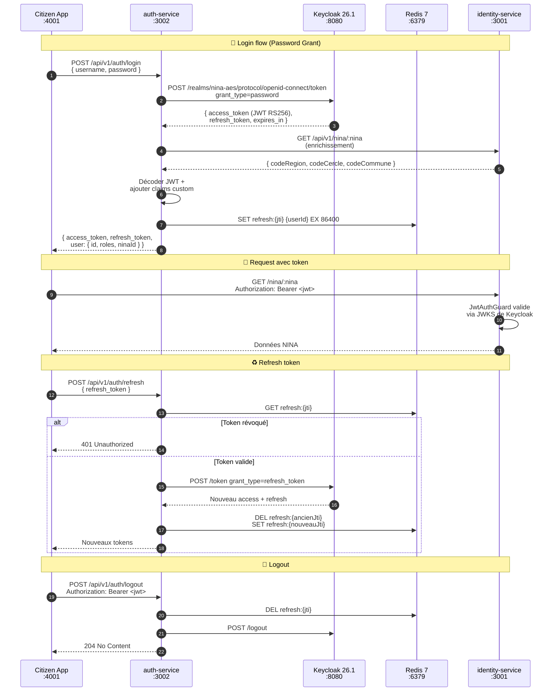

# 08 — Backend : Auth-Service (NestJS 11.1 + Keycloak 26.6.2)

> **Projet** : NINA-AES Platform **Document** : 08/26 **Service** : `auth-service` —
> Authentification, autorisation, gestion des sessions **Port** : `3002` **Stack** : Node.js 24.14+
> LTS · NestJS 11.1 · Keycloak 26.6.2 · Passport · JWT RS256 · Redis 8.6 · PostgreSQL 18 **Auteur**
> : Étudiant UQAR **Date** : Mai 2026 **Prérequis** :
> [Document 07 — Identity Service](./07-BACKEND-IDENTITY-SERVICE.md)

---

## Table des matières

1. [Objectif pédagogique](#1-objectif-pédagogique)
2. [Technologies utilisées (avec versions à jour — avril 2026)](#2-technologies-utilisées-avec-versions-à-jour--avril-2026)
3. [Architecture du microservice auth-service](#3-architecture-du-microservice-auth-service)
4. [Keycloak 26.1 — Configuration du realm NINA-AES](#4-keycloak-261--configuration-du-realm-nina-aes)
5. [Structure de dossiers](#5-structure-de-dossiers)
6. [Implémentation NestJS — Code commenté](#6-implémentation-nestjs--code-commenté)
7. [Guards, rôles & refresh tokens (Redis)](#7-guards-rôles--refresh-tokens-redis)
8. [Swagger + Tests (unit + e2e)](#8-swagger--tests-unit--e2e)
9. [Mini-rapport d'étape (template)](#9-mini-rapport-détape-template)
10. [Checklist de fin d'étape](#10-checklist-de-fin-détape)
11. [Pour aller plus loin](#11-pour-aller-plus-loin)

---

## 1. Objectif pédagogique

Construire le **service d'authentification central** de la plateforme NINA-AES : `auth-service`,
responsable de l'émission, de la validation et de la révocation des tokens JWT pour l'ensemble des
microservices et des applications frontend.

Ce service **s'appuie sur Keycloak 26.1** comme Identity Provider (IdP) et **n'implémente pas
lui-même** la logique bas-niveau d'authentification (hachage de mots de passe, OAuth2/OIDC). Il agit
comme une **façade NestJS** au-dessus de Keycloak, avec les responsabilités suivantes :

1. **Proxy REST** vers Keycloak (endpoints `/auth/login`, `/auth/refresh`, `/auth/logout`)
2. **Enrichissement du token** avec des claims métier NINA (ex: `ninaId`, `codeRegion`)
3. **Gestion de la révocation** via Redis (blacklist des refresh tokens)
4. **Décorateurs et guards** réutilisables (`@Roles()`, `@CurrentUser()`, `@Public()`)
5. **Inscription citoyenne** (signup auto avec vérification du NINA via `identity-service`)

### Ce que tu vas apprendre

| Compétence               | Niveau        | Application au projet                                        |
| ------------------------ | ------------- | ------------------------------------------------------------ |
| **OIDC / OAuth2**        | Avancé        | Flow Authorization Code, Password Grant, Client Credentials  |
| **JWT RS256**            | Expert        | Signature asymétrique, rotation de clés via JWKS             |
| **Keycloak 26**          | Avancé        | Realm, clients, users, rôles, groupes, claims custom         |
| **Passport (NestJS)**    | Avancé        | Stratégies `jwt`, `local`, extraction token, validation JWKS |
| **RBAC**                 | Avancé        | Guards, rôles hiérarchiques, décorateurs custom              |
| **Refresh tokens Redis** | Avancé        | Rotation, révocation, TTL                                    |
| **Rate limiting**        | Intermédiaire | `@nestjs/throttler` sur endpoints sensibles                  |
| **Tests sécurité**       | Avancé        | Mock JWKS, tokens expirés, tokens falsifiés                  |

### Livrable à la fin de ce document

Un service `auth-service` entièrement fonctionnel :

- **6 endpoints REST** sur `http://localhost:3002/api/v1/auth/*`
- **Connexion Keycloak** fonctionnelle (realm `nina-aes`, 3 clients, 4 rôles)
- **JWT RS256** vérifié via JWKS auto-rafraîchi toutes les 10 minutes
- **Rotation des refresh tokens** avec révocation Redis
- **3 guards réutilisables** : `JwtAuthGuard`, `RolesGuard`, `ThrottlerGuard`
- **3 décorateurs** : `@Public()`, `@Roles()`, `@CurrentUser()`
- **≥ 85 % de couverture de tests**
- **Healthcheck** vérifiant Keycloak + Redis

### Contexte sécurité : pourquoi Keycloak et pas une implémentation maison ?

Pour un projet académique solo, coder soi-même un système d'authentification complet serait à la
fois **risqué** (failles cryptographiques difficiles à détecter) et **improductif** (6 mois pour
reproduire ce que Keycloak offre en 1h). Keycloak 26.1 apporte gratuitement :

- OIDC + OAuth2 + SAML certifiés
- Interface admin web pour gérer les utilisateurs
- MFA (TOTP, WebAuthn) si nécessaire
- Audit intégré des connexions
- Support de la fédération d'identités (LDAP, AD, Google, Facebook…)
- Rotation automatique des clés RS256
- Thèmes personnalisables pour les écrans de login

**Coût** : un container Docker (~300 Mo RAM), ce qui est négligeable.

---

## 2. Technologies utilisées (avec versions à jour — avril 2026)

| Dépendance                 | Version       | Rôle                                                      |
| -------------------------- | ------------- | --------------------------------------------------------- |
| `@nestjs/common`           | `11.1.18`     | Core NestJS                                               |
| `@nestjs/core`             | `11.1.18`     | Runtime NestJS                                            |
| `@nestjs/platform-express` | `11.1.18`     | Adaptateur HTTP Express                                   |
| `@nestjs/config`           | `4.1.2`       | Lecture `.env` via Zod                                    |
| `@nestjs/swagger`          | `11.2.0`      | OpenAPI 3.1                                               |
| `@nestjs/terminus`         | `11.1.0`      | Healthchecks                                              |
| `@nestjs/passport`         | `11.0.6`      | Intégration Passport                                      |
| `@nestjs/jwt`              | `11.0.0`      | Signature/vérification JWT                                |
| `@nestjs/throttler`        | `6.5.0`       | Rate limiting                                             |
| `passport`                 | `0.7.0`       | Framework d'authentification                              |
| `passport-jwt`             | `4.0.1`       | Stratégie JWT                                             |
| `passport-local`           | `1.0.0`       | Stratégie user/password                                   |
| `jwks-rsa`                 | `3.2.0`       | Fetch + cache des clés publiques Keycloak                 |
| `jsonwebtoken`             | `9.0.2`       | Sign/verify bas niveau                                    |
| `ioredis`                  | `5.7.0`       | Client Redis (refresh tokens, blacklist)                  |
| `axios`                    | `1.7.12`      | HTTP client (appel Keycloak Admin API + identity-service) |
| `class-validator`          | `0.15.1`      | Validation DTO                                            |
| `class-transformer`        | `0.5.1`       | Sérialisation                                             |
| `zod`                      | `4.3.6`       | Validation `.env`                                         |
| `bcryptjs`                 | `2.4.3`       | (Fallback) hachage local si Keycloak down                 |
| `@nina-aes/shared-types`   | `workspace:*` | Types `JwtPayload`, `Roles`                               |
| `@nina-aes/utils`          | `workspace:*` | `validateNina()` (pour signup)                            |
| **Dev**                    |               |                                                           |
| `@nestjs/testing`          | `11.1.18`     | Testing module                                            |
| `jest`                     | `30.3.0`      | Test runner                                               |
| `supertest`                | `7.1.3`       | Tests e2e                                                 |
| `nock`                     | `14.0.0`      | Mock HTTP pour tester les appels Keycloak                 |
| `@types/passport-jwt`      | `4.0.1`       | Typings                                                   |
| `@types/passport-local`    | `1.0.38`      | Typings                                                   |
| `@types/jsonwebtoken`      | `9.0.7`       | Typings                                                   |
| `@types/bcryptjs`          | `2.4.6`       | Typings                                                   |
| `typescript-eslint`        | `9.2.0`       | Lint TS pour ESLint 10                                    |

| Infrastructure externe | Version  | Source                                                                  |
| ---------------------- | -------- | ----------------------------------------------------------------------- |
| **Keycloak**           | `26.6.2` | `quay.io/keycloak/keycloak:26.6.2` (déjà dans `docker-compose.dev.yml`) |
| **Redis**              | `8.6.3`  | `redis:8.6.3-alpine` (déjà présent)                                     |

---

## 3. Architecture du microservice auth-service

### 3.1 Diagramme Mermaid — Flow OIDC



### 3.2 Responsabilités par couche

| Couche             | Classe                                         | Responsabilité                                                                       |
| ------------------ | ---------------------------------------------- | ------------------------------------------------------------------------------------ |
| **Presentation**   | `AuthController`                               | Routes `/login`, `/refresh`, `/logout`, `/register`, `/me`, `/.well-known/jwks.json` |
| **Application**    | `AuthService`                                  | Orchestration login/refresh/logout, enrichissement JWT, appels Keycloak              |
| **Strategies**     | `JwtStrategy`, `LocalStrategy`                 | Validation token entrant (Passport)                                                  |
| **Infrastructure** | `KeycloakService`                              | Client HTTP vers Keycloak Admin + Token API                                          |
| **Infrastructure** | `RedisService`                                 | Stockage refresh tokens + blacklist                                                  |
| **Guards**         | `JwtAuthGuard`, `RolesGuard`, `ThrottlerGuard` | Protection des routes                                                                |
| **Decorators**     | `@Public()`, `@Roles()`, `@CurrentUser()`      | Métadonnées + injection                                                              |

### 3.3 Endpoints REST exposés

| Méthode | Route                            | Rate limit      | Rôle         | Description                                              |
| ------- | -------------------------------- | --------------- | ------------ | -------------------------------------------------------- |
| `POST`  | `/api/v1/auth/login`             | 5 req/15 min/IP | public       | Authentification par username + password                 |
| `POST`  | `/api/v1/auth/refresh`           | 20 req/min/IP   | public       | Rotation du refresh token                                |
| `POST`  | `/api/v1/auth/logout`            | 30 req/min/IP   | auth         | Révocation du refresh token actif                        |
| `POST`  | `/api/v1/auth/register/otp/send` | 3 req/10 min/IP | public       | Envoie l'OTP SMS de vérification téléphone (PROMPT 3.2)  |
| `POST`  | `/api/v1/auth/register/citizen`  | 3 req/h/IP      | public       | Inscription citoyenne (NINA + OTP + password)            |
| `POST`  | `/api/v1/auth/mfa/enable`        | 5 req/5 min/IP  | auth         | Active TOTP (renvoie QR code)                            |
| `POST`  | `/api/v1/auth/mfa/verify`        | 10 req/5 min/IP | auth         | Vérifie code TOTP (active définitivement le MFA)         |
| `POST`  | `/api/v1/auth/mfa/sms`           | 3 req/10 min/IP | public       | Envoie OTP MFA SMS (Africa's Talking) pendant le login   |
| `POST`  | `/api/v1/auth/password/forgot`   | 3 req/h/IP      | public       | Envoie e-mail de reset signé (réponse 204 systématique)  |
| `POST`  | `/api/v1/auth/password/reset`    | 5 req/15 min/IP | public       | Applique le nouveau mot de passe (token + MFA si activé) |
| `GET`   | `/api/v1/auth/me`                | 60 req/min      | auth         | Infos utilisateur connecté                               |
| `GET`   | `/.well-known/jwks.json`         | 1000 req/min    | public       | Proxy JWKS Keycloak (cache 10 min)                       |
| `GET`   | `/health`                        | —               | public       | Probe Docker/K8s                                         |
| `GET`   | `/api/docs`                      | —               | public (dev) | Swagger UI                                               |

### 3.4 Rôles RBAC définis

| Rôle Keycloak                | Mapping interne `UserRole` | Portée                                          | Exemples d'opérations autorisées          |
| ---------------------------- | -------------------------- | ----------------------------------------------- | ----------------------------------------- |
| `citizen`                    | `CITIZEN`                  | Consultation propre NINA, corrections signalées | `GET /nina/:ownNina`, `POST /corrections` |
| `agent`                      | `AGENT`                    | Gestion des corrections, recherche floue        | `PATCH /nina/:id`, `POST /nina/search`    |
| `supervisor`                 | `SUPERVISOR`               | Validation des corrections agents, escalades    | `POST /corrections/:id/approve`           |
| `admin`                      | `ADMIN`                    | CRUD complet NINA, gestion utilisateurs         | `POST /nina`, `DELETE /users/:id`         |
| `auditor`                    | `AUDITOR`                  | Lecture immuable des logs Merkle + dashboards   | `GET /audit/*`, `GET /governance/*`       |
| `anticorruption_inspector`   | `ANTICORRUPTION_INSPECTOR` | Module SIGAC : signalements + investigations    | `GET /sigac/*`, `POST /sigac/cases`       |
| `governance_viewer` (legacy) | (mappé sur `AUDITOR`)      | Conservé pour compat. — sera retiré au doc 22   | `GET /governance/dashboards/*`            |

**Hiérarchie composite** : `admin > supervisor > agent > citizen` (héritage descendant — un admin
hérite de tous les droits des rôles inférieurs). `auditor` et `anticorruption_inspector` sont
**isolés** (silos fonctionnels : lecture audit / investigation anti-corruption — pas d'héritage des
autres rôles).

**Politique MFA** (cf. § 7.x ci-dessous) :

| Rôle                       | MFA             | Méthodes acceptées       |
| -------------------------- | --------------- | ------------------------ |
| `CITIZEN`                  | **Optionnel**   | TOTP, SMS                |
| `AGENT`                    | **Obligatoire** | TOTP (préféré), SMS      |
| `SUPERVISOR`               | **Obligatoire** | TOTP                     |
| `ADMIN`                    | **Obligatoire** | TOTP + WebAuthn (doc 15) |
| `AUDITOR`                  | **Obligatoire** | TOTP                     |
| `ANTICORRUPTION_INSPECTOR` | **Obligatoire** | TOTP + WebAuthn (doc 15) |

---

## 4. Keycloak 26.6 — Configuration du realm NINA-AES

### 4.1 Démarrage Keycloak (déjà dans `docker-compose.dev.yml`)

```yaml
# Extrait — docker-compose.dev.yml (doc 05)
keycloak:
  image: quay.io/keycloak/keycloak:26.6.2
  container_name: nina-keycloak
  command: start-dev --import-realm
  environment:
    KC_BOOTSTRAP_ADMIN_USERNAME: admin
    KC_BOOTSTRAP_ADMIN_PASSWORD: keycloak_admin_2026!
    KC_DB: postgres
    KC_DB_URL: jdbc:postgresql://postgres:5432/keycloak
    KC_DB_USERNAME: keycloak
    KC_DB_PASSWORD: keycloak_dev
    KC_HOSTNAME: localhost
    KC_HTTP_ENABLED: 'true'
    KC_HEALTH_ENABLED: 'true'
  volumes:
    - ./infrastructure/keycloak/realm-export.json:/opt/keycloak/data/import/realm-export.json:ro
  ports:
    - '8080:8080'
  depends_on:
    postgres:
      condition: service_healthy
```

### 4.2 Création de la base `keycloak` dans PostgreSQL

Ajouter dans `scripts/init-db.sql` :

```sql
-- Base de données dédiée à Keycloak (isolation)
CREATE DATABASE keycloak;
CREATE USER keycloak WITH PASSWORD 'keycloak_dev';
GRANT ALL PRIVILEGES ON DATABASE keycloak TO keycloak;
```

### 4.3 Realm JSON — `infrastructure/keycloak/realm-export.json`

Ce fichier est importé automatiquement par Keycloak au démarrage. Il contient la configuration
complète du realm NINA-AES : clients, rôles, utilisateurs de test, claims.

```json
{
  "realm": "nina-aes",
  "enabled": true,
  "displayName": "NINA-AES Platform",
  "displayNameHtml": "<b>NINA-AES</b> — Identité Nationale Mali",
  "accessTokenLifespan": 900,
  "accessTokenLifespanForImplicitFlow": 900,
  "ssoSessionIdleTimeout": 1800,
  "ssoSessionMaxLifespan": 36000,
  "offlineSessionIdleTimeout": 2592000,
  "refreshTokenMaxReuse": 0,
  "revokeRefreshToken": true,
  "passwordPolicy": "length(12) and upperCase(1) and digits(1) and specialChars(1) and notUsername",
  "bruteForceProtected": true,
  "permanentLockout": false,
  "maxFailureWaitSeconds": 900,
  "waitIncrementSeconds": 60,
  "failureFactor": 5,

  "roles": {
    "realm": [
      {
        "name": "citizen",
        "description": "Citoyen malien — consultation propre NINA"
      },
      {
        "name": "agent",
        "description": "Agent RAVEC — gestion corrections et recherches",
        "composite": true,
        "composites": { "realm": ["citizen"] }
      },
      {
        "name": "supervisor",
        "description": "Superviseur RAVEC — valide les corrections agents et arbitre les escalades",
        "composite": true,
        "composites": { "realm": ["agent"] }
      },
      {
        "name": "admin",
        "description": "Administrateur plateforme — CRUD complet, gestion users",
        "composite": true,
        "composites": { "realm": ["supervisor"] }
      },
      {
        "name": "auditor",
        "description": "Auditeur — lecture immuable des logs Merkle + dashboards gouvernance (silo)"
      },
      {
        "name": "anticorruption_inspector",
        "description": "Inspecteur anti-corruption SIGAC — accès signalements et investigations (silo)"
      },
      {
        "name": "governance_viewer",
        "description": "(Legacy) Lecture dashboards gouvernance (ARMP, CPC, BVG) — sera mappé sur auditor"
      }
    ]
  },

  "clients": [
    {
      "clientId": "nina-aes-frontend",
      "name": "NINA-AES Frontend (Next.js)",
      "publicClient": true,
      "standardFlowEnabled": true,
      "directAccessGrantsEnabled": true,
      "rootUrl": "http://localhost:4001",
      "redirectUris": [
        "http://localhost:4001/*",
        "http://localhost:4002/*",
        "http://localhost:4003/*"
      ],
      "webOrigins": ["http://localhost:4001", "http://localhost:4002", "http://localhost:4003"],
      "protocol": "openid-connect",
      "attributes": {
        "pkce.code.challenge.method": "S256"
      }
    },
    {
      "clientId": "nina-aes-backend",
      "name": "NINA-AES Backend Services",
      "secret": "backend_secret_dev_2026",
      "publicClient": false,
      "standardFlowEnabled": false,
      "directAccessGrantsEnabled": true,
      "serviceAccountsEnabled": true,
      "protocol": "openid-connect"
    }
  ],

  "users": [
    {
      "username": "keycloak_admin_2026!",
      "enabled": true,
      "emailVerified": true,
      "email": "admin@nina-aes.local",
      "firstName": "Admin",
      "lastName": "Dev",
      "credentials": [
        {
          "type": "password",
          "value": "Admin@2026!",
          "temporary": false
        }
      ],
      "realmRoles": ["admin"],
      "attributes": {
        "ninaId": ["100000000000001A"]
      }
    },
    {
      "username": "agent_dev",
      "enabled": true,
      "emailVerified": true,
      "email": "agent@nina-aes.local",
      "firstName": "Agent",
      "lastName": "Dev",
      "credentials": [
        {
          "type": "password",
          "value": "Agent@2026!",
          "temporary": false
        }
      ],
      "realmRoles": ["agent"]
    },
    {
      "username": "citoyen_dev",
      "enabled": true,
      "emailVerified": true,
      "email": "citoyen@nina-aes.local",
      "firstName": "Amadou",
      "lastName": "TRAORÉ",
      "credentials": [
        {
          "type": "password",
          "value": "Citoyen@2026!",
          "temporary": false
        }
      ],
      "realmRoles": ["citizen"],
      "attributes": {
        "ninaId": ["198071504270422K"]
      }
    }
  ],

  "clientScopes": [
    {
      "name": "nina-claims",
      "protocol": "openid-connect",
      "attributes": {
        "include.in.token.scope": "true",
        "display.on.consent.screen": "false"
      },
      "protocolMappers": [
        {
          "name": "ninaId-mapper",
          "protocol": "openid-connect",
          "protocolMapper": "oidc-usermodel-attribute-mapper",
          "config": {
            "user.attribute": "ninaId",
            "claim.name": "ninaId",
            "jsonType.label": "String",
            "access.token.claim": "true",
            "id.token.claim": "true",
            "userinfo.token.claim": "true"
          }
        }
      ]
    }
  ],

  "defaultDefaultClientScopes": ["profile", "email", "roles", "web-origins", "nina-claims"]
}
```

### 4.4 Vérification de Keycloak

```powershell
# Démarrer l'infrastructure (si pas déjà fait)
pnpm run docker:up

# Attendre que Keycloak soit prêt (~30 secondes)
docker compose -f docker-compose.dev.yml logs -f keycloak

# Tester depuis curl
curl http://localhost:8080/realms/nina-aes/.well-known/openid-configuration
```

Tu dois obtenir un JSON avec :

- `issuer`: `http://localhost:8080/realms/nina-aes`
- `jwks_uri`: `http://localhost:8080/realms/nina-aes/protocol/openid-connect/certs`
- `token_endpoint`: `http://localhost:8080/realms/nina-aes/protocol/openid-connect/token`

**Console Admin** : http://localhost:8080/admin (login : `admin` / `keycloak_admin_2026!`)

### 4.5 Test du flow Password Grant (depuis curl)

```powershell
curl -X POST http://localhost:8080/realms/nina-aes/protocol/openid-connect/token `
  -H "Content-Type: application/x-www-form-urlencoded" `
  -d "grant_type=password" `
  -d "client_id=nina-aes-backend" `
  -d "client_secret=backend_secret_dev_2026" `
  -d "username=citoyen_dev" `
  -d "password=Citoyen@2026!"
```

Tu dois recevoir un JSON avec `access_token`, `refresh_token`, `expires_in: 900`, etc. Décode le
`access_token` sur https://jwt.io — tu verras les claims `realm_access.roles = ["citizen"]` et
`ninaId = "198071504270422K"`.

---

## 5. Structure de dossiers

```
services/auth-service/
├── src/
│   ├── main.ts
│   ├── app.module.ts
│   │
│   ├── common/
│   │   ├── filters/
│   │   │   └── http-exception.filter.ts    # (identique doc 07)
│   │   ├── interceptors/
│   │   │   └── logging.interceptor.ts
│   │   └── decorators/
│   │       ├── public.decorator.ts          # @Public() — skip JwtAuthGuard
│   │       ├── roles.decorator.ts           # @Roles('admin', 'agent')
│   │       └── current-user.decorator.ts    # @CurrentUser() req.user
│   │
│   ├── config/
│   │   ├── env.schema.ts
│   │   ├── env.config.ts
│   │   └── swagger.config.ts
│   │
│   ├── redis/
│   │   ├── redis.module.ts
│   │   └── redis.service.ts                 # ioredis singleton
│   │
│   ├── keycloak/
│   │   ├── keycloak.module.ts
│   │   ├── keycloak.service.ts              # Client HTTP Keycloak
│   │   └── types.ts                         # Types Keycloak (Token, User…)
│   │
│   ├── auth/
│   │   ├── auth.module.ts
│   │   ├── auth.controller.ts               # 6 endpoints
│   │   ├── auth.service.ts                  # Orchestration
│   │   ├── strategies/
│   │   │   ├── jwt.strategy.ts              # Passport JWT + JWKS
│   │   │   └── local.strategy.ts            # Fallback si Keycloak down
│   │   ├── guards/
│   │   │   ├── jwt-auth.guard.ts            # Guard global
│   │   │   └── roles.guard.ts               # Guard RBAC
│   │   └── dto/
│   │       ├── login.dto.ts
│   │       ├── register-citizen.dto.ts
│   │       ├── refresh-token.dto.ts
│   │       └── token-response.dto.ts
│   │
│   └── health/
│       ├── health.module.ts
│       └── health.controller.ts             # Vérifie Keycloak + Redis
│
├── test/
│   ├── auth.service.spec.ts                 # Mocks KeycloakService, Redis
│   ├── auth.controller.spec.ts
│   ├── jwt.strategy.spec.ts                 # Mock JWKS
│   ├── roles.guard.spec.ts
│   ├── auth.e2e-spec.ts                     # SuperTest + nock (mock Keycloak)
│   └── jest-e2e.json
│
├── infrastructure/keycloak/
│   └── realm-export.json                    # (voir § 4.3)
│
├── eslint.config.js
├── package.json
├── tsconfig.json
├── tsconfig.build.json
└── .env.example
```

---

## 6. Implémentation NestJS — Code commenté

### 6.1 `package.json` final

```json
{
  "name": "@nina-aes/auth-service",
  "version": "0.1.0",
  "private": true,
  "scripts": {
    "build": "nest build",
    "dev": "nest start --watch",
    "start": "node dist/main",
    "lint": "eslint \"{src,test}/**/*.ts\"",
    "test": "jest",
    "test:cov": "jest --coverage",
    "test:e2e": "jest --config ./test/jest-e2e.json",
    "check-types": "tsc --noEmit"
  },
  "dependencies": {
    "@nestjs/common": "^11.1.18",
    "@nestjs/config": "^4.1.2",
    "@nestjs/core": "^11.1.18",
    "@nestjs/jwt": "^11.0.0",
    "@nestjs/passport": "^11.0.6",
    "@nestjs/platform-express": "^11.1.18",
    "@nestjs/swagger": "^11.2.0",
    "@nestjs/terminus": "^11.1.0",
    "@nestjs/throttler": "^6.5.0",
    "@nina-aes/shared-types": "workspace:*",
    "@nina-aes/utils": "workspace:*",
    "axios": "^1.7.12",
    "bcryptjs": "^2.4.3",
    "class-transformer": "^0.5.1",
    "class-validator": "^0.15.1",
    "ioredis": "^5.7.0",
    "jsonwebtoken": "^9.0.2",
    "jwks-rsa": "^3.2.0",
    "passport": "^0.7.0",
    "passport-jwt": "^4.0.1",
    "passport-local": "^1.0.0",
    "reflect-metadata": "^0.2.2",
    "rxjs": "^7.8.2",
    "zod": "^4.3.6"
  },
  "devDependencies": {
    "@nestjs/cli": "^11.0.18",
    "@nestjs/testing": "^11.1.18",
    "@types/bcryptjs": "^2.4.6",
    "@types/express": "^5.0.0",
    "@types/jest": "^30.0.0",
    "@types/jsonwebtoken": "^9.0.7",
    "@types/node": "^25.5.2",
    "@types/passport-jwt": "^4.0.1",
    "@types/passport-local": "^1.0.38",
    "@types/supertest": "^6.0.4",
    "eslint": "^10.2.0",
    "jest": "^30.3.0",
    "nock": "^14.0.0",
    "source-map-support": "^0.5.21",
    "supertest": "^7.1.3",
    "ts-jest": "^29.4.9",
    "ts-loader": "^9.5.7",
    "ts-node": "^10.9.2",
    "typescript": "^6.0.2",
    "typescript-eslint": "^9.2.0"
  }
}
```

### 6.2 `src/config/env.schema.ts`

```ts
/**
 * @file        services/auth-service/src/config/env.schema.ts
 * @description Variables d'environnement validées par Zod.
 */

import { z } from 'zod';

export const envSchema = z.object({
  // ─── Application ──────────────────────────────────────────
  NODE_ENV: z.enum(['development', 'production', 'test']).default('development'),
  PORT: z.coerce.number().int().positive().default(3002),

  // ─── CORS ─────────────────────────────────────────────────
  CORS_ORIGINS: z.string().default('http://localhost:4001,http://localhost:4002'),

  // ─── Keycloak ─────────────────────────────────────────────
  KEYCLOAK_URL: z.string().url().default('http://localhost:8080'),
  KEYCLOAK_REALM: z.string().default('nina-aes'),
  KEYCLOAK_CLIENT_ID: z.string().default('nina-aes-backend'),
  KEYCLOAK_CLIENT_SECRET: z.string().default('backend_secret_dev_2026'),
  KEYCLOAK_ADMIN_USERNAME: z.string().default('admin'),
  KEYCLOAK_ADMIN_PASSWORD: z.string().default('keycloak_admin_2026!'),

  // ─── JWT (pour vérification via JWKS) ────────────────────
  JWT_ISSUER: z.string().url().default('http://localhost:8080/realms/nina-aes'),
  JWT_AUDIENCE: z.string().default('account'),
  JWKS_CACHE_TTL_MS: z.coerce.number().default(600000), // 10 min
  JWKS_RATE_LIMIT: z.coerce.number().default(10), // 10 req/min max vers jwks_uri

  // ─── Redis (refresh tokens + blacklist) ───────────────────
  REDIS_HOST: z.string().default('localhost'),
  REDIS_PORT: z.coerce.number().int().positive().default(6379),
  REDIS_PASSWORD: z.string().optional(),
  REDIS_DB: z.coerce.number().default(0),

  // ─── Services amis ────────────────────────────────────────
  IDENTITY_SERVICE_URL: z.string().url().default('http://localhost:3001'),

  // ─── Rate limiting (voir § 7.3 — fenêtres par route) ───────
  THROTTLE_TTL_SECONDS: z.coerce.number().default(60),
  THROTTLE_LIMIT_LOGIN: z.coerce.number().default(5),
  THROTTLE_LIMIT_REFRESH: z.coerce.number().default(20),
  THROTTLE_LIMIT_REGISTER: z.coerce.number().default(3),
  THROTTLE_REGISTER_TTL_SECONDS: z.coerce.number().default(3600),
  THROTTLE_LIMIT_LOGOUT: z.coerce.number().default(30),
  THROTTLE_LIMIT_ME: z.coerce.number().default(60),
});

export type Env = z.infer<typeof envSchema>;
```

### 6.3 `src/config/env.config.ts`

```ts
/**
 * @file        services/auth-service/src/config/env.config.ts
 */

import { envSchema, type Env } from './env.schema';

export function loadEnv(): Env {
  const parsed = envSchema.safeParse(process.env);

  if (!parsed.success) {
    // eslint-disable-next-line no-console
    console.error('❌ Invalid environment variables:');
    for (const issue of parsed.error.issues) {
      // eslint-disable-next-line no-console
      console.error(`  • ${issue.path.join('.')}: ${issue.message}`);
    }
    process.exit(1);
  }
  return parsed.data;
}
```

### 6.4 `src/main.ts`

```ts
/**
 * @file        services/auth-service/src/main.ts
 * @description Bootstrap auth-service.
 */

import 'reflect-metadata';
import { NestFactory } from '@nestjs/core';
import { Logger, ValidationPipe } from '@nestjs/common';
import { SwaggerModule } from '@nestjs/swagger';

import { AppModule } from './app.module';
import { HttpExceptionFilter } from './common/filters/http-exception.filter';
import { buildSwaggerConfig } from './config/swagger.config';
import { loadEnv } from './config/env.config';

async function bootstrap(): Promise<void> {
  const logger = new Logger('Bootstrap');
  const env = loadEnv();

  const app = await NestFactory.create(AppModule, {
    logger: ['error', 'warn', 'log', 'debug', 'verbose'],
    bufferLogs: true,
  });

  app.useGlobalPipes(
    new ValidationPipe({
      whitelist: true,
      forbidNonWhitelisted: true,
      transform: true,
      transformOptions: { enableImplicitConversion: true },
    }),
  );
  app.useGlobalFilters(new HttpExceptionFilter());
  app.setGlobalPrefix('api/v1', {
    exclude: ['health', 'api/docs', '.well-known/jwks.json'],
  });

  app.enableCors({
    origin: env.CORS_ORIGINS.split(','),
    credentials: true,
    methods: ['GET', 'POST', 'OPTIONS'],
    allowedHeaders: ['Content-Type', 'Authorization'],
  });

  // Swagger
  const swaggerConfig = buildSwaggerConfig();
  const document = SwaggerModule.createDocument(app, swaggerConfig);
  SwaggerModule.setup('api/docs', app, document, {
    swaggerOptions: {
      persistAuthorization: true,
      tagsSorter: 'alpha',
    },
    customSiteTitle: 'NINA-AES • Auth Service API',
  });

  app.enableShutdownHooks();

  await app.listen(env.PORT, '0.0.0.0');
  logger.log(`🔐 auth-service running on http://localhost:${env.PORT}`);
  logger.log(`📚 Swagger UI: http://localhost:${env.PORT}/api/docs`);
  logger.log(`🔑 Keycloak issuer: ${env.JWT_ISSUER}`);
}

bootstrap().catch((err) => {
  // eslint-disable-next-line no-console
  console.error('❌ Bootstrap failed:', err);
  process.exit(1);
});
```

### 6.5 `src/config/swagger.config.ts`

```ts
/**
 * @file        services/auth-service/src/config/swagger.config.ts
 */

import { DocumentBuilder } from '@nestjs/swagger';

export function buildSwaggerConfig() {
  return new DocumentBuilder()
    .setTitle('NINA-AES • Auth Service')
    .setDescription(
      `Service d'authentification centralisé de la plateforme NINA-AES.
       Façade NestJS au-dessus de Keycloak 26.1 avec enrichissement des
       JWT par claims métier (ninaId, codeRegion) et gestion de la
       rotation des refresh tokens via Redis.`,
    )
    .setVersion('0.1.0')
    .addServer('http://localhost:3002', 'Dev local')
    .addTag('auth', 'Authentification, refresh, logout')
    .addTag('register', 'Inscription citoyenne')
    .addTag('health', 'Healthcheck')
    .addBearerAuth(
      {
        type: 'http',
        scheme: 'bearer',
        bearerFormat: 'JWT',
        name: 'Authorization',
        in: 'header',
      },
      'access-token',
    )
    .build();
}
```

### 6.6 `src/redis/redis.service.ts` + `redis.module.ts`

```ts
/**
 * @file        services/auth-service/src/redis/redis.service.ts
 * @description Singleton ioredis partagé (refresh tokens + blacklist).
 */

import { Inject, Injectable, Logger, OnModuleDestroy, OnModuleInit } from '@nestjs/common';
import { ConfigService } from '@nestjs/config';
import Redis from 'ioredis';

@Injectable()
export class RedisService extends Redis implements OnModuleInit, OnModuleDestroy {
  private readonly logger = new Logger(RedisService.name);

  constructor(config: ConfigService) {
    super({
      host: config.getOrThrow<string>('REDIS_HOST'),
      port: config.getOrThrow<number>('REDIS_PORT'),
      password: config.get<string>('REDIS_PASSWORD'),
      db: config.getOrThrow<number>('REDIS_DB'),
      lazyConnect: true,
      // Pas de retry infini en dev — on veut voir les erreurs
      maxRetriesPerRequest: 3,
      enableReadyCheck: true,
    });
  }

  async onModuleInit(): Promise<void> {
    await this.connect();
    this.logger.log('✅ Connected to Redis');
  }

  async onModuleDestroy(): Promise<void> {
    await this.quit();
    this.logger.log('🛑 Disconnected from Redis');
  }

  /**
   * Stocke un refresh token avec TTL.
   * Key: `refresh:{jti}` → Value: `{userId}`
   */
  async storeRefreshToken(jti: string, userId: string, ttlSeconds: number): Promise<void> {
    await this.set(`refresh:${jti}`, userId, 'EX', ttlSeconds);
  }

  /**
   * Vérifie qu'un refresh token est toujours valide.
   */
  async isRefreshTokenValid(jti: string): Promise<boolean> {
    const value = await this.get(`refresh:${jti}`);
    return value !== null;
  }

  /**
   * Révoque un refresh token.
   */
  async revokeRefreshToken(jti: string): Promise<void> {
    await this.del(`refresh:${jti}`);
  }

  /**
   * Ajoute un access token à la blacklist jusqu'à son expiration.
   * Utile pour forcer un logout immédiat (sans attendre l'expiration naturelle).
   */
  async blacklistAccessToken(jti: string, ttlSeconds: number): Promise<void> {
    await this.set(`blacklist:${jti}`, '1', 'EX', ttlSeconds);
  }

  async isAccessTokenBlacklisted(jti: string): Promise<boolean> {
    const value = await this.get(`blacklist:${jti}`);
    return value === '1';
  }
}
```

```ts
/**
 * @file        services/auth-service/src/redis/redis.module.ts
 */

import { Global, Module } from '@nestjs/common';
import { ConfigModule } from '@nestjs/config';
import { RedisService } from './redis.service';

@Global()
@Module({
  imports: [ConfigModule],
  providers: [RedisService],
  exports: [RedisService],
})
export class RedisModule {}
```

### 6.7 `src/keycloak/keycloak.service.ts`

```ts
/**
 * @file        services/auth-service/src/keycloak/keycloak.service.ts
 * @description Client HTTP pour Keycloak Token API + Admin API.
 */

import {
  HttpException,
  Injectable,
  InternalServerErrorException,
  Logger,
  UnauthorizedException,
} from '@nestjs/common';
import { ConfigService } from '@nestjs/config';
import axios, { type AxiosInstance, AxiosError } from 'axios';

export interface KeycloakTokenResponse {
  access_token: string;
  refresh_token: string;
  expires_in: number;
  refresh_expires_in: number;
  token_type: 'Bearer';
  id_token?: string;
  scope: string;
  session_state: string;
}

export interface KeycloakCreateUserRequest {
  username: string;
  email: string;
  firstName: string;
  lastName: string;
  enabled: true;
  emailVerified: boolean;
  credentials: Array<{
    type: 'password';
    value: string;
    temporary: false;
  }>;
  attributes?: Record<string, string[]>;
  realmRoles?: string[];
}

@Injectable()
export class KeycloakService {
  private readonly logger = new Logger(KeycloakService.name);
  private readonly http: AxiosInstance;
  private readonly realm: string;
  private readonly clientId: string;
  private readonly clientSecret: string;
  private adminTokenCache: { token: string; expiresAt: number } | null = null;

  constructor(private readonly config: ConfigService) {
    const baseURL = this.config.getOrThrow<string>('KEYCLOAK_URL');
    this.realm = this.config.getOrThrow<string>('KEYCLOAK_REALM');
    this.clientId = this.config.getOrThrow<string>('KEYCLOAK_CLIENT_ID');
    this.clientSecret = this.config.getOrThrow<string>('KEYCLOAK_CLIENT_SECRET');

    this.http = axios.create({
      baseURL,
      timeout: 10000,
      headers: { 'Content-Type': 'application/x-www-form-urlencoded' },
    });
  }

  /**
   * Échange username+password contre un JWT.
   * Utilisé par POST /auth/login.
   */
  async login(username: string, password: string): Promise<KeycloakTokenResponse> {
    try {
      const { data } = await this.http.post<KeycloakTokenResponse>(
        `/realms/${this.realm}/protocol/openid-connect/token`,
        new URLSearchParams({
          grant_type: 'password',
          client_id: this.clientId,
          client_secret: this.clientSecret,
          username,
          password,
          scope: 'openid profile email nina-claims',
        }),
      );
      return data;
    } catch (err) {
      this.logger.warn(`Login failed for user ${username}: ${this.extractError(err)}`);
      throw new UnauthorizedException('Identifiants invalides');
    }
  }

  /**
   * Rotation du refresh token.
   */
  async refresh(refreshToken: string): Promise<KeycloakTokenResponse> {
    try {
      const { data } = await this.http.post<KeycloakTokenResponse>(
        `/realms/${this.realm}/protocol/openid-connect/token`,
        new URLSearchParams({
          grant_type: 'refresh_token',
          client_id: this.clientId,
          client_secret: this.clientSecret,
          refresh_token: refreshToken,
        }),
      );
      return data;
    } catch (err) {
      this.logger.warn(`Refresh failed: ${this.extractError(err)}`);
      throw new UnauthorizedException('Refresh token invalide ou expiré');
    }
  }

  /**
   * Logout côté Keycloak (invalide la session SSO).
   */
  async logout(refreshToken: string): Promise<void> {
    try {
      await this.http.post(
        `/realms/${this.realm}/protocol/openid-connect/logout`,
        new URLSearchParams({
          client_id: this.clientId,
          client_secret: this.clientSecret,
          refresh_token: refreshToken,
        }),
      );
    } catch (err) {
      // Logout idempotent — on log mais on ne plante pas
      this.logger.warn(`Logout warning: ${this.extractError(err)}`);
    }
  }

  /**
   * Crée un nouvel utilisateur via l'Admin API.
   * Utilisé par POST /auth/register/citizen.
   */
  async createUser(payload: KeycloakCreateUserRequest): Promise<string> {
    const adminToken = await this.getAdminToken();

    try {
      const response = await this.http.post(`/admin/realms/${this.realm}/users`, payload, {
        headers: {
          'Content-Type': 'application/json',
          Authorization: `Bearer ${adminToken}`,
        },
      });
      // Keycloak renvoie l'ID du user créé dans le header Location
      const locationHeader = response.headers.location as string | undefined;
      if (!locationHeader) {
        throw new InternalServerErrorException("Keycloak n'a pas renvoyé l'ID utilisateur");
      }
      const segments = locationHeader.split('/').filter(Boolean);
      const userId = segments.pop()?.trim();
      if (!userId) {
        throw new InternalServerErrorException(
          "Keycloak n'a pas renvoyé un identifiant utilisateur valide",
        );
      }
      return userId;
    } catch (err) {
      if (err instanceof AxiosError && err.response?.status === 409) {
        throw new UnauthorizedException('Username ou email déjà utilisé');
      }
      if (err instanceof HttpException) {
        throw err;
      }
      this.logger.error(`createUser failed: ${this.extractError(err)}`);
      throw new InternalServerErrorException('Erreur lors de la création du compte');
    }
  }

  /**
   * Obtient un token admin (service account) avec cache interne.
   */
  private async getAdminToken(): Promise<string> {
    // Utilise le cache si non expiré (marge de 30s avant expiration réelle)
    if (this.adminTokenCache && this.adminTokenCache.expiresAt > Date.now() + 30000) {
      return this.adminTokenCache.token;
    }

    try {
      const { data } = await this.http.post<KeycloakTokenResponse>(
        `/realms/${this.realm}/protocol/openid-connect/token`,
        new URLSearchParams({
          grant_type: 'client_credentials',
          client_id: this.clientId,
          client_secret: this.clientSecret,
        }),
      );

      this.adminTokenCache = {
        token: data.access_token,
        expiresAt: Date.now() + data.expires_in * 1000,
      };
      return data.access_token;
    } catch (err) {
      this.logger.error(`getAdminToken failed: ${this.extractError(err)}`);
      throw new InternalServerErrorException("Impossible d'obtenir le token admin Keycloak");
    }
  }

  private extractError(err: unknown): string {
    if (err instanceof AxiosError) {
      return (
        (err.response?.data as { error_description?: string })?.error_description ?? err.message
      );
    }
    return err instanceof Error ? err.message : String(err);
  }
}
```

```ts
/**
 * @file        services/auth-service/src/keycloak/keycloak.module.ts
 */

import { Module } from '@nestjs/common';
import { ConfigModule } from '@nestjs/config';
import { KeycloakService } from './keycloak.service';

@Module({
  imports: [ConfigModule],
  providers: [KeycloakService],
  exports: [KeycloakService],
})
export class KeycloakModule {}
```

### 6.8 DTOs — `src/auth/dto/*.ts`

```ts
/**
 * @file        services/auth-service/src/auth/dto/login.dto.ts
 */

import { ApiProperty } from '@nestjs/swagger';
import { IsNotEmpty, IsString, MinLength } from 'class-validator';

export class LoginDto {
  @ApiProperty({ example: 'citoyen_dev' })
  @IsString()
  @IsNotEmpty()
  username!: string;

  @ApiProperty({ example: 'Citoyen@2026!' })
  @IsString()
  @MinLength(8)
  password!: string;
}
```

```ts
/**
 * @file        services/auth-service/src/auth/dto/refresh-token.dto.ts
 */

import { ApiProperty } from '@nestjs/swagger';
import { IsJWT, IsNotEmpty } from 'class-validator';

export class RefreshTokenDto {
  @ApiProperty({
    description: 'Refresh token obtenu lors du login',
    example: 'eyJhbGciOiJIUzUxMiIsInR5cCIgOiAiS...',
  })
  @IsNotEmpty()
  @IsJWT()
  refreshToken!: string;
}
```

```ts
/**
 * @file        services/auth-service/src/auth/dto/register-citizen.dto.ts
 */

import { ApiProperty } from '@nestjs/swagger';
import { IsEmail, IsNotEmpty, IsString, Length, Matches, MinLength } from 'class-validator';

export class RegisterCitizenDto {
  @ApiProperty({ example: '198071504270422K' })
  @IsString()
  @Length(15, 15)
  @Matches(/^\d{14}[A-Z]$/)
  nina!: string;

  @ApiProperty({ example: 'amadou.traore' })
  @IsString()
  @Length(4, 50)
  @Matches(/^[a-z0-9._-]+$/, {
    message: 'username doit contenir uniquement des lettres minuscules, chiffres, ., _, -',
  })
  username!: string;

  @ApiProperty({ example: 'amadou@example.ml' })
  @IsEmail()
  email!: string;

  @ApiProperty({
    example: 'Passw0rd!2026',
    description: 'Min 12 car., 1 majuscule, 1 chiffre, 1 caractère spécial',
  })
  @IsString()
  @MinLength(12)
  @Matches(/^(?=.*[A-Z])(?=.*\d)(?=.*[!@#$%^&*()_+=\-]).{12,}$/, {
    message: 'Mot de passe trop faible (12+ car., majuscule, chiffre, spécial)',
  })
  password!: string;

  @ApiProperty({ example: 'Amadou' })
  @IsString()
  @IsNotEmpty()
  firstName!: string;

  @ApiProperty({ example: 'TRAORÉ' })
  @IsString()
  @IsNotEmpty()
  lastName!: string;
}
```

```ts
/**
 * @file        services/auth-service/src/auth/dto/token-response.dto.ts
 */

import { ApiProperty } from '@nestjs/swagger';

export class TokenResponseDto {
  @ApiProperty({ description: 'JWT signé RS256 (15 min)' })
  accessToken!: string;

  @ApiProperty({ description: 'Refresh token (30 jours)' })
  refreshToken!: string;

  @ApiProperty({ example: 900, description: 'Expiration access token (sec)' })
  expiresIn!: number;

  @ApiProperty({ example: 'Bearer' })
  tokenType!: 'Bearer';

  @ApiProperty({
    description: 'Infos utilisateur enrichies',
    example: {
      id: '550e8400-e29b-41d4-a716-446655440000',
      username: 'citoyen_dev',
      email: 'citoyen@nina-aes.local',
      roles: ['citizen'],
      ninaId: '198071504270422K',
    },
  })
  user!: {
    id: string;
    username: string;
    email: string;
    roles: string[];
    ninaId?: string;
  };
}
```

### 6.9 `src/auth/strategies/jwt.strategy.ts`

```ts
/**
 * @file        services/auth-service/src/auth/strategies/jwt.strategy.ts
 * @description Stratégie Passport JWT avec vérification RS256 via JWKS
 *              (clés publiques auto-rafraîchies depuis Keycloak).
 */

import { Injectable, UnauthorizedException } from '@nestjs/common';
import { ConfigService } from '@nestjs/config';
import { PassportStrategy } from '@nestjs/passport';
import { ExtractJwt, Strategy } from 'passport-jwt';
import { passportJwtSecret } from 'jwks-rsa';

import { RedisService } from '../../redis/redis.service';

/**
 * Shape du payload Keycloak après décodage.
 * Correspond aux claims OIDC standard + custom.
 */
export interface KeycloakJwtPayload {
  sub: string; // user id
  jti: string; // JWT id (pour révocation)
  iss: string;
  aud: string | string[];
  exp: number;
  iat: number;
  typ: 'Bearer';
  azp: string;
  preferred_username: string;
  email?: string;
  email_verified?: boolean;
  given_name?: string;
  family_name?: string;
  realm_access?: {
    roles: string[];
  };
  ninaId?: string;
}

/**
 * Shape injectée dans `req.user` par NestJS après validation.
 */
export interface AuthenticatedUser {
  id: string;
  username: string;
  email?: string;
  roles: string[];
  ninaId?: string;
  jti: string;
  raw: KeycloakJwtPayload;
}

@Injectable()
export class JwtStrategy extends PassportStrategy(Strategy, 'jwt') {
  constructor(
    config: ConfigService,
    private readonly redis: RedisService,
  ) {
    super({
      jwtFromRequest: ExtractJwt.fromAuthHeaderAsBearerToken(),
      ignoreExpiration: false,
      algorithms: ['RS256'],
      issuer: config.getOrThrow<string>('JWT_ISSUER'),
      audience: config.getOrThrow<string>('JWT_AUDIENCE'),
      // Récupère la clé publique depuis le JWKS de Keycloak,
      // avec cache et rate limiting (jwks-rsa)
      secretOrKeyProvider: passportJwtSecret({
        cache: true,
        cacheMaxAge: config.getOrThrow<number>('JWKS_CACHE_TTL_MS'),
        rateLimit: true,
        jwksRequestsPerMinute: config.getOrThrow<number>('JWKS_RATE_LIMIT'),
        jwksUri: `${config.getOrThrow<string>('JWT_ISSUER')}/protocol/openid-connect/certs`,
      }),
    });
  }

  /**
   * Cette méthode est appelée UNIQUEMENT si la signature JWT est valide
   * ET que l'expiration n'est pas dépassée. On ajoute ici notre logique
   * métier custom (blacklist, enrichissement, etc.).
   */
  async validate(payload: KeycloakJwtPayload): Promise<AuthenticatedUser> {
    // Vérifie que le token n'a pas été révoqué (logout forcé)
    if (await this.redis.isAccessTokenBlacklisted(payload.jti)) {
      throw new UnauthorizedException('Token révoqué');
    }

    return {
      id: payload.sub,
      username: payload.preferred_username,
      email: payload.email,
      roles: payload.realm_access?.roles ?? [],
      ninaId: payload.ninaId,
      jti: payload.jti,
      raw: payload,
    };
  }
}
```

### 6.10 `src/auth/guards/` — `jwt-auth.guard.ts` & `roles.guard.ts`

```ts
/**
 * @file        services/auth-service/src/auth/guards/jwt-auth.guard.ts
 * @description Guard global — applique JWT strategy sauf si @Public().
 */

import { ExecutionContext, Injectable, UnauthorizedException } from '@nestjs/common';
import { Reflector } from '@nestjs/core';
import { AuthGuard } from '@nestjs/passport';

import { IS_PUBLIC_KEY } from '../../common/decorators/public.decorator';

@Injectable()
export class JwtAuthGuard extends AuthGuard('jwt') {
  constructor(private readonly reflector: Reflector) {
    super();
  }

  canActivate(context: ExecutionContext) {
    // Skip si la route est marquée @Public()
    const isPublic = this.reflector.getAllAndOverride<boolean>(IS_PUBLIC_KEY, [
      context.getHandler(),
      context.getClass(),
    ]);
    if (isPublic) return true;
    return super.canActivate(context);
  }

  handleRequest<TUser>(err: Error | null, user: TUser): TUser {
    if (err || !user) {
      throw err ?? new UnauthorizedException('Token manquant ou invalide');
    }
    return user;
  }
}
```

```ts
/**
 * @file        services/auth-service/src/auth/guards/roles.guard.ts
 * @description Guard RBAC — vérifie que l'utilisateur a au moins un des
 *              rôles requis par le décorateur @Roles().
 */

import { CanActivate, ExecutionContext, ForbiddenException, Injectable } from '@nestjs/common';
import { Reflector } from '@nestjs/core';

import { ROLES_KEY } from '../../common/decorators/roles.decorator';
import type { AuthenticatedUser } from '../strategies/jwt.strategy';

@Injectable()
export class RolesGuard implements CanActivate {
  constructor(private readonly reflector: Reflector) {}

  canActivate(context: ExecutionContext): boolean {
    const requiredRoles = this.reflector.getAllAndOverride<string[]>(ROLES_KEY, [
      context.getHandler(),
      context.getClass(),
    ]);
    if (!requiredRoles || requiredRoles.length === 0) {
      return true;
    }

    const request = context.switchToHttp().getRequest<{
      user?: AuthenticatedUser;
    }>();
    const user = request.user;
    if (!user) {
      throw new ForbiddenException('Utilisateur non authentifié');
    }

    const hasRole = requiredRoles.some((role) => user.roles.includes(role));
    if (!hasRole) {
      throw new ForbiddenException(
        `Accès refusé : rôle requis parmi [${requiredRoles.join(', ')}]`,
      );
    }
    return true;
  }
}
```

### 6.11 Décorateurs — `src/common/decorators/*.ts`

```ts
/**
 * @file        services/auth-service/src/common/decorators/public.decorator.ts
 */

import { SetMetadata } from '@nestjs/common';

export const IS_PUBLIC_KEY = 'isPublic';

/**
 * @Public() — marque une route comme accessible sans JWT.
 * @example
 *   @Public()
 *   @Get('health')
 *   check() { ... }
 */
export const Public = () => SetMetadata(IS_PUBLIC_KEY, true);
```

```ts
/**
 * @file        services/auth-service/src/common/decorators/roles.decorator.ts
 */

import { SetMetadata } from '@nestjs/common';

export const ROLES_KEY = 'roles';

/**
 * @Roles('admin', 'agent') — restreint une route à certains rôles.
 * @example
 *   @Roles('admin')
 *   @Patch(':id')
 *   update(@Param('id') id: string) { ... }
 */
export const Roles = (...roles: string[]) => SetMetadata(ROLES_KEY, roles);
```

```ts
/**
 * @file        services/auth-service/src/common/decorators/current-user.decorator.ts
 */

import { createParamDecorator, type ExecutionContext } from '@nestjs/common';
import type { AuthenticatedUser } from '../../auth/strategies/jwt.strategy';

/**
 * @CurrentUser() — injecte l'utilisateur authentifié.
 * @example
 *   @Get('me')
 *   me(@CurrentUser() user: AuthenticatedUser) { return user; }
 */
export const CurrentUser = createParamDecorator(
  (_data: unknown, ctx: ExecutionContext): AuthenticatedUser | undefined => {
    const request = ctx.switchToHttp().getRequest<{ user?: AuthenticatedUser }>();
    return request.user;
  },
);
```

### 6.12 `src/auth/auth.service.ts`

```ts
/**
 * @file        services/auth-service/src/auth/auth.service.ts
 * @description Orchestre login / refresh / logout / register.
 */

import {
  BadRequestException,
  Injectable,
  Logger,
  ServiceUnavailableException,
  UnauthorizedException,
} from '@nestjs/common';
import { ConfigService } from '@nestjs/config';
import axios from 'axios';
import { decode } from 'jsonwebtoken';
import { validateNina } from '@nina-aes/utils';

import { KeycloakService } from '../keycloak/keycloak.service';
import { RedisService } from '../redis/redis.service';
import type { LoginDto } from './dto/login.dto';
import type { RegisterCitizenDto } from './dto/register-citizen.dto';
import type { TokenResponseDto } from './dto/token-response.dto';
import type { KeycloakJwtPayload } from './strategies/jwt.strategy';

@Injectable()
export class AuthService {
  private readonly logger = new Logger(AuthService.name);

  constructor(
    private readonly keycloak: KeycloakService,
    private readonly redis: RedisService,
    private readonly config: ConfigService,
  ) {}

  /**
   * Flow complet de login :
   *   1. Authenticate via Keycloak (password grant)
   *   2. Décoder le JWT pour extraire jti, sub, roles, ninaId
   *   3. Stocker le refresh token en Redis
   *   4. Retourner le DTO enrichi
   */
  async login(dto: LoginDto): Promise<TokenResponseDto> {
    const tokens = await this.keycloak.login(dto.username, dto.password);
    const payload = this.decodeJwt(tokens.access_token);

    // Stocke le refresh token (durée = expiration Keycloak)
    await this.redis.storeRefreshToken(payload.jti, payload.sub, tokens.refresh_expires_in);

    this.logger.log(`✅ Login: ${dto.username} (roles: ${payload.realm_access?.roles?.join(',')})`);

    return this.buildTokenResponse(tokens, payload);
  }

  /**
   * Rotation du refresh token avec révocation de l'ancien.
   */
  async refresh(refreshToken: string): Promise<TokenResponseDto> {
    // Décode sans vérifier la signature (juste pour extraire jti)
    const oldPayload = this.decodeJwt(refreshToken);

    // Vérifie que l'ancien refresh est toujours actif dans Redis
    const isValid = await this.redis.isRefreshTokenValid(oldPayload.jti);
    if (!isValid) {
      throw new UnauthorizedException('Refresh token révoqué');
    }

    // Demande de nouveaux tokens à Keycloak
    const newTokens = await this.keycloak.refresh(refreshToken);
    const newPayload = this.decodeJwt(newTokens.access_token);

    // Révoque l'ancien et stocke le nouveau (rotation stricte)
    await this.redis.revokeRefreshToken(oldPayload.jti);
    await this.redis.storeRefreshToken(
      newPayload.jti,
      newPayload.sub,
      newTokens.refresh_expires_in,
    );

    this.logger.log(`🔄 Refresh: ${newPayload.preferred_username}`);
    return this.buildTokenResponse(newTokens, newPayload);
  }

  /**
   * Logout : révoque le refresh token et blackliste l'access token.
   */
  async logout(
    accessTokenJti: string,
    accessTokenExpiresIn: number,
    refreshToken?: string,
  ): Promise<void> {
    // Blackliste l'access token jusqu'à son expiration
    // TTL ≤ 0 (horloge décalée, token déjà expiré) : ne pas appeler Redis avec EX négatif ou 0
    const ttlSeconds = Math.max(0, accessTokenExpiresIn);
    if (ttlSeconds > 0) {
      await this.redis.blacklistAccessToken(accessTokenJti, ttlSeconds);
    }

    if (refreshToken) {
      const payload = this.decodeJwt(refreshToken);
      await this.redis.revokeRefreshToken(payload.jti);
      await this.keycloak.logout(refreshToken);
    }
  }

  /**
   * Inscription citoyen :
   *   1. Vérifier que le NINA est syntaxiquement valide
   *   2. Vérifier que le NINA existe dans identity-service
   *   3. Créer l'utilisateur dans Keycloak avec attribut ninaId
   *   4. Assigner le rôle `citizen`
   */
  async registerCitizen(dto: RegisterCitizenDto): Promise<{
    id: string;
    username: string;
    nina: string;
  }> {
    // 1. Validation syntaxique
    const v = validateNina(dto.nina);
    if (!v.valid) {
      throw new BadRequestException(`NINA invalide (motif: ${v.reason})`);
    }

    // 2. Vérification d'existence via identity-service
    const identityUrl = this.config.getOrThrow<string>('IDENTITY_SERVICE_URL');
    try {
      await axios.get(`${identityUrl}/api/v1/nina/${dto.nina}`);
    } catch (err) {
      if (axios.isAxiosError(err) && err.response?.status === 404) {
        throw new BadRequestException('NINA non trouvé dans le registre');
      }
      if (axios.isAxiosError(err)) {
        const status = err.response?.status;
        if (status !== undefined && status >= 500) {
          throw new ServiceUnavailableException(
            "Le service d'identité est temporairement indisponible",
          );
        }
        if (status !== undefined && status >= 400) {
          throw new BadRequestException('La vérification du NINA auprès du registre a échoué');
        }
        throw new ServiceUnavailableException("Impossible de joindre le service d'identité");
      }
      throw new ServiceUnavailableException("Impossible de joindre le service d'identité");
    }

    // 3. Création dans Keycloak
    const userId = await this.keycloak.createUser({
      username: dto.username,
      email: dto.email,
      firstName: dto.firstName,
      lastName: dto.lastName,
      enabled: true,
      emailVerified: false, // Email de confirmation envoyé ensuite
      credentials: [
        {
          type: 'password',
          value: dto.password,
          temporary: false,
        },
      ],
      attributes: {
        ninaId: [dto.nina],
      },
      realmRoles: ['citizen'],
    });

    this.logger.log(`👤 Citizen registered: ${dto.username} (NINA: ${dto.nina})`);

    return {
      id: userId,
      username: dto.username,
      nina: dto.nina,
    };
  }

  /**
   * Décode un JWT sans vérifier la signature.
   * Utilisé uniquement pour extraire les claims (jti, sub, exp).
   * La vérification se fait ailleurs (JwtStrategy ou Keycloak lui-même).
   */
  private decodeJwt(token: string): KeycloakJwtPayload {
    const decoded = decode(token);
    if (!decoded || typeof decoded === 'string') {
      throw new UnauthorizedException('Token malformé');
    }
    return decoded as unknown as KeycloakJwtPayload;
  }

  private buildTokenResponse(
    tokens: {
      access_token: string;
      refresh_token: string;
      expires_in: number;
    },
    payload: KeycloakJwtPayload,
  ): TokenResponseDto {
    return {
      accessToken: tokens.access_token,
      refreshToken: tokens.refresh_token,
      expiresIn: tokens.expires_in,
      tokenType: 'Bearer',
      user: {
        id: payload.sub,
        username: payload.preferred_username,
        email: payload.email ?? '',
        roles: payload.realm_access?.roles ?? [],
        ninaId: payload.ninaId,
      },
    };
  }
}
```

### 6.13 `src/auth/auth.controller.ts`

```ts
/**
 * @file        services/auth-service/src/auth/auth.controller.ts
 */

import { Body, Controller, Get, HttpCode, HttpStatus, Post, UseGuards } from '@nestjs/common';
import { Throttle, ThrottlerGuard } from '@nestjs/throttler';
import {
  ApiBearerAuth,
  ApiCreatedResponse,
  ApiOkResponse,
  ApiOperation,
  ApiTags,
  ApiUnauthorizedResponse,
} from '@nestjs/swagger';

import { Public } from '../common/decorators/public.decorator';
import { CurrentUser } from '../common/decorators/current-user.decorator';
import { AuthService } from './auth.service';
import { LoginDto } from './dto/login.dto';
import { RefreshTokenDto } from './dto/refresh-token.dto';
import { RegisterCitizenDto } from './dto/register-citizen.dto';
import { TokenResponseDto } from './dto/token-response.dto';
import type { AuthenticatedUser } from './strategies/jwt.strategy';

@ApiTags('auth')
@Controller('auth')
@UseGuards(ThrottlerGuard)
export class AuthController {
  constructor(private readonly authService: AuthService) {}

  // ─── POST /api/v1/auth/login ──────────────────────────────
  // PROMPT 3.2 — 5 tentatives / 15 min / IP (anti-bruteforce conforme OWASP ASVS V11.1).
  @Public()
  @Throttle({
    default: {
      limit: 5,
      ttl: 900_000,
    },
  })
  @Post('login')
  @HttpCode(HttpStatus.OK)
  @ApiOperation({ summary: 'Authentification username + password' })
  @ApiOkResponse({ type: TokenResponseDto })
  @ApiUnauthorizedResponse({ description: 'Identifiants invalides' })
  async login(@Body() dto: LoginDto): Promise<TokenResponseDto> {
    return this.authService.login(dto);
  }

  // ─── POST /api/v1/auth/refresh ────────────────────────────
  @Public()
  @Throttle({
    default: {
      limit: 20,
      ttl: 60_000,
    },
  })
  @Post('refresh')
  @HttpCode(HttpStatus.OK)
  @ApiOperation({ summary: 'Rotation du refresh token' })
  @ApiOkResponse({ type: TokenResponseDto })
  @ApiUnauthorizedResponse({ description: 'Refresh token révoqué ou expiré' })
  async refresh(@Body() dto: RefreshTokenDto): Promise<TokenResponseDto> {
    return this.authService.refresh(dto.refreshToken);
  }

  // ─── POST /api/v1/auth/logout ─────────────────────────────
  @Throttle({
    default: {
      limit: 30,
      ttl: 60_000,
    },
  })
  @Post('logout')
  @HttpCode(HttpStatus.NO_CONTENT)
  @ApiBearerAuth('access-token')
  @ApiOperation({ summary: 'Déconnexion et révocation des tokens' })
  async logout(
    @CurrentUser() user: AuthenticatedUser,
    @Body() dto?: RefreshTokenDto,
  ): Promise<void> {
    const ttl = Math.max(0, user.raw.exp - Math.floor(Date.now() / 1000));
    await this.authService.logout(user.jti, ttl, dto?.refreshToken);
  }

  // ─── GET /api/v1/auth/me ──────────────────────────────────
  @Throttle({
    default: {
      limit: 60,
      ttl: 60_000,
    },
  })
  @Get('me')
  @ApiBearerAuth('access-token')
  @ApiOperation({ summary: "Informations de l'utilisateur connecté" })
  @ApiOkResponse({
    schema: {
      example: {
        id: '550e8400-e29b-41d4-a716-446655440000',
        username: 'citoyen_dev',
        email: 'citoyen@nina-aes.local',
        roles: ['citizen'],
        ninaId: '198071504270422K',
      },
    },
  })
  me(@CurrentUser() user: AuthenticatedUser) {
    return {
      id: user.id,
      username: user.username,
      email: user.email,
      roles: user.roles,
      ninaId: user.ninaId,
    };
  }

  // ─── POST /api/v1/auth/register/citizen ───────────────────
  @Public()
  @Throttle({
    default: {
      limit: 3,
      ttl: 3_600_000,
    },
  })
  @Post('register/citizen')
  @HttpCode(HttpStatus.CREATED)
  @ApiOperation({
    summary: 'Inscription citoyenne (vérifie le NINA auprès de identity-service)',
  })
  @ApiCreatedResponse({
    schema: {
      example: {
        id: '550e8400-e29b-41d4-a716-446655440000',
        username: 'amadou.traore',
        nina: '198071504270422K',
      },
    },
  })
  async registerCitizen(@Body() dto: RegisterCitizenDto) {
    return this.authService.registerCitizen(dto);
  }
}
```

### 6.13bis Extensions PROMPT 3.2 — MFA (TOTP + SMS), Password Reset, OTP téléphone

Cette sous-section couvre les endpoints additionnels exigés par le **PROMPT 3.2** (master prompt v3)
: MFA TOTP, MFA SMS via Africa's Talking, reset de mot de passe par e-mail signé, et extension du
`/register/citizen` au numéro de téléphone avec vérification OTP préalable. Elle complète § 6.13
sans le réécrire.

#### a) Dépendances supplémentaires (à ajouter au `package.json` § 6.1)

```jsonc
{
  "dependencies": {
    "otplib": "^12.0.1", // TOTP RFC 6238 + HOTP RFC 4226
    "qrcode": "^1.5.4", // Génération QR Code Base64 pour l'app authenticator
    "africastalking": "^0.7.3", // SDK officiel (USSD/SMS — 8 langues nationales)
    "nodemailer": "^7.0.5", // Envoi e-mail signé (reset)
    "argon2": "^0.43.0", // Hash mémoire-hard pour les secrets MFA stockés
  },
}
```

> **Note souveraineté** : `africastalking` est l'API panafricaine de l'opérateur kenyan Africa's
> Talking ; aucune dépendance US sensible. Pour la prod, on routera via le gateway local Orange Mali
> (cf. doc 14 § 3.2).

#### b) DTOs additionnels — `src/auth/dto/*.ts`

```ts
/**
 * @file        services/auth-service/src/auth/dto/register-citizen.dto.ts
 * @description Extension PROMPT 3.2 : ajout du téléphone + jeton de vérif OTP préalable.
 */
import { ApiProperty } from '@nestjs/swagger';
import { IsEmail, IsNotEmpty, IsString, Length, Matches, MinLength } from 'class-validator';

export class RegisterCitizenDto {
  @ApiProperty({ example: '198071504270422K', description: 'NINA 14 chiffres + 1 lettre' })
  @IsString()
  @Matches(/^[12]\d{13}[A-Z]$/)
  nina!: string;

  @ApiProperty({ example: 'amadou.traore' })
  @IsString()
  @Length(3, 32)
  username!: string;

  @ApiProperty({ example: 'amadou.traore@example.ml' })
  @IsEmail()
  email!: string;

  /** PROMPT 3.2 — format E.164 (Mali +223, Burkina +226, Niger +227). */
  @ApiProperty({ example: '+22376000000' })
  @Matches(/^\+22[3-7]\d{8}$/)
  phone!: string;

  @ApiProperty({ minLength: 12 })
  @IsString()
  @MinLength(12)
  password!: string;

  /**
   * Jeton opaque renvoyé par `POST /auth/register/otp/send` après envoi du SMS.
   * L'utilisateur doit l'inclure avec son OTP pour prouver la possession du numéro.
   */
  @ApiProperty({ description: 'Jeton de session OTP (24 caractères)' })
  @IsString()
  @Length(24, 24)
  otpToken!: string;

  @ApiProperty({ example: '482931', description: 'OTP à 6 chiffres reçu par SMS' })
  @IsString()
  @Length(6, 6)
  @IsNotEmpty()
  otpCode!: string;
}
```

```ts
/**
 * @file        services/auth-service/src/auth/dto/mfa.dto.ts
 */
import { ApiProperty } from '@nestjs/swagger';
import { IsString, Length, Matches } from 'class-validator';

export class EnableMfaDto {} // body vide : utilisateur identifié par JWT

export class VerifyMfaDto {
  @ApiProperty({ example: '482931' })
  @IsString()
  @Length(6, 6)
  code!: string;
}

export class SendMfaSmsDto {
  /** Optionnel pendant le login (non-authentifié) : on identifie via le `mfaChallengeId`. */
  @ApiProperty({ required: false, example: 'b3d7f0a4-3e91-4c2a-9d8b-2f1e0e6cf0a1' })
  @IsString()
  mfaChallengeId?: string;
}

export class VerifyMfaSmsDto {
  @ApiProperty({ example: 'b3d7f0a4-3e91-4c2a-9d8b-2f1e0e6cf0a1' })
  @IsString()
  mfaChallengeId!: string;

  @ApiProperty({ example: '482931' })
  @Matches(/^\d{6}$/)
  code!: string;
}
```

```ts
/**
 * @file        services/auth-service/src/auth/dto/password-reset.dto.ts
 */
import { ApiProperty } from '@nestjs/swagger';
import { IsEmail, IsString, Length, MinLength } from 'class-validator';

export class ForgotPasswordDto {
  @ApiProperty({ example: 'amadou.traore@example.ml' })
  @IsEmail()
  email!: string;
}

export class ResetPasswordDto {
  /** JWT signé RS256 (TTL 30 min) reçu par e-mail — claims : `sub`, `purpose=pwd_reset`. */
  @ApiProperty({ description: 'Token JWT reset reçu dans le lien e-mail' })
  @IsString()
  token!: string;

  @ApiProperty({ minLength: 12 })
  @IsString()
  @MinLength(12)
  newPassword!: string;

  @ApiProperty({ example: '482931', required: false, description: 'OTP MFA si activé' })
  @IsString()
  @Length(6, 6)
  mfaCode?: string;
}

export class SendRegisterOtpDto {
  @ApiProperty({ example: '+22376000000' })
  @IsString()
  phone!: string;
}
```

#### c) Méthodes ajoutées à `AuthService` — extrait commenté

```ts
/**
 * @file        services/auth-service/src/auth/auth.service.ts (extrait — section 6.13bis)
 * @description Méthodes MFA + Password reset + OTP téléphone (PROMPT 3.2).
 *
 * Sécurité :
 *  - Secret TOTP chiffré (AES-256-GCM) avec clé chargée depuis Vault au démarrage.
 *  - Codes SMS hashés en Argon2id avant stockage Redis (TTL 5 min).
 *  - Token reset = JWT RS256 (clé Keycloak) avec claim `purpose=pwd_reset`, usage unique
 *    (jti tracé dans Redis pour empêcher la réutilisation).
 */

import { authenticator } from 'otplib';
import * as qrcode from 'qrcode';
import * as argon2 from 'argon2';
import { randomBytes } from 'node:crypto';
import { Injectable, BadRequestException, UnauthorizedException } from '@nestjs/common';

@Injectable()
export class AuthService {
  // … (méthodes existantes : login, refresh, logout, me, registerCitizen, etc.)

  // ─── REGISTER OTP (étape préalable au /register/citizen) ─────────────────
  /**
   * Envoie un OTP à 6 chiffres au numéro fourni et retourne un `otpToken` opaque
   * que l'utilisateur devra inclure dans son inscription pour prouver la possession.
   */
  async sendRegisterOtp(phone: string): Promise<{ otpToken: string; ttlSec: number }> {
    const code = String(Math.floor(100_000 + Math.random() * 900_000));
    const otpToken = randomBytes(12).toString('hex'); // 24 chars
    const hashed = await argon2.hash(code, { type: argon2.argon2id });

    // Redis : clé éphémère (TTL 5 min) — jamais le code en clair.
    await this.redis.setEx(`otp:register:${otpToken}`, 300, JSON.stringify({ phone, hashed }));

    await this.smsGateway.send({
      to: phone,
      message: `NINA-AES : votre code de vérification est ${code}. Valide 5 minutes.`,
    });

    return { otpToken, ttlSec: 300 };
  }

  /**
   * Inscription citoyen : vérifie OTP → vérifie NINA via identity-service → crée user Keycloak.
   * Remplace la méthode `registerCitizen` historique (qui ne demandait que email + NINA).
   */
  async registerCitizen(dto: RegisterCitizenDto): Promise<RegisterResult> {
    const raw = await this.redis.get(`otp:register:${dto.otpToken}`);
    if (!raw) throw new BadRequestException('OTP expiré ou inconnu');
    const { phone, hashed } = JSON.parse(raw);
    if (phone !== dto.phone) throw new BadRequestException('Téléphone non concordant');
    if (!(await argon2.verify(hashed, dto.otpCode))) {
      throw new BadRequestException('Code OTP invalide');
    }
    await this.redis.del(`otp:register:${dto.otpToken}`);

    await this.identityClient.assertNinaExists(dto.nina);
    return this.keycloak.createCitizenUser(dto);
  }

  // ─── MFA TOTP ─────────────────────────────────────────────────────────────
  /**
   * Active TOTP : génère un secret base32, le stocke chiffré (AES-GCM, clé Vault),
   * renvoie le QR code Base64 (otpauth:// scanné par Google Authenticator, Authy, FreeOTP…).
   * L'activation n'est pas finalisée tant que `/mfa/verify` n'a pas confirmé un code.
   */
  async enableMfa(userId: string, username: string): Promise<{ qrCodeDataUrl: string }> {
    const secret = authenticator.generateSecret(); // 32 chars base32
    const cipher = this.vault.encryptAesGcm(secret);
    await this.keycloak.setUserAttribute(userId, 'mfa_totp_pending', cipher);

    const otpAuthUrl = authenticator.keyuri(username, 'NINA-AES', secret);
    const qrCodeDataUrl = await qrcode.toDataURL(otpAuthUrl);
    return { qrCodeDataUrl };
  }

  /** Vérifie le code TOTP — promeut `mfa_totp_pending` → `mfa_totp_enabled`. */
  async verifyMfa(userId: string, code: string): Promise<{ enabled: true }> {
    const cipher = await this.keycloak.getUserAttribute(userId, 'mfa_totp_pending');
    if (!cipher) throw new BadRequestException('Aucune activation TOTP en attente');
    const secret = this.vault.decryptAesGcm(cipher);

    if (!authenticator.verify({ token: code, secret })) {
      throw new UnauthorizedException('Code TOTP invalide');
    }
    await this.keycloak.setUserAttribute(userId, 'mfa_totp_enabled', cipher);
    await this.keycloak.deleteUserAttribute(userId, 'mfa_totp_pending');
    return { enabled: true };
  }

  // ─── MFA SMS (fallback pour téléphones non-smartphones / contexte USSD) ────
  /**
   * Génère un code 6 chiffres, le hash Argon2id, le stocke en Redis (TTL 5 min)
   * et l'envoie via Africa's Talking. Retourne le `mfaChallengeId` à présenter
   * dans `/mfa/sms/verify`.
   */
  async sendMfaSms(userId: string, phone: string): Promise<{ mfaChallengeId: string }> {
    const code = String(Math.floor(100_000 + Math.random() * 900_000));
    const mfaChallengeId = randomBytes(16).toString('hex');
    const hashed = await argon2.hash(code, { type: argon2.argon2id });

    await this.redis.setEx(
      `mfa:sms:${mfaChallengeId}`,
      300,
      JSON.stringify({ userId, hashed, attempts: 0 }),
    );
    await this.smsGateway.send({
      to: phone,
      message: `NINA-AES : code de vérification ${code}. Valide 5 minutes.`,
    });
    return { mfaChallengeId };
  }

  // ─── PASSWORD RESET ───────────────────────────────────────────────────────
  /**
   * Étape 1 — envoie un e-mail contenant un lien signé `?token=<JWT RS256>`.
   * Aucune information n'est divulguée si l'e-mail n'existe pas (réponse 204 dans tous les cas).
   */
  async forgotPassword(email: string): Promise<void> {
    const user = await this.keycloak.findUserByEmail(email).catch(() => null);
    if (!user) return; // anti-énumération : silence

    const token = await this.jwtSigner.signAsync(
      { sub: user.id, purpose: 'pwd_reset', jti: randomBytes(12).toString('hex') },
      { expiresIn: '30m' },
    );
    await this.mailer.sendResetEmail(email, token);
  }

  /** Étape 2 — vérifie le token (signature + jti pas déjà consommé) puis applique le nouveau mdp. */
  async resetPassword(dto: ResetPasswordDto): Promise<void> {
    const payload = await this.jwtSigner.verifyAsync(dto.token);
    if (payload.purpose !== 'pwd_reset') throw new UnauthorizedException();

    const used = await this.redis.get(`pwd_reset:jti:${payload.jti}`);
    if (used) throw new UnauthorizedException('Lien déjà utilisé');
    await this.redis.setEx(`pwd_reset:jti:${payload.jti}`, 1800, '1');

    // Si MFA activé sur le compte, exiger le code en plus du lien.
    const mfaEnabled = await this.keycloak.hasMfaEnabled(payload.sub);
    if (mfaEnabled) {
      if (!dto.mfaCode) throw new UnauthorizedException('MFA requis');
      await this.verifyMfa(payload.sub, dto.mfaCode);
    }
    await this.keycloak.resetPassword(payload.sub, dto.newPassword);
  }
}
```

#### d) Handlers ajoutés à `AuthController` — extrait

```ts
/**
 * @file        services/auth-service/src/auth/auth.controller.ts (extrait — section 6.13bis)
 */

// ─── POST /api/v1/auth/register/otp/send ──────────────────────
@Public()
@Throttle({ default: { limit: 3, ttl: 600_000 } })
@Post('register/otp/send')
@HttpCode(HttpStatus.ACCEPTED)
@ApiOperation({ summary: 'Envoie un OTP SMS au numéro fourni (préalable à /register/citizen)' })
async sendRegisterOtp(@Body() dto: SendRegisterOtpDto) {
  return this.authService.sendRegisterOtp(dto.phone);
}

// ─── POST /api/v1/auth/mfa/enable ─────────────────────────────
@UseGuards(JwtAuthGuard)
@Throttle({ default: { limit: 5, ttl: 300_000 } })
@Post('mfa/enable')
@ApiBearerAuth()
@ApiOperation({ summary: 'Active TOTP (renvoie le QR code à scanner)' })
async enableMfa(@CurrentUser() user: AuthenticatedUser) {
  return this.authService.enableMfa(user.id, user.username);
}

// ─── POST /api/v1/auth/mfa/verify ─────────────────────────────
@UseGuards(JwtAuthGuard)
@Throttle({ default: { limit: 10, ttl: 300_000 } })
@Post('mfa/verify')
@ApiBearerAuth()
@ApiOperation({ summary: 'Vérifie un code TOTP (active définitivement le MFA)' })
async verifyMfa(@CurrentUser() user: AuthenticatedUser, @Body() dto: VerifyMfaDto) {
  return this.authService.verifyMfa(user.id, dto.code);
}

// ─── POST /api/v1/auth/mfa/sms ────────────────────────────────
// Public car appelé pendant le login (l'utilisateur n'a pas encore d'access token).
// Le contexte est porté par `mfaChallengeId` créé lors de l'étape /login.
@Public()
@Throttle({ default: { limit: 3, ttl: 600_000 } })
@Post('mfa/sms')
@ApiOperation({ summary: 'Envoie un OTP MFA par SMS (Africa\'s Talking)' })
async sendMfaSms(@Body() dto: SendMfaSmsDto) {
  return this.authService.requestSmsChallenge(dto.mfaChallengeId);
}

// ─── POST /api/v1/auth/password/forgot ────────────────────────
@Public()
@Throttle({ default: { limit: 3, ttl: 3_600_000 } })
@Post('password/forgot')
@HttpCode(HttpStatus.NO_CONTENT)
@ApiOperation({ summary: 'Envoie un e-mail de reset (réponse 204 quel que soit le résultat)' })
async forgotPassword(@Body() dto: ForgotPasswordDto) {
  await this.authService.forgotPassword(dto.email);
}

// ─── POST /api/v1/auth/password/reset ─────────────────────────
@Public()
@Throttle({ default: { limit: 5, ttl: 900_000 } })
@Post('password/reset')
@HttpCode(HttpStatus.NO_CONTENT)
@ApiOperation({ summary: 'Applique le nouveau mot de passe (token JWT + MFA si activé)' })
async resetPassword(@Body() dto: ResetPasswordDto) {
  await this.authService.resetPassword(dto);
}
```

#### e) Hachage Argon2id et chargement Vault

| Élément                            | Choix retenu                                                                                                                                                                                          |
| ---------------------------------- | ----------------------------------------------------------------------------------------------------------------------------------------------------------------------------------------------------- |
| Hash des mots de passe utilisateur | Délégué à **Keycloak** (politique realm : `argon2id` — voir Admin Console → Authentication → Password Policy). Paramètres recommandés OWASP 2026 : `memoryCost=19456`, `timeCost=2`, `parallelism=1`. |
| Hash des OTP / codes SMS           | `argon2.hash(code, { type: argon2.argon2id })` côté NestJS (jamais en clair en Redis).                                                                                                                |
| Secrets TOTP                       | Chiffrés AES-256-GCM avec une **clé KEK chargée depuis Vault** au démarrage (`vault kv get secret/auth-service/mfa-kek`).                                                                             |
| Clés JWT RS256                     | Gérées par Keycloak ; côté NestJS, on utilise la JWKS publique (cf. § 6.9). Aucune clé privée locale.                                                                                                 |
| Secrets clients OAuth, SMS, SMTP   | Chargés depuis Vault au démarrage par le `VaultConfigLoader` (cf. doc 15 § 4). Jamais en `.env` en prod.                                                                                              |

Voir **doc 15 — Security Hardening** pour l'intégration complète Vault (Agent sidecar K3s,
politiques ACL, rotation auto).

#### f) Package `@nina-aes/auth-guards` (à extraire)

Les `JwtAuthGuard`, `RolesGuard`, et un nouveau **`MfaGuard`** seront extraits dans
`packages/auth-guards/` au doc 15 pour être réutilisés par les 10 autres microservices.

```ts
/**
 * @file        packages/auth-guards/src/mfa.guard.ts (prévu — doc 15)
 * @description Exige que le JWT porte le claim `amr` contenant 'mfa' OU 'otp'.
 *              Combiné avec @Roles() pour appliquer la politique : MFA obligatoire pour
 *              AGENT/SUPERVISOR/ADMIN/AUDITOR/ANTICORRUPTION_INSPECTOR, optionnel pour CITIZEN.
 */
@Injectable()
export class MfaGuard implements CanActivate {
  canActivate(ctx: ExecutionContext): boolean {
    const { user } = ctx.switchToHttp().getRequest();
    const requireMfa = (user.roles as string[]).some((r) => r !== 'citizen');
    if (!requireMfa) return true;

    const amr = (user.amr ?? []) as string[];
    if (!amr.includes('mfa') && !amr.includes('otp')) {
      throw new UnauthorizedException('MFA requis pour ce rôle');
    }
    return true;
  }
}
```

### 6.14 `src/auth/auth.module.ts`

```ts
/**
 * @file        services/auth-service/src/auth/auth.module.ts
 */

import { Module } from '@nestjs/common';
import { ConfigModule, ConfigService } from '@nestjs/config';
import { PassportModule } from '@nestjs/passport';
import { APP_GUARD } from '@nestjs/core';
import { ThrottlerGuard, ThrottlerModule } from '@nestjs/throttler';

import { KeycloakModule } from '../keycloak/keycloak.module';
import { AuthController } from './auth.controller';
import { AuthService } from './auth.service';
import { JwtStrategy } from './strategies/jwt.strategy';
import { JwtAuthGuard } from './guards/jwt-auth.guard';
import { RolesGuard } from './guards/roles.guard';

@Module({
  imports: [
    ConfigModule,
    KeycloakModule,
    PassportModule.register({ defaultStrategy: 'jwt' }),
    ThrottlerModule.forRootAsync({
      imports: [ConfigModule],
      inject: [ConfigService],
      useFactory: (config: ConfigService) => ({
        // Valeur par défaut du throttler nommé « default » (surchargée par @Throttle() sur chaque route)
        throttlers: [
          {
            name: 'default',
            ttl: parseInt(String(config.get('THROTTLE_TTL_SECONDS', 60)), 10) * 1000,
            limit: parseInt(String(config.get('THROTTLE_LIMIT_ME', 60)), 10),
          },
        ],
      }),
    }),
  ],
  controllers: [AuthController],
  providers: [
    AuthService,
    JwtStrategy,
    // Guards globaux enregistrés via APP_GUARD pour s'appliquer partout
    { provide: APP_GUARD, useClass: JwtAuthGuard },
    { provide: APP_GUARD, useClass: RolesGuard },
  ],
  exports: [AuthService, JwtStrategy],
})
export class AuthModule {}
```

### 6.15 `src/app.module.ts`

```ts
/**
 * @file        services/auth-service/src/app.module.ts
 */

import { Module } from '@nestjs/common';
import { ConfigModule } from '@nestjs/config';

import { AuthModule } from './auth/auth.module';
import { HealthModule } from './health/health.module';
import { RedisModule } from './redis/redis.module';

@Module({
  imports: [
    ConfigModule.forRoot({
      isGlobal: true,
      cache: true,
    }),
    RedisModule,
    AuthModule,
    HealthModule,
  ],
})
export class AppModule {}
```

### 6.16 `src/health/health.controller.ts`

```ts
/**
 * @file        services/auth-service/src/health/health.controller.ts
 * @description Vérifie la disponibilité de Keycloak et Redis.
 */

import { Controller, Get } from '@nestjs/common';
import { ConfigService } from '@nestjs/config';
import {
  HealthCheck,
  HealthCheckService,
  HealthIndicatorResult,
  HttpHealthIndicator,
} from '@nestjs/terminus';
import { ApiTags } from '@nestjs/swagger';

import { Public } from '../common/decorators/public.decorator';
import { RedisService } from '../redis/redis.service';

@ApiTags('health')
@Controller('health')
export class HealthController {
  constructor(
    private readonly health: HealthCheckService,
    private readonly http: HttpHealthIndicator,
    private readonly config: ConfigService,
    private readonly redis: RedisService,
  ) {}

  @Public()
  @Get()
  @HealthCheck()
  check() {
    const keycloakUrl = this.config.getOrThrow<string>('KEYCLOAK_URL');
    return this.health.check([
      () =>
        this.http.pingCheck(
          'keycloak',
          `${keycloakUrl}/realms/${this.config.getOrThrow('KEYCLOAK_REALM')}`,
        ),
      async (): Promise<HealthIndicatorResult> => {
        const ping = await this.redis.ping();
        return {
          redis: {
            status: ping === 'PONG' ? 'up' : 'down',
          },
        };
      },
    ]);
  }
}
```

---

## 7. Guards, rôles & refresh tokens (Redis)

### 7.1 Utilisation des décorateurs dans d'autres services

Une fois `auth-service` en place, tous les autres microservices NestJS (identity, audit, document…)
peuvent réutiliser `JwtStrategy`, `JwtAuthGuard` et `RolesGuard` en les important depuis
`@nina-aes/shared-types` ou via un package partagé `@nina-aes/auth-lib` (à créer au doc 15).

Exemple d'usage dans `identity-service/src/nina/nina.controller.ts` (mise à jour post doc 08) :

```ts
import { UseGuards } from '@nestjs/common';
import { JwtAuthGuard } from '@nina-aes/auth-lib';
import { Roles, RolesGuard } from '@nina-aes/auth-lib';

@UseGuards(JwtAuthGuard, RolesGuard)
@Controller('nina')
export class NinaController {
  // Accessible à tous les citoyens authentifiés
  @Get(':nina')
  findByNina(@Param('nina') nina: string) {
    /* ... */
  }

  // Réservé aux agents et admins
  @Roles('agent', 'admin')
  @Post('search')
  search(@Body() dto: SearchNinaDto) {
    /* ... */
  }

  // Réservé aux admins uniquement
  @Roles('admin')
  @Delete(':id')
  delete(@Param('id') id: string) {
    /* ... */
  }
}
```

Grâce à la hiérarchie Keycloak (`admin > supervisor > agent > citizen`), un admin peut tout faire,
un agent peut lire et rechercher mais pas supprimer, et un citoyen ne peut que consulter. Les rôles
**isolés** `auditor` et `anticorruption_inspector` ne sont **pas** dans la chaîne d'héritage : ils
n'apportent que leurs droits silos.

### 7.1bis Politique MFA par rôle (PROMPT 3.2)

Le `MfaGuard` (§ 6.13bis · f — sera extrait dans `@nina-aes/auth-guards` au doc 15) applique la
règle suivante :

- **CITIZEN** : MFA **optionnel**. L'utilisateur peut l'activer via `POST /auth/mfa/enable`. Sans
  MFA, le `JwtAuthGuard` seul suffit.
- **AGENT, SUPERVISOR, ADMIN, AUDITOR, ANTICORRUPTION_INSPECTOR** : MFA **obligatoire**. Le
  `MfaGuard` exige le claim `amr` contenant `mfa` ou `otp` dans le JWT, sinon `401 Unauthorized`.

Cette exigence est portée par le claim standard **`amr`** (Authentication Methods References,
RFC 8176) injecté par Keycloak après une étape TOTP ou SMS validée. La promotion d'un utilisateur
vers un rôle non-citoyen sans MFA activé est **refusée côté Keycloak** par un _required action_
`CONFIGURE_TOTP` ajouté automatiquement par un _event listener_ (cf. doc 15 § 6.2).

Exemple d'application combinée :

```ts
// Route hautement sensible : suppression d'un NINA — admin + MFA obligatoires.
@UseGuards(JwtAuthGuard, RolesGuard, MfaGuard)
@Roles('admin')
@Delete('nina/:id')
async deleteNina(@Param('id') id: string) { /* … */ }
```

### 7.2 Rotation des refresh tokens — protection contre le vol

Le serveur applique une **rotation stricte** : chaque utilisation d'un refresh token le révoque
immédiatement et en émet un nouveau. Si un attaquant vole un refresh token et l'utilise, deux cas
possibles :

1. **L'attaquant l'utilise avant l'utilisateur légitime** → l'utilisateur obtient un 401 au prochain
   refresh → connexion forcée → alerte possible
2. **L'utilisateur l'utilise avant l'attaquant** → l'attaquant obtient un 401

Dans les deux cas, la fenêtre d'attaque est **minimale** (quelques minutes max entre deux refresh).
Keycloak applique également cette rotation via l'option `revokeRefreshToken: true` +
`refreshTokenMaxReuse: 0` du realm.

### 7.3 Rate limiting détaillé

| Route                         | TTL    | Limite | Justification                               |
| ----------------------------- | ------ | ------ | ------------------------------------------- |
| `POST /auth/login`            | 900 s  | 5      | **PROMPT 3.2** : 5 essais / 15 min anti-bf  |
| `POST /auth/register/citizen` | 3600 s | 3      | Prévention spam d'inscription               |
| `POST /auth/refresh`          | 60 s   | 20     | Refresh légitime fréquent                   |
| `POST /auth/logout`           | 60 s   | 30     | Logout multi-session                        |
| `GET /auth/me`                | 60 s   | 60     | Usage quotidien normal                      |
| `POST /auth/mfa/enable`       | 300 s  | 5      | Activation TOTP : limiter le bruit          |
| `POST /auth/mfa/verify`       | 300 s  | 10     | Saisie code TOTP (faute de frappe possible) |
| `POST /auth/mfa/sms`          | 600 s  | 3      | Coût SMS Africa's Talking + anti-flood      |
| `POST /auth/password/forgot`  | 3600 s | 3      | Limiter l'envoi d'e-mails de reset par IP   |
| `POST /auth/password/reset`   | 900 s  | 5      | Empêcher le brute force sur le token reset  |

Ces limites sont appliquées **par IP** (via `@nestjs/throttler`). Dans le code (§ 6.13), chaque
route porte un décorateur `@Throttle({ default: { limit, ttl } })` aligné sur ce tableau (`ttl` en
millisecondes). Les clés `THROTTLE_*` du `.env` documentent les mêmes valeurs pour référence et pour
le `ThrottlerModule` par défaut (`THROTTLE_LIMIT_ME` + `THROTTLE_TTL_SECONDS`). En production, on
rajoutera un throttler **par utilisateur authentifié** (clé = `jti`).

### 7.4 Blacklist des access tokens (logout immédiat)

Lorsqu'un utilisateur fait `POST /auth/logout`, son access token est ajouté à la blacklist Redis
jusqu'à son expiration naturelle (~15 min). Ceci garantit que même si quelqu'un a copié le token, il
ne pourra plus l'utiliser.

La blacklist est vérifiée dans `JwtStrategy.validate()` :

```ts
if (await this.redis.isAccessTokenBlacklisted(payload.jti)) {
  throw new UnauthorizedException('Token révoqué');
}
```

**Trade-off** : ajoute 1 ms de latence par requête authentifiée, mais c'est acceptable vu la
criticité de l'identité.

---

## 8. Swagger + Tests (unit + e2e)

### 8.1 Tests unitaires — `test/auth.service.spec.ts`

```ts
/**
 * @file        services/auth-service/test/auth.service.spec.ts
 * @description Tests unitaires AuthService avec mocks Keycloak + Redis.
 */

import { Test, type TestingModule } from '@nestjs/testing';
import { ConfigService } from '@nestjs/config';
import { UnauthorizedException } from '@nestjs/common';

import { AuthService } from '../src/auth/auth.service';
import { KeycloakService } from '../src/keycloak/keycloak.service';
import { RedisService } from '../src/redis/redis.service';

// Token JWT valide pour les tests (décodable, pas vérifiable)
const fakeAccessToken =
  'eyJhbGciOiJSUzI1NiIsInR5cCIgOiAiSldUIn0.' +
  Buffer.from(
    JSON.stringify({
      sub: '550e8400-e29b-41d4-a716-446655440000',
      jti: 'test-jti-001',
      iss: 'http://localhost:8080/realms/nina-aes',
      aud: 'account',
      exp: Math.floor(Date.now() / 1000) + 900,
      iat: Math.floor(Date.now() / 1000),
      typ: 'Bearer',
      azp: 'nina-aes-backend',
      preferred_username: 'citoyen_dev',
      email: 'citoyen@nina-aes.local',
      realm_access: { roles: ['citizen'] },
      ninaId: '198071504270422K',
    }),
  ).toString('base64url') +
  '.fake_signature';

describe('AuthService', () => {
  let service: AuthService;
  let keycloak: jest.Mocked<KeycloakService>;
  let redis: jest.Mocked<RedisService>;

  beforeEach(async () => {
    const module: TestingModule = await Test.createTestingModule({
      providers: [
        AuthService,
        {
          provide: KeycloakService,
          useValue: {
            login: jest.fn(),
            refresh: jest.fn(),
            logout: jest.fn(),
            createUser: jest.fn(),
          },
        },
        {
          provide: RedisService,
          useValue: {
            storeRefreshToken: jest.fn(),
            isRefreshTokenValid: jest.fn(),
            revokeRefreshToken: jest.fn(),
            blacklistAccessToken: jest.fn(),
          },
        },
        {
          provide: ConfigService,
          useValue: {
            getOrThrow: jest.fn((key) => {
              if (key === 'IDENTITY_SERVICE_URL') return 'http://localhost:3001';
              return 'mock';
            }),
          },
        },
      ],
    }).compile();

    service = module.get(AuthService);
    keycloak = module.get(KeycloakService);
    redis = module.get(RedisService);
  });

  describe('login', () => {
    it('retourne un TokenResponseDto enrichi', async () => {
      keycloak.login.mockResolvedValue({
        access_token: fakeAccessToken,
        refresh_token: fakeAccessToken,
        expires_in: 900,
        refresh_expires_in: 1800,
        token_type: 'Bearer',
        scope: 'openid profile',
        session_state: 'abc',
      });

      const result = await service.login({
        username: 'citoyen_dev',
        password: 'Citoyen@2026!',
      });

      expect(result.user.username).toBe('citoyen_dev');
      expect(result.user.roles).toEqual(['citizen']);
      expect(result.user.ninaId).toBe('198071504270422K');
      expect(redis.storeRefreshToken).toHaveBeenCalledWith(
        'test-jti-001',
        '550e8400-e29b-41d4-a716-446655440000',
        1800,
      );
    });

    it('propage UnauthorizedException si Keycloak refuse', async () => {
      keycloak.login.mockRejectedValue(new UnauthorizedException('Identifiants invalides'));
      await expect(service.login({ username: 'x', password: 'y' })).rejects.toThrow(
        UnauthorizedException,
      );
    });
  });

  describe('refresh', () => {
    it("refuse si l'ancien refresh est révoqué en Redis", async () => {
      redis.isRefreshTokenValid.mockResolvedValue(false);
      await expect(service.refresh(fakeAccessToken)).rejects.toThrow(UnauthorizedException);
      expect(keycloak.refresh).not.toHaveBeenCalled();
    });

    it("rotation : révoque l'ancien et stocke le nouveau", async () => {
      redis.isRefreshTokenValid.mockResolvedValue(true);
      keycloak.refresh.mockResolvedValue({
        access_token: fakeAccessToken,
        refresh_token: fakeAccessToken,
        expires_in: 900,
        refresh_expires_in: 1800,
        token_type: 'Bearer',
        scope: 'openid profile',
        session_state: 'xyz',
      });

      await service.refresh(fakeAccessToken);

      expect(redis.revokeRefreshToken).toHaveBeenCalledWith('test-jti-001');
      expect(redis.storeRefreshToken).toHaveBeenCalled();
    });
  });

  describe('logout', () => {
    it("blackliste l'access token et révoque le refresh", async () => {
      await service.logout('jti-abc', 900, fakeAccessToken);
      expect(redis.blacklistAccessToken).toHaveBeenCalledWith('jti-abc', 900);
      expect(redis.revokeRefreshToken).toHaveBeenCalledWith('test-jti-001');
      expect(keycloak.logout).toHaveBeenCalled();
    });
  });
});
```

### 8.2 Tests end-to-end — `test/auth.e2e-spec.ts`

```ts
/**
 * @file        services/auth-service/test/auth.e2e-spec.ts
 * @description Tests e2e avec nock (mock HTTP Keycloak + identity-service).
 */

import { Test, type TestingModule } from '@nestjs/testing';
import { type INestApplication, ValidationPipe } from '@nestjs/common';
import request from 'supertest';
import nock from 'nock';

import { AppModule } from '../src/app.module';

describe('AuthController (e2e)', () => {
  let app: INestApplication;

  beforeAll(async () => {
    // Désactive les connexions HTTP réelles pendant les tests
    nock.disableNetConnect();
    nock.enableNetConnect(/localhost/);

    const moduleFixture: TestingModule = await Test.createTestingModule({
      imports: [AppModule],
    }).compile();

    app = moduleFixture.createNestApplication();
    app.useGlobalPipes(
      new ValidationPipe({
        whitelist: true,
        forbidNonWhitelisted: true,
        transform: true,
      }),
    );
    app.setGlobalPrefix('api/v1', { exclude: ['health'] });
    await app.init();
  });

  afterAll(async () => {
    nock.cleanAll();
    nock.enableNetConnect();
    await app.close();
  });

  describe('POST /api/v1/auth/login', () => {
    it('retourne 200 avec tokens pour des credentials valides', async () => {
      // Mock Keycloak token endpoint
      nock('http://localhost:8080')
        .post('/realms/nina-aes/protocol/openid-connect/token')
        .reply(200, {
          access_token: 'mocked.jwt.token',
          refresh_token: 'mocked.refresh.token',
          expires_in: 900,
          refresh_expires_in: 1800,
          token_type: 'Bearer',
          scope: 'openid',
          session_state: 'abc',
        });

      await request(app.getHttpServer())
        .post('/api/v1/auth/login')
        .send({
          username: 'citoyen_dev',
          password: 'Citoyen@2026!',
        })
        .expect(200);
    });

    it('rejette des credentials invalides (401)', async () => {
      nock('http://localhost:8080')
        .post('/realms/nina-aes/protocol/openid-connect/token')
        .reply(401, { error: 'invalid_grant' });

      await request(app.getHttpServer())
        .post('/api/v1/auth/login')
        .send({
          username: 'wrong',
          password: 'wrong_password_123',
        })
        .expect(401);
    });

    it('valide le format du password (min 8 car.)', async () => {
      await request(app.getHttpServer())
        .post('/api/v1/auth/login')
        .send({
          username: 'x',
          password: 'short',
        })
        .expect(400);
    });
  });

  describe('POST /api/v1/auth/register/citizen', () => {
    it('rejette un NINA syntaxiquement invalide', async () => {
      await request(app.getHttpServer())
        .post('/api/v1/auth/register/citizen')
        .send({
          nina: '00000000000000A',
          username: 'test.user',
          email: 'test@example.ml',
          password: 'Passw0rd!2026',
          firstName: 'Test',
          lastName: 'User',
        })
        .expect(400);
    });

    it('rejette un mot de passe trop faible', async () => {
      await request(app.getHttpServer())
        .post('/api/v1/auth/register/citizen')
        .send({
          nina: '198071504270422K',
          username: 'test.user',
          email: 'test@example.ml',
          password: 'weak',
          firstName: 'Test',
          lastName: 'User',
        })
        .expect(400);
    });
  });
});
```

### 8.3 `test/jest-e2e.json`

```json
{
  "moduleFileExtensions": ["js", "json", "ts"],
  "rootDir": ".",
  "testEnvironment": "node",
  "testRegex": ".e2e-spec.ts$",
  "transform": {
    "^.+\\.(t|j)s$": "ts-jest"
  }
}
```

### 8.4 `eslint.config.js`

```js
// eslint.config.js
import js from '@eslint/js';
import tseslint from 'typescript-eslint';

export default [
  js.configs.recommended,
  ...tseslint.configs.recommendedTypeChecked,
  {
    files: ['src/**/*.ts', 'test/**/*.ts'],
    languageOptions: {
      parser: tseslint.parser,
      parserOptions: {
        project: './tsconfig.json',
        tsconfigRootDir: import.meta.dirname,
      },
    },
    rules: {
      '@typescript-eslint/no-unused-vars': ['warn', { argsIgnorePattern: '^_' }],
      '@typescript-eslint/no-explicit-any': 'warn',
      '@typescript-eslint/consistent-type-imports': 'error',
    },
  },
  {
    files: ['test/**/*.ts'],
    rules: {
      '@typescript-eslint/no-explicit-any': 'off',
      '@typescript-eslint/unbound-method': 'off',
    },
  },
  { ignores: ['dist/**', 'node_modules/**', 'coverage/**'] },
];
```

### 8.5 `.env.example`

```env
# ─── Application ─────────────────────────────────────────
NODE_ENV=development
PORT=3002

# ─── CORS ─────────────────────────────────────────────────
CORS_ORIGINS=http://localhost:4001,http://localhost:4002,http://localhost:4003

# ─── Keycloak ─────────────────────────────────────────────
KEYCLOAK_URL=http://localhost:8080
KEYCLOAK_REALM=nina-aes
KEYCLOAK_CLIENT_ID=nina-aes-backend
KEYCLOAK_CLIENT_SECRET=backend_secret_dev_2026
KEYCLOAK_ADMIN_USERNAME=admin
KEYCLOAK_ADMIN_PASSWORD=keycloak_admin_2026!

# ─── JWT ──────────────────────────────────────────────────
JWT_ISSUER=http://localhost:8080/realms/nina-aes
JWT_AUDIENCE=account
JWKS_CACHE_TTL_MS=600000
JWKS_RATE_LIMIT=10

# ─── Redis ────────────────────────────────────────────────
REDIS_HOST=localhost
REDIS_PORT=6379
REDIS_DB=0

# ─── Services amis ───────────────────────────────────────
IDENTITY_SERVICE_URL=http://localhost:3001

# ─── Rate limiting ───────────────────────────────────────
THROTTLE_TTL_SECONDS=60
THROTTLE_LIMIT_LOGIN=5
THROTTLE_LIMIT_REFRESH=20
THROTTLE_LIMIT_REGISTER=3
THROTTLE_REGISTER_TTL_SECONDS=3600
THROTTLE_LIMIT_LOGOUT=30
THROTTLE_LIMIT_ME=60
```

### 8.6 Exécution des tests

```powershell
# Tests unitaires seuls (rapide, nock + mocks)
cd services/auth-service
pnpm run test

# Tests e2e (nock mocke Keycloak — pas besoin de vraie instance)
pnpm run test:e2e

# Couverture
pnpm run test:cov
```

Une fois l'infrastructure réelle en place (`pnpm run docker:up`) :

```powershell
# Test manuel du flow complet avec curl
curl -X POST http://localhost:3002/api/v1/auth/login `
  -H "Content-Type: application/json" `
  -d '{\"username\":\"citoyen_dev\",\"password\":\"Citoyen@2026!\"}'
```

---

## 9. Mini-rapport d'étape (template)

```markdown
# Rapport d'étape — auth-service (doc 08)

**Semaine** : [numéro] **Période** : [date début] → [date fin] **Temps investi** : [X heures]

## 🎯 Objectif

Construire le service d'authentification NINA-AES :

- Façade NestJS au-dessus de Keycloak 26.1
- JWT RS256 avec validation JWKS
- Refresh token rotation + blacklist via Redis
- Guards et décorateurs RBAC réutilisables
- ≥ 85 % de couverture de tests

## ✅ Réalisations

- [ ] Keycloak bootstrappé avec realm `nina-aes` (3 clients, 4 rôles, 3 users)
- [ ] `KeycloakService` (login, refresh, logout, createUser)
- [ ] `RedisService` (refresh tokens, blacklist)
- [ ] `JwtStrategy` avec JWKS cache 10 min
- [ ] `JwtAuthGuard` global + `@Public()`
- [ ] `RolesGuard` + `@Roles()` + `@CurrentUser()`
- [ ] 6 endpoints REST documentés Swagger
- [ ] Tests unitaires (X tests, X % couverture)
- [ ] Tests e2e avec nock (X tests)
- [ ] Healthcheck Keycloak + Redis
- [ ] `.env.example` et ESLint flat config

## 🐛 Problèmes rencontrés

1. …

## 📊 Métriques

- Lignes de code : [X]
- Tests : [X unit + X e2e]
- Couverture : [X %]
- Latence `POST /login` : [X ms]
- Latence `GET /me` (avec JWKS cache) : [X ms]

## 🎓 Ce que j'ai appris

- OIDC / OAuth2 flow Password Grant
- JWKS et rotation de clés RSA
- Pattern Guard/Decorator NestJS
- Refresh token rotation stricte

## ⏭️ Prochaine étape

Document 09 — Audit Service (Merkle hash chain).
```

---

## 10. Checklist de fin d'étape

- [ ] `infrastructure/keycloak/realm-export.json` créé et monté dans Docker Compose
- [ ] `docker compose up -d keycloak postgres redis` → tous healthy
- [ ] http://localhost:8080/realms/nina-aes/.well-known/openid-configuration répond
- [ ] Admin console http://localhost:8080/admin accessible (`admin` / `keycloak_admin_2026!`)
- [ ] Realm `nina-aes` créé avec 3 clients, 4 rôles, 3 users de test
- [ ] `pnpm --filter @nina-aes/auth-service add` toutes les dépendances installées
- [ ] Le service démarre sur http://localhost:3002 sans erreur
- [ ] http://localhost:3002/health retourne `{ status: 'ok' }` (Keycloak + Redis up)
- [ ] http://localhost:3002/api/docs affiche Swagger UI avec 6 endpoints
- [ ] `POST /api/v1/auth/login` avec `citoyen_dev` retourne un `access_token` + `refresh_token`
- [ ] Le `access_token` contient bien les claims `realm_access.roles` et `ninaId`
- [ ] `GET /api/v1/auth/me` avec le token retourne les infos utilisateur
- [ ] `POST /api/v1/auth/refresh` rotate correctement les tokens
- [ ] Réutiliser le même refresh token 2× → deuxième appel échoue en 401
- [ ] `POST /api/v1/auth/logout` blackliste le token (vérifier dans Redis)
- [ ] Tentative d'utiliser un token révoqué → 401
- [ ] `POST /api/v1/auth/register/citizen` avec un NINA invalide → 400
- [ ] Rate limiting : 6 logins consécutifs → le 6ᵉ renvoie 429
- [ ] Tests unit tous verts (`pnpm run test`)
- [ ] Tests e2e tous verts (`pnpm run test:e2e`)
- [ ] Couverture ≥ 85 % (`pnpm run test:cov`)
- [ ] `pnpm run lint` 0 erreur
- [ ] `pnpm run check-types` 0 erreur
- [ ] ADR-013 créé

---

## 11. Pour aller plus loin

### Améliorations à court terme

| Amélioration                                             | Document cible                     |
| -------------------------------------------------------- | ---------------------------------- |
| 🔐 MFA (TOTP / WebAuthn) via Keycloak                    | **26 — DevOps / Sécurité avancée** |
| 📧 Envoi d'email de vérification (Maildev dev, SES prod) | **11 — notification-service**      |
| 🔄 Fédération Google / Facebook pour citoyens            | **Extension future**               |
| 👮 Audit trail des connexions dans Merkle chain          | **09 — audit-service**             |
| 🛡️ Rate limiting par userId (pas seulement IP)           | **24 — sécurité**                  |
| 🔑 Package `@nina-aes/auth-lib` partagé                  | **15 — packages partagés**         |
| 📱 Magic link (login sans password pour USSD)            | **11 — notification-service**      |

### Références externes

- [Keycloak 26 Documentation](https://www.keycloak.org/documentation)
- [OpenID Connect Core 1.0](https://openid.net/specs/openid-connect-core-1_0.html)
- [RFC 6749 — OAuth 2.0](https://datatracker.ietf.org/doc/html/rfc6749)
- [RFC 7519 — JWT](https://datatracker.ietf.org/doc/html/rfc7519)
- [RFC 7517 — JWK](https://datatracker.ietf.org/doc/html/rfc7517)
- [NestJS — Authentication](https://docs.nestjs.com/security/authentication)
- [jwks-rsa documentation](https://github.com/auth0/node-jwks-rsa)

### ADR associé

📄 **[ADR-013 — Keycloak comme Identity Provider](./adr/ADR-013-keycloak-identity-provider.md)**

---

**← [Document 07 — Backend Identity Service](./07-BACKEND-IDENTITY-SERVICE.md)** |
**[Document 09 — Backend Audit Service →](./09-BACKEND-AUDIT-SERVICE.md)**
