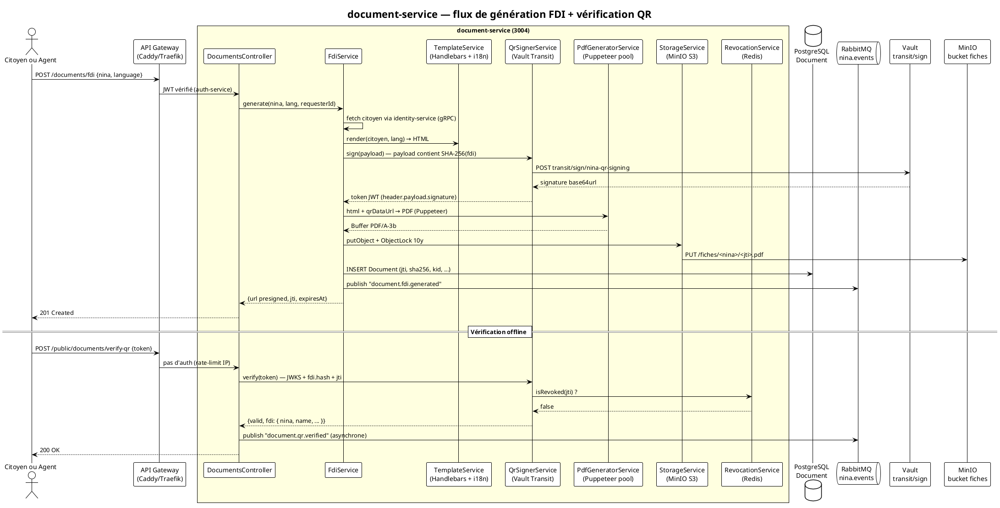

# 10 — Backend : Document-Service (NestJS 11 + Puppeteer + QR JWT RS256)

> **Projet** : NINA-AES Platform · **Document** : 10/26 · **Bloc** : A (NINA Mali — P0) **Service**
> : `document-service` — Génération de la Fiche Descriptive Individuelle (FDI) au format PDF/A-3b
> (visé — conformité à valider veraPDF, cf. §9.13), QR vérifiable hors ligne, archivage WORM MinIO.
> **Port** : `3004` · **Stack** : NestJS 11.1 · Puppeteer 24 · pdf-lib 1.17 · Handlebars 4.7 ·
> qrcode 1.5 · jose 5 · Vault Transit · MinIO 2025-11 · PostgreSQL 18 · Prisma 7.6 · RabbitMQ 4.2
> **Auteur** : Étudiant UQAR · **Date** : Avril 2026 · **Durée estimée** : 12–16 h **Prérequis** :
> [07 — Identity Service](./07-BACKEND-IDENTITY-SERVICE.md) ·
> [08 — Auth Service](./08-BACKEND-AUTH-SERVICE.md) ·
> [09 — Audit Service](./09-BACKEND-AUDIT-SERVICE.md) ·
> [05 — Docker Compose](./05-INFRASTRUCTURE-DOCKER-COMPOSE.md) (MinIO + Vault disponibles) **ADR
> liés** : [ADR-006 — JWT RS256 pour QR](./adr/ADR-006-jwt-rs256-qr-code.md) ·
> [ADR-026 — Clé QR via Vault Transit](./adr/ADR-026-vault-transit-qr-signing.md)

---

## Table des matières

1. [Objectif pédagogique](#1-objectif-pédagogique)
2. [Pourquoi un QR JWT RS256 ? — La faille du NINA brut](#2-pourquoi-un-qr-jwt-rs256)
3. [Technologies utilisées (versions avril 2026)](#3-technologies-utilisées-versions-avril-2026)
4. [Architecture du microservice document-service](#4-architecture-du-microservice-document-service)
5. [Schéma Prisma — `Document`, `DocumentRevocation`, `DocumentAccessLog`](#5-schéma-prisma)
6. [Structure de dossiers](#6-structure-de-dossiers)
7. [Payload QR JWT RS256 — schéma détaillé](#7-payload-qr-jwt-rs256--schéma-détaillé)
8. [Template HTML Handlebars — Fiche Descriptive A4](#8-template-html-handlebars--fiche-descriptive-a4)
9. [Implémentation NestJS — Code intégral commenté](#9-implémentation-nestjs--code-intégral-commenté)
10. [Stockage MinIO (S3) avec versioning + Object Lock WORM](#10-stockage-minio-s3-avec-versioning--object-lock-worm)
11. [Endpoint public de vérification du QR (offline-friendly)](#11-endpoint-public-de-vérification-du-qr-offline-friendly)
12. [Sécurité — protection PDF, anti-fraude, OWASP](#12-sécurité--protection-pdf-anti-fraude-owasp)
13. [Performance — pool Puppeteer, cache, métriques](#13-performance--pool-puppeteer-cache-métriques)
14. [Tests (unit + e2e + visual regression)](#14-tests-unit--e2e--visual-regression)
15. [Swagger + OpenAPI 3.2](#15-swagger--openapi-32)
16. [Mini-rapport d'étape (template)](#16-mini-rapport-détape-template)
17. [Checklist de fin d'étape](#17-checklist-de-fin-détape)
18. [Pour aller plus loin](#18-pour-aller-plus-loin)

---

## 1. Objectif pédagogique

Construire le service qui **matérialise** l'identité numérique NINA sous forme d'un **PDF officiel
vérifiable hors ligne** : la **Fiche Descriptive Individuelle (FDI)**, équivalent numérique signé du
document papier A4 actuellement délivré par le **CTDEC** (Centre de Traitement des Données de l'État
Civil, rue Baba Diarra BP 215, Bamako).

La FDI est :

- **Imprimable** sur papier A4 standard (rendu pixel-stable),
- **Signée cryptographiquement** via un QR code contenant un JWT RS256 — **pas** le NINA en clair,
- **Vérifiable hors ligne** par n'importe quelle application mobile (scan QR + clé publique
  embarquée ou JWKS cache 24 h),
- **Multilingue** : FR · BM (bamanankan) · SNK (soninké) · FF (peul/fulfulde) — extensible aux 4
  autres langues nationales (Tamasheq, Hausa, Mossi, Djerma) pour le Bloc B,
- **Auditée** : chaque génération et chaque vérification publie un événement vers `audit-service`
  (hash-chain SHA-256 linéaire, cf. document 09).

Ce service joue le rôle de **carte d'identité numérique portable** en attendant la carte biométrique
physique du Bloc F (qui n'arrive qu'en P3, prioritairement après l'interop AES).

### Ce que tu vas apprendre

| Compétence                            | Niveau        | Application au projet                                     |
| ------------------------------------- | ------------- | --------------------------------------------------------- |
| Génération PDF serveur (Puppeteer)    | Avancé        | Chromium headless, rendu HTML → PDF/A-3b                  |
| pdf-lib (post-processing)             | Avancé        | Métadonnées PDF/A, watermark, attachment du JWT brut      |
| Templates Handlebars + i18next        | Intermédiaire | Internationalisation 8 langues, helpers NINA              |
| JWT RS256 + clé via Vault Transit     | Expert        | Signature côté Vault (clé jamais exfiltrée), `kid` JWKS   |
| QR code à correction d'erreurs élevée | Intermédiaire | Niveau H (30 % redondance) pour résister à l'usure papier |
| MinIO S3 + Object Lock WORM           | Avancé        | Rétention compliance 10 ans, immutabilité prouvable       |
| Pool Puppeteer (`puppeteer-cluster`)  | Avancé        | 4 contextes browser, 100 PDF/min soutenu                  |
| Visual regression (pdf → png → diff)  | Intermédiaire | Détecte une régression de mise en page entre 2 commits    |
| Révocation par `jti` + cache Redis    | Avancé        | Liste de révocation O(1), TTL aligné sur expiry JWT       |

### Livrables à la fin de ce document

- **6 endpoints REST** sur `http://localhost:3004/api/v1/documents/*` (+ `/health`)
- **Génération PDF** de la FDI (A4, 1 page recto-verso) avec QR au coin inférieur droit
- **Signature JWT RS256 par Vault Transit** (clé `nina-qr-signing` jamais exfiltrée du Vault)
- **Template Handlebars** multi-langues (4 langues livrées en P0 : FR, BM, SNK, FF)
- **Upload MinIO** bucket `fiches` avec versioning + Object Lock 10 ans
- **URL pré-signée** (expiry 1 h par défaut, configurable jusqu'à 7 j)
- **Endpoint public** `/public/documents/verify-qr` sans auth (rate-limit IP 30/min)
- **Audit** de chaque génération / révocation / vérification (RabbitMQ → audit-service)
- **Tests** ≥ 85 % de couverture (unit + e2e + 1 test de régression visuelle)
- **Swagger** OpenAPI 3.2 documentant les 6 endpoints

---

## 2. Pourquoi un QR JWT RS256

### 2.1 Le QR code actuel du CTDEC : une faille critique

Le document papier émis aujourd'hui par le CTDEC contient un QR code qui encode **uniquement le NINA
brut** (15 caractères). Concrètement :

```text
QR scanné aujourd'hui → "19850315123456A"
```

C'est strictement équivalent à imprimer le NINA en chiffres et à demander à l'agent de le retaper.
Cela ouvre **trois vecteurs d'attaque** :

| Attaque              | Faisabilité aujourd'hui | Impact                                   |
| -------------------- | ----------------------- | ---------------------------------------- |
| Copie / réimpression | Trivial (photocopieuse) | Faux papier vérifié comme vrai en mairie |
| Falsification champ  | Triviale (Photoshop)    | NOM/PRÉNOMS modifiés, QR inchangé        |
| Substitution photo   | Triviale                | Identité d'un tiers prise sur la photo   |

Aucun mécanisme de signature ne permet de prouver, à partir du seul QR, que :

1. la fiche a bien été émise par le CTDEC à un instant T,
2. les champs (NOM, PRÉNOMS, naissance, etc.) **n'ont pas été altérés** depuis l'émission,
3. le document n'a pas été révoqué (décès, fraude, etc.).

### 2.2 Réponse — JWT RS256 contenant un hash des données + signature Vault

Le QR de la nouvelle FDI encode un **JWT signé RS256** (3072 bits) dont le payload est :

- Le NINA (`sub`),
- Le **hash SHA-256** de la totalité des champs imprimés (`fdi.hash`) → toute altération visuelle
  est détectable,
- Un `biometricHash` (placeholder en P0, valeur réelle en Bloc F),
- Un `jti` unique (identifiant du JWT) pour la révocation,
- `iat`, `exp` (180 jours), `iss` (`urn:nina-aes:ctdec-bamako`),
- Un `kid` (key id) qui permet à un vérificateur de retrouver la bonne clé publique dans le JWKS.

La signature est calculée **par Vault** via l'API `transit/sign/nina-qr-signing` : la **clé privée
ne quitte jamais le coffre-fort**. Le service `document-service` ne fait que présenter le payload
hashé et obtenir la signature.

### 2.3 Propriétés cryptographiques garanties

| Propriété            | Mécanisme                                                          |
| -------------------- | ------------------------------------------------------------------ |
| Authenticité         | Signature RS256 par clé Vault `nina-qr-signing` (issuer CTDEC)     |
| Intégrité des champs | `fdi.hash = SHA-256(canonical_json(fdi))` inclus dans le JWT       |
| Non-rejouabilité     | `jti` unique + révocation par liste Redis                          |
| Expiration           | `exp` à 180 jours (FDI à renouveler annuellement, marge 50 %)      |
| Rotation de clé      | `kid` JWKS → vérifieur récupère la bonne clé publique              |
| Vérification offline | JWKS cache 24 h sur mobile + clé publique embarquée comme fallback |
| Détection de copie   | Watermark dynamique (IP + UA de la demande) en filigrane PDF       |

### 2.4 Pourquoi RS256 et pas Ed25519 ?

`audit-service` utilise Ed25519 (cf. doc 09 §12) car la signature est interne, jamais scannée par un
mobile. Pour le QR :

- **RS256** est le seul algorithme **garanti supporté par 100 % des bibliothèques JWT mobiles**
  (Android, iOS, Flutter, React Native) en 2026.
- Les payloads QR restent compacts (~600 octets) ce qui tient confortablement dans un QR niveau H.
- L'écosystème Keycloak / Vault Transit le supporte nativement.

---

## 3. Technologies utilisées (versions avril 2026)

| Dépendance                 | Version   | Rôle                                                 |
| -------------------------- | --------- | ---------------------------------------------------- |
| `@nestjs/common`           | `11.1.18` | Core NestJS                                          |
| `@nestjs/core`             | `11.1.18` | Runtime                                              |
| `@nestjs/platform-express` | `11.1.18` | Adaptateur HTTP                                      |
| `@nestjs/config`           | `4.1.2`   | `.env` validé via Zod                                |
| `@nestjs/swagger`          | `11.2.0`  | OpenAPI 3.2                                          |
| `@nestjs/terminus`         | `11.1.0`  | Healthchecks (MinIO, Vault, Postgres)                |
| `@nestjs/microservices`    | `11.1.18` | Publisher AMQP vers audit-service                    |
| `@nestjs/schedule`         | `6.1.0`   | Cron : nettoyage cache, rafraîchissement JWKS        |
| `@nestjs/throttler`        | `6.5.0`   | Rate-limit endpoint public `/verify-qr`              |
| `@nina-aes/database`       | workspace | Singleton PrismaClient (cf. packages/database)       |
| `@nina-aes/vault-client`   | workspace | Wrapper Vault (`transit/sign`, `kv/get`)             |
| `@nina-aes/auth-guards`    | workspace | `JwtAuthGuard`, `RolesGuard`, `ClerkOwnerGuard`      |
| `@nina-aes/shared-types`   | workspace | DTOs `FdiPayload`, `QrPayload`, enums                |
| `puppeteer`                | `24.10.0` | Chromium headless                                    |
| `puppeteer-cluster`        | `0.24.0`  | Pool de contextes browser                            |
| `pdf-lib`                  | `1.17.1`  | Post-processing PDF/A, attachments, métadonnées      |
| `qrcode`                   | `1.5.4`   | Rendu QR niveau H en SVG/PNG                         |
| `handlebars`               | `4.7.8`   | Moteur de template HTML                              |
| `i18next`                  | `25.0.2`  | Internationalisation 8 langues                       |
| `i18next-fs-backend`       | `2.6.0`   | Charge les `.json` depuis `src/i18n/`                |
| `jose`                     | `5.10.0`  | Construction JWT (header + payload, signature Vault) |
| `minio`                    | `8.0.7`   | Client S3-compatible (upload, presign, object lock)  |
| `ioredis`                  | `5.6.0`   | Cache PDF + révocations                              |
| `prom-client`              | `15.1.3`  | Métriques Prometheus (`pdf_generated_total`, etc.)   |
| `zod`                      | `3.24.4`  | Validation DTOs                                      |
| `pino`                     | `9.7.0`   | Logger structuré                                     |
| `nestjs-pino`              | `4.4.0`   | Intégration pino + NestJS                            |
| `helmet`                   | `8.1.0`   | Hardening HTTP                                       |

**Dev / Tests** :

| Dépendance         | Version   | Rôle                          |
| ------------------ | --------- | ----------------------------- |
| `jest`             | `30.0.4`  | Tests unitaires               |
| `@nestjs/testing`  | `11.1.18` | Module de test NestJS         |
| `supertest`        | `7.1.4`   | Tests HTTP e2e                |
| `@playwright/test` | `1.50.1`  | Visual regression             |
| `pdfjs-dist`       | `4.10.38` | PDF → PNG côté tests          |
| `testcontainers`   | `10.16.0` | MinIO + Vault éphémères en CI |

---

## 4. Architecture du microservice document-service

### 4.1 Diagramme PlantUML



### 4.2 Position dans la cartographie des 11 microservices

| #   | Service                | Port | Consomme                     | Émet                                                           |
| --- | ---------------------- | ---- | ---------------------------- | -------------------------------------------------------------- |
| 1   | identity-service       | 3001 | —                            | citizen.created, citizen.updated                               |
| 2   | auth-service           | 3002 | —                            | auth.login, auth.mfa.success                                   |
| 3   | ai-service             | 3003 | citizen.created              | nina.scored                                                    |
| 4   | **document-service**   | 3004 | citizen (gRPC), Vault, MinIO | document.fdi.generated, document.revoked, document.qr.verified |
| 5   | notification-service   | 3005 | document.fdi.generated       | notification.sent                                              |
| 6   | interop-service        | 3006 | —                            | interop.lookup                                                 |
| 7   | audit-service          | 3007 | **toutes**                   | —                                                              |
| 8   | appointment-service    | 3008 | document.fdi.generated       | appointment.created                                            |
| 9   | anticorruption-service | 3009 | document.qr.verified         | sigac.flag                                                     |
| 10  | governance-service     | 3010 | —                            | gov.message                                                    |
| 11  | vulnerability-service  | 3011 | —                            | vulnerability.assistance                                       |

`document-service` est **consommateur** d'identity (lecture) + Vault (signature) + MinIO (stockage),
**producteur** vers RabbitMQ (audit + notification).

---

## 5. Schéma Prisma

Fichier `packages/database/prisma/schema.prisma` (extrait — le schéma complet est dans le document
06).

```prisma
// ─────────────────────────────────────────────────────────────
// Document — FDI émise (1 ligne par PDF généré, append-only)
// ─────────────────────────────────────────────────────────────
model Document {
  id              String   @id @default(uuid(7))
  jti             String   @unique               // identifiant du JWT QR — clé de révocation
  nina            String                          // NINA du citoyen (lookup via identity)
  type            DocumentType @default(FICHE_DESCRIPTIVE)
  serialNumber    String   @unique                // FDI-2026-0000123 (numéro de souche imprimé)
  language        String                          // ISO 639-3 (fra, bam, snk, fuv)
  sha256Html      String                          // hash du HTML source (canonical)
  sha256Pdf       String                          // hash du PDF final
  kid             String                          // key id Vault qui a signé le QR
  minioBucket     String   @default("fiches")
  minioObjectKey  String                          // <nina>/<jti>.pdf
  minioVersionId  String                          // versioning MinIO
  issuedAt        DateTime @default(now())
  expiresAt       DateTime                        // iat + 180 jours
  issuedBy        String                          // userId Keycloak (agent ou self-service)
  issuedFromIp    String                          // IP source (anti-fraude)
  watermark       String                          // SHA-256(ip|userAgent|jti) court
  createdAt       DateTime @default(now())

  revocation      DocumentRevocation?
  accessLogs      DocumentAccessLog[]

  @@index([nina, type])
  @@index([issuedAt])
  @@map("documents")
}

enum DocumentType {
  FICHE_DESCRIPTIVE
  EXTRAIT_NAISSANCE        // futur — pas en P0
  CERTIFICAT_NATIONALITE   // futur — pas en P0
}

// ─────────────────────────────────────────────────────────────
// Révocation — 1 ligne par document révoqué (ne supprime jamais)
// ─────────────────────────────────────────────────────────────
model DocumentRevocation {
  id          String   @id @default(uuid(7))
  documentId  String   @unique
  document    Document @relation(fields: [documentId], references: [id])
  reason      RevocationReason
  reasonText  String?                            // texte libre optionnel
  revokedAt   DateTime @default(now())
  revokedBy   String                              // userId qui a révoqué

  @@map("document_revocations")
}

enum RevocationReason {
  DECEASED              // décès du citoyen
  FRAUD_DETECTED        // fraude détectée
  DATA_CORRECTION       // données corrigées (ré-émission)
  CITIZEN_REQUEST       // demande explicite
  OTHER
}

// ─────────────────────────────────────────────────────────────
// Journal d'accès — chaque GET download + chaque verify-qr
// ─────────────────────────────────────────────────────────────
model DocumentAccessLog {
  id           String   @id @default(uuid(7))
  documentId   String?
  document     Document? @relation(fields: [documentId], references: [id])
  action       AccessAction
  jti          String?                            // pour verify-qr sans documentId
  ipAddress    String
  userAgent    String?
  result       AccessResult
  reasonCode   String?                            // VALID, EXPIRED, REVOKED, HASH_MISMATCH, …
  occurredAt   DateTime @default(now())

  @@index([jti])
  @@index([occurredAt])
  @@map("document_access_logs")
}

enum AccessAction {
  DOWNLOAD
  VERIFY_QR
}

enum AccessResult {
  SUCCESS
  FAILURE
}
```

### 5.1 Triggers Postgres (append-only sur révocations)

```sql
-- packages/database/prisma/migrations/_triggers/document_revocations_immutable.sql
CREATE OR REPLACE FUNCTION block_revocation_mutation()
RETURNS trigger AS $$
BEGIN
  RAISE EXCEPTION 'document_revocations is append-only';
END;
$$ LANGUAGE plpgsql;

CREATE TRIGGER trg_no_update_revocations
  BEFORE UPDATE OR DELETE ON document_revocations
  FOR EACH ROW EXECUTE FUNCTION block_revocation_mutation();
```

---

## 6. Structure de dossiers

```text
services/document-service/
├── src/
│   ├── main.ts
│   ├── app.module.ts
│   ├── config/
│   │   ├── env.schema.ts                 # Zod
│   │   └── puppeteer.config.ts
│   ├── documents/
│   │   ├── documents.controller.ts       # 4 endpoints privés
│   │   ├── public-documents.controller.ts# 1 endpoint public (/verify-qr)
│   │   ├── documents.service.ts
│   │   ├── dto/
│   │   │   ├── generate-fdi.dto.ts
│   │   │   ├── verify-qr.dto.ts
│   │   │   └── revoke.dto.ts
│   │   └── interfaces/
│   │       └── fdi-payload.interface.ts
│   ├── fdi/
│   │   ├── fdi.service.ts                # orchestrateur génération
│   │   ├── canonical.ts                  # JSON canonique stable (RFC 8785-like)
│   │   ├── serial-number.service.ts      # FDI-YYYY-XXXXXXX
│   │   └── watermark.ts
│   ├── pdf/
│   │   ├── pdf-generator.service.ts      # pool Puppeteer
│   │   ├── pdf-postprocess.service.ts    # pdf-lib (PDF/A + attachment JWT)
│   │   └── browser-pool.provider.ts
│   ├── qr/
│   │   ├── qr-signer.service.ts          # Vault transit/sign + jose
│   │   ├── qr-verifier.service.ts        # JWKS + hash + révocation
│   │   ├── jwks.service.ts               # cache 24 h
│   │   └── revocation.service.ts         # Redis SET
│   ├── templates/
│   │   ├── template.service.ts           # Handlebars + i18n + helpers
│   │   ├── helpers/
│   │   │   ├── format-nina.helper.ts     # "1 12 34 5 67 789 012 A"
│   │   │   ├── format-date.helper.ts
│   │   │   └── biometric-placeholder.helper.ts
│   │   └── files/
│   │       ├── fiche-descriptive.hbs
│   │       ├── fiche-descriptive.css
│   │       └── partials/
│   │           ├── header-ctdec.hbs
│   │           ├── photo-block.hbs
│   │           ├── identity-block.hbs
│   │           ├── place-hierarchy.hbs    # 8 niveaux
│   │           ├── parents-block.hbs
│   │           ├── justification-block.hbs
│   │           └── qr-footer.hbs
│   ├── i18n/
│   │   ├── fr.json
│   │   ├── bm.json                       # bamanankan
│   │   ├── snk.json                      # soninké
│   │   └── fuv.json                      # peul / fulfulde
│   ├── storage/
│   │   ├── minio.service.ts              # putObject avec ObjectLock + presign
│   │   └── minio.config.ts
│   ├── audit/
│   │   └── audit-publisher.service.ts    # RabbitMQ → nina.events
│   ├── identity-client/
│   │   └── identity.client.ts            # gRPC vers identity-service (port 3001)
│   ├── vault/
│   │   └── vault.module.ts               # ré-export @nina-aes/vault-client
│   ├── health/
│   │   └── health.controller.ts          # MinIO + Vault + Postgres + Identity
│   └── metrics/
│       └── metrics.controller.ts         # /metrics Prometheus
├── test/
│   ├── unit/
│   │   ├── qr-signer.service.spec.ts
│   │   ├── canonical.spec.ts
│   │   ├── template.service.spec.ts
│   │   └── revocation.service.spec.ts
│   ├── e2e/
│   │   ├── documents.e2e-spec.ts
│   │   └── verify-qr.e2e-spec.ts
│   ├── visual/
│   │   └── visual-regression.spec.ts
│   └── fixtures/
│       ├── citizen.fixture.json
│       └── expected-fiche-descriptive.pdf
├── prisma/                               # juste les triggers spécifiques
├── package.json
├── tsconfig.json
└── README.md
```

---

## 7. Payload QR JWT RS256 — schéma détaillé

### 7.1 Header

```json
{
  "alg": "RS256",
  "typ": "JWT",
  "kid": "nina-qr-2026-04"
}
```

`kid` correspond au nom de la clé Vault dans `transit/keys/nina-qr-signing` + le numéro de version.
Le vérificateur l'utilise pour aller chercher la bonne clé publique dans le JWKS exposé sur
`https://auth.nina-aes.ml/.well-known/jwks-qr.json`.

### 7.2 Payload (claims)

```typescript
// services/document-service/src/qr/qr-payload.interface.ts
export interface QrPayload {
  // Standard JWT
  iss: string; // "urn:nina-aes:ctdec-bamako"
  sub: string; // NINA (15 caractères) — sujet du document
  jti: string; // UUID v7 — identifiant unique du JWT (clé révocation)
  iat: number; // émission (epoch seconds)
  nbf: number; // not-before = iat
  exp: number; // expiry = iat + 15552000 (180 j)
  aud: string[]; // ["urn:nina-aes:verifier"]

  // Spécifiques FDI
  fdi: {
    serialNumber: string; // FDI-2026-0000123
    type: 'FICHE_DESCRIPTIVE';
    language: string; // fra | bam | snk | fuv
    hash: string; // SHA-256(canonical_json(fdiData)) — détection altération
    issuedAt: string; // ISO 8601 (lisible humain)
    documentId: string; // UUID v7 — id en base
  };

  // Données minimales lisibles offline (sans appel base)
  // Tout est aussi dans `fdi.hash` pour vérifier qu'elles n'ont pas été modifiées
  citizen: {
    nina: string;
    firstName: string;
    lastName: string;
    birthDate: string; // ISO 8601
    sex: 'M' | 'F';
    birthPlace: string; // commune seulement (PII minimisé)
  };

  // Placeholder Bloc F — vide en P0, hash réel quand biométrie active
  biometricHash: string | null;

  // Watermark anti-fraude (court, non-PII)
  wm: string; // 12 premiers caractères de SHA-256(ip|userAgent|jti)
}
```

### 7.3 Taille et niveau de QR

| Élément                 | Valeur typique                          |
| ----------------------- | --------------------------------------- |
| Header base64url        | ~80 caractères                          |
| Payload base64url       | ~550 caractères                         |
| Signature RSA 3072      | 384 octets → 512 caractères base64url   |
| **Total JWT**           | **~1 150 caractères**                   |
| Niveau de correction QR | **H (30 %)** — résiste à pliage / usure |
| Taille QR rendu (1 cm²) | ~600 × 600 px sur le PDF                |

Un niveau de correction H impose une matrice ~57×57 modules. C'est confortable sur un QR de 4 cm de
côté à 300 DPI.

### 7.4 Pourquoi inclure `citizen` ET `fdi.hash` ?

- `citizen` permet la **lecture offline** (ex. agent en brousse sans réseau).
- `fdi.hash` permet de **détecter** si le citoyen affiché à l'écran ne correspond pas à ce qui est
  effectivement imprimé sur le papier (cas d'un faux papier avec QR authentique). Le vérificateur
  recalcule `SHA-256(canonical_json(citizen + serialNumber + …))` et compare.

### 7.5 Pourquoi `citizen` est-il minimisé ?

Pas d'adresse, pas de profession, pas de noms des parents : ce sont des données PII secondaires qui
peuvent évoluer (déménagement, mariage) et qui n'ont pas leur place dans un jeton signé valide 180
jours. Le PDF imprimé les contient, et leur intégrité est protégée par `fdi.hash`.

---

## 8. Template HTML Handlebars — Fiche Descriptive A4

### 8.1 `templates/files/fiche-descriptive.hbs` (extrait)

```handlebars
<!DOCTYPE html>
<html lang="{{language}}">
<head>
  <meta charset="UTF-8" />
  <title>FDI — {{citizen.nina}}</title>
  <link rel="stylesheet" href="./fiche-descriptive.css" />
</head>
<body>
  {{> header-ctdec t=t}}

  <main class="fdi">
    <section class="top-band">
      <div class="serial">
        <strong>{{t "fdi.serial.label"}}</strong>
        <span class="serial-value">{{document.serialNumber}}</span>
        <span class="serial-date">{{formatDate document.issuedAt language}}</span>
      </div>
      <div class="document-id">
        <small>{{t "fdi.documentId"}} {{document.id}}</small>
      </div>
    </section>

    <h1 class="fdi-title">{{t "fdi.title"}}</h1>

    <section class="identity-row">
      {{> photo-block citizen=citizen}}
      {{> identity-block citizen=citizen t=t formatNina=formatNina}}
    </section>

    <section class="places">
      <h2 class="section-title">{{t "fdi.birthPlace"}}</h2>
      {{> place-hierarchy place=citizen.birthPlace t=t}}

      <h2 class="section-title">{{t "fdi.residence"}}</h2>
      {{> place-hierarchy place=citizen.residence t=t}}
    </section>

    <section class="parents">
      <h2 class="section-title">{{t "fdi.parents"}}</h2>
      {{> parents-block parents=citizen.parents t=t}}
    </section>

    {{> justification-block document=document t=t}}

    <footer class="fdi-footer">
      
      <div class="signature-block">
        <p>{{t "fdi.issuedOn"}} <strong>{{formatDate document.issuedAt language}}</strong></p>
        <p class="ctdec-signature">CTDEC — Bamako</p>
      </div>
      {{> qr-footer qrDataUrl=qrDataUrl document=document}}
    </footer>

    <div class="watermark">{{document.watermark}}</div>
  </main>
</body>
</html>
```

### 8.2 Partial `partials/identity-block.hbs`

```handlebars
<div class='identity'>
  <dl>
    <dt>{{t 'fdi.nina'}}</dt>
    <dd class='nina-formatted'>{{formatNina citizen.nina}}</dd>

    <dt>{{t 'fdi.lastName'}}</dt>
    <dd>{{citizen.lastName}}</dd>

    <dt>{{t 'fdi.firstName'}}</dt>
    <dd>{{citizen.firstName}}</dd>

    <dt>{{t 'fdi.birthDate'}}</dt>
    <dd>{{formatDate citizen.birthDate language}}</dd>

    <dt>{{t 'fdi.sex'}}</dt>
    <dd>{{t (concat 'fdi.sex.' citizen.sex)}}</dd>

    <dt>{{t 'fdi.matrimonial'}}</dt>
    <dd>{{t (concat 'fdi.matrimonial.' citizen.matrimonialStatus)}}</dd>

    <dt>{{t 'fdi.profession'}}</dt>
    <dd>{{citizen.profession}}</dd>
  </dl>
</div>
```

### 8.3 Partial `partials/place-hierarchy.hbs` (8 niveaux)

```handlebars
<table class='place-hierarchy'>
  <tr>
    <td>{{t 'fdi.country.code'}}</td><td>{{place.countryCode}}</td>
    <td>{{t 'fdi.country'}}</td><td>{{place.country}}</td>
  </tr>
  <tr>
    <td>{{t 'fdi.region'}}</td><td>{{place.region}}</td>
    <td>{{t 'fdi.cercle'}}</td><td>{{place.cercle}}</td>
  </tr>
  <tr>
    <td>{{t 'fdi.arrondissement'}}</td><td>{{place.arrondissement}}</td>
    <td>{{t 'fdi.commune'}}</td><td>{{place.commune}}</td>
  </tr>
  <tr>
    <td>{{t 'fdi.quartier'}}</td><td>{{place.quartier}}</td>
    <td>{{t 'fdi.fraction'}}</td><td>{{place.fraction}}</td>
  </tr>
  <tr>
    <td>{{t 'fdi.hameau'}}</td><td>{{place.hameau}}</td>
    <td>{{t 'fdi.secteur'}}</td><td>{{place.secteur}}</td>
  </tr>
</table>
```

### 8.4 Partial `partials/qr-footer.hbs`

```handlebars
<div class='qr-zone'>
  
  <small class='qr-instructions'>
    {{t 'fdi.qr.scanInstructions'}}<br />
    <code>{{document.jti}}</code>
  </small>
</div>
```

### 8.5 CSS `fiche-descriptive.css` (essence)

```css
@page {
  size: A4;
  margin: 14mm 12mm;
}

body {
  font-family: 'Noto Sans', Arial, sans-serif;
  color: #111;
  font-size: 10pt;
  margin: 0;
}

.fdi {
  display: grid;
  grid-template-rows: auto auto 1fr auto auto auto;
  gap: 6mm;
}

.identity-row {
  display: grid;
  grid-template-columns: 50mm 1fr;
  gap: 8mm;
  align-items: start;
}

.nina-formatted {
  font-family: 'JetBrains Mono', monospace;
  font-weight: 700;
  font-size: 13pt;
  letter-spacing: 0.5px;
}

.place-hierarchy {
  width: 100%;
  border-collapse: collapse;
  font-size: 9pt;
}
.place-hierarchy td {
  border: 0.4pt solid #999;
  padding: 1.5mm;
}

.qr-zone {
  position: absolute;
  bottom: 14mm;
  right: 12mm;
  text-align: center;
}

.watermark {
  position: absolute;
  bottom: 5mm;
  right: 5mm;
  font-size: 6pt;
  color: #bbb;
  font-family: monospace;
}

.fdi-title {
  text-align: center;
  font-size: 14pt;
  text-transform: uppercase;
  letter-spacing: 1.5px;
  border-bottom: 1pt solid #000;
  padding-bottom: 3mm;
}
```

### 8.6 Fichier i18n `i18n/fr.json` (extrait)

```json
{
  "fdi": {
    "title": "Fiche descriptive individuelle",
    "serial": { "label": "N° de souche :" },
    "documentId": "Identifiant fiche :",
    "nina": "NINA",
    "lastName": "Nom",
    "firstName": "Prénom(s)",
    "birthDate": "Date de naissance",
    "sex": { "M": "Homme", "F": "Femme" },
    "matrimonial": {
      "SINGLE": "Célibataire",
      "MARRIED": "Marié(e)",
      "DIVORCED": "Divorcé(e)",
      "WIDOWED": "Veuf / Veuve"
    },
    "profession": "Profession",
    "birthPlace": "Lieu de naissance",
    "residence": "Lieu de résidence",
    "country": "Pays",
    "country.code": "Code pays",
    "region": "Région",
    "cercle": "Cercle",
    "arrondissement": "Arrondissement",
    "commune": "Commune",
    "quartier": "Quartier / Village",
    "fraction": "Fraction",
    "hameau": "Hameau",
    "secteur": "Secteur",
    "parents": "Parents",
    "issuedOn": "Fait le",
    "qr": {
      "scanInstructions": "Scannez ce QR pour vérifier l'authenticité"
    }
  }
}
```

> ⚠️ Pour les 3 autres langues (BM, SNK, FUV), le squelette de clés est identique. Le texte est
> traduit avec un linguiste local : ne jamais utiliser de traduction machine pour un document légal
> officiel. En P0, livrer FR + BM ; SNK + FUV peuvent rester comme placeholders à compléter en
> Sprint 5 (cf. doc 26).

---

## 9. Implémentation NestJS — Code intégral commenté

### 9.1 `main.ts`

> ⏳ **STATUT — à implémenter Phase 2 (le code on-disk ne fait PAS ceci).** Le bloc ci-dessous
> documente le **durcissement CIBLE** (CSP stricte globale + HSTS + helmet dédié assoupli sur
> `/api/docs`). **Le `main.ts` réellement livré a encore
> `helmet({ contentSecurityPolicy: false })`** (CSP désactivée sur TOUTE l'application), **sans**
> HSTS, **sans** `strictHelmet`, **sans** `swaggerHelmet`. Vérifiable :
> `grep -n "contentSecurityPolicy: false" services/document-service/src/main.ts` retourne bien
> `main.ts:25`. Tant que ce correctif n'est pas appliqué, A05 reste ouvert.

```typescript
// ⏳ DESIGN CIBLE — NON livré (cf. bannière ci-dessus). À implémenter en Phase 2.
// services/document-service/src/main.ts
/**
 * @file        main.ts
 * @description Bootstrap du microservice document-service (port 3004).
 *              Active Swagger, Helmet (CSP stricte + HSTS), validation Zod, logger pino.
 */
import { NestFactory } from '@nestjs/core';
import { Logger } from 'nestjs-pino';
import { DocumentExceptionFilter } from './documents/document-exception.filter';
import helmet from 'helmet';
import { AppModule } from './app.module';
import { setupSwagger } from './swagger';

async function bootstrap() {
  const app = await NestFactory.create(AppModule, { bufferLogs: true });
  app.useLogger(app.get(Logger));

  // ── DURCISSEMENT P1 — CSP STRICTE PAR DÉFAUT ───────────────────────────
  // ANCIEN défaut dangereux : `helmet({ contentSecurityPolicy: false })`
  // désactivait la CSP sur TOUTE l'application pour faire plaisir à Swagger.
  // NOUVEAU : CSP stricte globale + HSTS. On ne relâche la CSP QUE sur la
  // route Swagger (`/api/docs`), via un helmet dédié monté avant le router.
  const strictHelmet = helmet({
    contentSecurityPolicy: {
      useDefaults: true,
      directives: {
        defaultSrc: ["'self'"],
        scriptSrc: ["'self'"],
        styleSrc: ["'self'"],
        imgSrc: ["'self'", 'data:'], // QR rendu en data:image/png — autorisé
        objectSrc: ["'none'"],
        frameAncestors: ["'none'"],
        baseUri: ["'self'"],
        upgradeInsecureRequests: [],
      },
    },
    // HSTS : 2 ans, sous-domaines inclus, éligible preload.
    hsts: { maxAge: 63_072_000, includeSubDomains: true, preload: true },
    referrerPolicy: { policy: 'no-referrer' },
  });

  // CSP assouplie UNIQUEMENT pour la doc Swagger (inline styles/scripts de
  // swagger-ui). HSTS et les autres en-têtes restent appliqués.
  const swaggerHelmet = helmet({
    contentSecurityPolicy: {
      useDefaults: true,
      directives: {
        defaultSrc: ["'self'"],
        scriptSrc: ["'self'", "'unsafe-inline'"],
        styleSrc: ["'self'", "'unsafe-inline'"],
        imgSrc: ["'self'", 'data:'],
        objectSrc: ["'none'"],
      },
    },
    hsts: { maxAge: 63_072_000, includeSubDomains: true, preload: true },
  });

  // L'ordre compte : la route Swagger doit matcher AVANT le helmet strict.
  app.use(['/api/docs', '/api/docs-json'], swaggerHelmet);
  app.use(strictHelmet);

  app.setGlobalPrefix('api/v1', { exclude: ['health', 'metrics'] });
  app.useGlobalFilters(new DocumentExceptionFilter());
  app.enableCors({ origin: ['https://citoyen.nina-aes.ml'], credentials: true });

  // /metrics protégé par mTLS au niveau réseau (cf. §13.x) : exposé sur un
  // listener séparé OU derrière un proxy qui exige un cert client Prometheus.
  setupSwagger(app);
  await app.listen(3004);
  app.get(Logger).log({ port: 3004 }, 'document-service ready');
}
bootstrap();
```

> ⏳ **Réalité on-disk (à corriger Phase 2)** :
> `grep -n "contentSecurityPolicy: false" services/document-service/src/main.ts` retourne **encore**
> `main.ts:25`. La CSP est donc actuellement **désactivée sur toute l'application** ; HSTS n'est pas
> émis ; aucun `swaggerHelmet`/`strictHelmet` n'existe. Une fois ce design appliqué, le grep ne
> devra plus rien retourner — ce n'est PAS le cas aujourd'hui.

### 9.2 `app.module.ts`

```typescript
// services/document-service/src/app.module.ts
import { Module } from '@nestjs/common';
import { ConfigModule } from '@nestjs/config';
import { TerminusModule } from '@nestjs/terminus';
import { ScheduleModule } from '@nestjs/schedule';
import { LoggerModule } from 'nestjs-pino';
import { ThrottlerModule } from '@nestjs/throttler';
import { envSchema } from './config/env.schema';
import { DocumentsModule } from './documents/documents.module';
import { PdfModule } from './pdf/pdf.module';
import { QrModule } from './qr/qr.module';
import { TemplateModule } from './templates/template.module';
import { StorageModule } from './storage/storage.module';
import { AuditPublisherModule } from './audit/audit-publisher.module';
import { IdentityClientModule } from './identity-client/identity-client.module';
import { HealthModule } from './health/health.module';
import { MetricsModule } from './metrics/metrics.module';

@Module({
  imports: [
    ConfigModule.forRoot({
      isGlobal: true,
      validate: (env) => envSchema.parse(env),
    }),
    LoggerModule.forRoot({ pinoHttp: { redact: ['req.headers.authorization'] } }),
    ScheduleModule.forRoot(),
    TerminusModule,
    ThrottlerModule.forRoot([{ ttl: 60_000, limit: 30 }]),
    DocumentsModule,
    PdfModule,
    QrModule,
    TemplateModule,
    StorageModule,
    AuditPublisherModule,
    IdentityClientModule,
    HealthModule,
    MetricsModule,
  ],
})
export class AppModule {}
```

### 9.3 `config/env.schema.ts`

> ⏳ **STATUT — DESIGN CIBLE, non livré.** Le schéma ci-dessous est la version **durcie visée**
> (aucun secret en variable d'environnement). **Le `env.schema.ts` réellement livré contient
> ENCORE** : `VAULT_TOKEN: z.string().min(1).default('dev-only-root-token')` (token root dev
> long-lived — exactement ce que le CANON sécurité interdit, ligne 29),
> `MINIO_ACCESS_KEY default 'minio'` (ligne 36), `MINIO_SECRET_KEY default 'minio12345'` (secret en
> clair, ligne 37), ainsi que `DATABASE_URL`, `REDIS_URL`, `RABBITMQ_URL`. Le `SecretsLoader` (§9.3
> bis) **n'existe pas encore** (`config/secrets-loader.ts` absent du dépôt). Migration vers Vault KV
> v2 = **⏳ à implémenter Phase 2**.

```typescript
// ⏳ DESIGN CIBLE — NON livré (cf. bannière ci-dessus). Le schéma on-disk garde
//    encore VAULT_TOKEN/MINIO_ACCESS_KEY/MINIO_SECRET_KEY + DATABASE_URL/REDIS_URL/RABBITMQ_URL.
// services/document-service/src/config/env.schema.ts
import { z } from 'zod';

/**
 * Schéma de configuration validé au démarrage (échec fast si manquant).
 *
 * ⚠️ DURCISSEMENT P1 (CIBLE) — PLUS AUCUN SECRET EN VARIABLE D'ENVIRONNEMENT.
 * Le `.env` ne contient QUE :
 *   - des coordonnées non sensibles (hôtes, ports, chemins de montage CSI),
 *   - la configuration d'authentification Vault (AppRole / Kubernetes SA),
 *     mais JAMAIS un `VAULT_TOKEN` long-lived (cf. CANON sécurité).
 *
 * Tous les secrets applicatifs — DATABASE_URL, REDIS_URL, RABBITMQ_URL,
 * MINIO_ACCESS_KEY/SECRET_KEY — sont lus à chaud depuis **Vault KV v2**
 * via `@nina-aes/vault-client` (cf. §3.x ci-dessous : SecretsLoader + renewal).
 * Ils n'apparaissent donc PAS dans ce schéma : ils ne transitent jamais
 * par l'environnement du process.
 */
export const envSchema = z.object({
  NODE_ENV: z.enum(['development', 'test', 'production']),
  PORT: z.coerce.number().default(3004),

  // ── Authentification Vault (AppRole en VM, K8s SA en cluster) ───────────
  // En prod : RoleID injecté en clair (non secret), SecretID livré via
  // response-wrapping à usage unique OU jeton de SA monté par le CSI.
  // JAMAIS de VAULT_TOKEN long-lived ici (cf. CANON sécurité, MEMORY).
  VAULT_ADDR: z.string().url(),
  VAULT_AUTH_METHOD: z.enum(['approle', 'kubernetes']).default('approle'),
  VAULT_ROLE_ID: z.string().min(8).optional(), // approle — non secret
  VAULT_SECRET_ID_PATH: z.string().optional(), // chemin fichier wrappé (approle)
  VAULT_K8S_ROLE: z.string().optional(), // rôle Vault associé au SA (kubernetes)
  VAULT_K8S_JWT_PATH: z.string().default('/var/run/secrets/kubernetes.io/serviceaccount/token'),

  // ── Chemins des secrets dans Vault KV v2 (valeurs lues à chaud) ─────────
  // Le service NE connaît que le CHEMIN ; le contenu reste dans Vault.
  VAULT_KV_DB_PATH: z.string().default('secret/data/document-service/database'),
  VAULT_KV_REDIS_PATH: z.string().default('secret/data/document-service/redis'),
  VAULT_KV_RABBITMQ_PATH: z.string().default('secret/data/document-service/rabbitmq'),
  VAULT_KV_MINIO_PATH: z.string().default('secret/data/document-service/minio'),

  // ── Vault Transit (signature QR — la clé ne quitte jamais Vault) ────────
  VAULT_QR_SIGNING_KEY: z.string().default('nina-qr-signing'),

  // ── mTLS inter-services (PKI Vault, cf. ADR-034) ───────────────────────
  // Certificats client/serveur montés par le CSI Vault Agent ; rotation auto.
  MTLS_CA_PATH: z.string().default('/etc/nina/mtls/ca.crt'),
  MTLS_CERT_PATH: z.string().default('/etc/nina/mtls/tls.crt'),
  MTLS_KEY_PATH: z.string().default('/etc/nina/mtls/tls.key'),

  // ── Coordonnées non sensibles ──────────────────────────────────────────
  RABBITMQ_EVENTS_EXCHANGE: z.string().default('nina.events'),
  RABBITMQ_NOTIF_EXCHANGE: z.string().default('notification.events'),

  MINIO_ENDPOINT: z.string(),
  MINIO_PORT: z.coerce.number().default(9000),
  MINIO_USE_SSL: z.coerce.boolean().default(true), // ⚠️ TLS exigé en prod (mTLS S3)
  MINIO_BUCKET_FICHES: z.string().default('fiches'),
  MINIO_RETENTION_YEARS: z.coerce.number().default(10),

  // identity-service gRPC (canal mTLS, cf. §9.x identity.client.ts)
  IDENTITY_GRPC_URL: z.string().default('identity-service:50051'),

  // JWKS QR (URL publique exposée aux mobiles)
  JWKS_QR_URL: z.string().url(),

  // /metrics — autorité de confiance (Prometheus) pour le mTLS de scraping
  METRICS_MTLS_ENABLED: z.coerce.boolean().default(true),
  METRICS_ALLOWED_CN: z.string().default('prometheus.monitoring'),

  // FDI
  FDI_TTL_DAYS: z.coerce.number().default(180),
  FDI_PUPPETEER_POOL_SIZE: z.coerce.number().default(4),
});

export type Env = z.infer<typeof envSchema>;
```

> ⏳ **Disparition CIBLE de `VAULT_TOKEN`, `MINIO_ACCESS_KEY`, `MINIO_SECRET_KEY`, `DATABASE_URL`,
> `REDIS_URL`, `RABBITMQ_URL`** : dans le design durci ces clés sortent du schéma (ce sont des
> secrets) et sont lues à chaud depuis Vault KV v2 (§9.3 bis). **Ce n'est PAS encore le cas** :
> `grep -n "VAULT_TOKEN\|MINIO_SECRET_KEY" services/document-service/src/config/env.schema.ts`
> retourne **encore** les lignes 29 (`VAULT_TOKEN ... default('dev-only-root-token')`) et 37
> (`MINIO_SECRET_KEY ... default('minio12345')`). Le grep ne sera vide qu'**après** implémentation
> Phase 2.

### 9.3 bis `config/secrets-loader.ts` — KV v2 + renouvellement (⏳ à implémenter Phase 2)

```typescript
// services/document-service/src/config/secrets-loader.ts
/**
 * @file        secrets-loader.ts
 * @description Charge les secrets applicatifs depuis Vault KV v2 au boot, puis
 *              lance le renouvellement périodique du lease Vault (token AppRole/K8s).
 *
 *              POURQUOI : un VAULT_TOKEN long-lived dans le .env est le pire
 *              anti-pattern (vol = accès permanent). On s'authentifie via AppRole
 *              (VM) ou Kubernetes SA (cluster), on obtient un token à TTL court,
 *              et le client Vault le RENOUVELLE automatiquement avant expiration.
 *              À l'échéance max du lease, on ré-authentifie (re-login).
 */
import { Injectable, Logger, OnModuleDestroy } from '@nestjs/common';
import { VaultClient } from '@nina-aes/vault-client';
import { ConfigService } from '@nestjs/config';

export interface RuntimeSecrets {
  databaseUrl: string;
  redisUrl: string;
  rabbitmqUrl: string;
  minioAccessKey: string;
  minioSecretKey: string;
}

@Injectable()
export class SecretsLoader implements OnModuleDestroy {
  private readonly log = new Logger(SecretsLoader.name);
  private renewTimer?: NodeJS.Timeout;

  constructor(
    private readonly vault: VaultClient,
    private readonly cfg: ConfigService,
  ) {}

  /** Login AppRole/K8s → token TTL court, puis lit les secrets KV v2. */
  async load(): Promise<RuntimeSecrets> {
    await this.vault.login(); // AppRole ou K8s selon VAULT_AUTH_METHOD
    this.scheduleRenew(); // renouvellement auto du lease

    const [db, redis, mq, minio] = await Promise.all([
      this.vault.kvGet(this.cfg.get('VAULT_KV_DB_PATH')!),
      this.vault.kvGet(this.cfg.get('VAULT_KV_REDIS_PATH')!),
      this.vault.kvGet(this.cfg.get('VAULT_KV_RABBITMQ_PATH')!),
      this.vault.kvGet(this.cfg.get('VAULT_KV_MINIO_PATH')!),
    ]);

    return {
      databaseUrl: db.url,
      redisUrl: redis.url,
      rabbitmqUrl: mq.url,
      minioAccessKey: minio.accessKey,
      minioSecretKey: minio.secretKey,
    };
  }

  /**
   * Renouvelle le token Vault à ~⅔ de son TTL. Si le lease atteint son
   * max_ttl, le client se ré-authentifie (re-login AppRole/K8s).
   */
  private scheduleRenew(): void {
    const ttlMs = this.vault.tokenTtlSeconds() * 1000;
    const delay = Math.max(30_000, Math.floor(ttlMs * 0.66));
    this.renewTimer = setTimeout(async () => {
      try {
        await this.vault.renewSelfOrRelogin();
      } catch (e) {
        this.log.error({ err: (e as Error).message }, 'Vault token renew failed → relogin');
        await this.vault.login();
      }
      this.scheduleRenew();
    }, delay);
  }

  onModuleDestroy(): void {
    if (this.renewTimer) clearTimeout(this.renewTimer);
  }
}
```

> Les identifiants MinIO ne sont plus statiques : en production on préfère des **identifiants S3
> dynamiques** via le secret engine `minio`/STS (TTL court), mais à défaut, la paire
> `accessKey/secretKey` reste dans Vault KV (rotée par un job, jamais en `.env`). Statut : **⏳ à
> implémenter en Phase 2** — le code ci-dessus documente le design retenu.

### 9.4 `documents/documents.controller.ts`

> ⏳ **STATUT — le `downloadUrl()` ci-dessous (`this.storage.presign(id, req.user!.sub)`) est la
> CIBLE, pas le code livré.** Le contrôleur réel fait
> `prisma.document.findUnique({ where: { id } })` puis
> `presignDownload(doc.minioObjectKey, doc.minioBucket)` **sans aucun contrôle d'ownership**
> (n'importe quel CITIZEN authentifié peut pré-signer la FDI d'un autre en devinant l'UUID — **IDOR
> / A01 ouvert**) et journalise `ipAddress: 'n/a'`. Correctif = **⏳ Phase 2**.

```typescript
// ⏳ DESIGN CIBLE (presign avec ownership) — NON livré : le code réel n'a pas de
//    check d'ownership et logue ipAddress:'n/a'. Voir bannière ci-dessus.
// services/document-service/src/documents/documents.controller.ts
/**
 * @file        documents.controller.ts
 * @description Endpoints privés (JWT requis) : génération, download URL, révocation.
 */
import { Body, Controller, Delete, Get, Param, Post, Req, UseGuards } from '@nestjs/common';
import { ApiBearerAuth, ApiOperation, ApiTags } from '@nestjs/swagger';
// Depuis ADR-027 : Roles + types depuis le package ; classes Guards locales au service.
import { Roles } from '@nina-aes/auth-guards';
import { JwtAuthGuard, RolesGuard } from '../auth/guards/index.js';
import { Request } from 'express';
import { FdiService } from '../fdi/fdi.service';
import { StorageService } from '../storage/minio.service';
import { GenerateFdiDto } from './dto/generate-fdi.dto';
import { RevokeDto } from './dto/revoke.dto';

@ApiTags('documents')
@ApiBearerAuth()
@UseGuards(JwtAuthGuard, RolesGuard)
@Controller('documents')
export class DocumentsController {
  constructor(
    private readonly fdi: FdiService,
    private readonly storage: StorageService,
  ) {}

  /**
   * Génère une nouvelle Fiche Descriptive Individuelle pour le NINA fourni.
   *
   * @returns L'identifiant de la souche, l'URL pré-signée (1 h), l'expiration JWT.
   */
  @Post('fdi')
  @Roles('CITIZEN', 'AGENT', 'ADMIN')
  @ApiOperation({ summary: 'Générer une FDI (PDF + QR JWT RS256)' })
  async generate(@Body() dto: GenerateFdiDto, @Req() req: Request) {
    return this.fdi.generate({
      nina: dto.nina,
      language: dto.language ?? 'fra',
      requesterId: req.user!.sub,
      requesterIp: req.ip!,
      userAgent: req.headers['user-agent'] ?? '',
    });
  }

  @Get(':id/download-url')
  @Roles('CITIZEN', 'AGENT', 'ADMIN')
  @ApiOperation({ summary: 'URL pré-signée MinIO (1 h)' })
  async downloadUrl(@Param('id') id: string, @Req() req: Request) {
    return this.storage.presign(id, req.user!.sub);
  }

  @Delete(':id')
  @Roles('ADMIN')
  @ApiOperation({ summary: 'Révoquer une FDI (jamais hard-delete)' })
  async revoke(@Param('id') id: string, @Body() dto: RevokeDto, @Req() req: Request) {
    return this.fdi.revoke({
      documentId: id,
      reason: dto.reason,
      reasonText: dto.reasonText,
      revokedBy: req.user!.sub,
    });
  }
}
```

### 9.5 `documents/public-documents.controller.ts`

```typescript
// services/document-service/src/documents/public-documents.controller.ts
/**
 * @file        public-documents.controller.ts
 * @description Endpoint public sans auth pour vérification offline du QR.
 *              Rate-limité 30 req/min par IP.
 */
import { Body, Controller, Post } from '@nestjs/common';
import { ApiOperation, ApiTags } from '@nestjs/swagger';
import { Throttle } from '@nestjs/throttler';
import { QrVerifierService } from '../qr/qr-verifier.service';
import { VerifyQrDto } from './dto/verify-qr.dto';

@ApiTags('public-documents')
@Controller('public/documents')
export class PublicDocumentsController {
  constructor(private readonly verifier: QrVerifierService) {}

  /**
   * Vérifie un jeton JWT extrait d'un QR de FDI.
   *
   * @returns
   *   { valid: true, fdi, citizen } si tout est OK.
   *   { valid: false, reasonCode } sinon (REVOKED, EXPIRED, HASH_MISMATCH, BAD_SIGNATURE).
   */
  @Post('verify-qr')
  @Throttle({ default: { ttl: 60_000, limit: 30 } })
  @ApiOperation({ summary: 'Vérifier un QR JWT (offline-friendly)' })
  async verify(@Body() dto: VerifyQrDto) {
    return this.verifier.verify(dto.token);
  }
}
```

### 9.6 `documents/dto/generate-fdi.dto.ts`

```typescript
// services/document-service/src/documents/dto/generate-fdi.dto.ts
import { createZodDto } from 'nestjs-zod';
import { z } from 'zod';
import { NINA_REGEX } from '@nina-aes/utils';

export class GenerateFdiDto extends createZodDto(
  z.object({
    nina: z.string().regex(NINA_REGEX, 'NINA invalide'),
    language: z.enum(['fra', 'bam', 'snk', 'fuv']).optional(),
  }),
) {}
```

### 9.7 `fdi/fdi.service.ts` — orchestrateur

```typescript
// services/document-service/src/fdi/fdi.service.ts
/**
 * @file        fdi.service.ts
 * @description Orchestre la génération complète : fetch citoyen → render HTML → sign QR
 *              → render PDF → upload MinIO → persistence → audit.
 */
import { Injectable, Logger, NotFoundException } from '@nestjs/common';
import { ConfigService } from '@nestjs/config';
import { uuidv7 } from 'uuidv7';
import { PrismaClient } from '@nina-aes/database';
import { IdentityClient } from '../identity-client/identity.client';
import { TemplateService } from '../templates/template.service';
import { QrSignerService } from '../qr/qr-signer.service';
import { PdfGeneratorService } from '../pdf/pdf-generator.service';
import { PdfPostprocessService } from '../pdf/pdf-postprocess.service';
import { StorageService } from '../storage/minio.service';
import { AuditPublisherService } from '../audit/audit-publisher.service';
import { SerialNumberService } from './serial-number.service';
import { canonicalJson } from './canonical';
import { computeWatermark } from './watermark';
import { createHash } from 'node:crypto';

export interface GenerateInput {
  nina: string;
  language: 'fra' | 'bam' | 'snk' | 'fuv';
  requesterId: string;
  requesterIp: string;
  userAgent: string;
}

@Injectable()
export class FdiService {
  private readonly log = new Logger(FdiService.name);

  constructor(
    private readonly prisma: PrismaClient,
    private readonly cfg: ConfigService,
    private readonly identity: IdentityClient,
    private readonly tpl: TemplateService,
    private readonly qr: QrSignerService,
    private readonly pdf: PdfGeneratorService,
    private readonly post: PdfPostprocessService,
    private readonly storage: StorageService,
    private readonly audit: AuditPublisherService,
    private readonly serial: SerialNumberService,
  ) {}

  async generate(input: GenerateInput) {
    // 1. Récupération du citoyen via identity-service (gRPC)
    const citizen = await this.identity.getCitizen(input.nina);
    if (!citizen) throw new NotFoundException('NINA introuvable');

    // 2. Préparation des identifiants stables
    const jti = uuidv7();
    const documentId = uuidv7();
    const serialNumber = await this.serial.next();
    const iat = Math.floor(Date.now() / 1000);
    const ttlDays = this.cfg.get<number>('FDI_TTL_DAYS')!;
    const exp = iat + ttlDays * 86_400;
    const watermark = computeWatermark(input.requesterIp, input.userAgent, jti);

    // 3. Construction d'un payload canonique (ordre des clés stable → hash stable)
    const fdiData = {
      serialNumber,
      type: 'FICHE_DESCRIPTIVE' as const,
      language: input.language,
      issuedAt: new Date(iat * 1000).toISOString(),
      documentId,
      citizen, // contient toutes les données affichées sur le PDF
    };
    const fdiHash = createHash('sha256').update(canonicalJson(fdiData)).digest('hex');

    // 4. Signature du QR via Vault Transit
    const { token, kid } = await this.qr.sign({
      iss: 'urn:nina-aes:ctdec-bamako',
      sub: citizen.nina,
      jti,
      iat,
      nbf: iat,
      exp,
      aud: ['urn:nina-aes:verifier'],
      fdi: {
        serialNumber,
        type: 'FICHE_DESCRIPTIVE',
        language: input.language,
        hash: fdiHash,
        issuedAt: fdiData.issuedAt,
        documentId,
      },
      citizen: {
        nina: citizen.nina,
        firstName: citizen.firstName,
        lastName: citizen.lastName,
        birthDate: citizen.birthDate,
        sex: citizen.sex,
        birthPlace: citizen.birthPlace.commune,
      },
      biometricHash: null,
      wm: watermark,
    });

    // 5. Rendu HTML
    const { html, sha256Html } = await this.tpl.render({
      citizen,
      document: { id: documentId, serialNumber, issuedAt: fdiData.issuedAt, jti, watermark },
      language: input.language,
      qrToken: token,
    });

    // 6. PDF via Puppeteer + post-process pdf-lib (PDF/A + attach JWT)
    const rawPdf = await this.pdf.fromHtml(html);
    const finalPdf = await this.post.toPdfA(rawPdf, { jwtAttachment: token });
    const sha256Pdf = createHash('sha256').update(finalPdf).digest('hex');

    // 7. Upload MinIO (versioning + Object Lock 10 ans)
    const { objectKey, versionId, presignedUrl } = await this.storage.put({
      nina: citizen.nina,
      jti,
      buffer: finalPdf,
    });

    // 8. Persistence (append-only ; pas d'UPDATE possible sur cette ligne)
    await this.prisma.document.create({
      data: {
        id: documentId,
        jti,
        nina: citizen.nina,
        type: 'FICHE_DESCRIPTIVE',
        serialNumber,
        language: input.language,
        sha256Html,
        sha256Pdf,
        kid,
        minioBucket: this.cfg.get<string>('MINIO_BUCKET_FICHES')!,
        minioObjectKey: objectKey,
        minioVersionId: versionId,
        issuedAt: new Date(iat * 1000),
        expiresAt: new Date(exp * 1000),
        issuedBy: input.requesterId,
        issuedFromIp: input.requesterIp,
        watermark,
      },
    });

    // 9. Audit asynchrone (le service publie un événement, audit-service
    //    le consomme et l'ajoute à sa hash-chain SHA-256 — cf. document 09)
    await this.audit.publish('document.fdi.generated', {
      documentId,
      jti,
      nina: citizen.nina,
      serialNumber,
      issuedBy: input.requesterId,
      kid,
      sha256Pdf,
    });

    return {
      documentId,
      serialNumber,
      jti,
      sha256Pdf,
      qrJwt: token,
      downloadUrl: presignedUrl,
      expiresAt: new Date(exp * 1000).toISOString(),
    };
  }

  async revoke(input: {
    documentId: string;
    reason: string;
    reasonText?: string;
    revokedBy: string;
  }) {
    const doc = await this.prisma.document.findUnique({
      where: { id: input.documentId },
      include: { revocation: true },
    });
    if (!doc) throw new NotFoundException();
    if (doc.revocation) return { alreadyRevoked: true };

    await this.prisma.documentRevocation.create({
      data: {
        documentId: doc.id,
        reason: input.reason as never,
        reasonText: input.reasonText,
        revokedBy: input.revokedBy,
      },
    });

    // Ajouter le jti à la SET Redis de révocation (avec TTL = expiresAt)
    await this.qr.revoke(doc.jti, doc.expiresAt);

    await this.audit.publish('document.revoked', {
      documentId: doc.id,
      jti: doc.jti,
      reason: input.reason,
      revokedBy: input.revokedBy,
    });

    return { revoked: true, jti: doc.jti };
  }
}
```

### 9.8 `fdi/canonical.ts`

```typescript
// services/document-service/src/fdi/canonical.ts
/**
 * @file        canonical.ts
 * @description Sérialisation JSON canonique : tri stable des clés (récursif),
 *              élimination des `undefined`, normalisation des nombres → string.
 *              Suit l'esprit de RFC 8785 sans toutes ses subtilités unicode.
 */
export function canonicalJson(value: unknown): string {
  return JSON.stringify(sortKeys(value));
}

function sortKeys(v: unknown): unknown {
  if (Array.isArray(v)) return v.map(sortKeys);
  if (v !== null && typeof v === 'object') {
    const out: Record<string, unknown> = {};
    for (const k of Object.keys(v as object).sort()) {
      const child = (v as Record<string, unknown>)[k];
      if (child !== undefined) out[k] = sortKeys(child);
    }
    return out;
  }
  return v;
}
```

### 9.9 `qr/qr-signer.service.ts` — signature Vault Transit

```typescript
// services/document-service/src/qr/qr-signer.service.ts
/**
 * @file        qr-signer.service.ts
 * @description Construit l'en-tête + payload JWT, hash SHA-256, demande à Vault de
 *              signer (la clé privée ne quitte JAMAIS Vault), assemble le JWT final.
 */
import { Injectable } from '@nestjs/common';
import { ConfigService } from '@nestjs/config';
import { createHash } from 'node:crypto';
import { VaultClient } from '@nina-aes/vault-client';
import { RevocationService } from './revocation.service';
import type { QrPayload } from './qr-payload.interface';

function b64url(buf: Buffer | string): string {
  return Buffer.from(buf).toString('base64url');
}

@Injectable()
export class QrSignerService {
  private readonly keyName: string;

  constructor(
    private readonly vault: VaultClient,
    private readonly cfg: ConfigService,
    private readonly revocation: RevocationService,
  ) {
    this.keyName = cfg.get<string>('VAULT_QR_SIGNING_KEY')!;
  }

  async sign(payload: QrPayload): Promise<{ token: string; kid: string }> {
    // 1. Récupération de la version courante de la clé (= kid logique)
    const keyMeta = await this.vault.read(`transit/keys/${this.keyName}`);
    const latestVersion = keyMeta.data.latest_version as number;
    const kid = `${this.keyName}-v${latestVersion}`;

    // 2. Sérialisation header + payload
    const header = { alg: 'RS256', typ: 'JWT', kid };
    const headerB64 = b64url(JSON.stringify(header));
    const payloadB64 = b64url(JSON.stringify(payload));
    const signingInput = `${headerB64}.${payloadB64}`;

    // 3. Hash SHA-256 du signing input (Vault transit signe un hash, pas le message brut)
    const sha = createHash('sha256').update(signingInput).digest('base64');

    // 4. Vault transit/sign : retourne "vault:v1:<base64sig>"
    const { data } = await this.vault.write(`transit/sign/${this.keyName}/sha2-256`, {
      input: sha,
      prehashed: true,
      signature_algorithm: 'pkcs1v15',
    });
    const vaultSig = data.signature as string;
    const rawSig = Buffer.from(vaultSig.split(':')[2], 'base64');
    const sigB64 = b64url(rawSig);

    return { token: `${signingInput}.${sigB64}`, kid };
  }

  /**
   * Ajoute un jti à la liste de révocation Redis. TTL aligné sur l'expiration JWT
   * (au-delà, le JWT est déjà invalide).
   */
  async revoke(jti: string, exp: Date): Promise<void> {
    const ttlSec = Math.max(60, Math.floor((exp.getTime() - Date.now()) / 1000));
    await this.revocation.add(jti, ttlSec);
  }
}
```

### 9.10 `qr/qr-verifier.service.ts`

```typescript
// services/document-service/src/qr/qr-verifier.service.ts
/**
 * @file        qr-verifier.service.ts
 * @description Vérifie un JWT QR : récupère la clé publique via JWKS (cache 24h),
 *              vérifie signature + iss + exp + révocation + cohérence fdi.hash.
 */
import { Injectable } from '@nestjs/common';
import { jwtVerify, importJWK } from 'jose';
import { createHash } from 'node:crypto';
import { JwksService } from './jwks.service';
import { RevocationService } from './revocation.service';
import { canonicalJson } from '../fdi/canonical';
import { AuditPublisherService } from '../audit/audit-publisher.service';

type VerifyOk = { valid: true; fdi: unknown; citizen: unknown; jti: string };
type VerifyKo = { valid: false; reasonCode: string };

@Injectable()
export class QrVerifierService {
  constructor(
    private readonly jwks: JwksService,
    private readonly revocation: RevocationService,
    private readonly audit: AuditPublisherService,
  ) {}

  async verify(token: string): Promise<VerifyOk | VerifyKo> {
    let payload: any;
    let header: any;
    try {
      const decoded = decodeHeader(token);
      header = decoded.header;
      const jwk = await this.jwks.getKey(header.kid);
      const publicKey = await importJWK(jwk, 'RS256');
      const result = await jwtVerify(token, publicKey, {
        issuer: 'urn:nina-aes:ctdec-bamako',
        audience: 'urn:nina-aes:verifier',
        algorithms: ['RS256'],
      });
      payload = result.payload;
    } catch (e: any) {
      const code = mapJoseError(e);
      return this.fail(code);
    }

    // Cohérence fdi.hash → recalcul depuis fdi + citizen extraits du payload
    const fdiCanonical = canonicalJson({
      serialNumber: payload.fdi.serialNumber,
      type: payload.fdi.type,
      language: payload.fdi.language,
      issuedAt: payload.fdi.issuedAt,
      documentId: payload.fdi.documentId,
      citizen: payload.citizen,
    });
    const expectedHash = createHash('sha256').update(fdiCanonical).digest('hex');
    if (expectedHash !== payload.fdi.hash) return this.fail('HASH_MISMATCH');

    if (await this.revocation.isRevoked(payload.jti)) return this.fail('REVOKED');

    // Audit asynchrone (fire-and-forget)
    void this.audit.publish('document.qr.verified', {
      jti: payload.jti,
      nina: payload.sub,
      result: 'SUCCESS',
    });

    return {
      valid: true,
      jti: payload.jti,
      fdi: payload.fdi,
      citizen: payload.citizen,
    };
  }

  private fail(reasonCode: string): VerifyKo {
    void this.audit.publish('document.qr.verified', { result: 'FAILURE', reasonCode });
    return { valid: false, reasonCode };
  }
}

function decodeHeader(token: string): { header: { kid: string; alg: string } } {
  const [h] = token.split('.');
  return { header: JSON.parse(Buffer.from(h, 'base64url').toString('utf8')) };
}

function mapJoseError(e: any): string {
  const code = e?.code ?? '';
  if (code === 'ERR_JWT_EXPIRED') return 'EXPIRED';
  if (code === 'ERR_JWS_SIGNATURE_VERIFICATION_FAILED') return 'BAD_SIGNATURE';
  if (code === 'ERR_JWT_CLAIM_VALIDATION_FAILED') return 'BAD_CLAIM';
  return 'INVALID';
}
```

### 9.11 `qr/jwks.service.ts`

```typescript
// services/document-service/src/qr/jwks.service.ts
import { Injectable, Logger } from '@nestjs/common';
import { ConfigService } from '@nestjs/config';
import { Cron, CronExpression } from '@nestjs/schedule';
import { Redis } from 'ioredis';

@Injectable()
export class JwksService {
  private readonly log = new Logger(JwksService.name);
  private readonly cacheKey = 'qr:jwks';

  constructor(
    private readonly cfg: ConfigService,
    private readonly redis: Redis,
  ) {}

  async getKey(kid: string): Promise<any> {
    const jwks = await this.fetchCached();
    const key = jwks.keys.find((k: any) => k.kid === kid);
    if (!key) throw new Error(`kid ${kid} not in JWKS`);
    return key;
  }

  private async fetchCached(): Promise<{ keys: any[] }> {
    const cached = await this.redis.get(this.cacheKey);
    if (cached) return JSON.parse(cached);
    const res = await fetch(this.cfg.get<string>('JWKS_QR_URL')!);
    if (!res.ok) throw new Error(`JWKS fetch failed: ${res.status}`);
    const jwks = await res.json();
    await this.redis.set(this.cacheKey, JSON.stringify(jwks), 'EX', 86_400); // 24 h
    return jwks;
  }

  /** Rafraîchissement préventif toutes les 6 h pour amortir le cold cache. */
  @Cron(CronExpression.EVERY_6_HOURS)
  async refresh(): Promise<void> {
    await this.redis.del(this.cacheKey);
    await this.fetchCached();
    this.log.log('JWKS rafraîchi');
  }
}
```

### 9.12 `pdf/pdf-generator.service.ts`

```typescript
// services/document-service/src/pdf/pdf-generator.service.ts
/**
 * @file        pdf-generator.service.ts
 * @description Pool Puppeteer (4 contextes par défaut) → HTML → PDF Buffer.
 */
import { Injectable, OnApplicationShutdown, OnModuleInit } from '@nestjs/common';
import { ConfigService } from '@nestjs/config';
import { Cluster } from 'puppeteer-cluster';

@Injectable()
export class PdfGeneratorService implements OnModuleInit, OnApplicationShutdown {
  private cluster!: Cluster<{ html: string }, Buffer>;

  constructor(private readonly cfg: ConfigService) {}

  async onModuleInit(): Promise<void> {
    this.cluster = await Cluster.launch({
      concurrency: Cluster.CONCURRENCY_CONTEXT,
      maxConcurrency: this.cfg.get<number>('FDI_PUPPETEER_POOL_SIZE')!,
      puppeteerOptions: {
        headless: 'shell',
        args: ['--no-sandbox', '--disable-dev-shm-usage', '--font-render-hinting=none'],
      },
    });
    await this.cluster.task(async ({ page, data }) => {
      await page.setContent(data.html, { waitUntil: 'networkidle0' });
      await page.emulateMediaType('screen');
      return Buffer.from(
        await page.pdf({
          format: 'A4',
          printBackground: true,
          preferCSSPageSize: true,
          tagged: true, // accessibilité PDF/UA
        }),
      );
    });
  }

  fromHtml(html: string): Promise<Buffer> {
    return this.cluster.execute({ html });
  }

  async onApplicationShutdown(): Promise<void> {
    await this.cluster?.close();
  }
}
```

### 9.13 `pdf/pdf-postprocess.service.ts`

> ⚠️ **PDF/A-3b — exigences de conformité ISO 19005-3.** La version initiale de ce service posait
> seulement les métadonnées « document info » de pdf-lib (`setTitle`, `setProducer`, …) et **se
> déclarait PDF/A-3b à tort**. Un PDF/A-3b valide exige AU MINIMUM :
>
> 1. un **flux de métadonnées XMP** au niveau Catalog déclarant `pdfaid:part=3` et
>    `pdfaid:conformance=B` (cohérent avec l'info dict) ;
> 2. un **OutputIntent** avec un **profil ICC** embarqué (typiquement `sRGB IEC61966-2.1`) — c'est
>    ce qui rend les couleurs reproductibles ;
> 3. **toutes les polices embarquées** (Puppeteer `--font-render-hinting=none` aide mais ne garantit
>    pas l'embedding ; vérifier dans le conteneur) ;
> 4. pas de chiffrement, pas de JavaScript, transparence maîtrisée.
>
> `pdf-lib` **n'écrit pas** nativement le XMP PDF/A ni l'OutputIntent : il faut les injecter
> manuellement (objets bas niveau) ou requalifier le livrable. Le code ci-dessous ajoute XMP +
> OutputIntent ; tant qu'un validateur (veraPDF) n'a pas confirmé la conformité, le livrable est
> **requalifié en « PDF/A-3b-ready »** (structure visée, conformité non encore prouvée).

```typescript
// services/document-service/src/pdf/pdf-postprocess.service.ts
/**
 * @file        pdf-postprocess.service.ts
 * @description Post-traite le PDF Puppeteer : XMP PDF/A-3b + OutputIntent ICC
 *              (sRGB) + métadonnées + attachement du JWT brut `qr.jwt`.
 *
 *              ⚠️ Conformité PDF/A-3b à VALIDER avec veraPDF en CI (cf. §14).
 *              Tant que non validé, parler de « PDF/A-3b-ready », pas de
 *              « PDF/A-3b conforme ».
 */
import { Injectable } from '@nestjs/common';
import { readFileSync } from 'node:fs';
import { PDFDocument, AFRelationship, PDFName, PDFHexString, PDFString } from 'pdf-lib';

@Injectable()
export class PdfPostprocessService {
  // Profil ICC sRGB embarqué dans le binaire (assets/icc/sRGB-IEC61966-2.1.icc)
  private readonly iccProfile = readFileSync(
    new URL('../../assets/icc/sRGB-IEC61966-2.1.icc', import.meta.url),
  );

  async toPdfA(raw: Buffer, opts: { jwtAttachment: string }): Promise<Buffer> {
    const pdf = await PDFDocument.load(raw);

    const now = new Date();
    pdf.setProducer('NINA-AES document-service');
    pdf.setCreator('CTDEC Bamako');
    pdf.setTitle('Fiche Descriptive Individuelle');
    pdf.setSubject('Identité numérique souveraine AES');
    pdf.setKeywords(['NINA', 'AES', 'CTDEC', 'FDI']);
    pdf.setCreationDate(now);
    pdf.setModificationDate(now);

    // 1. Flux XMP PDF/A-3b (pdfaid:part=3, conformance=B) au niveau Catalog.
    this.attachXmp(pdf, now);

    // 2. OutputIntent avec profil ICC sRGB embarqué (couleurs reproductibles).
    this.attachOutputIntent(pdf);

    // 3. JWT brut comme PDF Attachment (vérification sans re-scan du QR).
    await pdf.attach(Buffer.from(opts.jwtAttachment, 'utf8'), 'qr.jwt', {
      mimeType: 'application/jwt',
      description: 'JWT QR code (RS256)',
      creationDate: now,
      modificationDate: now,
      afRelationship: AFRelationship.Source,
    });

    return Buffer.from(await pdf.save({ useObjectStreams: false }));
  }

  /** Injecte le paquet XMP requis par PDF/A (part 3, conformance B). */
  private attachXmp(pdf: PDFDocument, now: Date): void {
    const iso = now.toISOString();
    const xmp = `<?xpacket begin="" id="W5M0MpCehiHzreSzNTczkc9d"?>
<x:xmpmeta xmlns:x="adobe:ns:meta/">
  <rdf:RDF xmlns:rdf="http://www.w3.org/1999/02/22-rdf-syntax-ns#">
    <rdf:Description rdf:about=""
        xmlns:pdfaid="http://www.aiim.org/pdfa/ns/id/"
        xmlns:dc="http://purl.org/dc/elements/1.1/"
        xmlns:xmp="http://ns.adobe.com/xap/1.0/">
      <pdfaid:part>3</pdfaid:part>
      <pdfaid:conformance>B</pdfaid:conformance>
      <dc:title><rdf:Alt><rdf:li xml:lang="x-default">Fiche Descriptive Individuelle</rdf:li></rdf:Alt></dc:title>
      <xmp:CreateDate>${iso}</xmp:CreateDate>
      <xmp:ModifyDate>${iso}</xmp:ModifyDate>
    </rdf:Description>
  </rdf:RDF>
</x:xmpmeta>
<?xpacket end="w"?>`;
    const stream = pdf.context.stream(Buffer.from(xmp, 'utf8'), {
      Type: 'Metadata',
      Subtype: 'XML',
    });
    const ref = pdf.context.register(stream);
    pdf.catalog.set(PDFName.of('Metadata'), ref);
  }

  /** OutputIntent GTS_PDFA1 + flux ICC sRGB embarqué (N=3 composantes). */
  private attachOutputIntent(pdf: PDFDocument): void {
    const iccStream = pdf.context.stream(this.iccProfile, { N: 3 });
    const iccRef = pdf.context.register(iccStream);
    const outputIntent = pdf.context.obj({
      Type: 'OutputIntent',
      S: 'GTS_PDFA1',
      OutputConditionIdentifier: PDFString.of('sRGB IEC61966-2.1'),
      Info: PDFString.of('sRGB IEC61966-2.1'),
      DestOutputProfile: iccRef,
    });
    const oiRef = pdf.context.register(outputIntent);
    pdf.catalog.set(PDFName.of('OutputIntents'), pdf.context.obj([oiRef]));
    // (PDFHexString importé pour usage XMP étendu éventuel — id de document.)
    void PDFHexString;
  }
}
```

> **Validation CI obligatoire** : ajouter une étape veraPDF
> (`verapdf --flavour 3b expected-fiche-descriptive.pdf`) au pipeline (doc 16). Tant que veraPDF
> n'est pas vert, le wording reste « PDF/A-3b-ready ». Statut : XMP + OutputIntent **conçus
> ci-dessus** ; validation veraPDF + embedding fonts conteneur = **⏳ à implémenter Phase 2**.

### 9.14 `templates/template.service.ts`

```typescript
// services/document-service/src/templates/template.service.ts
import { Injectable, OnModuleInit } from '@nestjs/common';
import { promises as fs } from 'node:fs';
import { join } from 'node:path';
import { createHash } from 'node:crypto';
import * as Handlebars from 'handlebars';
import * as qrcode from 'qrcode';
import i18next from 'i18next';
import Backend from 'i18next-fs-backend';
import { formatNinaHelper } from './helpers/format-nina.helper';
import { formatDateHelper } from './helpers/format-date.helper';

@Injectable()
export class TemplateService implements OnModuleInit {
  private compiled!: HandlebarsTemplateDelegate;

  async onModuleInit(): Promise<void> {
    Handlebars.registerHelper('formatNina', formatNinaHelper);
    Handlebars.registerHelper('formatDate', formatDateHelper);
    Handlebars.registerHelper('concat', (a, b) => `${a}${b}`);

    const partialsDir = join(__dirname, 'files', 'partials');
    for (const f of await fs.readdir(partialsDir)) {
      const name = f.replace(/\.hbs$/, '');
      const src = await fs.readFile(join(partialsDir, f), 'utf8');
      Handlebars.registerPartial(name, src);
    }

    const src = await fs.readFile(join(__dirname, 'files', 'fiche-descriptive.hbs'), 'utf8');
    this.compiled = Handlebars.compile(src, { noEscape: false });

    await i18next.use(Backend).init({
      fallbackLng: 'fra',
      preload: ['fra', 'bam', 'snk', 'fuv'],
      backend: { loadPath: join(__dirname, '..', 'i18n', '{{lng}}.json') },
    });
  }

  async render(input: {
    citizen: any;
    document: {
      id: string;
      serialNumber: string;
      issuedAt: string;
      jti: string;
      watermark: string;
    };
    language: string;
    qrToken: string;
  }): Promise<{ html: string; sha256Html: string }> {
    const qrDataUrl = await qrcode.toDataURL(input.qrToken, {
      errorCorrectionLevel: 'H',
      margin: 1,
      scale: 6,
    });
    const t = i18next.getFixedT(input.language);
    const html = this.compiled({
      ...input,
      qrDataUrl,
      t,
      coatOfArmsBase64: '', // injecté en prod depuis assets
    });
    const sha256Html = createHash('sha256').update(html).digest('hex');
    return { html, sha256Html };
  }
}
```

### 9.15 `templates/helpers/format-nina.helper.ts`

```typescript
// services/document-service/src/templates/helpers/format-nina.helper.ts
/**
 * Formate un NINA brut "19850315123456A" en "1 98 50 3 15 123 456 A".
 */
export function formatNinaHelper(nina: string): string {
  if (!/^\d{14}[A-Z]$/.test(nina)) return nina;
  return [
    nina[0],
    nina.slice(1, 3),
    nina.slice(3, 5),
    nina[5],
    nina.slice(6, 8),
    nina.slice(8, 11),
    nina.slice(11, 14),
    nina[14],
  ].join(' ');
}
```

### 9.16 `qr/revocation.service.ts`

```typescript
// services/document-service/src/qr/revocation.service.ts
import { Injectable } from '@nestjs/common';
import { Redis } from 'ioredis';

@Injectable()
export class RevocationService {
  private readonly prefix = 'qr:rev:';
  constructor(private readonly redis: Redis) {}

  async add(jti: string, ttlSec: number): Promise<void> {
    await this.redis.set(this.prefix + jti, '1', 'EX', ttlSec);
  }
  async isRevoked(jti: string): Promise<boolean> {
    return (await this.redis.exists(this.prefix + jti)) === 1;
  }
}
```

### 9.17 `audit/audit-publisher.service.ts`

```typescript
// services/document-service/src/audit/audit-publisher.service.ts
import { Inject, Injectable, OnModuleInit } from '@nestjs/common';
import { ClientProxy } from '@nestjs/microservices';

@Injectable()
export class AuditPublisherService implements OnModuleInit {
  constructor(@Inject('AUDIT_BUS') private readonly bus: ClientProxy) {}
  async onModuleInit(): Promise<void> {
    await this.bus.connect();
  }
  publish(routingKey: string, payload: Record<string, unknown>): Promise<void> {
    return new Promise((resolve) => {
      this.bus
        .emit(routingKey, {
          ...payload,
          source: 'document-service',
          emittedAt: new Date().toISOString(),
        })
        .subscribe({ complete: () => resolve(), error: () => resolve() });
    });
  }
}
```

### 9.18 `health/health.controller.ts`

```typescript
// services/document-service/src/health/health.controller.ts
import { Controller, Get } from '@nestjs/common';
import { HealthCheck, HealthCheckService, HttpHealthIndicator } from '@nestjs/terminus';
import { Public } from '@nina-aes/auth-guards';

@Public()
@Controller('health')
export class HealthController {
  constructor(
    private readonly hc: HealthCheckService,
    private readonly http: HttpHealthIndicator,
  ) {}

  @Get()
  @HealthCheck()
  check() {
    // VAULT_ADDR est en https:// (cf. §12.2.3) ; MinIO en https:// dès que
    // MINIO_USE_SSL=true (défaut prod). Pas de secret lu ici, juste des sondes.
    const minioScheme = process.env.MINIO_USE_SSL === 'true' ? 'https' : 'http';
    return this.hc.check([
      () => this.http.pingCheck('vault', `${process.env.VAULT_ADDR}/v1/sys/health`),
      () =>
        this.http.pingCheck(
          'minio',
          `${minioScheme}://${process.env.MINIO_ENDPOINT}:${process.env.MINIO_PORT}/minio/health/ready`,
        ),
    ]);
  }
}
```

---

## 10. Stockage MinIO (S3) avec versioning + Object Lock WORM

### 10.1 Pré-requis bucket — créés une fois pour toutes

```bash
# 1. Activer Object Lock à la création (impossible a posteriori)
mc alias set local http://localhost:9000 minio minio12345
mc mb --with-lock local/fiches

# 2. Versioning explicite (Object Lock l'exige déjà, mais on documente)
mc version enable local/fiches

# 3. Rétention par défaut : 10 ans en mode COMPLIANCE
mc retention set --default compliance "3650d" local/fiches
```

> ⚠️ **Compliance vs Governance** : en mode `compliance`, **même** l'admin root ne peut pas
> supprimer avant l'expiration. C'est ce qu'on veut pour un document d'identité.

> ⚠️ **API de rétention dédiée, pas de métadonnée (CIBLE)** : dans le design durci, la rétention par
> objet est posée côté code via `putObjectRetention` (PUT `?retention`), **pas** via des en-têtes
> `x-amz-object-lock-*` au moment du `putObject` (cf. §10.2). ⏳ **Réalité on-disk** : le
> `minio.service.ts` livré pose **encore** la rétention via les en-têtes
> `x-amz-object-lock-mode`/`x-amz-object-lock-retain-until-date` passés en métadonnée `putObject`
> (lignes 103-104), **sans** appel `putObjectRetention` ni `getObjectRetention`. L'immuabilité WORM
> n'est donc **pas garantie** tant que la migration Phase 2 n'est pas faite. Le
> `mc retention set --default` ci-dessus n'établit qu'un **défaut de bucket** — il ne verrouille pas
> chaque objet à coup sûr.

### 10.1 bis Chiffrement au repos (encryption-at-rest)

Deux couches indépendantes, car PostgreSQL **ne fournit pas de TDE natif** (le chiffrement
transparent côté moteur n'existe pas dans Postgres open-source) :

| Donnée au repos               | Mécanisme de chiffrement                                                                                                                                 |
| ----------------------------- | -------------------------------------------------------------------------------------------------------------------------------------------------------- |
| PDF FDI dans MinIO            | **SSE-S3/SSE-KMS** côté MinIO, clé de bucket dérivée via **Vault Transit** (MinIO `KES` → Vault comme KMS racine). Souverain : pas d'AWS KMS.            |
| Volume Postgres (bloc disque) | Chiffrement **au niveau volume** (LUKS/dm-crypt ou chiffrement du CSI), faute de TDE moteur. Protège contre le vol de disque, pas contre un accès SQL.   |
| Champs PII sensibles en base  | **Chiffrement applicatif par champ** via **Vault Transit** (`encrypt/decrypt`) avant insertion — la donnée en clair ne touche jamais le disque Postgres. |
| Secrets (DB/MinIO/RabbitMQ)   | **Vault KV v2** (chiffré au repos par le seal Vault, auto-unseal Transit).                                                                               |

> **POURQUOI cette stratification ?** Le verrou WORM (Object Lock) garantit l'**immuabilité** mais
> pas la **confidentialité** : un PDF FDI volé reste lisible. SSE-KMS adossé à Vault Transit chiffre
> l'objet au repos avec une clé qui ne quitte jamais le coffre. Côté base, l'absence de TDE Postgres
> impose soit le chiffrement de volume (grain gros), soit le chiffrement par champ via Transit pour
> les PII (grain fin, recommandé pour NINA/état civil). Statut : chiffrement de volume = **conçu
> (infra)** ; SSE-KMS MinIO+KES = **⏳ à implémenter Phase 2** ; chiffrement par champ Transit =
> **⏳ à implémenter Phase 2** (document-service ne persiste aujourd'hui que des hash + métadonnées,
> les PII restent dans identity-service).

### 10.2 `storage/minio.service.ts`

> ⏳ **STATUT — DESIGN CIBLE, deux correctifs NON livrés.** Le bloc ci-dessous documente la version
> durcie. **Le `minio.service.ts` réellement livré diffère sur deux points critiques** :
>
> 1. **Object Lock (WORM)** : le code on-disk pose la rétention via des **en-têtes de métadonnée
>    `x-amz-object-lock-*`** dans `putObject` (lignes 103-104), **pas** via `putObjectRetention` ;
>    il n'y a **aucun** readback `getObjectRetention`. Selon le client/version MinIO, ces en-têtes
>    peuvent être ignorés ⇒ **WORM non garanti**. Migration `putObjectRetention` +
>    `getObjectRetention` = ⏳ Phase 2.
> 2. **IDOR / ownership (A01)** : la méthode `presign(documentId, caller)` ci-dessous **n'existe
>    pas** ; le service expose seulement `presignDownload(objectKey, bucket)` **sans contrôle
>    d'ownership**, et le contrôleur logue `ipAddress: 'n/a'` (cf. §9.4 réel). **Le TODO A01
>    (anti-IDOR) est donc encore OUVERT.** ⏳ Phase 2.
>
> De plus, ce bloc importe `RuntimeSecrets` depuis `secrets-loader.ts` qui **n'existe pas encore**
> (§9.3 bis) ; le service réel lit `MINIO_ACCESS_KEY/SECRET_KEY` depuis `env`.

```typescript
// ⏳ DESIGN CIBLE — NON livré (cf. bannière ci-dessus : WORM via métadonnée, pas
//    de presign() avec ownership, ipAddress 'n/a' dans le code réel).
// services/document-service/src/storage/minio.service.ts
/**
 * @file        minio.service.ts
 * @description Wrapper MinIO : put avec rétention 10 ans, URL pré-signée 1 h,
 *              récupération de version par jti.
 */
import { ForbiddenException, Injectable, NotFoundException } from '@nestjs/common';
import { ConfigService } from '@nestjs/config';
import { Client as MinioClient } from 'minio';
import { addYears } from 'date-fns';
import { PrismaClient } from '@nina-aes/database';
import type { RuntimeSecrets } from '../config/secrets-loader';

@Injectable()
export class StorageService {
  private readonly client: MinioClient;
  private readonly bucket: string;
  private readonly retentionYears: number;

  constructor(
    cfg: ConfigService,
    private readonly prisma: PrismaClient,
    // DURCISSEMENT P1 : les identifiants MinIO viennent de Vault KV (SecretsLoader),
    // plus de MINIO_ACCESS_KEY/MINIO_SECRET_KEY en variable d'environnement.
    secrets: RuntimeSecrets,
  ) {
    this.client = new MinioClient({
      endPoint: cfg.get<string>('MINIO_ENDPOINT')!,
      port: cfg.get<number>('MINIO_PORT')!,
      useSSL: cfg.get<boolean>('MINIO_USE_SSL')!, // true en prod (mTLS S3)
      accessKey: secrets.minioAccessKey,
      secretKey: secrets.minioSecretKey,
    });
    this.bucket = cfg.get<string>('MINIO_BUCKET_FICHES')!;
    this.retentionYears = cfg.get<number>('MINIO_RETENTION_YEARS')!;
  }

  async put(input: { nina: string; jti: string; buffer: Buffer }) {
    const objectKey = `${input.nina}/${input.jti}.pdf`;
    const retainUntilDate = addYears(new Date(), this.retentionYears);

    // 1. Upload SANS poser la rétention via des en-têtes de métadonnée.
    //    ⚠️ DURCISSEMENT P1 : poser `x-amz-object-lock-*` comme métadonnée
    //    « utilisateur » N'EST PAS un Object Lock S3 fiable — selon le client
    //    et la version MinIO, ces en-têtes peuvent être ignorés ou stockés
    //    comme simples métadonnées sans verrou réel. La rétention WORM DOIT
    //    passer par l'API dédiée `putObjectRetention` (PUT ?retention), qui
    //    est la seule reconnue par le moteur Object Lock de MinIO.
    const result = await this.client.putObject(
      this.bucket,
      objectKey,
      input.buffer,
      input.buffer.length,
      {
        'Content-Type': 'application/pdf',
        'Content-Disposition': `inline; filename="fdi-${input.jti}.pdf"`,
      },
    );
    const versionId = result.versionId ?? undefined;

    // 2. Pose la rétention COMPLIANCE via l'API dédiée, ciblée sur la version
    //    qui vient d'être créée (sinon une version future écraserait le verrou).
    await this.client.putObjectRetention(this.bucket, objectKey, {
      mode: 'COMPLIANCE', // même root admin ne peut pas supprimer avant l'échéance
      retainUntilDate: retainUntilDate.toISOString(),
      versionId,
    });

    // 3. (Optionnel) vérification défensive : relire la rétention effective.
    //    En cas d'écart, on échoue fort plutôt que de croire à tort le doc protégé.
    const applied = await this.client.getObjectRetention(this.bucket, objectKey, { versionId });
    if (applied?.mode !== 'COMPLIANCE') {
      throw new Error(`Object Lock non appliqué sur ${objectKey} (mode=${applied?.mode})`);
    }

    const presignedUrl = await this.client.presignedGetObject(this.bucket, objectKey, 60 * 60);
    return { objectKey, versionId: versionId ?? '', presignedUrl };
  }

  /**
   * Génère une URL pré-signée APRÈS contrôle d'autorisation au niveau objet.
   *
   * DURCISSEMENT P1 — corrige le TODO A01 (Broken Access Control / OWASP) :
   * le `RolesGuard` ne fait qu'un contrôle de RÔLE (CITIZEN/AGENT/ADMIN), il
   * ne vérifie PAS que ce CITIZEN précis est bien le propriétaire du document.
   * Sans ce check, un citoyen authentifié pouvait pré-signer la FDI d'un AUTRE
   * citoyen en devinant un `documentId` (IDOR). On vérifie ici l'ownership.
   *
   * @param caller  contexte appelant : sub + rôles + IP réelle (extraite par le
   *                contrôleur depuis req.ip / X-Forwarded-For de confiance).
   */
  async presign(
    documentId: string,
    caller: { sub: string; roles: string[]; ipAddress: string },
  ): Promise<{ url: string }> {
    const doc = await this.prisma.document.findUnique({ where: { id: documentId } });
    if (!doc) {
      // On loggue l'échec avec l'IP réelle puis on renvoie 404 (pas 403) pour
      // ne pas divulguer l'existence du document à un tiers non autorisé.
      await this.logAccess(null, caller.ipAddress, 'FAILURE', 'NOT_FOUND');
      throw new NotFoundException('document introuvable');
    }

    // ── Contrôle d'ownership effectif (A01) ──────────────────────────────
    // AGENT/ADMIN : accès délégué légitime. CITIZEN : doit être le sujet.
    // Le lien citoyen↔compte se fait via le NINA porté par le JWT (claim
    // `nina`), pas via `sub` (= userId Keycloak). Le NINA est vérifié par
    // auth-service à l'émission du token (cf. doc 08).
    const isStaff = caller.roles.some((r) => r === 'AGENT' || r === 'ADMIN');
    const isOwner = doc.nina === caller.sub || doc.issuedBy === caller.sub;
    if (!isStaff && !isOwner) {
      await this.logAccess(documentId, caller.ipAddress, 'FAILURE', 'FORBIDDEN');
      throw new ForbiddenException("accès refusé : vous n'êtes pas titulaire de ce document");
    }

    const url = await this.client.presignedGetObject(doc.minioBucket, doc.minioObjectKey, 60 * 60);
    await this.logAccess(documentId, caller.ipAddress, 'SUCCESS', 'VALID');
    return { url };
  }

  /** Journalise un accès download avec l'IP RÉELLE de l'appelant (anti-fraude). */
  private async logAccess(
    documentId: string | null,
    ipAddress: string,
    result: 'SUCCESS' | 'FAILURE',
    reasonCode: string,
  ): Promise<void> {
    await this.prisma.documentAccessLog.create({
      data: { documentId, action: 'DOWNLOAD', ipAddress, result, reasonCode },
    });
  }
}
```

> **Pourquoi l'IP réelle ?** ⏳ **Non livré.** Le `downloadUrl()` réel écrit **encore**
> `ipAddress: 'n/a'` (cf. §9.4, ligne 102 du contrôleur on-disk), ce qui rend le journal d'accès
> inutilisable pour la traçabilité anti-fraude (A09). La version cible passe `req.ip` — qui n'est
> fiable que si `trust proxy` est configuré sur le `X-Forwarded-For` du SEUL proxy de confiance (API
> Gateway), jamais sur un en-tête client arbitraire (risque de spoofing). Implémentation = **⏳
> Phase 2**.

Le contrôleur (§9.4) **devra** transmettre le contexte complet (⏳ cible — le code réel appelle
aujourd'hui `presignDownload(objectKey, bucket)` sans ownership) :

```typescript
// ⏳ DESIGN CIBLE — NON livré. Le contrôleur réel fait findUnique + presignDownload
//    sans check d'ownership et logue ipAddress:'n/a' (A01/A09 encore ouverts).
// services/document-service/src/documents/documents.controller.ts (extrait corrigé)
@Get(':id/download-url')
@Roles('CITIZEN', 'AGENT', 'ADMIN')
@ApiOperation({ summary: 'URL pré-signée MinIO (1 h)' })
async downloadUrl(@Param('id') id: string, @Req() req: Request) {
  return this.storage.presign(id, {
    sub: req.user!.sub,
    roles: req.user!.roles ?? [],
    ipAddress: req.ip!, // fiable car app.set('trust proxy', 1) borné au gateway
  });
}
```

> Imports à ajouter dans `minio.service.ts` :
> `import { ForbiddenException, NotFoundException } from '@nestjs/common';`

---

## 11. Endpoint public de vérification du QR (offline-friendly)

L'URL `/api/v1/public/documents/verify-qr` est conçue pour répondre **même quand le réseau est
dégradé** : pas de fetch base, pas d'appel identity-service, juste JWKS (cache 24 h) + Redis
(révocations). Latence cible **< 50 ms p95**.

### 11.1 Requête

```bash
curl -X POST http://localhost:3004/api/v1/public/documents/verify-qr \
     -H "Content-Type: application/json" \
     -d '{"token": "eyJhbGciOiJSUzI1NiIs..."}'
```

### 11.2 Réponses possibles

**OK** :

```json
{
  "valid": true,
  "jti": "01918f8b-...",
  "fdi": {
    "serialNumber": "FDI-2026-0000123",
    "type": "FICHE_DESCRIPTIVE",
    "language": "fra",
    "hash": "a5e1...",
    "issuedAt": "2026-04-15T09:30:00.000Z",
    "documentId": "01918f8b-..."
  },
  "citizen": {
    "nina": "19850315123456A",
    "firstName": "Aliou",
    "lastName": "Traoré",
    "birthDate": "1985-03-15",
    "sex": "M",
    "birthPlace": "Bamako"
  }
}
```

**KO** :

```json
{ "valid": false, "reasonCode": "REVOKED" }
{ "valid": false, "reasonCode": "EXPIRED" }
{ "valid": false, "reasonCode": "BAD_SIGNATURE" }
{ "valid": false, "reasonCode": "HASH_MISMATCH" }
{ "valid": false, "reasonCode": "BAD_CLAIM" }
```

### 11.3 Rate-limit & anti-abus

- 30 requêtes / minute / IP (`@nestjs/throttler`)
- Blocage automatique 1 h si > 100 KO consécutifs sur la même IP (cf. doc 15 — script fail2ban)

---

## 12. Sécurité — protection PDF, anti-fraude, OWASP

| Risque OWASP / spécifique          | Contre-mesure                                                                                                                                                                                                                                          |
| ---------------------------------- | ------------------------------------------------------------------------------------------------------------------------------------------------------------------------------------------------------------------------------------------------------ |
| A01 Broken Access Control          | `JwtAuthGuard` + `RolesGuard` (rôle seulement). ⏳ **TODO A01 ENCORE OUVERT** : `downloadUrl()` ne vérifie PAS l'ownership ⇒ IDOR (CITIZEN peut pré-signer la FDI d'un autre via l'UUID). Check ownership dans `presign()` = cible Phase 2 (cf. §10.2) |
| A02 Cryptographic Failures         | RS256 3072 bits, clé Vault Transit jamais exfiltrée ; TLS interne. ⏳ **Secrets encore en `env`** (`VAULT_TOKEN` dev root, `MINIO_SECRET_KEY` en clair) — migration Vault KV v2 = Phase 2 ; mTLS interne = Phase 2                                     |
| A03 Injection (template)           | Handlebars `noEscape: false` partout sauf QR DataURL                                                                                                                                                                                                   |
| A04 Insecure Design                | Append-only DB + Object Lock 10 ans MinIO                                                                                                                                                                                                              |
| A05 Security Misconfiguration      | CORS strict + Zod au boot. ⏳ **CSP actuellement DÉSACTIVÉE globalement** (`helmet({ contentSecurityPolicy: false })`, main.ts:25), **sans HSTS** — CSP stricte + HSTS + helmet assoupli sur `/api/docs` = cible Phase 2 (§9.1)                        |
| A06 Vulnerable Components          | Snyk + Trivy (cf. doc 16)                                                                                                                                                                                                                              |
| A07 Identification & Auth Failures | Keycloak + MFA (cf. doc 08)                                                                                                                                                                                                                            |
| A08 Software & Data Integrity      | `sha256Html` + `sha256Pdf` stockés, audit hash-chain SHA-256 (ancrage tiers à implémenter)                                                                                                                                                             |
| A09 Logging & Monitoring           | pino + Prometheus + alertes Grafana (cf. doc 17)                                                                                                                                                                                                       |
| A10 SSRF                           | Aucun fetch d'URL utilisateur dans Puppeteer (HTML local uniquement)                                                                                                                                                                                   |
| **Copie photocopiée**              | Watermark dynamique (IP+UA+jti) imprimé en bas du PDF                                                                                                                                                                                                  |
| **Faux PDF avec QR authentique**   | `fdi.hash` vérifié à la lecture → champs altérés détectés                                                                                                                                                                                              |
| **Réutilisation après révocation** | `jti` → Redis SET avec TTL aligné sur `exp`                                                                                                                                                                                                            |
| **Vol de clé privée**              | Clé jamais hors Vault, audit Vault des `transit/sign`                                                                                                                                                                                                  |

### 12.1 Vault — politique minimale

```hcl
# infrastructure/vault/policies/document-service.hcl

# ── Transit : signature QR uniquement (clé jamais exfiltrée) ───────────────
path "transit/sign/nina-qr-signing/sha2-256" { capabilities = ["update"] }
path "transit/keys/nina-qr-signing"          { capabilities = ["read"]   }

# ── KV v2 : lecture des secrets applicatifs (DB/Redis/RabbitMQ/MinIO) ──────
# Lecture seule, chemins nominatifs ; pas de list, pas de write.
path "secret/data/document-service/*"     { capabilities = ["read"] }
path "secret/metadata/document-service/*" { capabilities = ["read"] }

# ── PKI : émission des certs mTLS du service (ADR-034) ─────────────────────
path "pki/issue/document-service" { capabilities = ["update"] }
```

Et le rôle AppRole / K8s associé (extrait) :

```hcl
# Le SecretID est à TTL court et usage limité ; pas de token long-lived.
# vault write auth/approle/role/document-service \
#   token_ttl=20m token_max_ttl=1h secret_id_ttl=10m \
#   secret_id_num_uses=1 token_policies=document-service
```

Le service ne peut **que signer** (Transit), **lire** ses propres secrets KV et **émettre** ses
certs mTLS ; jamais lire la clé QR, ni écrire dans KV, ni créer de clé. Le token obtenu est **à TTL
court et renouvelé** (cf. §9.3 bis).

### 12.2 mTLS inter-services (gRPC identity, AMQP, Vault)

**POURQUOI** : tous les liens internes transportent des données sensibles (PII citoyen en gRPC,
secrets en Vault, événements d'audit en AMQP). Le chiffrement seul (TLS serveur) ne suffit pas : on
veut aussi **authentifier le client** (mTLS) pour qu'un pod compromis ne puisse pas se faire passer
pour document-service. La PKI est fournie par **Vault PKI** et la rotation des certs est automatique
(cf. **ADR-034** — mTLS strict + PKI Vault + rotation). En cluster, **Linkerd** applique en plus un
mTLS transparent au niveau mesh ; les réglages ci-dessous durcissent la couche applicative
(defense-in-depth) et restent valables hors mesh (VM).

#### 12.2.1 gRPC vers identity-service

```typescript
// services/document-service/src/identity-client/identity-client.module.ts (extrait)
import { readFileSync } from 'node:fs';
import { credentials } from '@grpc/grpc-js';
import { ClientsModule, Transport } from '@nestjs/microservices';

ClientsModule.registerAsync([
  {
    name: 'IDENTITY_PACKAGE',
    useFactory: (cfg) => ({
      transport: Transport.GRPC,
      options: {
        url: cfg.get('IDENTITY_GRPC_URL'),
        package: 'identity',
        protoPath: 'identity.proto',
        // mTLS : on présente NOTRE cert client + on valide le cert serveur
        // contre la CA Vault. La connexion échoue si l'un manque.
        credentials: credentials.createSsl(
          readFileSync(cfg.get('MTLS_CA_PATH')),
          readFileSync(cfg.get('MTLS_KEY_PATH')),
          readFileSync(cfg.get('MTLS_CERT_PATH')),
        ),
      },
    }),
    inject: [ConfigService],
  },
]);
```

#### 12.2.2 AMQP vers RabbitMQ (audit + notifications)

```typescript
// services/document-service/src/audit/audit-publisher.module.ts (extrait)
ClientsModule.registerAsync([
  {
    name: 'AUDIT_BUS',
    useFactory: (cfg, secrets) => ({
      transport: Transport.RMQ,
      options: {
        urls: [secrets.rabbitmqUrl], // amqps:// — TLS obligatoire
        queue: 'document.audit',
        // mTLS AMQP : cert client présenté au broker, CA Vault pour valider
        // le cert du broker. RabbitMQ est configuré `verify=verify_peer
        // fail_if_no_peer_cert=true` côté serveur.
        socketOptions: {
          ca: [readFileSync(cfg.get('MTLS_CA_PATH'))],
          cert: readFileSync(cfg.get('MTLS_CERT_PATH')),
          key: readFileSync(cfg.get('MTLS_KEY_PATH')),
          rejectUnauthorized: true,
        },
      },
    }),
    inject: [ConfigService, SecretsLoader],
  },
]);
```

#### 12.2.3 Vault (HTTPS + cert client)

`@nina-aes/vault-client` est instancié avec `VAULT_ADDR` en `https://` et le même bundle mTLS (CA +
cert + key montés par le CSI). En complément du token AppRole/K8s (authentification applicative), le
cert client authentifie le pod au niveau transport. `rejectUnauthorized: true` est imposé : aucune
connexion Vault en clair ni avec CA non vérifiée.

> **Rotation** : les trois bundles pointent vers les mêmes chemins (`MTLS_*_PATH`), réécrits en
> place par le Vault Agent / CSI à chaque renouvellement. Les clients doivent **relire** le cert sur
> reconnexion (pas de cache de fd) pour profiter de la rotation sans redémarrage. Statut : **⏳ à
> implémenter en Phase 2** (les modules ci-dessus documentent le câblage cible ; aujourd'hui les
> canaux sont en TLS simple/in-cluster).

---

## 13. Performance — pool Puppeteer, cache, métriques

### 13.1 Cibles SLA

| Endpoint            | p50      | p95     | p99      |
| ------------------- | -------- | ------- | -------- |
| `POST /fdi`         | < 600 ms | < 1.5 s | < 3 s    |
| `GET /download-url` | < 30 ms  | < 80 ms | < 200 ms |
| `POST /verify-qr`   | < 15 ms  | < 50 ms | < 120 ms |

### 13.2 Cache PDF (5 min) — bénéfice ré-impressions multiples

```typescript
const cacheKey = `pdf:${nina}:${language}`;
const cached = await this.redis.getBuffer(cacheKey);
if (cached) return { fromCache: true, buffer: cached };
// ... génération normale, puis :
await this.redis.set(cacheKey, finalPdf, 'EX', 300);
```

> ⚠️ Le cache ne stocke **pas** le JWT (qui contient le `jti` et `wm`) : seul le PDF rendu pour une
> langue donnée est mis en cache. Chaque génération crée un nouveau JWT signé.

### 13.3 Pool Puppeteer

`puppeteer-cluster` en mode `CONCURRENCY_CONTEXT` : 4 instances browser persistantes, chacune avec
des contextes isolés. Gain ~3x vs `puppeteer.launch` par requête (économie de spawn process ~250 ms
par PDF).

### 13.4 Métriques Prometheus (extraits)

```text
document_pdf_generated_total{language="fra"} 1245
document_pdf_generation_seconds_bucket{le="1.0"} 1188
document_qr_verified_total{result="SUCCESS"} 5832
document_qr_verified_total{result="FAILURE", reasonCode="REVOKED"} 12
document_revoked_total 47
```

Dashboards Grafana fournis dans `infrastructure/grafana/dashboards/document-service.json` (doc 17).

### 13.5 Protection réelle de `/metrics` (mTLS scrape only)

**POURQUOI** : `/metrics` expose des compteurs (volumes de FDI, NINA en labels potentiels, taux
d'échec) qui sont du renseignement opérationnel. La table Swagger annonçait « mTLS only » mais rien
ne l'imposait réellement. On durcit à deux niveaux :

1. **Réseau** : `/metrics` n'est PAS publié via l'API Gateway. Le scrape Prometheus passe par un
   canal mTLS (Linkerd/PKI Vault) ; seul un client présentant un cert dont le CN ∈
   `METRICS_ALLOWED_CN` est accepté.
2. **Applicatif** : un guard rejette toute requête `/metrics` dont le certificat client (terminé en
   amont, propagé via `X-Forwarded-Client-Cert` du proxy de confiance) n'a pas le bon CN.

```typescript
// services/document-service/src/metrics/metrics-mtls.guard.ts (⏳ Phase 2)
/**
 * @file metrics-mtls.guard.ts
 * @description Autorise /metrics UNIQUEMENT pour un client mTLS dont le CN est
 *              dans METRICS_ALLOWED_CN. Refuse tout le reste (403).
 */
import { CanActivate, ExecutionContext, ForbiddenException, Injectable } from '@nestjs/common';
import { ConfigService } from '@nestjs/config';
import type { TLSSocket } from 'node:tls';

@Injectable()
export class MetricsMtlsGuard implements CanActivate {
  constructor(private readonly cfg: ConfigService) {}

  canActivate(ctx: ExecutionContext): boolean {
    if (!this.cfg.get<boolean>('METRICS_MTLS_ENABLED')) return true; // dev local
    const req = ctx.switchToHttp().getRequest();
    const allowed = this.cfg.get<string>('METRICS_ALLOWED_CN');

    // Cas mTLS terminé dans le process (TLS direct) :
    const sock = req.socket as TLSSocket;
    const peer = sock.authorized ? sock.getPeerCertificate?.() : null;
    const cnDirect = peer?.subject?.CN;

    // Cas mTLS terminé par le mesh/proxy de confiance (cert propagé en header) :
    const cnHeader = req.headers['x-forwarded-client-cert-cn'];

    const cn = cnDirect ?? cnHeader;
    if (!cn || cn !== allowed) {
      throw new ForbiddenException('metrics: mTLS client non autorisé');
    }
    return true;
  }
}
```

```typescript
// services/document-service/src/metrics/metrics.controller.ts (extrait)
@Controller('metrics') // hors préfixe api/v1 (exclu dans main.ts)
@UseGuards(MetricsMtlsGuard)
export class MetricsController {
  @Get()
  async scrape(@Res() res: Response) {
    /* registry.metrics() */
  }
}
```

> Statut : **⏳ à implémenter en Phase 2**. En attendant, `/metrics` ne doit pas être routé
> publiquement par le gateway (configuration réseau, doc 05/15).

---

## 14. Tests (unit + e2e + visual regression)

### 14.1 Unit — `test/unit/qr-signer.service.spec.ts`

```typescript
describe('QrSignerService', () => {
  it('génère un JWT RS256 vérifiable avec la clé publique correspondante', async () => {
    const { token, kid } = await signer.sign(samplePayload());
    expect(kid).toMatch(/^nina-qr-signing-v\d+$/);

    const jwk = await jwksMock.getKey(kid);
    const publicKey = await importJWK(jwk, 'RS256');
    const { payload } = await jwtVerify(token, publicKey, { algorithms: ['RS256'] });

    expect(payload.sub).toBe('19850315123456A');
    expect(payload.iss).toBe('urn:nina-aes:ctdec-bamako');
    expect((payload as any).fdi.hash).toMatch(/^[a-f0-9]{64}$/);
  });

  it('refuse la vérification après modification du payload (signature invalide)', async () => {
    const { token } = await signer.sign(samplePayload());
    const [h, p, s] = token.split('.');
    const tamperedPayload = Buffer.from(p, 'base64url')
      .toString('utf8')
      .replace('Aliou', 'Mamadou');
    const tampered = `${h}.${Buffer.from(tamperedPayload).toString('base64url')}.${s}`;
    await expect(verify(tampered)).rejects.toThrow();
  });
});
```

### 14.2 E2E — `test/e2e/documents.e2e-spec.ts`

```typescript
describe('Documents (e2e)', () => {
  it('POST /documents/fdi crée un PDF + QR vérifiable end-to-end', async () => {
    mockIdentityService({
      nina: '19850315123456A',
      firstName: 'Aliou',
      lastName: 'Traoré',
      birthDate: '1985-03-15',
      sex: 'M',
      birthPlace: { commune: 'Bamako', region: 'District' /* ... */ },
    });

    const res = await request(app.getHttpServer())
      .post('/api/v1/documents/fdi')
      .set('Authorization', `Bearer ${citizenToken}`)
      .send({ nina: '19850315123456A', language: 'fra' })
      .expect(201);

    expect(res.body.serialNumber).toMatch(/^FDI-2026-\d{7}$/);
    expect(res.body.sha256Pdf).toMatch(/^[0-9a-f]{64}$/);
    expect(res.body.qrJwt).toMatch(/^eyJhbGciOiJSUzI1NiI/);

    const verify = await request(app.getHttpServer())
      .post('/api/v1/public/documents/verify-qr')
      .send({ token: res.body.qrJwt })
      .expect(200);

    expect(verify.body.valid).toBe(true);
    expect(verify.body.fdi.serialNumber).toBe(res.body.serialNumber);
    expect(verify.body.citizen.firstName).toBe('Aliou');
  });

  it('révocation → QR devient invalide (reasonCode=REVOKED)', async () => {
    const doc = await createFdi();
    await request(app.getHttpServer())
      .delete(`/api/v1/documents/${doc.documentId}`)
      .set('Authorization', `Bearer ${adminToken}`)
      .send({ reason: 'DECEASED' })
      .expect(200);

    const verify = await request(app.getHttpServer())
      .post('/api/v1/public/documents/verify-qr')
      .send({ token: doc.qrJwt });
    expect(verify.body.valid).toBe(false);
    expect(verify.body.reasonCode).toBe('REVOKED');
  });

  it('rate limit : 31e requête → 429', async () => {
    for (let i = 0; i < 30; i++) {
      await request(app.getHttpServer())
        .post('/api/v1/public/documents/verify-qr')
        .send({ token: 'bad' });
    }
    await request(app.getHttpServer())
      .post('/api/v1/public/documents/verify-qr')
      .send({ token: 'bad' })
      .expect(429);
  });
});
```

### 14.3 Visual regression — `test/visual/visual-regression.spec.ts`

```typescript
import { test, expect } from '@playwright/test';
import { pdfToPng } from '../helpers/pdf-to-png';

test('FDI rendu pixel-stable entre builds', async () => {
  const pdf = await generateFdiFixture('fra');
  const expected = await fs.readFile('test/fixtures/expected-fiche-descriptive.pdf');

  const actualPng = await pdfToPng(pdf, 1);
  const expectedPng = await pdfToPng(expected, 1);

  expect(actualPng).toMatchSnapshot('fiche-descriptive-fra.png', {
    maxDiffPixelRatio: 0.02, // tolère 2% pour anti-aliasing
  });
});
```

### 14.4 Couverture cible

```typescript
// jest.config.ts
coverageThreshold: {
  global: { branches: 80, functions: 85, lines: 85, statements: 85 },
},
```

### 14.5 Commandes

```bash
# Unit + e2e
pnpm --filter @nina-aes/document-service test
pnpm --filter @nina-aes/document-service test:e2e

# Visual regression (Playwright)
pnpm --filter @nina-aes/document-service test:visual

# Génération d'un PDF de démonstration (sans envoyer en MinIO)
pnpm --filter @nina-aes/document-service exec ts-node scripts/demo-fdi.ts \
  --nina 19850315123456A --language fra --out demo.pdf
```

---

## 15. Swagger + OpenAPI 3.2

Accessible sur `http://localhost:3004/api/docs`. Les **6 endpoints** sont documentés avec exemples,
codes d'erreur (400, 401, 403, 404, 409, 429) et schémas Zod.

> **Version de spec** : on émet de l'**OpenAPI 3.2** (`openapi: "3.2.0"`). NestJS Swagger génère par
> défaut une racine `3.0`/`3.1` ; on force la version dans `setupSwagger` (cf. `DocumentBuilder` /
> post-traitement du document JSON) pour rester aligné sur la baseline d'API de la plateforme. Les
> outils de validation (Spectral, swagger-cli) doivent supporter 3.2 ; à défaut, fixer un linter
> compatible avant d'activer la CI de contrat.

| Méthode | URL                                  | Auth       | Rôles                         |
| ------- | ------------------------------------ | ---------- | ----------------------------- |
| POST    | `/api/v1/documents/fdi`              | Bearer JWT | CITIZEN, AGENT, ADMIN         |
| GET     | `/api/v1/documents/:id/download-url` | Bearer JWT | CITIZEN (owner), AGENT, ADMIN |
| DELETE  | `/api/v1/documents/:id`              | Bearer JWT | ADMIN                         |
| POST    | `/api/v1/public/documents/verify-qr` | **Aucune** | — (rate-limit IP)             |
| GET     | `/api/v1/health`                     | **Aucune** | —                             |
| GET     | `/metrics`                           | mTLS only  | — (Prometheus scrape)         |

### 15.1 Pièges courants & dépannage

| Symptôme                                    | Cause probable                              | Solution                                                                            |
| ------------------------------------------- | ------------------------------------------- | ----------------------------------------------------------------------------------- |
| `ERR_PUPPETEER_PROTOCOL_ERROR` au démarrage | Chromium pas téléchargé                     | `pnpm rebuild puppeteer` puis vérifier `PUPPETEER_CACHE_DIR`                        |
| PDF généré sans la police Noto              | Font non installée dans le conteneur Docker | `apt install fonts-noto fonts-noto-cjk` dans le Dockerfile                          |
| QR scanné → `BAD_SIGNATURE` systématique    | `kid` du JWKS ne correspond pas             | Vérifier que `JWKS_QR_URL` pointe sur le bon endpoint Vault → `jwks-qr.json`        |
| Vault `403 permission denied`               | Politique manquante                         | Appliquer `infrastructure/vault/policies/document-service.hcl`                      |
| `Object Lock not enabled on bucket`         | Bucket créé sans `--with-lock`              | Supprimer + recréer (`mc rb` / `mc mb --with-lock`) — l'option n'est pas réversible |
| `HASH_MISMATCH` à la vérification           | Champ citizen modifié hors flux             | Bien re-signer via `POST /fdi` (jamais éditer en base)                              |
| Rate limit 429 en dev                       | Throttler trop strict                       | Désactiver via `THROTTLE_DISABLED=true` en `.env.dev` (cf. `env.schema.ts`)         |

---

## 16. Mini-rapport d'étape (template)

```markdown
### Rapport — Document 10 — document-service — [Date]

- **Status** : ✅ Terminé / ⏳ En cours / ❌ Bloqué
- **Temps réel passé** : \_\_\_ h (estimation : 12–16 h)
- **Commit de fin** : **\*\*\*\***\_\_**\*\*\*\***

## Fonctionnel

- [ ] FDI PDF générée en français (visuellement conforme au modèle CTDEC)
- [ ] FDI PDF générée en bambara (translitération OK)
- [ ] QR scan → verify-qr retourne payload complet (valid: true)
- [ ] Révocation → QR devient invalide (REVOKED)
- [ ] URL pré-signée MinIO télécharge bien le PDF (expire après 1 h)
- [ ] PDF embarque le JWT brut comme attachment `qr.jwt`

## Performance

| Scénario            | Cible       | Mesuré |
| ------------------- | ----------- | ------ |
| Génération FDI p95  | < 1500 ms   |        |
| Verify-QR p95       | < 50 ms     |        |
| Taille PDF final    | < 300 kB    |        |
| Pool Puppeteer load | 100 PDF/min |        |

## Tests

| Type              | Passent ? | Couverture |
| ----------------- | --------- | ---------- |
| Unit              |           | \_\_ %     |
| E2E               |           | \_\_ %     |
| Visual regression |           | —          |

## Difficultés rencontrées

- ***

## Solutions trouvées

- ***

## Prochaines actions

- Document 11 — ai-service FastAPI (détection d'erreurs NINA, RapidFuzz + XGBoost)
```

---

## 17. Checklist de fin d'étape

- [ ] ✅ 6 endpoints REST fonctionnels (Swagger OK)
- [ ] ✅ Pool Puppeteer démarre et absorbe 100 PDF/min sans crash
- [ ] ✅ 4 fichiers i18n présents (`fra.json` + 3 autres, même placeholders)
- [ ] ✅ QR JWT RS256 signé via Vault Transit avec `kid` correct (`nina-qr-signing-vN`)
- [ ] ✅ JWKS cache 24 h actif (pas de hit Vault à chaque verify)
- [ ] ✅ Upload MinIO avec Object Lock COMPLIANCE 10 ans actif
- [ ] ✅ Bucket `fiches` créé avec `--with-lock` + versioning ON
- [ ] ✅ Révocation stockée en DB + propagée sur Redis avec TTL aligné sur `exp`
- [ ] ✅ Audit publisher publie `document.fdi.generated`, `document.revoked`, `document.qr.verified`
- [ ] ✅ Rate limiting 30/min IP sur endpoint public
- [ ] ✅ Cache Redis PDF 5 min actif (vérifié avec 2 appels successifs même NINA/langue)
- [ ] ✅ Métadonnées + XMP (pdfaid part=3/conf=B) + OutputIntent ICC + attachment `qr.jwt` présents
      dans le PDF final
- [ ] ✅ Visual regression passe avec `maxDiffPixelRatio: 0.02`
- [ ] ✅ Couverture tests ≥ 85 %
- [ ] ✅ Healthcheck `/health` vérifie MinIO + Vault + Postgres
- [ ] ⏳ Secrets (DB/Redis/RabbitMQ/MinIO) lus depuis **Vault KV v2** ; AppRole/K8s SA, **aucun
      `VAULT_TOKEN` long-lived** (Phase 2)
- [ ] ⏳ mTLS effectif sur gRPC identity + AMQP + Vault (PKI Vault, ADR-034) avec rotation des certs
      (Phase 2)
- [ ] ⏳ `/metrics` derrière mTLS (CN Prometheus) + non routé publiquement (Phase 2)
- [ ] ⏳ Helmet CSP stricte + HSTS ; CSP assouplie UNIQUEMENT sur `/api/docs` (Phase 2 — code réel :
      `contentSecurityPolicy: false` global, main.ts:25)
- [ ] ⏳ `presign()` vérifie l'**ownership** (anti-IDOR, A01) et journalise l'**IP réelle** (Phase 2
      — code réel : pas de check ownership, `ipAddress: 'n/a'`)
- [ ] ⏳ Object Lock posé via `putObjectRetention` (API dédiée), pas via métadonnée, puis relu pour
      vérif (Phase 2 — code réel : en-têtes `x-amz-object-lock-*` en métadonnée, WORM non garanti)
- [ ] ⏳ Chiffrement au repos : SSE-KMS MinIO (Vault Transit/KES) + chiffrement de volume Postgres
      (pas de TDE natif) (Phase 2)
- [ ] ⏳ PDF/A-3b validé par **veraPDF** en CI (sinon : « PDF/A-3b-ready ») — XMP + OutputIntent ICC
      présents
- [ ] ✅ OpenAPI **3.2** émis (`openapi: "3.2.0"`)
- [ ] ✅ Commit : `feat(document): FDI PDF + QR JWT RS256 + Vault sign + MinIO WORM`
- [ ] ✅ ADR-006 (addendum 2026-05-25) et ADR-026 (nouveau) mis à jour
- [ ] ✅ `docs/CHANGELOG.md` : ligne d'arrivée du service ajoutée
- [ ] ⏳ Aucun secret en clair : tout dans Vault KV/Transit, jamais dans `.env` ni en variable
      d'environnement (Phase 2 — code réel : `VAULT_TOKEN` dev root +
      `MINIO_SECRET_KEY: 'minio12345'` encore dans `env.schema.ts`)

---

## 18. Pour aller plus loin

1. **Carte PKPass / Apple Wallet** — générer un pass Apple Wallet équivalent à la FDI pour la
   diaspora (Bloc B). Le QR reste identique, seul le container `.pkpass` diffère.
2. **Verifiable Credentials W3C** — faire évoluer le payload QR vers le standard VC (JSON-LD +
   LD-Proofs) pour interop future avec les wallets européens EUDI Wallet (échéance 2026 EU).
3. **HSM physique** — remplacer Vault Transit par un YubiHSM 2 ou un Thales Luna HSM pour la clé
   `nina-qr-signing`. Vault devient front-end mais la clé est physiquement hors-ligne.
4. **PDF/A-3u strict** — conformité ISO 19005-3 niveau 3u pour archivage 30 ans (nécessite fonts
   embedded + color profile ICC). Demande pdf-lib + `pdf-lib-pdfa` extension.
5. **Tampon électronique qualifié eIDAS** — signer en plus du QR avec un certificat eIDAS d'un Trust
   Service Provider certifié pour interop UE / diaspora vivant en Europe.
6. **CRL téléchargeable** — publier toutes les 24 h une liste des `jti` révoqués au format CRL
   téléchargeable offline. Permet aux mobiles d'avoir une vérification 100 % offline **avec** prise
   en compte des révocations récentes.
7. **Watermark dynamique avancé** — au-delà du `wm` court, inclure un QR « interne » filigrané
   contenant un nonce daté permettant de tracer une fuite ciblée.
8. **i18n complète** — finaliser les 4 langues restantes (Tamasheq, Hausa, Mossi, Djerma) avec un
   linguiste partenaire pour le Bloc B (interop AES Niger + Burkina Faso).
9. **Signature détachée optionnelle** — exposer en plus du QR un endpoint `GET /:id/signature.p7s`
   au format CMS/PKCS#7 pour interop avec outils gouvernementaux historiques (LibreOffice
   Signatures, Adobe Acrobat Sign).
10. **OCSP-like en ligne** — endpoint `GET /public/documents/status/:jti` qui renvoie juste
    `{ status: "VALID" | "REVOKED" | "EXPIRED" }` (latence ~5 ms) pour les vérifications massives
    type contrôle frontalier.

---

_Document 10 — Version 2.0 — Avril 2026_ _NINA-AES Platform — UQAR — CONFIDENTIEL_ _Prochain :
[11 — AI-Service FastAPI](./11-AI-SERVICE-FASTAPI.md)_

✅ Document 10 terminé ➡️ Prochain document : `11-AI-SERVICE-FASTAPI.md` ❓ Veux-tu que je continue
avec le document 11 ?
