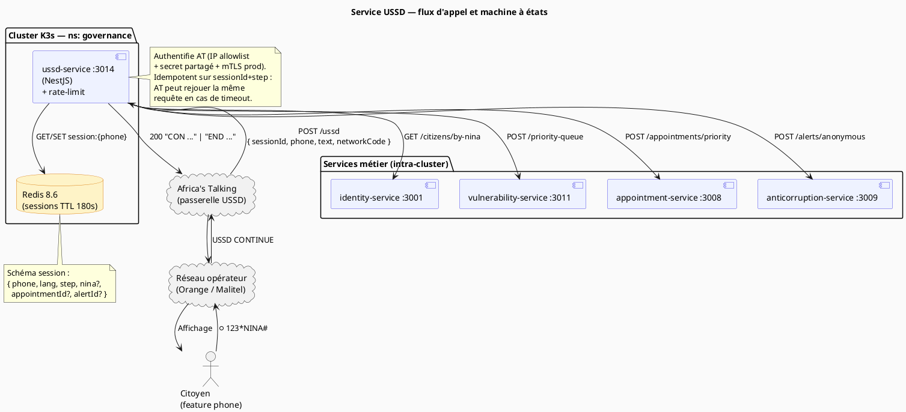

# 14 — Service USSD (Africa's Talking)

> **Bloc concerné** : A (NINA Mali) + **C1** (personnes vulnérables) **Prérequis** : documents 00 →
> 13 complétés ; `identity-service`, `vulnerability-service` et `appointment-service` accessibles ;
> Redis up via `pnpm docker:up`. **Durée estimée** : 16 à 24 heures pour un étudiant seul.
> **Livrables de cette étape** :
>
> > ⚠️ **ÉTAT RÉEL (à lire avant tout)** : le code livré (`services/ussd-service/src/modules/ussd/`)
> > est un **MVP** — sessions **EN MÉMOIRE** (`Map`), parcours « Vérifier NINA » **SIMULÉ**
> > (validation de format seulement, pas de lookup identity), options 2/3/4 = « À venir ». Les
> > contrôles P0 listés ci-dessous (guard d'authenticité du webhook, rate-limit double, idempotence
> > Redis, binding phone↔NINA + OTP, audit, SIGAC anonyme) sont la **CIBLE à implémenter (Prompt
> > 3.9)**, **PAS l'état actuel**. Les puces ci-dessous sont rédigées au futur pour cette raison.
>
> - `services/ussd-service/` (NestJS 11.1+ — port 3014)
> - Webhook `POST /ussd` **devant authentifier** le caller Africa's Talking (IP allowlist + secret
>   partagé + mTLS en prod) — rejet 403 de tout appel non authentifié _(cible §4.2)_
> - Binding **phone↔NINA** à câbler (2ᵉ facteur SMS si le numéro ne correspond pas) + rate-limiting
>   **par phone ET par NINA** pour bloquer l'énumération / fuite PII de masse _(cible §4.2.2, §4.5)_
> - Parcours signalement SIGAC **anonyme** à implémenter : zéro log du numéro, zéro correlation-id,
>   token éphémère non dérivé du numéro — protection du lanceur d'alerte _(cible §4.6.1)_
> - Machine à états USSD avec sessions **Redis** (TTL 180 s) + **idempotence** `sessionId + step`
>   _(cible — le MVP utilise un `Map` en mémoire, TTL 5 min)_
> - 8 langues nationales (FR, BM, SNK, FF, TMQ, HAU, MOS, DJE) — chargées depuis
>   `@nina-aes/shared-types`
> - 5 parcours métier : consultation NINA · prise de rendez-vous · suivi correction · file
>   prioritaire vulnérable · signalement SIGAC anonyme
> - Simulateur USSD local (HTML simple) pour développer sans compte Africa's Talking
> - Tests E2E couvrant les 5 parcours (Jest + supertest)
> - Mise à jour de `docs/adr/ADR-008-ussd-africas-talking.md` (décision Africa's Talking — **existe
>   déjà**, ne pas créer de doublon `ADR-035`)

---

## 1. Objectif pédagogique

L'USSD (Unstructured Supplementary Service Data) est **le seul canal numérique disponible pour les
~55 % de Maliens** qui possèdent un téléphone non-smartphone (feature phone). Sans USSD, on
discriminerait massivement les zones rurales, les personnes âgées et la diaspora installée dans des
pays où le forfait data est cher. C'est le pilier concret du **principe d'inclusion** (cf. contexte
projet §13.2).

Trois choses à apprendre dans cette étape :

1. **Le modèle « machine à états sans serveur conversationnel »** : USSD impose des réponses
   synchrones, courtes (< 182 caractères par écran), avec un timeout réseau de ~30 s. On ne peut
   **pas** appeler 5 microservices en chaîne — il faut **précharger** dans la session Redis dès le
   premier hit, et naviguer dans le menu en O(1).
2. **Localisation pratique** : 8 langues, claviers GSM 7-bit (les caractères « á », « ɲ » passent en
   GSM-Extended → moitié du quota par char). On apprend à dimensionner ses libellés.
3. **Robustesse réseau** : Africa's Talking ré-invoque le webhook plusieurs fois en cas de timeout.
   On doit être **idempotent** sur `sessionId + step` (un rejeu ne doit jamais dupliquer un effet de
   bord, ex. créer deux RDV) et utiliser Redis pour stocker l'état ne dépendant pas du transport
   HTTP.

> 💡 **Pourquoi pas un IVR (vocal) à la place ?** Le coût USSD est facturé à la session (~5 FCFA au
> Mali), un appel IVR coûte ~50 FCFA/min. Pour un cas d'usage de quelques secondes, l'USSD reste
> **10× moins cher** et n'exige pas de microphone fonctionnel — un téléphone à 5 €.

---

## 2. Technologies utilisées (versions avril 2026)

| Technologie                   | Version    | Rôle dans cette étape                                                                                                                                   | Documentation officielle               |
| ----------------------------- | ---------- | ------------------------------------------------------------------------------------------------------------------------------------------------------- | -------------------------------------- |
| **NestJS**                    | 11.1+      | Framework microservice (port 3014)                                                                                                                      | https://docs.nestjs.com/               |
| **TypeScript**                | 6.0+       | Langage source                                                                                                                                          | https://www.typescriptlang.org/        |
| **Africa's Talking Node SDK** | 0.7+       | Client API USSD/SMS pour 18 pays africains                                                                                                              | https://developers.africastalking.com/ |
| **Redis**                     | 8.6.2+     | Sessions USSD (TTL 180 s) + cache codes-pays                                                                                                            | https://redis.io/                      |
| **ioredis**                   | 5.5+       | Client Redis Node.js (clusters + pipelines)                                                                                                             | https://github.com/redis/ioredis       |
| **Zod**                       | 4.3+       | Validation des payloads webhook + variables d'env                                                                                                       | https://zod.dev/                       |
| **`@nina-aes/shared-types`**  | workspace  | `Language` enum + `SUPPORTED_LANGUAGES` partagés                                                                                                        | (interne)                              |
| **`@nina-aes/utils`**         | workspace  | `validateNina`, `formatNina`                                                                                                                            | (interne)                              |
| **`@nina-aes/config`**        | workspace  | `AFRICAS_TALKING_API_KEY`, `AFRICAS_TALKING_USERNAME`, …                                                                                                | (interne)                              |
| **Jest + supertest**          | 30.x / 7.x | Tests E2E du webhook                                                                                                                                    | https://jestjs.io/                     |
| **ngrok**                     | latest     | Tunnel HTTPS pour exposer `localhost:3014` à Africa's Talking                                                                                           | https://ngrok.com/                     |
| **express-rate-limit**        | 7.5+       | Garde-fou HTTP global ; le rate-limit métier (par phone ET par NINA, §4.2.2) est implémenté côté Redis car le `sessionId` est trivialement renouvelable | https://github.com/express-rate-limit  |

> 🔒 **Souveraineté** : Africa's Talking est basé au Kenya (entreprise africaine). Pour la
> production souveraine au Mali, un opérateur local (Orange Mali, Sotelma) peut fournir la même
> fonction USSD via un accord direct — l'abstraction `AggregatorClient` (cf. §4.3) permet de
> basculer sans toucher la logique métier.

---

## 3. Architecture / Schéma

### Vue composants (PlantUML)



### Flowchart des menus (Mermaid)


### Flowchart des menus (PlantUML)

```PlantUML
@startuml
title USSD NINA (*123*NINA#)

start

if (Langue connue?) then (non)
  :Afficher menu langues\n1.Français\n2.Bamanankan\n3.Soninké\n4.Fulfulde\n5.Tamasheq\n6.Hausa\n7.Mooré\n8.Zarma;
  :Sélection langue;
else (oui)
endif

:Menu principal\n1. Mon NINA\n2. Prendre RDV\n3. Suivre correction\n4. Signaler corruption\n0. Quitter;

switch (Choix utilisateur)
case (1)
  repeat
    :Saisir NINA\n(14 chiffres + lettre);
  repeat while (NINA invalide ?)
  :Afficher nom + DDN\n+ commune résidence;
  stop
case (2)
  :Saisir NINA;
  if (vulnerability_category != null ?) then (oui)
    :File P1 : 7h30\nqueueNumber=1;
    stop
  else (non)
    :Date proposée : JJ/MM 9h00;
    stop
  endif
case (3)
  :Saisir NINA;
  :Afficher statut\nUNDER_REVIEW / APPROVED;
  stop
case (4)
  :Saisir description\n(160 chars max);
  :Classification NLP\n+ génère token;
  :Token : XXXX-YYYY;
  stop
case (0)
  :END Bisimila!;
  stop
endswitch

@enduml
```

---

## 4. Étapes d'implémentation

### Étape 4.1 — Création du service NestJS

**Pourquoi** : on isole l'USSD dans son propre microservice (port 3014) car il a un cycle de vie
particulier (sessions courtes, appels webhook synchrones) et ne doit pas partager le pool de
connexions Redis avec d'autres services.

```powershell
cd C:\Users\lonel\Projet-En-Informatique\Session-Ete-2026\nina-aes-platform

# Crée le dossier service depuis le template NestJS standard
pnpm dlx @nestjs/cli new services/ussd-service --skip-git --skip-install --package-manager pnpm

# Aligne le nom workspace
# Modifier services/ussd-service/package.json : "name": "@nina-aes/ussd-service"

# Installe les dépendances workspace + métier
pnpm --filter @nina-aes/ussd-service add @nina-aes/shared-types @nina-aes/utils `
  @nina-aes/config @nina-aes/logger ioredis africastalking zod \
  @nestjs/throttler express-rate-limit
pnpm --filter @nina-aes/ussd-service add -D @types/node supertest @types/supertest
```

**Fichier(s) à créer/modifier** :

```jsonc
// services/ussd-service/package.json (extrait)
{
  "name": "@nina-aes/ussd-service",
  "version": "0.1.0",
  "private": true,
  "scripts": {
    "build": "nest build",
    "start:dev": "nest start --watch",
    "check-types": "tsc --noEmit",
    "test": "jest",
    "test:e2e": "jest --config ./test/jest-e2e.json",
  },
  "dependencies": {
    "@nina-aes/config": "workspace:*",
    "@nina-aes/logger": "workspace:*",
    "@nina-aes/shared-types": "workspace:*",
    "@nina-aes/utils": "workspace:*",
  },
}
```

### Étape 4.2 — Authentification du webhook (anti-spoofing) — **P0 sécurité**

**Pourquoi** : le webhook `POST /ussd` est **public** (Africa's Talking ne présente pas de JWT). Tel
quel, **n'importe qui sur Internet peut POSTer un `phoneNumber` arbitraire** et déclencher une
consultation NINA, un signalement frauduleux, ou abuser du rate-limit. C'est la faille la plus grave
du service : sans authentification du caller, **toutes** les protections en aval (binding
phone↔NINA, idempotence) sont contournables par injection de payloads forgés.

> ⚠️ **État actuel du code** : `services/ussd-service/src/modules/ussd/ussd.controller.ts` documente
> cette protection en commentaire (« IP allowlist + HMAC ») mais **ne l'implémente pas encore**
> (marqué `TODO 2e passe — Prompt 3.9`). Cette section décrit la cible à implémenter ; tant que le
> guard ci-dessous n'est pas en place, **le service NE DOIT PAS être exposé en production**.

On combine **trois couches** (défense en profondeur — aucune n'est suffisante seule) :

1. **IP allowlist** des passerelles Africa's Talking (ou de l'opérateur en prod souveraine). AT
   publie ses plages sortantes ; on rejette tout `X-Forwarded-For` / IP source hors liste. _Limite_
   : l'IP est usurpable derrière un proxy mal configuré → jamais seule. **Durcissement (revue
   sécurité — implémenté)** : l'IP source est résolue par Express via `app.set('trust proxy', N)`
   piloté par `TRUST_PROXY_HOPS` (`main.ts`). `X-Real-IP` n'est honoré **que** si la requête a
   réellement transité par un proxy de confiance (`req.ips` non vide) — un client direct qui injecte
   `X-Real-IP: <IP-AT-allowlistée>` est ignoré (repli sur l'IP du pair TCP, hors allowlist → rejet).
   En **production**, le service **refuse de démarrer** si `TRUST_PROXY_HOPS < 1` (fail-closed). Le
   **secret partagé** (couche 2) reste la barrière réelle.
2. **Secret partagé** : AT ajoute un segment secret à l'URL de callback (path) **et/ou** un header
   convenu. On compare en **temps constant** (`crypto.timingSafeEqual`) pour éviter une attaque
   temporelle. Le secret vit dans Vault (`@nina-aes/config`), **jamais** en clair.
3. **mTLS en production** : l'opérateur présente un certificat client signé par notre CA interne ;
   terminé à l'`api-gateway`/NGINX en amont. C'est la seule couche réellement non-usurpable, mais
   elle dépend d'un accord opérateur (cf. souveraineté §10).

```typescript
// services/ussd-service/src/ussd/guards/at-authenticity.guard.ts
/**
 * @file        at-authenticity.guard.ts
 * @description Guard d'authenticité du webhook Africa's Talking.
 *
 *              SÉCURITÉ (OWASP A07:2021 — Identification/Authentication
 *              Failures) : le webhook étant public, on AUTHENTIFIE le caller
 *              par 3 couches cumulées. Tout appel non authentifié est REJETÉ
 *              (403) AVANT d'atteindre la machine à états — donc avant tout
 *              accès PII.
 *
 *              Le mTLS (couche 3) est terminé en amont (api-gateway/NGINX) ;
 *              ce guard couvre les couches 1 (IP allowlist) et 2 (secret
 *              partagé en temps constant).
 * @module      @nina-aes/ussd-service
 */

import { CanActivate, ExecutionContext, ForbiddenException, Injectable } from '@nestjs/common';
import { timingSafeEqual } from 'node:crypto';
import type { Request } from 'express';
import { ConfigService } from '@nina-aes/config';

@Injectable()
export class AtAuthenticityGuard implements CanActivate {
  constructor(private readonly config: ConfigService) {}

  /**
   * Autorise la requête uniquement si elle provient d'une passerelle AT
   * connue ET présente le secret partagé attendu.
   *
   * @param ctx - Contexte d'exécution NestJS.
   * @returns `true` si authentique ; lève `ForbiddenException` sinon.
   */
  canActivate(ctx: ExecutionContext): boolean {
    const req = ctx.switchToHttp().getRequest<Request>();

    // Couche 1 — IP allowlist. En prod, derrière l'api-gateway, on lit l'IP
    // réelle via le header de confiance `X-Real-IP` posé par NGINX (jamais
    // un header arbitraire fourni par le client).
    const sourceIp = (req.headers['x-real-ip'] as string | undefined) ?? req.ip ?? '';
    const allow = this.config.get('AT_GATEWAY_IP_ALLOWLIST').split(',');
    if (!allow.includes(sourceIp)) {
      // On NE log PAS le payload (peut contenir un phoneNumber). On trace
      // seulement l'IP rejetée pour le SOC.
      throw new ForbiddenException('Source non autorisée');
    }

    // Couche 2 — secret partagé en temps constant (anti-timing-attack).
    // AT le passe via un header convenu OU un segment de path secret.
    const presented = (req.headers['x-at-webhook-secret'] as string | undefined) ?? '';
    const expected = this.config.get('AT_WEBHOOK_SHARED_SECRET');
    if (!this.constantTimeEquals(presented, expected)) {
      throw new ForbiddenException('Signature webhook invalide');
    }

    return true;
  }

  /**
   * Comparaison à temps constant : évite qu'un attaquant déduise le secret
   * octet par octet via la mesure du temps de réponse.
   */
  private constantTimeEquals(a: string, b: string): boolean {
    const ba = Buffer.from(a);
    const bb = Buffer.from(b);
    // timingSafeEqual exige des longueurs égales ; on court-circuite avant
    // pour ne pas révéler la longueur du secret par une exception.
    if (ba.length !== bb.length) return false;
    return timingSafeEqual(ba, bb);
  }
}
```

```typescript
// services/ussd-service/src/ussd/ussd.controller.ts (extrait — application du guard)
import { UseGuards } from '@nestjs/common';
import { AtAuthenticityGuard } from './guards/at-authenticity.guard';

// Le guard s'exécute AVANT le handler : aucun payload non authentifié
// n'atteint la logique métier ni la PII.
@Post('/ussd/callback')
@UseGuards(AtAuthenticityGuard)
async callback(/* … */) {
  /* … */
}
```

> 🔒 **Souveraineté & secrets** : `AT_WEBHOOK_SHARED_SECRET` et la CA mTLS sont stockés dans Vault
> et injectés via AppRole / ServiceAccount (lease renouvelé), **jamais** de `VAULT_TOKEN`
> long-lived. Référence transverse : `docs/security/SECURITY-RUNBOOK.md` (rotation des secrets
> webhook) et `docs/security/THREAT-MODEL.md` (surface d'attaque des endpoints publics).
>
> ⚠️ **Écart config (Phase 2)** : à ce jour, **ni** `AT_WEBHOOK_SHARED_SECRET` **ni**
> `AT_GATEWAY_IP_ALLOWLIST` ne sont définis dans `packages/config/src/index.ts` (seuls
> `AFRICAS_TALKING_API_KEY` et `AFRICAS_TALKING_USERNAME` existent). Le schéma Zod est **à étendre
> en Phase 2** : le guard ci-dessus, qui appelle `this.config.get('AT_GATEWAY_IP_ALLOWLIST')` puis
> `this.config.get('AT_WEBHOOK_SHARED_SECRET')`, **échouerait à l'exécution** tant que ces deux clés
> ne sont pas ajoutées au schéma.

### Étape 4.2.1 — Validation du payload Africa's Talking + idempotence

**Pourquoi** : une fois le caller authentifié (§4.2), Africa's Talking ré-invoque la **même**
requête en cas de timeout réseau. On valide strictement le payload avec Zod et on **n'enregistre /
ne déclenche rien deux fois** grâce à une clé d'idempotence `sessionId + step` dans Redis.

```typescript
// services/ussd-service/src/ussd/ussd.dto.ts
/**
 * @file        ussd.dto.ts
 * @description Schéma Zod du webhook Africa's Talking.
 *              Format documenté : https://developers.africastalking.com/docs/ussd/api
 *
 * @author      Étudiant UQAR
 * @date        2026
 * @module      @nina-aes/ussd-service
 */

import { z } from 'zod';

/** Payload reçu sur POST /ussd. */
export const ussdRequestSchema = z.object({
  /** UUID opaque, idempotence. */
  sessionId: z.string().min(1).max(128),
  /** Code de service, ex. "*123*NINA#". */
  serviceCode: z.string().min(1).max(64),
  /** Numéro complet E.164 (+22376XXXXXXX). */
  phoneNumber: z.string().regex(/^\+\d{8,15}$/),
  /** Concaténation des saisies utilisateur séparées par `*` (ex. "1*2*1234"). */
  text: z.string().default(''),
  /** Code réseau ISO (ex. 610-01 pour Orange Mali). */
  networkCode: z.string().optional(),
});

export type UssdRequest = z.infer<typeof ussdRequestSchema>;

/** Réponse : préfixe `CON ` (continue) ou `END ` (clôture session). */
export type UssdResponse = `CON ${string}` | `END ${string}`;
```

**Idempotence sur `sessionId + step`** : AT rejoue la même requête en cas de timeout. Si un step
déclenche un **effet de bord** (créer un RDV, déposer un signalement SIGAC), un rejeu créerait un
**doublon**. On mémorise la réponse déjà calculée par `(sessionId, step)` et on la **rejoue à
l'identique** sans ré-exécuter l'effet de bord.

> ⚠️ **État actuel du code** : **aucun `IdempotencyStore` n'existe** dans le code livré ; le service
> ne déduplique pas encore les rejeux. Le bloc ci-dessous est la **cible** (Prompt 3.9), pas l'état
> actuel.

```typescript
// services/ussd-service/src/ussd/idempotency.store.ts
/**
 * @file        idempotency.store.ts
 * @description Cache idempotent des réponses USSD, clé `(sessionId, step)`.
 *
 *              POURQUOI : Africa's Talking ré-invoque le webhook en cas de
 *              timeout réseau. Sans garde, un rejeu de l'étape « confirmer le
 *              RDV » créerait DEUX rendez-vous (effet de bord dupliqué).
 *
 *              PRINCIPE : avant d'exécuter un step à effet de bord, on tente
 *              un verrou `SET NX`. Si la clé existe déjà, on renvoie la
 *              réponse mémorisée SANS rejouer l'effet.
 * @module      @nina-aes/ussd-service
 */

import { Injectable } from '@nestjs/common';
import Redis from 'ioredis';
import type { UssdResponse } from './ussd.dto';

@Injectable()
export class IdempotencyStore {
  /** Même fenêtre que la session : au-delà, AT a abandonné. */
  private static readonly TTL_SECONDS = 180;

  constructor(private readonly redis: Redis) {}

  /**
   * Exécute `produce` une seule fois par `(sessionId, step)`. Sur rejeu,
   * renvoie la réponse mémorisée sans relancer l'effet de bord.
   *
   * @param sessionId - Session AT (clé d'idempotence primaire).
   * @param step      - Étape logique (discrimine plusieurs effets dans 1 session).
   * @param produce   - Fonction à effet de bord, exécutée au plus une fois.
   */
  async once(
    sessionId: string,
    step: string,
    produce: () => Promise<UssdResponse>,
  ): Promise<UssdResponse> {
    const key = `ussd:idem:${sessionId}:${step}`;

    // Réponse déjà calculée pour ce (sessionId, step) ? → rejeu à l'identique.
    const cached = await this.redis.get(key);
    if (cached) return cached as UssdResponse;

    // Verrou anti-concurrence : si deux rejeux arrivent simultanément, un
    // seul gagne le SET NX et exécute l'effet de bord.
    const locked = await this.redis.set(`${key}:lock`, '1', 'EX', 30, 'NX');
    if (!locked) {
      // Un autre worker traite déjà ce step : on attend brièvement le résultat.
      const again = await this.redis.get(key);
      if (again) return again as UssdResponse;
    }

    const response = await produce();
    await this.redis.set(key, response, 'EX', IdempotencyStore.TTL_SECONDS);
    return response;
  }
}
```

### Étape 4.2.2 — Rate-limiting par phone ET par NINA — **P0 anti-énumération**

**Pourquoi** : un `sessionId` est trivialement renouvelable (l'attaquant en génère un par requête).
Limiter seulement le `sessionId` (comme le faisait `express-rate-limit` naïf) **ne protège pas** de
l'énumération. On limite donc sur **deux dimensions indépendantes** :

- **par `phoneNumber`** : empêche un même numéro de balayer des centaines de NINA (signal de
  campagne d'énumération) ;
- **par `NINA` ciblé** : empêche que des numéros différents (botnet, SIM box) ne convergent tous sur
  le **même** NINA (attaque de désanonymisation ciblée d'une personne).

On compte dans Redis avec une fenêtre glissante. Le compteur par NINA est indexé par un **hash** du
NINA (pas le NINA en clair) pour ne pas créer de clés Redis révélant des identités.

> ⚠️ **État actuel du code** : **aucun `RateLimitStore` n'existe** ; le controller réel (`callback`)
> n'appelle `isBlockedByPhone` / `isBlockedByNina` **nulle part** (le commentaire
> `ussd.controller.ts` renvoie à un `TODO 2e passe — Prompt 3.9`). Le bloc ci-dessous est la
> **cible**, pas l'état actuel.

```typescript
// services/ussd-service/src/ussd/rate-limit.store.ts
/**
 * @file        rate-limit.store.ts
 * @description Rate-limiting USSD à double dimension : par numéro appelant ET
 *              par NINA ciblé. Bloque l'énumération PII (OWASP A04:2021 —
 *              Insecure Design : absence de limitation de débit fonctionnelle).
 * @module      @nina-aes/ussd-service
 */

import { Injectable } from '@nestjs/common';
import { createHash } from 'node:crypto';
import Redis from 'ioredis';

@Injectable()
export class RateLimitStore {
  /** Fenêtre glissante (secondes). */
  private static readonly WINDOW = 60;
  /** Quotas distincts par dimension. */
  private static readonly MAX_PER_PHONE = 10; // 10 interactions/min/numéro
  private static readonly MAX_PER_NINA = 5; //  5 consultations/min/NINA

  constructor(private readonly redis: Redis) {}

  /**
   * Incrémente le compteur d'une dimension et indique si le quota est dépassé.
   *
   * @returns `true` si la requête doit être REJETÉE (quota atteint).
   */
  async isBlockedByPhone(phone: string): Promise<boolean> {
    // On hash le numéro : pas de MSISDN en clair dans les clés Redis.
    const key = `ussd:rl:phone:${this.hash(phone)}`;
    return this.bump(key, RateLimitStore.MAX_PER_PHONE);
  }

  /** Limite par NINA ciblé (anti-désanonymisation d'une personne précise). */
  async isBlockedByNina(nina: string): Promise<boolean> {
    const key = `ussd:rl:nina:${this.hash(nina)}`;
    return this.bump(key, RateLimitStore.MAX_PER_NINA);
  }

  /** Incrément atomique + pose du TTL au premier hit de la fenêtre. */
  private async bump(key: string, max: number): Promise<boolean> {
    const count = await this.redis.incr(key);
    if (count === 1) await this.redis.expire(key, RateLimitStore.WINDOW);
    return count > max;
  }

  /** SHA-256 tronqué — anti-corrélation des clés avec des identités réelles. */
  private hash(value: string): string {
    return createHash('sha256').update(value).digest('hex').slice(0, 32);
  }
}
```

> 🔒 Le rejet renvoie `END <message neutre>` (jamais « NINA X bloqué » — ne pas confirmer
> l'existence d'un NINA à un attaquant). Chaque blocage est **audité** (signal SOC) mais **sans**
> stocker le numéro en clair.

### Étape 4.3 — Machine à états + sessions Redis

**Pourquoi** : USSD est synchrone. On ne peut pas tenir un état serveur en mémoire (Africa's Talking
peut router la prochaine requête sur un autre pod). Redis est le seul état partagé, avec TTL 180 s
(durée de session AT max).

> ⚠️ **État actuel du code** : `session.service.ts` stocke les sessions dans un **`Map` EN MÉMOIRE**
> (`SESSION_TTL_MS = 5 min`), **pas** dans Redis (TTL 180 s). Le passage à Redis décrit ci-dessous
> est la **cible (Prompt 3.9)**. Un `Map` en mémoire est **perdu au restart du pod** et ne
> fonctionne **pas en multi-pod** (la requête suivante peut atterrir sur un autre pod sans la
> session) — c'est exactement l'anti-pattern que Redis corrige.

```typescript
// services/ussd-service/src/ussd/session.store.ts
/**
 * @file        session.store.ts
 * @description Persistance des sessions USSD dans Redis. Toutes les valeurs
 *              sont sérialisées JSON ; le TTL est rafraîchi à chaque hit.
 * @module      @nina-aes/ussd-service
 */

import { Injectable } from '@nestjs/common';
import Redis from 'ioredis';
import { Language } from '@nina-aes/shared-types';

/** État d'une session USSD active. */
export interface UssdSession {
  phone: string;
  lang: Language;
  /** Étape courante de la machine à états. */
  step:
    | 'lang_select'
    | 'main_menu'
    | 'ask_nina'
    | 'ask_lookup_otp'
    | 'ask_nina_for_appt'
    | 'ask_nina_for_correction'
    | 'ask_alert_description';
  /** NINA saisi (validé) — null tant qu'absent. */
  nina?: string;
  /** Données métier capturées en cours de session. */
  appointmentId?: string;
  alertId?: string;
}

@Injectable()
export class SessionStore {
  /** Durée de vie d'une session : Africa's Talking impose ~3 min. */
  private static readonly TTL_SECONDS = 180;

  constructor(private readonly redis: Redis) {}

  /**
   * Récupère la session active. Renvoie `null` si la session a expiré ou
   * n'a jamais existé.
   */
  async get(sessionId: string): Promise<UssdSession | null> {
    const raw = await this.redis.get(this.key(sessionId));
    return raw ? (JSON.parse(raw) as UssdSession) : null;
  }

  /** Crée ou met à jour la session, rafraîchit le TTL. */
  async set(sessionId: string, session: UssdSession): Promise<void> {
    await this.redis.set(
      this.key(sessionId),
      JSON.stringify(session),
      'EX',
      SessionStore.TTL_SECONDS,
    );
  }

  /** Termine la session immédiatement (END renvoyé à l'utilisateur). */
  async destroy(sessionId: string): Promise<void> {
    await this.redis.del(this.key(sessionId));
  }

  /** Espace de noms Redis pour éviter les collisions inter-services. */
  private key(sessionId: string): string {
    return `ussd:session:${sessionId}`;
  }
}
```

### Étape 4.4 — Contrôleur webhook + machine à états

**Pourquoi** : c'est le cœur du service. Une seule route HTTP `POST /ussd` reçoit toutes les saisies
du citoyen ; le `text` accumulé permet de connaître la profondeur dans l'arbre de menus.

```typescript
// services/ussd-service/src/ussd/ussd.controller.ts
/**
 * @file        ussd.controller.ts
 * @description Point d'entrée unique du webhook Africa's Talking. Délègue la
 *              transition d'état à `UssdMachine` et renvoie un texte plat.
 * @module      @nina-aes/ussd-service
 */

import { Body, Controller, ForbiddenException, Post, UseGuards } from '@nestjs/common';
import { ussdRequestSchema, UssdResponse } from './ussd.dto';
import { UssdMachine } from './ussd.machine';
import { AtAuthenticityGuard } from './guards/at-authenticity.guard';
import { RateLimitStore } from './rate-limit.store';

// SÉCURITÉ : le guard d'authenticité (§4.2) s'exécute AVANT tout traitement.
// Un appel non authentifié est rejeté (403) sans jamais toucher la PII.
@Controller('ussd')
@UseGuards(AtAuthenticityGuard)
export class UssdController {
  constructor(
    private readonly machine: UssdMachine,
    private readonly rateLimit: RateLimitStore,
  ) {}

  /**
   * Reçoit le webhook USSD d'Africa's Talking.
   *
   * Africa's Talking attend un Content-Type `text/plain` et un statut 200 ;
   * tout statut différent provoque une terminaison de session côté opérateur.
   *
   * Pipeline de sécurité :
   *   1. `AtAuthenticityGuard` (IP allowlist + secret partagé) — appliqué au
   *      niveau classe.
   *   2. Validation Zod stricte du payload.
   *   3. Rate-limit par numéro appelant (le rate-limit par NINA est appliqué
   *      dans le handler de consultation, une fois le NINA connu — §4.2.2).
   *
   * @param body - Payload brut, validé via Zod ci-dessous.
   */
  @Post()
  async handle(@Body() body: unknown): Promise<UssdResponse> {
    const req = ussdRequestSchema.parse(body);

    // Rate-limit par numéro : casse l'énumération automatisée. Message neutre
    // (on ne confirme jamais quoi que ce soit à un attaquant).
    if (await this.rateLimit.isBlockedByPhone(req.phoneNumber)) {
      throw new ForbiddenException('END Trop de requetes. Reessayez plus tard.');
    }

    return this.machine.transition(req);
  }
}
```

```typescript
// services/ussd-service/src/ussd/ussd.machine.ts
/**
 * @file        ussd.machine.ts
 * @description Machine à états du parcours USSD. Garde la logique pure et
 *              testable (pas d'I/O direct — délégué aux clients HTTP injectés).
 * @module      @nina-aes/ussd-service
 */

import { Injectable } from '@nestjs/common';
import { Language, validateNina, formatNina } from '@nina-aes/utils';
import { SessionStore, UssdSession } from './session.store';
import { I18nMenus } from './i18n-menus';
import { IdentityClient } from '../clients/identity.client';
import { VulnerabilityClient } from '../clients/vulnerability.client';
import { AppointmentClient } from '../clients/appointment.client';
import { SigacClient } from '../clients/sigac.client';
import { UssdRequest, UssdResponse } from './ussd.dto';
import { AuditClient } from '../clients/audit.client';
import { SmsOtpClient } from '../clients/sms-otp.client';
// Handlers métier — un par parcours. Tous branchés dans le switch `dispatch`.
import { handleLookupNina } from './handlers/lookup-nina';
import { handleLookupOtp } from './handlers/lookup-otp';
import { handleBookAppointment } from './handlers/book-appointment';
import { handleTrackCorrection } from './handlers/track-correction';
import { handleAnonymousAlert } from './handlers/anonymous-alert';

@Injectable()
export class UssdMachine {
  constructor(
    private readonly store: SessionStore,
    private readonly menus: I18nMenus,
    private readonly identity: IdentityClient,
    private readonly vuln: VulnerabilityClient,
    private readonly appt: AppointmentClient,
    private readonly sigac: SigacClient,
    /** Journalisation auditée des consultations NINA (hash-chain, cf. ADR-007). */
    private readonly audit: AuditClient,
    /** 2e facteur SMS pour le binding phone↔NINA (§4.5). */
    private readonly smsOtp: SmsOtpClient,
  ) {}

  /**
   * Calcule la réponse à renvoyer en fonction du payload entrant.
   *
   * @param req - Webhook validé.
   * @returns Texte préfixé `CON ` ou `END `.
   */
  async transition(req: UssdRequest): Promise<UssdResponse> {
    const tokens = req.text === '' ? [] : req.text.split('*');
    let session = await this.store.get(req.sessionId);

    // Première interaction : crée la session, détecte la langue préférée.
    if (!session) {
      const lang = await this.detectLanguage(req.phoneNumber);
      session = { phone: req.phoneNumber, lang, step: lang ? 'main_menu' : 'lang_select' };
      await this.store.set(req.sessionId, session);
      return lang ? this.menus.mainMenu(lang) : this.menus.languageSelector();
    }

    return this.dispatch(session, tokens, req.sessionId);
  }

  /**
   * Détecte la langue à partir du téléphone (Citizen.preferredLanguage si NINA
   * connu, sinon `null` pour forcer le menu de sélection).
   */
  private async detectLanguage(phone: string): Promise<Language | null> {
    return this.identity.getPreferredLanguage(phone).catch(() => null);
  }

  /**
   * Distribue la saisie courante selon l'étape de la machine.
   * Chaque branche retourne `CON ...` (suite) ou `END ...` (clôture).
   */
  private async dispatch(
    session: UssdSession,
    tokens: string[],
    sessionId: string,
  ): Promise<UssdResponse> {
    const last = tokens[tokens.length - 1] ?? '';
    // BRANCHEMENT EXHAUSTIF : chaque `step` de l'union `UssdSession['step']`
    // DOIT avoir un case. Le `default` n'est qu'un garde-fou (corruption de
    // session) — il NE doit jamais servir de fourre-tout pour des étapes
    // « oubliées », sinon un parcours métier renverrait silencieusement
    // « session_lost ». Le compilateur TS aide via `noImplicitReturns` +
    // l'assertion `never` du default ci-dessous.
    switch (session.step) {
      case 'lang_select':
        return this.handleLangSelect(session, last, sessionId);
      case 'main_menu':
        return this.handleMainMenu(session, last, sessionId);
      case 'ask_nina':
        // Parcours 1 — consultation NINA (cf. handler §4.5).
        return handleLookupNina(last, session, sessionId, {
          menus: this.menus,
          identity: this.identity,
          store: this.store,
          audit: this.audit,
          smsOtp: this.smsOtp,
        });
      case 'ask_lookup_otp':
        // 2e facteur SMS quand le numéro appelant ≠ Citizen.phone (anti-énum).
        return handleLookupOtp(last, session, sessionId, {
          menus: this.menus,
          identity: this.identity,
          store: this.store,
          audit: this.audit,
          smsOtp: this.smsOtp,
        });
      case 'ask_nina_for_appt':
        // Parcours 2 — prise de rendez-vous + file prioritaire (cf. §4.6).
        return handleBookAppointment(last, session, sessionId, {
          menus: this.menus,
          identity: this.identity,
          appointment: this.appt,
          store: this.store,
        });
      case 'ask_nina_for_correction':
        // Parcours 3 — suivi d'une correction d'état civil.
        return handleTrackCorrection(last, session, sessionId, {
          menus: this.menus,
          identity: this.identity,
          store: this.store,
        });
      case 'ask_alert_description':
        // Parcours 4 — signalement SIGAC anonyme (cf. §4.10, lanceur d'alerte).
        return handleAnonymousAlert(last, session, sessionId, {
          menus: this.menus,
          sigac: this.sigac,
          store: this.store,
        });
      default: {
        // Assertion d'exhaustivité : si on ajoute un `step` sans case, le
        // compilateur lève une erreur de type ICI (au lieu d'un bug runtime).
        const _exhaustive: never = session.step;
        await this.store.destroy(sessionId);
        return `END ${this.menus.generic('errors.session_lost', session.lang)}`;
      }
    }
  }

  // Les handlers concrets (§4.5 → §4.10) sont décrits dans les blocs suivants
  // et importés en tête de fichier. AUCUNE étape ne reste « à brancher ».
}
```

### Étape 4.5 — Handlers métier (extrait : consultation NINA) — **binding phone↔NINA P0**

**Pourquoi** : c'est le parcours le plus simple. Il valide la pédagogie avant de passer à prise de
rendez-vous (qui ajoute la file prioritaire) et signalement (qui ajoute SIGAC).

> ⚠️ **Risque P0 — énumération / fuite PII de masse** : si on renvoie la fiche dès qu'un NINA est
> valide, **n'importe qui** peut interroger le NINA d'un tiers (les NINA sont semi-devinables :
> préfixe sexe + date de naissance). À l'échelle, c'est une **fuite PII de masse** (nom, DDN,
> commune de résidence). **Règle** : on ne renvoie la fiche QUE si le `phoneNumber` du caller
> **correspond** au `Citizen.phone` enregistré pour ce NINA. Sinon, on déclenche un **2ᵉ facteur
> SMS** (OTP envoyé au numéro officiel du citoyen) — l'attaquant qui ne contrôle pas la ligne ne
> peut pas poursuivre. Combiné au rate-limit par phone ET par NINA (§4.4 bis), cela casse
> l'énumération automatisée.

> 🔒 **Durcissement (revue sécurité — implémenté)** : renvoyer `not_found` (NINA inconnu) **≠**
> `otp_sent` (NINA connu mais non lié) constituait un **oracle d'existence** — un appelant qui ne
> contrôle pas la ligne pouvait sonder n'importe quel NINA et apprendre lesquels sont enregistrés.
> Le code (`ussd.service.handleVerifyNina`) rend désormais les **deux** cas **strictement
> indistinguables** : même état (`VERIFY_NINA_OTP`), même message **neutre** `otp_challenge` (qui NE
> confirme PAS d'envoi). L'OTP réel n'est expédié que sur un vrai `phone_mismatch`, et **sous un
> quota d'envoi dédié** (`RateLimitStore.allowOtpSend` : 1 SMS/fenêtre par NINA **et** par numéro
> officiel destinataire), indépendant du compteur de consultation — ce qui coupe l'**amplification
> SMS** / le harcèlement de la victime. L'audit conserve le vrai résultat (`not_found` vs
> `phone_mismatch`) pour le SOC, sans qu'il transparaisse à l'écran.

> ⚠️ **État actuel du code** : `handleLookupNina`, `SmsOtpClient`, `AuditClient` et `IdentityClient`
> **ne sont PAS présents** dans le code livré. Le code réel (`ussd.service.handleVerifyNina`) valide
> **seulement le FORMAT** du NINA (regex `/^[12]\d{13}[A-Z]$/`) puis renvoie un résultat **SIMULÉ**
> (`"OK"` masqué) — **aucun lookup identity, aucun binding phone↔NINA, aucun 2ᵉ facteur SMS, aucun
> audit**. Le bloc ci-dessous est la **cible**, pas l'état actuel.

```typescript
// services/ussd-service/src/ussd/handlers/lookup-nina.ts
/**
 * @file        lookup-nina.ts
 * @description Handler du parcours « 1. Consulter mon NINA ».
 *
 *              Étapes :
 *                1. Reçoit le NINA saisi par l'utilisateur.
 *                2. Valide format + lettre de contrôle (validateNina).
 *                3. Récupère la fiche depuis identity-service.
 *                4. Affiche un résumé court (< 160 chars) puis END.
 *
 *              En cas de NINA invalide, on garde la session ouverte et on
 *              redemande la saisie (bonne pratique UX USSD : l'utilisateur
 *              ne tape pas un nouveau code court).
 * @module      @nina-aes/ussd-service
 */

import { validateNina, maskNina } from '@nina-aes/utils';
import { UssdResponse } from '../ussd.dto';
import { UssdSession } from '../session.store';
import { I18nMenus } from '../i18n-menus';
import { IdentityClient } from '../../clients/identity.client';
import { SessionStore } from '../session.store';
import { AuditClient } from '../../clients/audit.client';
import { SmsOtpClient } from '../../clients/sms-otp.client';

/**
 * Compare deux numéros E.164 après normalisation. On NE log JAMAIS les
 * valeurs en clair (PII).
 */
function samePhone(a: string, b: string): boolean {
  const norm = (p: string) => p.replace(/[\s-]/g, '');
  return norm(a) === norm(b);
}

export async function handleLookupNina(
  raw: string,
  session: UssdSession,
  sessionId: string,
  deps: {
    menus: I18nMenus;
    identity: IdentityClient;
    store: SessionStore;
    audit: AuditClient;
    smsOtp: SmsOtpClient;
  },
): Promise<UssdResponse> {
  const nina = raw.trim().toUpperCase();
  if (!validateNina(nina)) {
    return `CON ${deps.menus.t('lookup.invalid_nina', session.lang)}`;
  }

  const citizen = await deps.identity.getByNina(nina).catch(() => null);
  if (!citizen) {
    await deps.store.destroy(sessionId);
    // Audit : tentative de consultation d'un NINA inconnu (signal d'énumération).
    await deps.audit.record({
      action: 'ussd.nina_lookup',
      result: 'not_found',
      ninaMasked: maskNina(nina),
      // phone NON loggé en clair — seulement masqué côté audit-service.
    });
    return `END ${deps.menus.t('lookup.not_found', session.lang)}`;
  }

  // ─── BINDING phone↔NINA (anti-énumération / fuite PII de masse) ───────────
  // On ne dévoile la fiche QUE si le numéro appelant est bien celui enregistré
  // pour ce citoyen. Sinon, 2e facteur SMS au numéro OFFICIEL du citoyen.
  if (!samePhone(session.phone, citizen.phone ?? '')) {
    // Audit OBLIGATOIRE : consultation refusée (numéro non lié). Permet de
    // détecter une campagne d'énumération (même phone → N NINA différents).
    await deps.audit.record({
      action: 'ussd.nina_lookup',
      result: 'phone_mismatch',
      ninaMasked: maskNina(nina),
    });

    // Déclenche un OTP envoyé au numéro officiel — l'attaquant qui ne contrôle
    // pas la ligne ne pourra pas continuer. La session bascule en attente OTP.
    await deps.smsOtp.challenge({ nina, language: session.lang });
    await deps.store.set(sessionId, { ...session, step: 'ask_lookup_otp', nina });
    return `CON ${deps.menus.t('lookup.otp_sent', session.lang)}`;
  }

  await deps.store.destroy(sessionId);

  // Audit OBLIGATOIRE de TOUTE consultation NINA réussie (RGPD-like :
  // traçabilité des accès aux données personnelles). Le numéro n'est jamais
  // loggé en clair ; seul le NINA masqué et le résultat le sont.
  await deps.audit.record({
    action: 'ussd.nina_lookup',
    result: 'success',
    ninaMasked: maskNina(nina),
    citizenId: citizen.id,
  });

  // Format compact : nom · DDN · commune (toujours < 160 chars en GSM-7).
  const line = [
    `${citizen.firstName} ${citizen.lastName}`,
    citizen.birthDate,
    citizen.residence?.commune ?? '?',
  ].join(' · ');
  return `END ${maskNina(nina)} - ${line}`;
}
```

> 📌 **Audit (cf. ADR-007)** : `AuditClient.record` écrit dans la **hash-chain SHA-256 linéaire** de
> l'`audit-service`. Cette chaîne est intègre **seulement si sa racine est ancrée chez un tiers**
> (registre signé OCLEI / Vérificateur Général) — sinon un administrateur DB pourrait la recalculer.
> L'ancrage est **conçu, non encore implémenté** ; en attendant, on parle de « journal chaîné », pas
> de « registre inaltérable ».

### Étape 4.6 — File prioritaire pour personnes vulnérables

**Pourquoi** : ce parcours matérialise l'objectif **O7** (accessibilité) et lie l'USSD au
`vulnerability-service`. Si la fiche citoyen porte une `vulnerabilityCategory`, on lui propose le
créneau prioritaire (P1, 7h30) au lieu du créneau standard.

```typescript
// services/ussd-service/src/ussd/handlers/book-appointment.ts
/**
 * @file        book-appointment.ts
 * @description Handler du parcours « 2. Prendre rendez-vous ».
 *              Détecte automatiquement la file prioritaire si le citoyen
 *              est marqué vulnérable.
 * @module      @nina-aes/ussd-service
 */

import { validateNina, formatNina } from '@nina-aes/utils';
import { PriorityLevel } from '@nina-aes/shared-types';
import type { UssdResponse } from '../ussd.dto';
import type { UssdSession, SessionStore } from '../session.store';
import type { I18nMenus } from '../i18n-menus';
import type { IdentityClient } from '../../clients/identity.client';
import type { AppointmentClient } from '../../clients/appointment.client';

export async function handleBookAppointment(
  raw: string,
  session: UssdSession,
  sessionId: string,
  deps: {
    menus: I18nMenus;
    identity: IdentityClient;
    appointment: AppointmentClient;
    store: SessionStore;
  },
): Promise<UssdResponse> {
  if (!validateNina(raw)) {
    return `CON ${deps.menus.t('appt.invalid_nina', session.lang)}`;
  }

  const citizen = await deps.identity.getByNina(raw).catch(() => null);
  if (!citizen) {
    await deps.store.destroy(sessionId);
    return `END ${deps.menus.t('appt.not_found', session.lang)}`;
  }

  // Si vulnérable → file prioritaire P1, créneau 7h30
  const isVulnerable = citizen.vulnerabilityCategory != null;
  const slot = await deps.appointment.bookPriority({
    citizenId: citizen.id,
    nina: citizen.nina,
    priority: isVulnerable ? PriorityLevel.P1 : PriorityLevel.P3,
    language: session.lang,
  });

  await deps.store.destroy(sessionId);
  return isVulnerable
    ? `END ${deps.menus
        .t('appt.priority_confirmed', session.lang)
        .replace('{date}', slot.scheduledAt)
        .replace('{queue}', String(slot.queueNumber))}`
    : `END ${deps.menus
        .t('appt.standard_confirmed', session.lang)
        .replace('{date}', slot.scheduledAt)}`;
}
```

### Étape 4.6.1 — Signalement SIGAC anonyme — **protection du lanceur d'alerte (P0)**

**Pourquoi** : ce parcours est le plus sensible du projet. Un citoyen dénonce une corruption via
USSD ; **si le lien entre son numéro et le signalement subsiste quelque part, sa vie peut être en
danger**. Le canal USSD est piégeux : contrairement à l'app mobile, le `phoneNumber` (MSISDN) est
**toujours** présent dans le payload AT. Notre devoir est de **couper ce lien le plus tôt possible**
et de **ne jamais le matérialiser** côté NINA-AES.

Règles **non négociables** pour ce handler :

1. **Zéro log du numéro** — même masqué — sur le chemin du signalement. Pas de `maskPhone` ici : on
   ne journalise **rien** qui touche au plaignant.
2. **Zéro correlation-id** reliant la session USSD au signalement. On **n'écrit pas** le
   `sessionId`, ni l'IP, ni un timestamp précis (arrondi) dans l'enregistrement SIGAC.
3. **Hash éphémère** : le seul lien remis à l'utilisateur est un **token de suivi** dérivé d'un
   secret aléatoire (jamais du numéro). Le numéro **n'est pas** une entrée de ce hash.
4. **Pas d'audit nominatif** : contrairement à la consultation NINA (§4.5), ce parcours **n'écrit
   PAS** dans l'audit nominatif. On compte tout au plus un événement **agrégé** (« 1 signalement
   reçu »), sans aucun attribut individuel.

```typescript
// services/ussd-service/src/ussd/handlers/anonymous-alert.ts
/**
 * @file        anonymous-alert.ts
 * @description Handler du parcours « 4. Signaler une corruption » (SIGAC).
 *
 *              PROTECTION DU LANCEUR D'ALERTE (priorité absolue) :
 *              - on NE TRANSMET PAS le phoneNumber à SIGAC ;
 *              - on NE LOGGE NI le numéro, NI le sessionId, NI l'IP ;
 *              - le token de suivi dérive d'un secret aléatoire, JAMAIS du
 *                numéro (impossible de remonter au plaignant depuis le token).
 *
 *              On rompt délibérément la traçabilité technique habituelle :
 *              ici l'anonymat prime sur l'auditabilité.
 * @module      @nina-aes/ussd-service
 */

import { randomBytes, createHash } from 'node:crypto';
import type { UssdResponse } from '../ussd.dto';
import type { UssdSession } from '../session.store';
import type { SessionStore } from '../session.store';
import type { I18nMenus } from '../i18n-menus';
import type { SigacClient } from '../../clients/sigac.client';

export async function handleAnonymousAlert(
  raw: string,
  session: UssdSession,
  sessionId: string,
  deps: { menus: I18nMenus; sigac: SigacClient; store: SessionStore },
): Promise<UssdResponse> {
  const description = raw.trim().slice(0, 160);
  if (description.length < 10) {
    return `CON ${deps.menus.t('alert.too_short', session.lang)}`;
  }

  // Token de suivi : secret aléatoire pur. Le numéro N'EST PAS une entrée.
  // L'utilisateur le note ; il sert à suivre le dossier sans révéler d'identité.
  const secret = randomBytes(16);
  const trackingToken = createHash('sha256').update(secret).digest('hex').slice(0, 8).toUpperCase();

  // On envoie à SIGAC UNIQUEMENT la description + le token. AUCUN champ
  // identifiant : pas de phone, pas de sessionId, pas d'IP, pas de NINA.
  await deps.sigac.submitAnonymous({
    description,
    trackingToken,
    language: session.lang,
  });

  // On DÉTRUIT immédiatement la session : plus aucune trace en Redis reliant
  // ce token au numéro qui a appelé.
  await deps.store.destroy(sessionId);

  // VOLONTAIREMENT aucun logger.info ici. Le moindre log corrélable
  // (timestamp + IP) suffirait à désanonymiser via recoupement.
  return `END ${deps.menus
    .t('alert.received', session.lang)
    .replace('{token}', `${trackingToken.slice(0, 4)}-${trackingToken.slice(4)}`)}`;
}
```

> ⚠️ **Risque RÉSIDUEL de désanonymisation — à documenter honnêtement** : même avec ce handler «
> zéro trace », le **MSISDN reste visible côté opérateur et côté Africa's Talking** (un tiers
> **étranger**, Kenya) : la session USSD figure dans les **CDR** (Call Detail Records) de
> l'agrégateur et de l'opérateur, avec numéro + horodatage + code de service `*123*…#`. Un
> adversaire disposant d'un accès légal ou illégal à ces CDR pourrait **corréler l'instant du
> signalement** à un numéro. NINA-AES **ne peut pas** neutraliser ce risque côté plateforme — il est
> **structurel au canal USSD via un agrégateur tiers**.
>
> **Mitigations (conçues, partiellement hors périmètre code)** :
>
> - **Souveraineté** : un accord direct avec Orange Mali / Sotelma (interface `AggregatorClient`,
>   §10) supprime le tiers étranger, mais **pas** la visibilité opérateur.
> - **Conseil produit** : afficher en tête du parcours « pour un anonymat maximal, utilisez une
>   cabine ou une SIM non nominative » (libellé i18n `alert.anonymity_notice`).
> - **Référence sécurité** : ce risque est tracé dans `docs/security/THREAT-MODEL.md` (canal USSD /
>   CDR opérateur) ; la procédure de réponse en cas de demande de réquisition est dans
>   `docs/security/SECURITY-RUNBOOK.md`.
>
> **Honnêteté** : ce parcours est **conçu** ; le handler `anonymous-alert.ts` et le client
> `SigacClient.submitAnonymous` ne sont **pas encore présents** dans `services/ussd-service/src` (le
> code actuel renvoie « À venir » pour les options 2/3/4). Cette section décrit la cible.

### Étape 4.7 — Localisation des menus (8 langues)

**Pourquoi** : USSD impose le **GSM 7-bit** par défaut (160 chars). En GSM-Extended (UCS-2), une
session = 70 chars. La plupart des opérateurs maliens basculent en UCS-2 dès qu'un caractère
non-7-bit apparaît (`ɲ`, `ɛ`, `ŋ` sont fréquents en bambara). On dimensionne donc tous nos libellés
**< 70 chars** pour rester sûrs.

```typescript
// services/ussd-service/src/ussd/i18n-menus.ts
/**
 * @file        i18n-menus.ts
 * @description Dictionnaire de menus + helper de rendu selon la langue.
 *              Aucun template engine — chaînes brutes pour respecter les
 *              limites GSM (< 70 chars en UCS-2, < 160 en GSM-7).
 * @module      @nina-aes/ussd-service
 */

import { Injectable } from '@nestjs/common';
import { Language } from '@nina-aes/shared-types';
import type { UssdResponse } from './ussd.dto';

/** Catalogue de libellés par clé puis par langue. */
const MESSAGES: Record<string, Partial<Record<Language, string>>> = {
  'menu.main': {
    [Language.FR]: '1. Mon NINA\n2. RDV\n3. Suivi\n4. Signaler\n0. Quitter',
    [Language.BM]: '1. Ne ka NINA\n2. RDV\n3. Tagama\n4. Sɛbɛ\n0. Bɔ',
    [Language.SNK]: '1. An NINA\n2. RDV\n3. Tugu\n4. Yidi\n0. Bonu',
    [Language.FF]: '1. Mi NINA\n2. RDV\n3. Folliño\n4. Habrude\n0. Yaltude',
    [Language.TMQ]: '1. NINA-in\n2. RDV\n3. Adi\n4. Esebd\n0. Iqqim',
    [Language.HAU]: '1. NINA-na\n2. RDV\n3. Bibiya\n4. Bayar\n0. Fita',
    [Language.MOS]: '1. M NINA\n2. RDV\n3. Yaab\n4. Wagse\n0. Yi',
    [Language.DJE]: '1. Ay NINA\n2. RDV\n3. Hangan\n4. Ci\n0. Foy',
  },
  // ... ~30 clés au total. Cf. apps/mobile/src/i18n pour les libellés communs.
};

@Injectable()
export class I18nMenus {
  /** Rend un libellé localisé. Fallback FR si la langue n'a pas de traduction. */
  t(key: string, lang: Language): string {
    return MESSAGES[key]?.[lang] ?? MESSAGES[key]?.[Language.FR] ?? key;
  }

  /** Construit le menu principal. */
  mainMenu(lang: Language): UssdResponse {
    return `CON ${this.t('menu.main', lang)}`;
  }

  /** Sélecteur de langue affiché à la première interaction si NINA inconnu. */
  languageSelector(): UssdResponse {
    return 'CON 1.FR 2.BM 3.SNK 4.FF\n5.TMQ 6.HAU 7.MOS 8.DJE';
  }

  /** Helper pour les messages d'erreur génériques. */
  generic(key: string, lang: Language): string {
    return this.t(key, lang);
  }
}
```

### Étape 4.8 — Simulateur USSD local (sans Africa's Talking)

**Pourquoi** : on développe sous Windows sans carte SIM, sans compte AT. Un simulateur HTML appelle
`localhost:3014/ussd` exactement comme AT le ferait — productivité × 5.

```html
<!-- services/ussd-service/public/simulator.html (extrait) -->
<!doctype html>
<html lang="fr">
  <head>
    <meta charset="utf-8" />
    <title>Simulateur USSD NINA-AES</title>
    <style>
      body {
        font-family: monospace;
        background: #111;
        color: #0f0;
        padding: 1rem;
      }
      pre {
        white-space: pre-wrap;
        border: 1px solid #0f0;
        padding: 0.5rem;
        min-height: 4rem;
      }
      input,
      button {
        font-family: inherit;
        padding: 0.4rem;
      }
    </style>
  </head>
  <body>
    <h1>📱 Simulateur USSD — *123*NINA#</h1>
    <p>Numéro : <input id="phone" value="+22376547842" /></p>
    <p>Saisie : <input id="text" autofocus /> <button onclick="send()">Envoyer</button></p>
    <pre id="screen">[Composez *123*NINA# pour démarrer]</pre>
    <script>
      const sessionId = 'sim-' + Date.now();
      let acc = '';
      async function send() {
        const t = document.getElementById('text');
        acc = acc === '' ? t.value : acc + '*' + t.value;
        const res = await fetch('http://localhost:3014/ussd', {
          method: 'POST',
          headers: { 'Content-Type': 'application/json' },
          body: JSON.stringify({
            sessionId,
            serviceCode: '*123*NINA#',
            phoneNumber: document.getElementById('phone').value,
            text: t.value === 'init' ? '' : acc,
          }),
        });
        const txt = await res.text();
        document.getElementById('screen').textContent = txt;
        t.value = '';
        if (txt.startsWith('END')) acc = '';
      }
    </script>
  </body>
</html>
```

> 📝 Démarrer avec `pnpm --filter @nina-aes/ussd-service start:dev`, ouvrir
> `http://localhost:3014/simulator.html` (servi via `ServeStaticModule`), saisir `init` pour
> démarrer une session. Le simulateur conserve `sessionId` durant toute la session.

### Étape 4.9 — Exposition via ngrok pour test réel Africa's Talking

```powershell
# Installer ngrok depuis https://ngrok.com/download (binaire unique)
ngrok config add-authtoken <votre-token-ngrok>

# Ouvre un tunnel HTTPS vers le service local
ngrok http 3014

# Dans la console Africa's Talking :
# - Sandbox > USSD > Add a Service Code
# - Code : *384*5577# (sandbox)
# - Callback URL : https://<votre-id>.ngrok.io/ussd
# - Tester via le dashboard "Simulator"
```

---

## 5. Tests de validation

### Test 1 — Unitaire : machine à états

```powershell
pnpm --filter @nina-aes/ussd-service test
```

Couvre :

- Première interaction sans `Citizen.preferredLanguage` → menu langue affiché
- Première interaction avec langue connue → menu principal directement
- NINA invalide → réémission de la demande (CON, pas END)
- Citoyen vulnérable → `appointment-service.bookPriority({ priority: P1 })`
- **Sécurité (P0)** :
  - Webhook sans secret partagé / IP hors allowlist → **403** (jamais d'accès PII)
  - `phoneNumber` ≠ `Citizen.phone` → **2ᵉ facteur SMS** déclenché (pas de fiche renvoyée)
  - 11ᵉ requête du même numéro en < 60 s → bloquée ; 6ᵉ consultation du même NINA → bloquée
  - Rejeu du step « confirmer RDV » (même `sessionId + step`) → **un seul** RDV créé (idempotence)
  - Signalement SIGAC → assert qu'**aucun** log ne contient le numéro ni le `sessionId`, et que le
    payload SIGAC ne porte ni phone ni IP ni NINA

### Test 2 — E2E : webhook complet (supertest + Redis test container)

```typescript
// services/ussd-service/test/ussd.e2e-spec.ts (extrait)
it('parcours bambara : 2 (langue) → 1 (mon NINA) → saisie NINA', async () => {
  const res1 = await request(app).post('/ussd').send({
    sessionId: 'e2e-1',
    serviceCode: '*123*NINA#',
    phoneNumber: '+22376000001',
    text: '',
  });
  expect(res1.text).toMatch(/^CON 1\.FR 2\.BM/);

  const res2 = await request(app).post('/ussd').send({
    sessionId: 'e2e-1',
    serviceCode: '*123*NINA#',
    phoneNumber: '+22376000001',
    text: '2',
  });
  expect(res2.text).toMatch(/^CON 1\. Ne ka NINA/);

  const res3 = await request(app).post('/ussd').send({
    sessionId: 'e2e-1',
    serviceCode: '*123*NINA#',
    phoneNumber: '+22376000001',
    text: '2*1',
  });
  expect(res3.text).toMatch(/^CON .*NINA/);
});
```

### Test 3 — Manuel via simulateur

1. `pnpm --filter @nina-aes/ussd-service start:dev`
2. Ouvrir `http://localhost:3014/simulator.html`
3. Composer **`init`** (vide) → menu langue
4. Saisir **`2`** → menu bambara
5. Saisir **`1`** → demande NINA
6. Saisir un NINA seedé → résumé fiche
7. Vérifier le code retour `END`

### Test 4 — Latence

Sous charge (Apache Bench, 50 req/s pendant 60 s) :

```powershell
ab -n 3000 -c 50 -p payload.json -T 'application/json' http://localhost:3014/ussd
```

**Cible SLA** : P99 < 500 ms (Africa's Talking timeout = ~30 s, mais on vise une UX éclair).

---

## 6. Pièges courants & dépannage

| Symptôme                                                                       | Cause probable                                                                                                                                                                        | Solution                                                                                                                                                                                                  |
| ------------------------------------------------------------------------------ | ------------------------------------------------------------------------------------------------------------------------------------------------------------------------------------- | --------------------------------------------------------------------------------------------------------------------------------------------------------------------------------------------------------- |
| Africa's Talking retourne « INVALID_RESPONSE_FORMAT »                          | Réponse sans préfixe `CON ` ou `END ` ; ou Content-Type ≠ `text/plain`                                                                                                                | Vérifier que tous les retours du contrôleur commencent par `CON` ou `END`. Ajouter `@Header('Content-Type','text/plain')`.                                                                                |
| Sessions perdues à mi-parcours                                                 | TTL Redis trop court (< 180 s) OU pod NestJS redémarré avec session en mémoire (anti-pattern)                                                                                         | Confirmer `EX 180` dans `SessionStore`. **Ne jamais** stocker l'état hors Redis.                                                                                                                          |
| Caractères « ɲ », « ɛ » mal affichés                                           | Opérateur en GSM-7 strict, refuse les UCS-2                                                                                                                                           | Pour les langues nécessitant UCS-2, demander à AT de forcer `text/plain; charset=UTF-8` côté config compte.                                                                                               |
| Webhook timeout 30 s                                                           | Appel synchrone à un microservice lent                                                                                                                                                | Préférer un cache Redis warm (cf. `vulnerability-service` : précharger Citizen+Vulnerability avant).                                                                                                      |
| Réponse coupée à 160 chars                                                     | UCS-2 limit, libellés trop longs                                                                                                                                                      | Mesurer chaque clé i18n, raccourcir, supprimer accents non-essentiels.                                                                                                                                    |
| Tests E2E plantent en CI                                                       | Redis non disponible dans le runner                                                                                                                                                   | Utiliser `redis-memory-server` ou un service container GitHub Actions (cf. doc 16).                                                                                                                       |
| ngrok bloqué par firewall Windows                                              | Politique d'entreprise                                                                                                                                                                | Alternative **de dev uniquement** : Cloudflare Tunnel `cloudflared tunnel --url http://localhost:3014`. ⚠️ Cloudflare est un tiers étranger : **jamais** sur le chemin critique de prod souveraine.       |
| Africa's Talking invoque `text=""` à chaque dialin alors qu'on suit la session | Comportement normal au tout premier hit                                                                                                                                               | `req.text === ''` ⇒ session inexistante : créer la session, sortir le menu initial.                                                                                                                       |
| Webhook joignable depuis Internet sans authentification                        | Guard `AtAuthenticityGuard` (§4.2) absent ou désactivé → spoofing du `phoneNumber`, énumération PII                                                                                   | **Ne pas exposer en prod** tant que IP allowlist + secret partagé (+ mTLS) ne sont pas actifs. Vérifier le `@UseGuards` au niveau classe du controller.                                                   |
| Même numéro consulte des dizaines de NINA différents                           | Tentative d'énumération PII                                                                                                                                                           | Rate-limit par phone (§4.2.2) + binding phone↔NINA (§4.5) ; alerter le SOC via l'audit des `phone_mismatch`.                                                                                              |
| `GET /api/v1/ussd/sessions/:id` joignable sans authentification                | Endpoint de debug exposé **sans guard ADMIN** dans le code réel (`ussd.controller.ts`) → **IDOR** : lecture de `state` / `language` / timestamps d'une session par `sessionId` deviné | Ajouter `@UseGuards(JwtAuthGuard + rôle ADMIN)` **ou** supprimer la route hors dev ; **ne jamais** l'exposer en prod (le commentaire du code dit lui-même « à restreindre rôle ADMIN dans la 2e passe »). |

---

## 7. Documentation à produire après cette étape

> ⚠️ L'ADR **`ADR-008-ussd-africas-talking.md`** (`docs/adr/ADR-008-ussd-africas-talking.md`) porte
> **déjà** la décision « Africa's Talking comme agrégateur USSD/SMS » — **ne pas créer de doublon
> `ADR-035`**. Au besoin, **compléter ADR-008** avec les points ci-dessous :

- **Décision** : Africa's Talking (sandbox + production) comme aggregator USSD/SMS, abstrait
  derrière l'interface `AggregatorClient` pour permettre la bascule vers Orange Mali / Sotelma en
  production souveraine.
- **Justification** : couverture multi-pays (Mali, Burkina, Niger), simulateur intégré, doc fournie
  en français, tarification transparente. Concurrent : Twilio (US — exclu pour la souveraineté),
  Bandwidth (US), Vonage (UK).
- **Conséquences positives** : une seule API pour 18 pays africains ; SDK Node maintenu ; webhook
  standardisé.
- **Conséquences négatives** : dépendance à un tiers (mitigée par l'abstraction `AggregatorClient`)
  ; coût par session ~5 FCFA en production ; **risque résiduel de désanonymisation** du lanceur
  d'alerte via les CDR de l'agrégateur/opérateur (MSISDN — tiers étranger), non neutralisable côté
  plateforme (cf. §4.6.1 et `docs/security/THREAT-MODEL.md`).
- **Sécurité** : le durcissement du webhook (authentification IP allowlist + secret partagé + mTLS,
  binding phone↔NINA, rate-limit double, anonymat SIGAC) relève d'**ADR-034**
  (`docs/adr/ADR-034-security-hardening-vault-mtls-owasp.md`) ; ADR-008 ne fait que le référencer.
- **Diagramme** : reprendre `05-sequence-vulnerable-person.puml` qui couvre déjà le flux USSD → file
  prioritaire → livraison à domicile.
- **Captures** : 4 captures du simulateur (menu langue · menu principal bambara · saisie NINA ·
  résumé fiche).

Créer aussi **`docs/api/14-ussd-payloads.md`** : exemples de payloads webhook, tableaux des codes
`serviceCode` à enregistrer (sandbox + production).

---

## 8. Mini-rapport d'étape (template)

```markdown
### Rapport — USSD Service (Bloc A + C1) — JJ/MM/2026

- **Status** : ✅ Terminé / ⏳ En cours / ❌ Bloqué
- **Temps réel passé** : X heures
- **Parcours implémentés** : Consult NINA · Prise RDV (P1/P3) · Suivi correction · Signalement SIGAC
  · Sélecteur langue
- **Langues couvertes** : FR ✅ · BM ✅ · SNK ⏳ · FF ⏳ · TMQ ⏳ · HAU ⏳ · MOS ⏳ · DJE ⏳
- **Tests** : Unit X/Y · E2E X/Y · Sim manuel ✅
- **Latence mesurée** : P50 = X ms, P99 = X ms (cible < 500 ms)
- **Difficultés rencontrées** :
  - Caractères bambara basculent en UCS-2 → quota 70 chars (libellés raccourcis)
  - sessionId réémis en cas de timeout AT (idempotence vérifiée)
- **Solutions trouvées** :
- **Prochaines actions** : finir traductions 6 langues, brancher vraie sandbox AT via ngrok,
  **implémenter le guard d'authenticité webhook (§4.2) avant toute exposition prod**, câbler le 2ᵉ
  facteur SMS du binding phone↔NINA (§4.5)
- **Captures jointes** : sim_lang.png, sim_main_bm.png, sim_lookup_ok.png, sim_priority_p1.png
```

---

## 9. Checklist de fin d'étape

- [ ] Code commenté (JSDoc sur chaque fonction publique)
- [ ] `tsconfig.json` strict + `noUncheckedIndexedAccess`
- [ ] Schéma Zod du webhook ; chaque réponse préfixée `CON ` ou `END `
- [ ] **Authentification du webhook** : IP allowlist + secret partagé (temps constant) + mTLS en
      prod ; tout appel non authentifié rejeté **403** avant accès PII (§4.2)
- [ ] **Binding phone↔NINA** : fiche renvoyée uniquement si `phoneNumber == Citizen.phone`, sinon 2ᵉ
      facteur SMS (§4.5)
- [ ] **Rate-limit par phone ET par NINA** (clés Redis hashées, pas de MSISDN en clair) (§4.2.2)
- [ ] **Signalement SIGAC** : zéro log du numéro, zéro correlation-id, token non dérivé du numéro ;
      session détruite immédiatement ; risque résiduel CDR documenté (§4.6.1)
- [ ] **Audit** de chaque consultation NINA (hash-chain ADR-007 ; numéro jamais en clair)
- [ ] **TOUS les handlers branchés** dans le switch `dispatch` (assertion `never` d'exhaustivité)
- [ ] Sessions Redis avec TTL 180 s ; clé `ussd:session:{sessionId}`
- [ ] Idempotence sur `sessionId + step` testée (re-poster la même requête → même réponse, **aucun
      effet de bord dupliqué**)
- [ ] 8 fichiers de traductions présents (au moins menu principal)
- [ ] Tests unitaires ≥ 85 % couverture sur la machine à états
- [ ] Tests E2E couvrant les 5 parcours
- [ ] Simulateur HTML servi sur `/simulator.html`
- [ ] Tunnel ngrok testé contre le sandbox AT
- [ ] Latence P99 < 500 ms sous 50 req/s
- [ ] `docs/adr/ADR-008-ussd-africas-talking.md` complété (existe déjà — **pas** de doublon
      `ADR-035`)
- [ ] Aucun token AT en clair dans le code (passé via `@nina-aes/config`)
- [ ] Commit conventionnel : `feat(ussd-service): NestJS + Africa's Talking + 8 langues + Redis`

---

## 10. Pour aller plus loin

- **Souveraineté production** : remplacer Africa's Talking par un accord direct avec Orange Mali
  (interface `AggregatorClient` à décliner). L'API USSD opérateur diffère légèrement mais le pattern
  machine à états reste identique.
- **Conversion vocale (IVR)** : pour les utilisateurs analphabètes qui ne savent pas lire les menus
  USSD, brancher un IVR (Africa's Talking Voice ou Asterisk on-premise) qui appelle les mêmes
  endpoints du `ussd-service` et lit les libellés en TTS local (Mozilla DeepSpeech bambara —
  souverain).
- **Cache préchargé** : précharger en Redis le `Citizen + VulnerabilityRecord + dernier RDV` pour
  les ~10 000 numéros les plus actifs → la première interaction ne fait plus AUCUN appel HTTP
  intra-cluster.
- **Lectures recommandées** :
  - https://developers.africastalking.com/docs/ussd/api (specs détaillées)
  - https://www.gsma.com/connectivity-for-good/spectrum/2018/03/14/ussd-feature-phone-future/ (étude
    marché)
  - https://en.wikipedia.org/wiki/GSM_7_bit_default_alphabet (pourquoi 160 vs 70 chars)
  - https://github.com/AfricasTalkingLtd/africastalking-node.js (SDK officiel)

---
