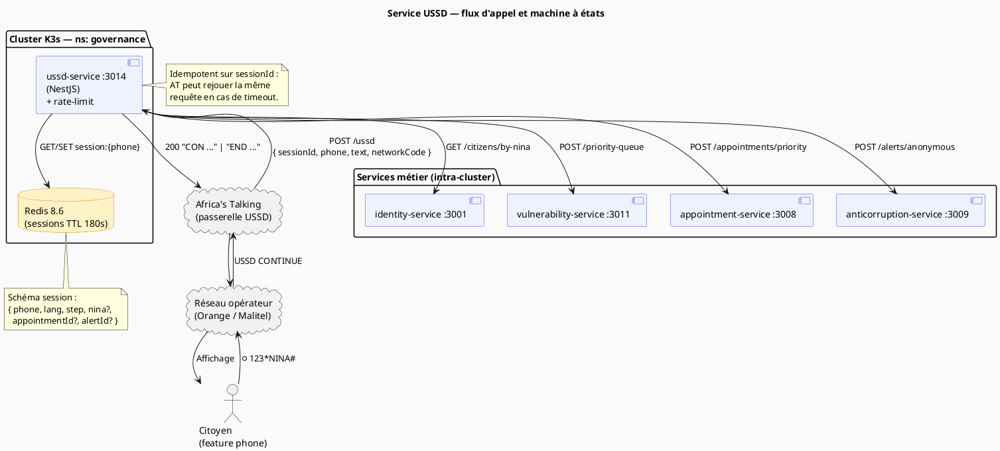
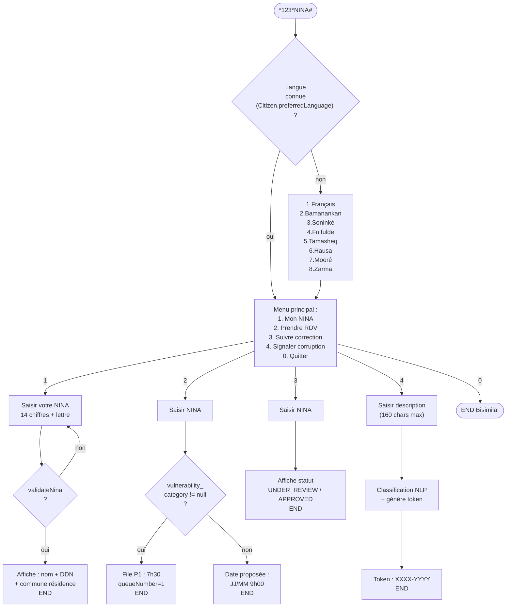

# 14 — Service USSD (Africa's Talking)

> **Bloc concerné** : A (NINA Mali) + **C1** (personnes vulnérables)
> **Prérequis** : documents 00 → 13 complétés ; `identity-service`, `vulnerability-service` et
> `appointment-service` accessibles ; Redis up via `pnpm docker:up`.
> **Durée estimée** : 16 à 24 heures pour un étudiant seul.
> **Livrables de cette étape** :
>
> - `services/ussd-service/` (NestJS 11.1+ — port 3014)
> - Webhook `POST /ussd` validant la signature Africa's Talking
> - Machine à états USSD avec sessions **Redis** (TTL 180 s)
> - 8 langues nationales (FR, BM, SNK, FF, TMQ, HAU, MOS, DJE) — chargées depuis
>   `@nina-aes/shared-types`
> - 5 parcours métier : consultation NINA · prise de rendez-vous · suivi correction · file
>   prioritaire vulnérable · signalement SIGAC anonyme
> - Simulateur USSD local (HTML simple) pour développer sans compte Africa's Talking
> - Tests E2E couvrant les 5 parcours (Jest + supertest)
> - `docs/adr/ADR-017-ussd-africas-talking.md`

---

## 1. Objectif pédagogique

L'USSD (Unstructured Supplementary Service Data) est **le seul canal numérique disponible pour
les ~55 % de Maliens** qui possèdent un téléphone non-smartphone (feature phone). Sans USSD, on
discriminerait massivement les zones rurales, les personnes âgées et la diaspora installée dans
des pays où le forfait data est cher. C'est le pilier concret du **principe d'inclusion** (cf.
contexte projet §13.2).

Trois choses à apprendre dans cette étape :

1. **Le modèle « machine à états sans serveur conversationnel »** : USSD impose des réponses
   synchrones, courtes (< 182 caractères par écran), avec un timeout réseau de ~30 s. On ne peut
   **pas** appeler 5 microservices en chaîne — il faut **précharger** dans la session Redis dès
   le premier hit, et naviguer dans le menu en O(1).
2. **Localisation pratique** : 8 langues, claviers GSM 7-bit (les caractères « á », « ɲ »
   passent en GSM-Extended → moitié du quota par char). On apprend à dimensionner ses libellés.
3. **Robustesse réseau** : Africa's Talking ré-invoque le webhook plusieurs fois en cas de
   timeout. On doit être **idempotent** sur `sessionId` et utiliser Redis pour stocker l'état
   ne dépendant pas du transport HTTP.

> 💡 **Pourquoi pas un IVR (vocal) à la place ?** Le coût USSD est facturé à la session (~5 FCFA
> au Mali), un appel IVR coûte ~50 FCFA/min. Pour un cas d'usage de quelques secondes, l'USSD
> reste **10× moins cher** et n'exige pas de microphone fonctionnel — un téléphone à 5 €.

---

## 2. Technologies utilisées (versions avril 2026)

| Technologie                         | Version      | Rôle dans cette étape                                           | Documentation officielle                       |
| ----------------------------------- | ------------ | --------------------------------------------------------------- | ---------------------------------------------- |
| **NestJS**                          | 11.1+        | Framework microservice (port 3014)                              | https://docs.nestjs.com/                       |
| **TypeScript**                      | 6.0+         | Langage source                                                  | https://www.typescriptlang.org/                |
| **Africa's Talking Node SDK**       | 0.7+         | Client API USSD/SMS pour 18 pays africains                      | https://developers.africastalking.com/         |
| **Redis**                           | 8.6.2+       | Sessions USSD (TTL 180 s) + cache codes-pays                    | https://redis.io/                              |
| **ioredis**                         | 5.5+         | Client Redis Node.js (clusters + pipelines)                     | https://github.com/redis/ioredis               |
| **Zod**                             | 4.3+         | Validation des payloads webhook + variables d'env               | https://zod.dev/                               |
| **`@nina-aes/shared-types`**        | workspace    | `Language` enum + `SUPPORTED_LANGUAGES` partagés                | (interne)                                      |
| **`@nina-aes/utils`**               | workspace    | `validateNina`, `formatNina`                                    | (interne)                                      |
| **`@nina-aes/config`**              | workspace    | `AFRICAS_TALKING_API_KEY`, `AFRICAS_TALKING_USERNAME`, …        | (interne)                                      |
| **Jest + supertest**                | 30.x / 7.x   | Tests E2E du webhook                                            | https://jestjs.io/                             |
| **ngrok**                           | latest       | Tunnel HTTPS pour exposer `localhost:3014` à Africa's Talking   | https://ngrok.com/                             |
| **express-rate-limit**              | 7.5+         | Garde-fou contre l'abus (un même `sessionId` = un seul flux)    | https://github.com/express-rate-limit          |

> 🔒 **Souveraineté** : Africa's Talking est basé au Kenya (entreprise africaine). Pour la
> production souveraine au Mali, un opérateur local (Orange Mali, Sotelma) peut fournir la
> même fonction USSD via un accord direct — l'abstraction `AggregatorClient` (cf. §4.3)
> permet de basculer sans toucher la logique métier.

---

## 3. Architecture / Schéma

### Vue composants (PlantUML)



### Flowchart des menus (Mermaid)



### Flowchart des menus (PlantUML)

```PlantUML
@startuml
title IVR NINA (*123*NINA#)

start

if (Langue connue?) then (non)
  :Afficher menu langues\n1.Français\n2.Bamanankan\n3.Soninké\n4.Fulfulde\n5.Tamasheq\n6.Hausa\n7.Mooré\n8.Zarma;
  :Sélection langue;
else (oui)
endif

:Menu principal\n1. Mon NINA\n2. Prendre RDV\n3. Suivre correction\n4. Signaler corruption\n0. Quitter;

switch (Choix utilisateur)
case (1)
  repeat
    :Saisir NINA\n(14 chiffres + lettre);
  repeat while (NINA invalide ?)
  :Afficher nom + DDN\n+ commune résidence;
  stop
case (2)
  :Saisir NINA;
  if (vulnerability_category != null ?) then (oui)
    :File P1 : 7h30\nqueueNumber=1;
    stop
  else (non)
    :Date proposée : JJ/MM 9h00;
    stop
  endif
case (3)
  :Saisir NINA;
  :Afficher statut\nUNDER_REVIEW / APPROVED;
  stop
case (4)
  :Saisir description\n(160 chars max);
  :Classification NLP\n+ génère token;
  :Token : XXXX-YYYY;
  stop
case (0)
  :END Bisimila!;
  stop
endswitch

@enduml
```

---

## 4. Étapes d'implémentation

### Étape 4.1 — Création du service NestJS

**Pourquoi** : on isole l'USSD dans son propre microservice (port 3014) car il a un cycle de vie
particulier (sessions courtes, appels webhook synchrones) et ne doit pas partager le pool de
connexions Redis avec d'autres services.

```powershell
cd C:\Users\lonel\Projet-En-Informatique\Session-Ete-2026\nina-aes-platform

# Crée le dossier service depuis le template NestJS standard
pnpm dlx @nestjs/cli new services/ussd-service --skip-git --skip-install --package-manager pnpm

# Aligne le nom workspace
# Modifier services/ussd-service/package.json : "name": "@nina-aes/ussd-service"

# Installe les dépendances workspace + métier
pnpm --filter @nina-aes/ussd-service add @nina-aes/shared-types @nina-aes/utils `
  @nina-aes/config @nina-aes/logger ioredis africastalking zod \
  @nestjs/throttler express-rate-limit
pnpm --filter @nina-aes/ussd-service add -D @types/node supertest @types/supertest
```

**Fichier(s) à créer/modifier** :

```jsonc
// services/ussd-service/package.json (extrait)
{
  "name": "@nina-aes/ussd-service",
  "version": "0.1.0",
  "private": true,
  "scripts": {
    "build": "nest build",
    "start:dev": "nest start --watch",
    "check-types": "tsc --noEmit",
    "test": "jest",
    "test:e2e": "jest --config ./test/jest-e2e.json"
  },
  "dependencies": {
    "@nina-aes/config": "workspace:*",
    "@nina-aes/logger": "workspace:*",
    "@nina-aes/shared-types": "workspace:*",
    "@nina-aes/utils": "workspace:*"
  }
}
```

### Étape 4.2 — Validation du payload Africa's Talking

**Pourquoi** : Africa's Talking ré-invoque la même requête en cas de timeout réseau. On valide
strictement le payload avec Zod et on **n'enregistre rien deux fois** grâce à `sessionId` comme
clé d'idempotence dans Redis.

```typescript
// services/ussd-service/src/ussd/ussd.dto.ts
/**
 * @file        ussd.dto.ts
 * @description Schéma Zod du webhook Africa's Talking.
 *              Format documenté : https://developers.africastalking.com/docs/ussd/api
 *
 * @author      Étudiant UQAR
 * @date        2026
 * @module      @nina-aes/ussd-service
 */

import { z } from 'zod';

/** Payload reçu sur POST /ussd. */
export const ussdRequestSchema = z.object({
  /** UUID opaque, idempotence. */
  sessionId: z.string().min(1).max(128),
  /** Code de service, ex. "*123*NINA#". */
  serviceCode: z.string().min(1).max(64),
  /** Numéro complet E.164 (+22376XXXXXXX). */
  phoneNumber: z.string().regex(/^\+\d{8,15}$/),
  /** Concaténation des saisies utilisateur séparées par `*` (ex. "1*2*1234"). */
  text: z.string().default(''),
  /** Code réseau ISO (ex. 610-01 pour Orange Mali). */
  networkCode: z.string().optional(),
});

export type UssdRequest = z.infer<typeof ussdRequestSchema>;

/** Réponse : préfixe `CON ` (continue) ou `END ` (clôture session). */
export type UssdResponse = `CON ${string}` | `END ${string}`;
```

### Étape 4.3 — Machine à états + sessions Redis

**Pourquoi** : USSD est synchrone. On ne peut pas tenir un état serveur en mémoire (Africa's
Talking peut router la prochaine requête sur un autre pod). Redis est le seul état partagé,
avec TTL 180 s (durée de session AT max).

```typescript
// services/ussd-service/src/ussd/session.store.ts
/**
 * @file        session.store.ts
 * @description Persistance des sessions USSD dans Redis. Toutes les valeurs
 *              sont sérialisées JSON ; le TTL est rafraîchi à chaque hit.
 * @module      @nina-aes/ussd-service
 */

import { Injectable } from '@nestjs/common';
import Redis from 'ioredis';
import { Language } from '@nina-aes/shared-types';

/** État d'une session USSD active. */
export interface UssdSession {
  phone: string;
  lang: Language;
  /** Étape courante de la machine à états. */
  step:
    | 'lang_select'
    | 'main_menu'
    | 'ask_nina'
    | 'ask_nina_for_appt'
    | 'ask_nina_for_correction'
    | 'ask_alert_description';
  /** NINA saisi (validé) — null tant qu'absent. */
  nina?: string;
  /** Données métier capturées en cours de session. */
  appointmentId?: string;
  alertId?: string;
}

@Injectable()
export class SessionStore {
  /** Durée de vie d'une session : Africa's Talking impose ~3 min. */
  private static readonly TTL_SECONDS = 180;

  constructor(private readonly redis: Redis) {}

  /**
   * Récupère la session active. Renvoie `null` si la session a expiré ou
   * n'a jamais existé.
   */
  async get(sessionId: string): Promise<UssdSession | null> {
    const raw = await this.redis.get(this.key(sessionId));
    return raw ? (JSON.parse(raw) as UssdSession) : null;
  }

  /** Crée ou met à jour la session, rafraîchit le TTL. */
  async set(sessionId: string, session: UssdSession): Promise<void> {
    await this.redis.set(
      this.key(sessionId),
      JSON.stringify(session),
      'EX',
      SessionStore.TTL_SECONDS,
    );
  }

  /** Termine la session immédiatement (END renvoyé à l'utilisateur). */
  async destroy(sessionId: string): Promise<void> {
    await this.redis.del(this.key(sessionId));
  }

  /** Espace de noms Redis pour éviter les collisions inter-services. */
  private key(sessionId: string): string {
    return `ussd:session:${sessionId}`;
  }
}
```

### Étape 4.4 — Contrôleur webhook + machine à états

**Pourquoi** : c'est le cœur du service. Une seule route HTTP `POST /ussd` reçoit toutes les
saisies du citoyen ; le `text` accumulé permet de connaître la profondeur dans l'arbre de menus.

```typescript
// services/ussd-service/src/ussd/ussd.controller.ts
/**
 * @file        ussd.controller.ts
 * @description Point d'entrée unique du webhook Africa's Talking. Délègue la
 *              transition d'état à `UssdMachine` et renvoie un texte plat.
 * @module      @nina-aes/ussd-service
 */

import { Body, Controller, Post } from '@nestjs/common';
import { ussdRequestSchema, UssdResponse } from './ussd.dto';
import { UssdMachine } from './ussd.machine';

@Controller('ussd')
export class UssdController {
  constructor(private readonly machine: UssdMachine) {}

  /**
   * Reçoit le webhook USSD d'Africa's Talking.
   *
   * Africa's Talking attend un Content-Type `text/plain` et un statut 200 ;
   * tout statut différent provoque une terminaison de session côté opérateur.
   *
   * @param body - Payload validé via Zod en pipe global.
   */
  @Post()
  async handle(@Body() body: unknown): Promise<UssdResponse> {
    const req = ussdRequestSchema.parse(body);
    return this.machine.transition(req);
  }
}
```

```typescript
// services/ussd-service/src/ussd/ussd.machine.ts
/**
 * @file        ussd.machine.ts
 * @description Machine à états du parcours USSD. Garde la logique pure et
 *              testable (pas d'I/O direct — délégué aux clients HTTP injectés).
 * @module      @nina-aes/ussd-service
 */

import { Injectable } from '@nestjs/common';
import { Language, validateNina, formatNina } from '@nina-aes/utils';
import { SessionStore, UssdSession } from './session.store';
import { I18nMenus } from './i18n-menus';
import { IdentityClient } from '../clients/identity.client';
import { VulnerabilityClient } from '../clients/vulnerability.client';
import { AppointmentClient } from '../clients/appointment.client';
import { SigacClient } from '../clients/sigac.client';
import { UssdRequest, UssdResponse } from './ussd.dto';

@Injectable()
export class UssdMachine {
  constructor(
    private readonly store: SessionStore,
    private readonly menus: I18nMenus,
    private readonly identity: IdentityClient,
    private readonly vuln: VulnerabilityClient,
    private readonly appt: AppointmentClient,
    private readonly sigac: SigacClient,
  ) {}

  /**
   * Calcule la réponse à renvoyer en fonction du payload entrant.
   *
   * @param req - Webhook validé.
   * @returns Texte préfixé `CON ` ou `END `.
   */
  async transition(req: UssdRequest): Promise<UssdResponse> {
    const tokens = req.text === '' ? [] : req.text.split('*');
    let session = await this.store.get(req.sessionId);

    // Première interaction : crée la session, détecte la langue préférée.
    if (!session) {
      const lang = await this.detectLanguage(req.phoneNumber);
      session = { phone: req.phoneNumber, lang, step: lang ? 'main_menu' : 'lang_select' };
      await this.store.set(req.sessionId, session);
      return lang
        ? this.menus.mainMenu(lang)
        : this.menus.languageSelector();
    }

    return this.dispatch(session, tokens, req.sessionId);
  }

  /**
   * Détecte la langue à partir du téléphone (Citizen.preferredLanguage si NINA
   * connu, sinon `null` pour forcer le menu de sélection).
   */
  private async detectLanguage(phone: string): Promise<Language | null> {
    return this.identity.getPreferredLanguage(phone).catch(() => null);
  }

  /**
   * Distribue la saisie courante selon l'étape de la machine.
   * Chaque branche retourne `CON ...` (suite) ou `END ...` (clôture).
   */
  private async dispatch(
    session: UssdSession,
    tokens: string[],
    sessionId: string,
  ): Promise<UssdResponse> {
    const last = tokens[tokens.length - 1] ?? '';
    switch (session.step) {
      case 'lang_select': return this.handleLangSelect(session, last, sessionId);
      case 'main_menu':   return this.handleMainMenu(session, last, sessionId);
      case 'ask_nina':    return this.handleAskNina(session, last, sessionId);
      // ... autres étapes (ask_nina_for_appt, ask_alert_description, etc.)
      default:
        await this.store.destroy(sessionId);
        return `END ${this.menus.generic('errors.session_lost', session.lang)}`;
    }
  }

  // Les handlers concrets (3.5.x) sont décrits dans les blocs suivants.
}
```

### Étape 4.5 — Handlers métier (extrait : consultation NINA)

**Pourquoi** : c'est le parcours le plus simple. Il valide la pédagogie avant de passer à
prise de rendez-vous (qui ajoute la file prioritaire) et signalement (qui ajoute SIGAC).

```typescript
// services/ussd-service/src/ussd/handlers/lookup-nina.ts
/**
 * @file        lookup-nina.ts
 * @description Handler du parcours « 1. Consulter mon NINA ».
 *
 *              Étapes :
 *                1. Reçoit le NINA saisi par l'utilisateur.
 *                2. Valide format + lettre de contrôle (validateNina).
 *                3. Récupère la fiche depuis identity-service.
 *                4. Affiche un résumé court (< 160 chars) puis END.
 *
 *              En cas de NINA invalide, on garde la session ouverte et on
 *              redemande la saisie (bonne pratique UX USSD : l'utilisateur
 *              ne tape pas un nouveau code court).
 * @module      @nina-aes/ussd-service
 */

import { validateNina, maskNina } from '@nina-aes/utils';
import { UssdResponse } from '../ussd.dto';
import { UssdSession } from '../session.store';
import { I18nMenus } from '../i18n-menus';
import { IdentityClient } from '../../clients/identity.client';
import { SessionStore } from '../session.store';

export async function handleLookupNina(
  raw: string,
  session: UssdSession,
  sessionId: string,
  deps: { menus: I18nMenus; identity: IdentityClient; store: SessionStore },
): Promise<UssdResponse> {
  const nina = raw.trim().toUpperCase();
  if (!validateNina(nina)) {
    return `CON ${deps.menus.t('lookup.invalid_nina', session.lang)}`;
  }

  const citizen = await deps.identity.getByNina(nina).catch(() => null);
  if (!citizen) {
    await deps.store.destroy(sessionId);
    return `END ${deps.menus.t('lookup.not_found', session.lang)}`;
  }

  await deps.store.destroy(sessionId);
  // Format compact : nom · DDN · commune (toujours < 160 chars en GSM-7).
  const line = [
    `${citizen.firstName} ${citizen.lastName}`,
    citizen.birthDate,
    citizen.residence?.commune ?? '?',
  ].join(' · ');
  return `END ${maskNina(nina)} - ${line}`;
}
```

### Étape 4.6 — File prioritaire pour personnes vulnérables

**Pourquoi** : ce parcours matérialise l'objectif **O7** (accessibilité) et lie l'USSD au
`vulnerability-service`. Si la fiche citoyen porte une `vulnerabilityCategory`, on lui propose
le créneau prioritaire (P1, 7h30) au lieu du créneau standard.

```typescript
// services/ussd-service/src/ussd/handlers/book-appointment.ts
/**
 * @file        book-appointment.ts
 * @description Handler du parcours « 2. Prendre rendez-vous ».
 *              Détecte automatiquement la file prioritaire si le citoyen
 *              est marqué vulnérable.
 * @module      @nina-aes/ussd-service
 */

import { validateNina, formatNina } from '@nina-aes/utils';
import { PriorityLevel } from '@nina-aes/shared-types';
import type { UssdResponse } from '../ussd.dto';
import type { UssdSession, SessionStore } from '../session.store';
import type { I18nMenus } from '../i18n-menus';
import type { IdentityClient } from '../../clients/identity.client';
import type { AppointmentClient } from '../../clients/appointment.client';

export async function handleBookAppointment(
  raw: string,
  session: UssdSession,
  sessionId: string,
  deps: {
    menus: I18nMenus;
    identity: IdentityClient;
    appointment: AppointmentClient;
    store: SessionStore;
  },
): Promise<UssdResponse> {
  if (!validateNina(raw)) {
    return `CON ${deps.menus.t('appt.invalid_nina', session.lang)}`;
  }

  const citizen = await deps.identity.getByNina(raw).catch(() => null);
  if (!citizen) {
    await deps.store.destroy(sessionId);
    return `END ${deps.menus.t('appt.not_found', session.lang)}`;
  }

  // Si vulnérable → file prioritaire P1, créneau 7h30
  const isVulnerable = citizen.vulnerabilityCategory != null;
  const slot = await deps.appointment.bookPriority({
    citizenId: citizen.id,
    nina: citizen.nina,
    priority: isVulnerable ? PriorityLevel.P1 : PriorityLevel.P3,
    language: session.lang,
  });

  await deps.store.destroy(sessionId);
  return isVulnerable
    ? `END ${deps.menus.t('appt.priority_confirmed', session.lang)
        .replace('{date}', slot.scheduledAt)
        .replace('{queue}', String(slot.queueNumber))}`
    : `END ${deps.menus.t('appt.standard_confirmed', session.lang)
        .replace('{date}', slot.scheduledAt)}`;
}
```

### Étape 4.7 — Localisation des menus (8 langues)

**Pourquoi** : USSD impose le **GSM 7-bit** par défaut (160 chars). En GSM-Extended (UCS-2),
une session = 70 chars. La plupart des opérateurs maliens basculent en UCS-2 dès qu'un caractère
non-7-bit apparaît (`ɲ`, `ɛ`, `ŋ` sont fréquents en bambara). On dimensionne donc tous nos
libellés **< 70 chars** pour rester sûrs.

```typescript
// services/ussd-service/src/ussd/i18n-menus.ts
/**
 * @file        i18n-menus.ts
 * @description Dictionnaire de menus + helper de rendu selon la langue.
 *              Aucun template engine — chaînes brutes pour respecter les
 *              limites GSM (< 70 chars en UCS-2, < 160 en GSM-7).
 * @module      @nina-aes/ussd-service
 */

import { Injectable } from '@nestjs/common';
import { Language } from '@nina-aes/shared-types';
import type { UssdResponse } from './ussd.dto';

/** Catalogue de libellés par clé puis par langue. */
const MESSAGES: Record<string, Partial<Record<Language, string>>> = {
  'menu.main': {
    [Language.FR]: '1. Mon NINA\n2. RDV\n3. Suivi\n4. Signaler\n0. Quitter',
    [Language.BM]: '1. Ne ka NINA\n2. RDV\n3. Tagama\n4. Sɛbɛ\n0. Bɔ',
    [Language.SNK]: '1. An NINA\n2. RDV\n3. Tugu\n4. Yidi\n0. Bonu',
    [Language.FF]: '1. Mi NINA\n2. RDV\n3. Folliño\n4. Habrude\n0. Yaltude',
    [Language.TMQ]: '1. NINA-in\n2. RDV\n3. Adi\n4. Esebd\n0. Iqqim',
    [Language.HAU]: '1. NINA-na\n2. RDV\n3. Bibiya\n4. Bayar\n0. Fita',
    [Language.MOS]: '1. M NINA\n2. RDV\n3. Yaab\n4. Wagse\n0. Yi',
    [Language.DJE]: '1. Ay NINA\n2. RDV\n3. Hangan\n4. Ci\n0. Foy',
  },
  // ... ~30 clés au total. Cf. apps/mobile/src/i18n pour les libellés communs.
};

@Injectable()
export class I18nMenus {
  /** Rend un libellé localisé. Fallback FR si la langue n'a pas de traduction. */
  t(key: string, lang: Language): string {
    return MESSAGES[key]?.[lang] ?? MESSAGES[key]?.[Language.FR] ?? key;
  }

  /** Construit le menu principal. */
  mainMenu(lang: Language): UssdResponse {
    return `CON ${this.t('menu.main', lang)}`;
  }

  /** Sélecteur de langue affiché à la première interaction si NINA inconnu. */
  languageSelector(): UssdResponse {
    return 'CON 1.FR 2.BM 3.SNK 4.FF\n5.TMQ 6.HAU 7.MOS 8.DJE';
  }

  /** Helper pour les messages d'erreur génériques. */
  generic(key: string, lang: Language): string {
    return this.t(key, lang);
  }
}
```

### Étape 4.8 — Simulateur USSD local (sans Africa's Talking)

**Pourquoi** : on développe sous Windows sans carte SIM, sans compte AT. Un simulateur HTML
appelle `localhost:3014/ussd` exactement comme AT le ferait — productivité × 5.

```html
<!-- services/ussd-service/public/simulator.html (extrait) -->
<!doctype html>
<html lang="fr">
  <head>
    <meta charset="utf-8" />
    <title>Simulateur USSD NINA-AES</title>
    <style>
      body { font-family: monospace; background: #111; color: #0f0; padding: 1rem; }
      pre  { white-space: pre-wrap; border: 1px solid #0f0; padding: 0.5rem; min-height: 4rem; }
      input, button { font-family: inherit; padding: 0.4rem; }
    </style>
  </head>
  <body>
    <h1>📱 Simulateur USSD — *123*NINA#</h1>
    <p>Numéro : <input id="phone" value="+22376547842" /></p>
    <p>Saisie : <input id="text" autofocus /> <button onclick="send()">Envoyer</button></p>
    <pre id="screen">[Composez *123*NINA# pour démarrer]</pre>
    <script>
      const sessionId = 'sim-' + Date.now();
      let acc = '';
      async function send() {
        const t = document.getElementById('text');
        acc = acc === '' ? t.value : acc + '*' + t.value;
        const res = await fetch('http://localhost:3014/ussd', {
          method: 'POST',
          headers: { 'Content-Type': 'application/json' },
          body: JSON.stringify({
            sessionId,
            serviceCode: '*123*NINA#',
            phoneNumber: document.getElementById('phone').value,
            text: t.value === 'init' ? '' : acc,
          }),
        });
        const txt = await res.text();
        document.getElementById('screen').textContent = txt;
        t.value = '';
        if (txt.startsWith('END')) acc = '';
      }
    </script>
  </body>
</html>
```

> 📝 Démarrer avec `pnpm --filter @nina-aes/ussd-service start:dev`, ouvrir
> `http://localhost:3014/simulator.html` (servi via `ServeStaticModule`), saisir `init` pour
> démarrer une session. Le simulateur conserve `sessionId` durant toute la session.

### Étape 4.9 — Exposition via ngrok pour test réel Africa's Talking

```powershell
# Installer ngrok depuis https://ngrok.com/download (binaire unique)
ngrok config add-authtoken <votre-token-ngrok>

# Ouvre un tunnel HTTPS vers le service local
ngrok http 3014

# Dans la console Africa's Talking :
# - Sandbox > USSD > Add a Service Code
# - Code : *384*5577# (sandbox)
# - Callback URL : https://<votre-id>.ngrok.io/ussd
# - Tester via le dashboard "Simulator"
```

---

## 5. Tests de validation

### Test 1 — Unitaire : machine à états

```powershell
pnpm --filter @nina-aes/ussd-service test
```

Couvre :

- Première interaction sans `Citizen.preferredLanguage` → menu langue affiché
- Première interaction avec langue connue → menu principal directement
- NINA invalide → réémission de la demande (CON, pas END)
- Citoyen vulnérable → `appointment-service.bookPriority({ priority: P1 })`

### Test 2 — E2E : webhook complet (supertest + Redis test container)

```typescript
// services/ussd-service/test/ussd.e2e-spec.ts (extrait)
it('parcours bambara : 2 (langue) → 1 (mon NINA) → saisie NINA', async () => {
  const res1 = await request(app).post('/ussd').send({
    sessionId: 'e2e-1', serviceCode: '*123*NINA#',
    phoneNumber: '+22376000001', text: '',
  });
  expect(res1.text).toMatch(/^CON 1\.FR 2\.BM/);

  const res2 = await request(app).post('/ussd').send({
    sessionId: 'e2e-1', serviceCode: '*123*NINA#',
    phoneNumber: '+22376000001', text: '2',
  });
  expect(res2.text).toMatch(/^CON 1\. Ne ka NINA/);

  const res3 = await request(app).post('/ussd').send({
    sessionId: 'e2e-1', serviceCode: '*123*NINA#',
    phoneNumber: '+22376000001', text: '2*1',
  });
  expect(res3.text).toMatch(/^CON .*NINA/);
});
```

### Test 3 — Manuel via simulateur

1. `pnpm --filter @nina-aes/ussd-service start:dev`
2. Ouvrir `http://localhost:3014/simulator.html`
3. Composer **`init`** (vide) → menu langue
4. Saisir **`2`** → menu bambara
5. Saisir **`1`** → demande NINA
6. Saisir un NINA seedé → résumé fiche
7. Vérifier le code retour `END`

### Test 4 — Latence

Sous charge (Apache Bench, 50 req/s pendant 60 s) :

```powershell
ab -n 3000 -c 50 -p payload.json -T 'application/json' http://localhost:3014/ussd
```

**Cible SLA** : P99 < 500 ms (Africa's Talking timeout = ~30 s, mais on vise une UX éclair).

---

## 6. Pièges courants & dépannage

| Symptôme                                                            | Cause probable                                                                              | Solution                                                                                |
| ------------------------------------------------------------------- | ------------------------------------------------------------------------------------------- | --------------------------------------------------------------------------------------- |
| Africa's Talking retourne « INVALID_RESPONSE_FORMAT »                | Réponse sans préfixe `CON ` ou `END ` ; ou Content-Type ≠ `text/plain`                      | Vérifier que tous les retours du contrôleur commencent par `CON` ou `END`. Ajouter `@Header('Content-Type','text/plain')`. |
| Sessions perdues à mi-parcours                                       | TTL Redis trop court (< 180 s) OU pod NestJS redémarré avec session en mémoire (anti-pattern) | Confirmer `EX 180` dans `SessionStore`. **Ne jamais** stocker l'état hors Redis.        |
| Caractères « ɲ », « ɛ » mal affichés                                 | Opérateur en GSM-7 strict, refuse les UCS-2                                                 | Pour les langues nécessitant UCS-2, demander à AT de forcer `text/plain; charset=UTF-8` côté config compte. |
| Webhook timeout 30 s                                                 | Appel synchrone à un microservice lent                                                      | Préférer un cache Redis warm (cf. `vulnerability-service` : précharger Citizen+Vulnerability avant). |
| Réponse coupée à 160 chars                                           | UCS-2 limit, libellés trop longs                                                            | Mesurer chaque clé i18n, raccourcir, supprimer accents non-essentiels.                  |
| Tests E2E plantent en CI                                             | Redis non disponible dans le runner                                                         | Utiliser `redis-memory-server` ou un service container GitHub Actions (cf. doc 16).     |
| ngrok bloqué par firewall Windows                                    | Politique d'entreprise                                                                      | Alternative : Cloudflare Tunnel `cloudflared tunnel --url http://localhost:3014`.       |
| Africa's Talking invoque `text=""` à chaque dialin alors qu'on suit la session | Comportement normal au tout premier hit                                                | `req.text === ''` ⇒ session inexistante : créer la session, sortir le menu initial.     |

---

## 7. Documentation à produire après cette étape

Créer **`docs/adr/ADR-017-ussd-africas-talking.md`** :

- **Décision** : Africa's Talking (sandbox + production) comme aggregator USSD/SMS, abstrait
  derrière l'interface `AggregatorClient` pour permettre la bascule vers Orange Mali / Sotelma
  en production souveraine.
- **Justification** : couverture multi-pays (Mali, Burkina, Niger), simulateur intégré, doc
  fournie en français, tarification transparente. Concurrent : Twilio (US — exclu pour la
  souveraineté), Bandwidth (US), Vonage (UK).
- **Conséquences positives** : une seule API pour 18 pays africains ; SDK Node maintenu ;
  webhook standardisé.
- **Conséquences négatives** : dépendance à un tiers (mitigée par l'abstraction
  `AggregatorClient`) ; coût par session ~5 FCFA en production.
- **Diagramme** : reprendre `05-sequence-vulnerable-person.puml` qui couvre déjà le flux USSD
  → file prioritaire → livraison à domicile.
- **Captures** : 4 captures du simulateur (menu langue · menu principal bambara · saisie NINA
  · résumé fiche).

Créer aussi **`docs/api/14-ussd-payloads.md`** : exemples de payloads webhook, tableaux des
codes `serviceCode` à enregistrer (sandbox + production).

---

## 8. Mini-rapport d'étape (template)

```markdown
### Rapport — USSD Service (Bloc A + C1) — JJ/MM/2026

- **Status** : ✅ Terminé / ⏳ En cours / ❌ Bloqué
- **Temps réel passé** : X heures
- **Parcours implémentés** : Consult NINA · Prise RDV (P1/P3) · Suivi correction · Signalement SIGAC · Sélecteur langue
- **Langues couvertes** : FR ✅ · BM ✅ · SNK ⏳ · FF ⏳ · TMQ ⏳ · HAU ⏳ · MOS ⏳ · DJE ⏳
- **Tests** : Unit X/Y · E2E X/Y · Sim manuel ✅
- **Latence mesurée** : P50 = X ms, P99 = X ms (cible < 500 ms)
- **Difficultés rencontrées** :
  - Caractères bambara basculent en UCS-2 → quota 70 chars (libellés raccourcis)
  - sessionId réémis en cas de timeout AT (idempotence vérifiée)
- **Solutions trouvées** :
- **Prochaines actions** : finir traductions 6 langues, brancher vraie sandbox AT via ngrok, ajouter rate-limit par phone (5 req/min)
- **Captures jointes** : sim_lang.png, sim_main_bm.png, sim_lookup_ok.png, sim_priority_p1.png
```

---

## 9. Checklist de fin d'étape

- [ ] Code commenté (JSDoc sur chaque fonction publique)
- [ ] `tsconfig.json` strict + `noUncheckedIndexedAccess`
- [ ] Schéma Zod du webhook ; chaque réponse préfixée `CON ` ou `END `
- [ ] Sessions Redis avec TTL 180 s ; clé `ussd:session:{sessionId}`
- [ ] Idempotence sur `sessionId` testée (re-poster la même requête → même réponse)
- [ ] 8 fichiers de traductions présents (au moins menu principal)
- [ ] Tests unitaires ≥ 85 % couverture sur la machine à états
- [ ] Tests E2E couvrant les 5 parcours
- [ ] Simulateur HTML servi sur `/simulator.html`
- [ ] Tunnel ngrok testé contre le sandbox AT
- [ ] Latence P99 < 500 ms sous 50 req/s
- [ ] `docs/adr/ADR-017-ussd-africas-talking.md` rédigé
- [ ] Aucun token AT en clair dans le code (passé via `@nina-aes/config`)
- [ ] Commit conventionnel : `feat(ussd-service): NestJS + Africa's Talking + 8 langues + Redis`

---

## 10. Pour aller plus loin

- **Souveraineté production** : remplacer Africa's Talking par un accord direct avec Orange Mali
  (interface `AggregatorClient` à décliner). L'API USSD opérateur diffère légèrement mais le
  pattern machine à états reste identique.
- **Conversion vocale (IVR)** : pour les utilisateurs analphabètes qui ne savent pas lire les
  menus USSD, brancher un IVR (Africa's Talking Voice ou Asterisk on-premise) qui appelle les
  mêmes endpoints du `ussd-service` et lit les libellés en TTS local (Mozilla DeepSpeech
  bambara — souverain).
- **Cache préchargé** : précharger en Redis le `Citizen + VulnerabilityRecord + dernier RDV`
  pour les ~10 000 numéros les plus actifs → la première interaction ne fait plus AUCUN appel
  HTTP intra-cluster.
- **Lectures recommandées** :
  - https://developers.africastalking.com/docs/ussd/api (specs détaillées)
  - https://www.gsma.com/connectivity-for-good/spectrum/2018/03/14/ussd-feature-phone-future/ (étude marché)
  - https://en.wikipedia.org/wiki/GSM_7_bit_default_alphabet (pourquoi 160 vs 70 chars)
  - https://github.com/AfricasTalkingLtd/africastalking-node.js (SDK officiel)

---