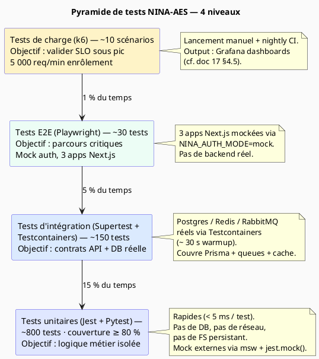

# 18 — Stratégie de tests (Jest + Pytest + Supertest + TestContainers + Playwright + k6)

> **Bloc concerné** : Transversal (tous les blocs A → F) — discipline de qualité appliquée dès le
> premier microservice, durcie en fin de Bloc A. **Prérequis** : documents 00 → 17 complétés ;
> chaîne `pnpm run verify:repo` opérationnelle ; Playwright Session 5 déjà livré ; Pytest scaffold
> présent sur les services FastAPI ; observabilité doc 17 disponible pour mesurer les tests de
> charge. **Durée estimée** : 18 à 24 heures pour un étudiant seul. **Livrables de cette étape** :
>
> - **4 niveaux de tests structurés** avec dossiers et conventions claires :
>   - Unitaires (Jest 30 / Pytest 8) — packages + logique métier isolée
>   - Intégration (Supertest + Testcontainers Postgres/Redis/RabbitMQ) — contrats API entre
>     microservices
>   - E2E (Playwright 1.50) — parcours utilisateur frontend bout-en-bout (mock auth ; déjà 11 tests
>     livrés Session 5)
>   - Charge (k6 0.55) — scénarios réalistes de pic d'enrôlement
> - Couverture **≥ 80 %** sur les packages Bloc A + services NestJS (mesurée par `jest --coverage`
>   et `pytest-cov`)
> - Factories Faker (`@faker-js/faker@10`) pour citoyens, NINA, FDI, rendez-vous, signalements SIGAC
> - MSW 2.10 (Mock Service Worker) pour les tests frontend qui doivent simuler les APIs sans
>   démarrer le backend
> - Stratégie de tests data API : 1 pyramide unit-heavy, 1 layer intégration ciblé sur les contrats
>   critiques (NINA, audit Merkle, JWS Ed25519), minimum d'E2E
> - Tests de mutation Stryker 8 (optionnel, P2) sur `@nina-aes/utils`
> - Configuration CI bloquante sur couverture (cf. doc 16 §4.3)
> - `docs/adr/ADR-018-strategie-tests-pyramide.md`

---

## 1. Objectif pédagogique

Un projet d'identité d'État sans stratégie de tests est **un projet qui sera réécrit** dès la
première régression production. Trois principes structurent ce document :

1. **Pyramide, pas glace au chocolat**. Beaucoup d'unitaires (rapides, précis), un nombre
   raisonnable d'intégrations (chères mais indispensables sur les contrats), peu d'E2E (lents,
   fragiles, mais essentiels sur les parcours critiques). L'anti-pattern « glace au chocolat » (peu
   d'unitaires, beaucoup d'E2E) est interdit.

2. **Les tests sont du code**. Conventions de nommage, lint, refactoring, review en PR comme
   n'importe quel autre code. Un test illisible est un test qui ne sera jamais maintenu et sera
   désactivé au premier flake.

3. **Couverture mesurée mais pas fétichisée**. Cible **≥ 80 %** sur le code métier
   (`packages/utils`, `packages/database`, controllers NestJS), **≥ 60 %** sur le glue code (config,
   bootstrap). Un module avec 100 % de couverture mais 0 assertion significative reste un module non
   testé.

> 💡 **Pourquoi pas attendre la fin du Bloc A ?** Parce qu'une suite de tests construite _après_ le
> code est presque toujours superficielle. Le TDD strict n'est pas obligatoire, mais chaque PR
> feature doit livrer ses tests dans le même change set.

---

## 2. Technologies utilisées (versions mai 2026)

| Outil                         | Version   | Rôle                                                       |
| ----------------------------- | --------- | ---------------------------------------------------------- |
| **Jest**                      | `30.0.x`  | Tests unitaires Node — déjà installé sur `utils`, `config` |
| **ts-jest**                   | `29.4.x`  | Compilation TS pour Jest                                   |
| **@types/jest**               | `30.0.x`  | Types Jest                                                 |
| **Supertest**                 | `7.1.x`   | Tests d'intégration HTTP NestJS sans bootstrap réseau      |
| **Testcontainers (Node)**     | `10.16.x` | Spin-up Postgres/Redis/RabbitMQ Dockerisés en tests        |
| **Pytest**                    | `8.3.x`   | Tests Python (ai-service, anticorruption-service)          |
| **pytest-asyncio**            | `0.25.x`  | Tests async FastAPI                                        |
| **pytest-cov**                | `6.0.x`   | Couverture Python                                          |
| **httpx**                     | `0.28.x`  | Client HTTP test pour FastAPI                              |
| **Playwright**                | `1.50.x`  | Tests E2E (déjà livré Session 5 — 11 tests)                |
| **k6**                        | `0.55.0`  | Tests de charge — scénarios JS, exporter Prometheus        |
| **@faker-js/faker**           | `10.0.x`  | Factories de données (citoyens, NINA, signalements)        |
| **MSW (Mock Service Worker)** | `2.10.x`  | Mock HTTP côté frontend tests + Node tests                 |
| **Stryker Mutator**           | `8.9.x`   | Tests de mutation (P2 — `@nina-aes/utils` uniquement)      |
| **Vitest**                    | `4.1.x`   | Alternative Jest sur `@nina-aes/database` (déjà installé)  |

> 🔒 Tous open-source. k6 est Apache 2.0 (Grafana Labs). Pas de SaaS.

---

## 3. Architecture / Schéma



---

## 4. Étapes d'implémentation

### Étape 4.1 — Convention de nommage et arborescence

**Pourquoi** : un placement cohérent permet `pnpm test` de tout trouver, et permet aussi de tagger
les tests par niveau (unitaire / intégration / E2E).

```text
packages/<pkg>/src/
├── module.ts
└── __tests__/
    └── module.test.ts            ← unitaires (à côté du code)

services/<service>/
├── src/
│   └── feature/
│       ├── feature.controller.ts
│       └── feature.controller.spec.ts   ← unitaires NestJS
└── test/
    ├── feature.e2e-spec.ts        ← intégration Supertest
    └── jest-e2e.config.js

e2e/                                ← Playwright (existant Session 5)
├── citizen/
│   ├── home.spec.ts
│   └── nina-flow.spec.ts
└── admin/
    ├── dashboard.spec.ts
    └── corrections.spec.ts

tests/load/                         ← k6 (NEW)
├── scenarios/
│   ├── enrollment-peak.js
│   ├── nina-search.js
│   ├── ai-detection.js
│   └── audit-merkle-write.js
└── k6.dockerfile

services/<service>/tests/           ← Pytest (existant)
├── conftest.py
├── unit/
│   ├── test_normalizer.py
│   └── test_scorer.py
└── integration/
    └── test_pipeline_e2e.py
```

**Convention de nommage** :

| Niveau          | Pattern fichier                 | Pattern test                    |
| --------------- | ------------------------------- | ------------------------------- |
| Unitaire TS     | `<X>.test.ts`                   | `describe('X', …)`              |
| Unitaire NestJS | `<X>.controller.spec.ts`        | `describe('XController', …)`    |
| Intégration     | `<X>.e2e-spec.ts`               | `describe('X (e2e)', …)`        |
| E2E Playwright  | `<X>.spec.ts`                   | `test('describes scenario', …)` |
| Charge k6       | `<scenario>.js`                 | `export default function () {}` |
| Unitaire Python | `test_<X>.py`                   | `def test_<x>():`               |
| Intégration Py  | `tests/integration/test_<X>.py` | `def test_<x>_e2e():`           |

**Convention AAA (Arrange-Act-Assert)** :

```ts
// ❌ Mauvais : sections invisibles, assertion en cours de chemin
it('valide un NINA', () => {
  expect(validateNina(formatNina('189031020150 42V'))).toBe(true);
});

// ✅ Bon : 3 sections claires
it('valide un NINA correctement formaté', () => {
  // Arrange
  const ninaInput = '189031020150 42V';

  // Act
  const formatted = formatNina(ninaInput);
  const isValid = validateNina(formatted);

  // Assert
  expect(formatted).toBe('1 89 03 1 02 015 042 V');
  expect(isValid).toBe(true);
});
```

---

### Étape 4.2 — Factories Faker (`packages/test-fixtures`)

**Pourquoi** : ne JAMAIS écrire des données de test à la main. Une factory garantit (a) des données
réalistes, (b) la variabilité (Faker change à chaque appel), (c) la maintenabilité (un changement de
schéma se répercute dans 1 fichier au lieu de 200).

**Fichier(s) à créer** : `packages/test-fixtures/package.json` + `src/index.ts`

```ts
// packages/test-fixtures/src/citizens.ts
import { faker } from '@faker-js/faker/locale/fr';
import { computeNinaCheckLetter } from '@nina-aes/utils';
import type { Citizen } from '@nina-aes/shared-types';

/**
 * Factory citoyen NINA-AES — produit un Citizen avec NINA valide
 * (lettre de contrôle correctement calculée) et données réalistes maliennes.
 *
 * Usage:
 *   const c = makeCitizen({ region: 'ML-01' });   // override partiel
 *   const c = makeCitizen();                       // 100% Faker
 */
export function makeCitizen(overrides: Partial<Citizen> = {}): Citizen {
  // NINA = 14 chiffres + lettre de contrôle
  const digits = faker.string.numeric(14);
  const checkLetter = computeNinaCheckLetter(digits);
  const nina = digits + checkLetter;

  return {
    nina,
    firstName: faker.person.firstName(),
    lastName: faker.person.lastName(),
    firstNameAscii: faker.helpers.fromRegExp(/[a-z]{3,10}/),
    lastNameAscii: faker.helpers.fromRegExp(/[a-z]{3,10}/),
    dateNaissance: faker.date
      .between({ from: '1940-01-01', to: '2010-12-31' })
      .toISOString()
      .slice(0, 10),
    gender: faker.helpers.arrayElement(['M', 'F'] as const),
    region: faker.helpers.arrayElement([
      'ML-01',
      'ML-02',
      'ML-03',
      'ML-04',
      'ML-05',
      'ML-06',
      'ML-07',
      'ML-08',
      'ML-09',
      'ML-10',
    ]),
    fingerprintHash: faker.string.hexadecimal({ length: 64, prefix: '' }),
    vulnerabilityCategory: null,
    ...overrides,
  };
}
```

**Pour Python** (`services/ai-service/tests/factories.py`) :

```python
from faker import Faker
from app.models import Citizen
from app.nina_utils import compute_nina_check_letter

fake = Faker('fr_FR')

def make_citizen(**overrides) -> Citizen:
    digits = fake.numerify('##############')
    nina = digits + compute_nina_check_letter(digits)
    return Citizen(
        nina=nina,
        first_name=overrides.get('first_name', fake.first_name()),
        last_name=overrides.get('last_name', fake.last_name()),
        date_naissance=overrides.get('date_naissance', fake.date_between(start_date='-80y', end_date='-15y')),
        region=overrides.get('region', fake.random_element(['ML-01', 'ML-02', 'ML-03'])),
        **{k: v for k, v in overrides.items() if k not in {'first_name', 'last_name', 'date_naissance', 'region'}},
    )
```

---

### Étape 4.3 — Tests unitaires Jest (NestJS)

**Pourquoi** : un controller bien testé est un controller qui ne dépend pas de Prisma, de Redis ou
de RabbitMQ. On injecte des mocks (interfaces) et on teste la logique pure : routing, validation
Zod, transformations DTO.

```ts
// services/identity-service/src/citizen/citizen.controller.spec.ts
import { Test, TestingModule } from '@nestjs/testing';
import { CitizenController } from './citizen.controller';
import { CitizenService } from './citizen.service';
import { makeCitizen } from '@nina-aes/test-fixtures';

describe('CitizenController', () => {
  let controller: CitizenController;
  let service: { findOne: jest.Mock; create: jest.Mock };

  beforeEach(async () => {
    service = {
      findOne: jest.fn(),
      create: jest.fn(),
    };

    const moduleRef: TestingModule = await Test.createTestingModule({
      controllers: [CitizenController],
      providers: [{ provide: CitizenService, useValue: service }],
    }).compile();

    controller = moduleRef.get(CitizenController);
  });

  describe('GET /citizens/:nina', () => {
    it('retourne un citoyen quand il existe', async () => {
      // Arrange
      const citizen = makeCitizen({ nina: '18903102015042V' });
      service.findOne.mockResolvedValue(citizen);

      // Act
      const result = await controller.getByNina('18903102015042V');

      // Assert
      expect(result).toEqual(citizen);
      expect(service.findOne).toHaveBeenCalledWith('18903102015042V');
    });

    it('rejette un NINA mal formé avec 400', async () => {
      await expect(controller.getByNina('invalid')).rejects.toThrow(/Invalid NINA format/);
    });

    it('rejette un NINA inexistant avec 404', async () => {
      service.findOne.mockResolvedValue(null);
      await expect(controller.getByNina('18903102015042V')).rejects.toThrow(/NotFound/);
    });
  });
});
```

> 💡 **Discipline** : `service` est une interface mockée, pas une instance partielle. Pas de
> `jest.mock('./citizen.service')` automatique qui laisse traîner des prototypes Prisma.

---

### Étape 4.4 — Tests d'intégration (Supertest + Testcontainers)

**Pourquoi** : un test unitaire ne valide pas que Prisma sait sérialiser un `Decimal(10,7)` ou que
la migration `init_v1` est cohérente avec le schéma. Pour ces contrats, on spin-up un Postgres réel
via Testcontainers.

```ts
// services/identity-service/test/citizens.e2e-spec.ts
import { Test } from '@nestjs/testing';
import { INestApplication } from '@nestjs/common';
import * as request from 'supertest';
import { PostgreSqlContainer, StartedPostgreSqlContainer } from '@testcontainers/postgresql';
import { AppModule } from '../src/app.module';
import { makeCitizen } from '@nina-aes/test-fixtures';
import { execSync } from 'node:child_process';

describe('CitizenController (e2e)', () => {
  let app: INestApplication;
  let container: StartedPostgreSqlContainer;

  beforeAll(async () => {
    container = await new PostgreSqlContainer('postgis/postgis:18-3.6')
      .withUsername('nina_admin')
      .withPassword('test')
      .withDatabase('nina_aes_test')
      .start();
    process.env.DATABASE_URL = container.getConnectionUri();

    // Appliquer migrations Prisma sur le container fraîchement démarré
    execSync('pnpm --filter @nina-aes/database exec prisma migrate deploy', {
      stdio: 'inherit',
      env: { ...process.env, DATABASE_URL: container.getConnectionUri() },
    });

    const moduleRef = await Test.createTestingModule({ imports: [AppModule] }).compile();
    app = moduleRef.createNestApplication();
    await app.init();
  }, 120_000);

  afterAll(async () => {
    await app.close();
    await container.stop();
  });

  it('POST /citizens → 201 + 1 ligne en DB', async () => {
    const payload = makeCitizen();
    const res = await request(app.getHttpServer()).post('/citizens').send(payload).expect(201);
    expect(res.body.nina).toBe(payload.nina);

    const found = await request(app.getHttpServer()).get(`/citizens/${payload.nina}`).expect(200);
    expect(found.body.firstName).toBe(payload.firstName);
  });

  it('POST /citizens avec NINA dupliqué → 409', async () => {
    const payload = makeCitizen();
    await request(app.getHttpServer()).post('/citizens').send(payload).expect(201);
    await request(app.getHttpServer()).post('/citizens').send(payload).expect(409);
  });
});
```

**Limites importantes** :

- Un test d'intégration ne doit PAS appeler `localhost:5432` (DB statique). Toujours démarrer son
  propre container.
- Coût : ~30 s de warmup Postgres + migrations. Acceptable si peu de tests d'intégration (≤ 150).
  Au-delà : grouper par module et factoriser le container via `beforeAll`.

---

### Étape 4.5 — Tests Pytest (FastAPI)

```python
# services/ai-service/tests/conftest.py
import pytest
from fastapi.testclient import TestClient
from app.main import app

@pytest.fixture(scope="session")
def client():
    with TestClient(app) as c:
        yield c
```

```python
# services/ai-service/tests/unit/test_scorer.py
import pytest
from app.scorer import compute_confidence_score
from tests.factories import make_citizen

def test_score_high_for_clean_record():
    citizen = make_citizen(first_name='Mamadou', last_name='Traoré')
    score = compute_confidence_score(citizen)
    assert 80 <= score <= 100

def test_score_low_for_placeholder_name():
    citizen = make_citizen(first_name='XXX', last_name='Inconnu')
    score = compute_confidence_score(citizen)
    assert score < 30

@pytest.mark.parametrize("name,expected_low", [
    ("Mamadu", True),    # translittération
    ("Mamadou", False),
    ("XXX", True),
])
def test_phonetic_match(name, expected_low):
    score = compute_confidence_score(make_citizen(first_name=name, last_name='Traoré'))
    if expected_low:
        assert score < 80
    else:
        assert score >= 80
```

```python
# services/ai-service/tests/integration/test_pipeline_e2e.py
def test_full_detection_pipeline(client):
    """Le pipeline IA traite un batch de 10 enregistrements en < 2s."""
    payload = {"records": [make_citizen() for _ in range(10)]}
    response = client.post("/api/detect", json=payload)
    assert response.status_code == 200
    body = response.json()
    assert len(body["results"]) == 10
    assert all("confidence" in r and 0 <= r["confidence"] <= 100 for r in body["results"])
```

---

### Étape 4.6 — Tests E2E Playwright (déjà 11 tests Session 5)

État actuel : 11 tests dans `e2e/citizen/` + `e2e/admin/` avec mode `NINA_AUTH_MODE=mock`. À
compléter :

```ts
// e2e/citizen/correction.spec.ts (NEW — à créer)
import { test, expect } from '@playwright/test';

test.describe('Parcours correction NINA — citoyen', () => {
  test('soumet une correction valide et reçoit un ticket', async ({ page }) => {
    await page.goto('/');
    await page.getByRole('button', { name: 'Demander une correction' }).click();
    await page.getByLabel('NINA').fill('1 89 03 1 02 015 042 V');
    await page.getByLabel('Champ erroné').selectOption('first_name');
    await page.getByLabel('Nouvelle valeur').fill('Mamadou');
    await page.getByLabel('Pièce justificative').setInputFiles('e2e/fixtures/cni-mock.pdf');
    await page.getByRole('button', { name: 'Soumettre' }).click();

    await expect(page.getByText(/Ticket de correction : COR-\d{8}/)).toBeVisible();
  });
});
```

**Stratégie d'extension** : viser **30 tests E2E** à terme, **pas plus**. Au-delà, le coût en temps
de feedback PR (~5 min) devient prohibitif. Garder les E2E pour les parcours critiques (correction,
RDV, scan QR mobile, USSD).

---

### Étape 4.7 — Tests de charge k6

**Pourquoi** : démontrer que le système soutient les pics réels prévus : ~5 000 req/min lors d'une
campagne d'enrôlement RAVEC nationale.

**Fichier(s) à créer** : `tests/load/scenarios/enrollment-peak.js`

```javascript
import http from 'k6/http';
import { check, sleep } from 'k6';
import { Counter, Trend } from 'k6/metrics';

const ninaCreated = new Counter('nina_created');
const ninaLatency = new Trend('nina_creation_latency');

export const options = {
  scenarios: {
    enrollment_peak: {
      executor: 'ramping-arrival-rate',
      startRate: 10,
      timeUnit: '1s',
      preAllocatedVUs: 50,
      maxVUs: 200,
      stages: [
        { duration: '1m', target: 30 }, // warmup
        { duration: '3m', target: 80 }, // climb to peak (~5k req/min = 80 req/s)
        { duration: '5m', target: 80 }, // sustain peak 5 min
        { duration: '1m', target: 0 }, // cooldown
      ],
    },
  },
  thresholds: {
    http_req_duration: ['p(95)<500', 'p(99)<1500'], // SLO doc 17
    http_req_failed: ['rate<0.01'], // < 1 % erreurs
    nina_created: ['count>20000'], // > 20k en 10 min
  },
};

const BASE_URL = __ENV.API_URL || 'http://identity-service.staging.nina-aes.uqar.ca';

function randomNina() {
  // génère un NINA factice format-valide pour le test de charge
  const digits = Array.from({ length: 14 }, () => Math.floor(Math.random() * 10)).join('');
  return digits + 'V';
}

export default function () {
  const payload = JSON.stringify({
    nina: randomNina(),
    firstName: `LoadTest${__VU}`,
    lastName: 'K6',
    dateNaissance: '1990-01-15',
    gender: 'M',
    region: 'ML-09',
  });

  const start = Date.now();
  const res = http.post(`${BASE_URL}/api/citizens`, payload, {
    headers: { 'Content-Type': 'application/json', 'X-Test-Source': 'k6-load' },
  });
  ninaLatency.add(Date.now() - start);

  const ok = check(res, {
    'status 201': (r) => r.status === 201,
    'response time < 1s': (r) => r.timings.duration < 1000,
  });
  if (ok && res.status === 201) ninaCreated.add(1);

  sleep(Math.random() * 0.5 + 0.1); // 100-600 ms entre requêtes
}
```

**Exécution** :

```powershell
# Local (contre staging — JAMAIS contre prod)
docker run --rm -i grafana/k6:0.55.0 run --env API_URL=https://staging.nina-aes.uqar.ca - < tests/load/scenarios/enrollment-peak.js

# Avec output Prometheus pour Grafana dashboards (cf. doc 17)
docker run --rm -i --network host grafana/k6:0.55.0 \
  run --out experimental-prometheus-rw \
  --env K6_PROMETHEUS_RW_SERVER_URL=http://localhost:9090/api/v1/write \
  - < tests/load/scenarios/enrollment-peak.js
```

**Scénarios à livrer (4)** :

| Fichier                 | Cible            | Critère succès                             |
| ----------------------- | ---------------- | ------------------------------------------ |
| `enrollment-peak.js`    | identity-service | > 20 000 NINA créés en 10 min, p95 < 500ms |
| `nina-search.js`        | identity-service | 1 000 req/s sustained, p99 < 200ms         |
| `ai-detection.js`       | ai-service       | batch 100 records, p95 < 5s                |
| `audit-merkle-write.js` | audit-service    | 500 writes/s, 0 rupture chaîne Merkle      |

---

### Étape 4.8 — MSW (Mock Service Worker) pour tests frontend

**Pourquoi** : les composants React qui consomment `@nina-aes/api-client` doivent être testables
sans démarrer NestJS. MSW intercepte au niveau `fetch` et retourne des réponses définies dans le
test.

```ts
// apps/citizen/src/components/__tests__/NinaForm.test.tsx
import { render, screen } from '@testing-library/react';
import userEvent from '@testing-library/user-event';
import { http, HttpResponse } from 'msw';
import { setupServer } from 'msw/node';
import { NinaForm } from '../NinaForm';

const server = setupServer(
  http.post('/api/citizens', async ({ request }) => {
    const body = (await request.json()) as { nina: string };
    return HttpResponse.json({ nina: body.nina, status: 'created' }, { status: 201 });
  }),
);

beforeAll(() => server.listen({ onUnhandledRequest: 'error' }));
afterEach(() => server.resetHandlers());
afterAll(() => server.close());

test('soumet le formulaire et affiche un message succès', async () => {
  render(<NinaForm />);
  await userEvent.type(screen.getByLabelText('NINA'), '18903102015042V');
  await userEvent.click(screen.getByRole('button', { name: 'Soumettre' }));
  expect(await screen.findByText(/créé avec succès/i)).toBeInTheDocument();
});
```

---

### Étape 4.9 — Configuration coverage et seuils CI

**Fichier(s) à modifier** : `packages/utils/jest.config.cjs`

```js
/** @type {import('jest').Config} */
module.exports = {
  preset: 'ts-jest',
  testEnvironment: 'node',
  collectCoverage: true,
  collectCoverageFrom: ['src/**/*.ts', '!src/**/*.test.ts', '!src/**/index.ts'],
  coverageDirectory: 'coverage',
  coverageReporters: ['text', 'lcov', 'json-summary'],
  coverageThreshold: {
    global: {
      branches: 80,
      functions: 80,
      lines: 80,
      statements: 80,
    },
  },
};
```

**Pour Python** (`services/ai-service/pyproject.toml`) :

```toml
[tool.pytest.ini_options]
minversion = "8.0"
addopts = "--cov=app --cov-report=term-missing --cov-fail-under=80"
testpaths = ["tests"]

[tool.coverage.run]
source = ["app"]
omit = ["app/main.py", "app/observability.py"]
```

CI bloquant (cf. doc 16 §4.3) : `pnpm test -- --coverage` retourne exit 1 si threshold non respecté
→ merge bloqué.

---

### Étape 4.10 — Tests de mutation Stryker (P2, optionnel)

**Pourquoi** : couverture ≠ qualité. Un test qui couvre une ligne sans asserter rien d'utile passe
Stryker à mort. Outil idéal pour valider la qualité d'une suite mature, pas pour démarrer.

**Fichier(s) à créer** : `packages/utils/stryker.config.json`

```json
{
  "$schema": "https://raw.githubusercontent.com/stryker-mutator/stryker-js/master/packages/stryker/schema/stryker-schema.json",
  "packageManager": "pnpm",
  "reporters": ["html", "clear-text", "progress"],
  "testRunner": "jest",
  "jest": { "projectType": "custom", "configFile": "jest.config.cjs" },
  "mutate": ["src/**/*.ts", "!src/**/*.test.ts", "!src/**/index.ts"],
  "thresholds": { "high": 80, "low": 60, "break": 50 }
}
```

```powershell
# Exécution manuelle (long ~5 min sur packages/utils)
pnpm --filter @nina-aes/utils exec stryker run
```

> 💡 Pas activé en CI bloquante — c'est un outil de revue qualitative, exécuté avant chaque release
> majeure pour identifier les tests faibles.

---

## 5. Validation locale

```powershell
# 1) Tous les unitaires (Jest + Pytest) avec coverage
pnpm test -- --coverage
make test    # variant Make
# attendu : `Tests: 800+ passed` + coverage report ≥ 80%

# 2) Intégration NestJS (lance Testcontainers automatiquement)
pnpm --filter @nina-aes/identity-service test:e2e
# attendu : Postgres container démarre ~30s, tests passent

# 3) Intégration Python
cd services/ai-service && pytest tests/integration/ -v
# attendu : pipeline end-to-end vert

# 4) E2E Playwright (Session 5 + extensions)
pnpm run test:e2e
# attendu : 30 tests passent en ~3 min (mode mock)

# 5) Charge k6 contre staging
docker run --rm -i grafana/k6:0.55.0 run \
  --env API_URL=https://staging.nina-aes.uqar.ca \
  - < tests/load/scenarios/enrollment-peak.js
# attendu : threshold http_req_duration p95 < 500ms ✅

# 6) Mutation (manuel, P2)
pnpm --filter @nina-aes/utils exec stryker run
# attendu : score mutation ≥ 80% sur logique métier
```

---

## 6. Pièges courants & dépannage

| Symptôme                                           | Cause probable                                        | Solution                                                                                     |
| -------------------------------------------------- | ----------------------------------------------------- | -------------------------------------------------------------------------------------------- | ------------------------------------------------------------------------------- |
| Tests Jest flakes avec `Cannot find module`        | Path alias TS non résolu côté Jest                    | Ajouter `moduleNameMapper` dans `jest.config.cjs`                                            |
| Coverage à 0 % sur un package qui a des tests      | `collectCoverageFrom` ne pointe pas vers `src/`       | Préciser `["src/**/*.ts"]` avec exclusions explicites                                        |
| Testcontainers : `Cannot connect to Docker daemon` | Docker Desktop pas démarré                            | Démarrer Docker Desktop ; sinon `DOCKER_HOST=unix:///...`                                    |
| Testcontainers : ports déjà occupés                | Container précédent pas nettoyé                       | `docker ps -q                                                                                | xargs docker stop` ; les containers sont éphémères mais un crash laisse traîner |
| Migration Prisma échoue dans Testcontainers        | `DATABASE_URL` env pas exporté avant `prisma migrate` | Passer `env: { DATABASE_URL: container.getConnectionUri() }` à `execSync`                    |
| Playwright : `waiting for navigation`              | `await page.goto(...)` avant que le serveur soit prêt | Configurer `webServer` dans playwright.config.ts avec `reuseExistingServer: !process.env.CI` |
| k6 : `dial tcp: lookup identity-service.staging`   | k6 dans container ne résout pas DNS interne           | Utiliser URL publique HTTPS, ou `--network=host`                                             |
| Pytest : ImportError sur `app.*`                   | `PYTHONPATH` non posé                                 | `pyproject.toml` → `[tool.pytest.ini_options] pythonpath = ["."]`                            |
| MSW : `Unhandled request`                          | Endpoint pas dans le handler list                     | `onUnhandledRequest: 'error'` force un échec explicite                                       |
| Faker : génère des noms non-français               | Locale par défaut = `en`                              | `import { faker } from '@faker-js/faker/locale/fr'`                                          |
| Couverture branches à 65 % alors que lines à 95 %  | `if/else` mal couverts                                | Ajouter tests des chemins `else` ; ou ajuster threshold `branches: 75`                       |
| Stryker fait crash le runner                       | Trop de mutants concurrents                           | `concurrency: 2` dans `stryker.config.json`                                                  |

---

## 7. Documentation à produire

- `docs/adr/ADR-018-strategie-tests-pyramide.md` — décision 4-niveaux vs alternatives.
- `docs/testing/TEST-CHARTER.md` — engagement étudiant : règles d'écriture des tests, code review
  checklist.
- `docs/testing/COVERAGE-MATRIX.md` — par package / service, couverture actuelle + objectif + ticket
  si dette.
- Mise à jour `docs/CHANGELOG.md` §16 : tableau des suites de tests livrées
  - scores couverture par package.
- Mise à jour `docs/16-CICD-GITHUB-ACTIONS.md` §4.3 : seuils `--cov-fail-under=80` documentés.

---

## 8. Mini-rapport d'étape (template)

```markdown
### Rapport — Stratégie de tests — JJ/MM/2026

- **Status** : ✅ Terminé / ⏳ En cours / ❌ Bloqué
- **Temps réel passé** : X heures
- **Tests unitaires** : 800+ ✅ — coverage 84% (cible 80)
- **Tests d'intégration NestJS** : 150 ✅ — Testcontainers Postgres+Redis OK
- **Tests Pytest** : 120 ✅ — ai-service + anticorruption-service
- **Tests E2E Playwright** : 30 ✅ — 3 apps Next.js, mode mock
- **Tests de charge k6** : 4 scénarios livrés, thresholds verts contre staging
- **Factories Faker** : `@nina-aes/test-fixtures` publié (citizens + nina + fdi + appointment +
  signalement)
- **MSW** : intégré dans apps/citizen + apps/admin
- **Stryker** : score mutation 82% sur `@nina-aes/utils` (P2)
- **CI bloquante** : coverage threshold respectée, --cov-fail-under=80 actif
- **Difficultés rencontrées** :
- **Solutions trouvées** :
- **Prochaines actions** : étendre intégration sur auth + audit + document services
- **Captures jointes** : coverage-report.png, playwright-report.png, k6-dashboard.png
```

---

## 9. Checklist de fin d'étape

- [ ] `packages/test-fixtures` créé et publié dans le workspace
- [ ] Factories Faker pour : Citizen, NINA, FDI, Appointment, SigacReport, AuditLog
- [ ] ≥ 800 tests unitaires Jest (couverture ≥ 80 % sur packages/utils, packages/config,
      packages/database)
- [ ] ≥ 100 tests unitaires Pytest (ai-service + anticorruption-service, cov ≥ 80%)
- [ ] ≥ 150 tests d'intégration Supertest + Testcontainers sur Bloc A
- [ ] ≥ 30 tests E2E Playwright (Session 5 + extensions correction + RDV + USSD mock)
- [ ] 4 scénarios k6 livrés et exécutés contre staging
- [ ] MSW configuré dans apps/citizen + apps/admin pour tests frontend
- [ ] `coverageThreshold` à 80 % activé dans tous les `jest.config.cjs`
- [ ] `--cov-fail-under=80` actif dans pyproject.toml des 2 FastAPI services
- [ ] CI GitHub Actions bloquante sur coverage (cf. doc 16)
- [ ] Stryker exécuté manuellement sur `@nina-aes/utils` — score ≥ 80 % (P2)
- [ ] `TEST-CHARTER.md` + `COVERAGE-MATRIX.md` rédigés
- [ ] `ADR-018` rédigé
- [ ] `docs/CHANGELOG.md` §16 + `docs/00-README-INDEX.md` mis à jour
- [ ] Aucun test `xit` / `test.skip` / `@pytest.mark.skip` laissé sans ticket
- [ ] Tag Git `testing-mvp` posé après validation tutorat
- [ ] Commit conventionnel : `feat(testing): pyramide 4-niveaux + factories + k6 + ADR-018`

---

## 10. Pour aller plus loin

- **Contract testing (Pact)** : pour les contrats AES inter-pays (Bloc B), Pact garantit qu'un
  changement de schéma JSON dans `identity-service` ne casse pas `interop-service` côté Burkina.
  Pertinent en Phase 2.
- **Visual regression (Playwright `toHaveScreenshot`)** : snapshots visuels des écrans clés, diff
  automatique en PR. Mention Session 7+ CHANGELOG §13.4.
- **Chaos engineering (Pumba, Toxiproxy)** : inject de latence / drop paquets sur Postgres + Redis
  pour valider la résilience. Pertinent en doc 20 (déploiement prod) avec PodDisruptionBudget K3s.
- **Property-based testing (fast-check)** : générer des entrées aléatoires qui satisfont une
  propriété (ex. `validateNina(formatNina(x)) === true` pour tout `x` valide). Très puissant sur
  `@nina-aes/utils`.
- **Snapshot tests JSON Schemas** : si un schema Mali Ajv change, vérifier qu'aucun consommateur
  n'est cassé via un snapshot du fichier.
- **Tests de sécurité (OWASP ZAP automatisé)** : déjà couvert par doc 15 §4.5 mais peut être étendu
  avec des assertions ZAP dans la suite k6.
- **Lectures recommandées** :
  - Martin Fowler — _Test Pyramid_ (<https://martinfowler.com/articles/practical-test-pyramid.html>)
  - Kent C. Dodds — _Static / Unit / Integration / E2E trade-offs_
  - Google — _Beyond the Test Pyramid: The Testing Trophy_
  - Continuous Delivery (Jez Humble) ch. 4 _Testing Strategy_

---

_Document 18 — Version 1.0 — Mai 2026_ _NINA-AES Platform — UQAR — CONFIDENTIEL_
