# 99 — Diagrammes UML complets (Mermaid)

> **Projet** : NINA-AES Platform — Plateforme de gestion d'identité numérique pour l'Alliance des
> États du Sahel (Mali, Burkina Faso, Niger) **Format** : Mermaid (exécutable sur
> [mermaid.live](https://mermaid.live)) **Total** : 40 diagrammes — couvrant les 13 types UML 2.5 +
> 7 diagrammes bonus **Date** : 2026-04-15

---

## Table des matières

### I. UML Structurels (1–12)

1. [Diagramme de classes — Domaine métier](#1--diagramme-de-classes--domaine-métier)
2. [Diagramme de classes — Couches NestJS (Clean Architecture)](#2--diagramme-de-classes--couches-nestjs)
3. [Diagramme de classes — Packages partagés](#3--diagramme-de-classes--packages-partagés)
4. [Diagramme d'objets — Instance citoyen + correction](#4--diagramme-dobjets)
5. [Diagramme de composants — Global plateforme](#5--diagramme-de-composants--global)
6. [Diagramme de composants — AI Service](#6--diagramme-de-composants--ai-service)
7. [Diagramme de composants — Auth Service](#7--diagramme-de-composants--auth-service)
8. [Diagramme de déploiement — Production K3s](#8--diagramme-de-déploiement--production-k3s)
9. [Diagramme de déploiement — Dev Docker Compose](#9--diagramme-de-déploiement--dev)
10. [Diagramme de packages — Monorepo Turborepo](#10--diagramme-de-packages--monorepo)
11. [Diagramme de structure composite — identity-service](#11--diagramme-de-structure-composite)
12. [Diagramme de profil — Stéréotypes NestJS/FastAPI](#12--diagramme-de-profil)

### II. UML Comportementaux (13–23)

13. [Use case — Citoyen](#13--use-case--citoyen)
14. [Use case — Agent / Superviseur / Admin / Auditeur](#14--use-case--agent-superviseur-admin-auditeur)
15. [Use case — Interop AES](#15--use-case--interop-aes)
16. [Activité — Correction identité avec IA](#16--activité--correction-identité)
17. [Activité — Interop requête cross-border](#17--activité--interop-cross-border)
18. [Activité — USSD multilingue](#18--activité--ussd)
19. [État — CorrectionRequest](#19--état--correctionrequest)
20. [État — Appointment](#20--état--appointment)
21. [État — GovernanceDirective](#21--état--governancedirective)
22. [État — CorruptionAlert](#22--état--corruptionalert)
23. [État — Cycle de vie JWT](#23--état--cycle-de-vie-jwt)

### III. UML Interactions (24–32)

24. [Séquence — Connexion Keycloak OIDC](#24--séquence--login-keycloak)
25. [Séquence — Recherche NINA citoyen](#25--séquence--recherche-nina)
26. [Séquence — Scan QR mobile](#26--séquence--scan-qr)
27. [Séquence — Correction IA (anticorruption)](#27--séquence--correction-ia)
28. [Séquence — Interop Mali → Burkina](#28--séquence--interop-cross-border)
29. [Séquence — USSD Africa's Talking](#29--séquence--ussd)
30. [Séquence — Audit Merkle chain](#30--séquence--audit-merkle)
31. [Vue d'ensemble des interactions](#31--interaction-overview)
32. [Timing — Chaîne de traitement](#32--timing-gantt)

### IV. Bonus — Schémas additionnels (33–40)

33. [ER — Schéma identité Prisma](#33--er--identité)
34. [ER — Schéma audit Merkle](#34--er--audit)
35. [User journey — Citoyen malien](#35--user-journey)
36. [Gantt — Phases projet P0→P3](#36--gantt--phases)
37. [Mindmap — Fonctionnalités](#37--mindmap)
38. [Timeline — Jalons projet](#38--timeline)
39. [Architecture-beta — Vue cloud](#39--architecture-beta)
40. [Requirement diagram — Exigences SRS](#40--requirement-diagram)

---

## I. UML STRUCTURELS

### 1 — Diagramme de classes — Domaine métier

Basé sur `@nina-aes/shared-types/interfaces.ts.` Toutes les entités métier avec leurs relations.

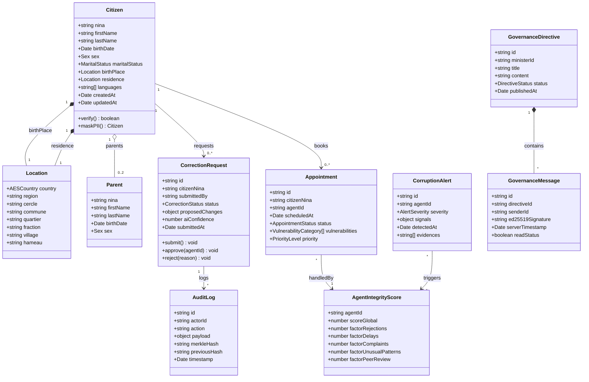
```mermaid
classDiagram
    class Citizen {
        +string nina
        +string firstName
        +string lastName
        +Date birthDate
        +Sex sex
        +MaritalStatus maritalStatus
        +Location birthPlace
        +Location residence
        +string[] languages
        +Date createdAt
        +Date updatedAt
        +verify() boolean
        +maskPII() Citizen
    }

    class Location {
        +AESCountry country
        +string region
        +string cercle
        +string commune
        +string quartier
        +string fraction
        +string village
        +string hameau
    }

    class Parent {
        +string nina
        +string firstName
        +string lastName
        +Date birthDate
        +Sex sex
    }

    class CorrectionRequest {
        +string id
        +string citizenNina
        +string submittedBy
        +CorrectionStatus status
        +object proposedChanges
        +number aiConfidence
        +Date submittedAt
        +submit() void
        +approve(agentId) void
        +reject(reason) void
    }

    class Appointment {
        +string id
        +string citizenNina
        +string agentId
        +Date scheduledAt
        +AppointmentStatus status
        +VulnerabilityCategory[] vulnerabilities
        +PriorityLevel priority
    }

    class CorruptionAlert {
        +string id
        +string agentId
        +AlertSeverity severity
        +object signals
        +Date detectedAt
        +string[] evidences
    }

    class AgentIntegrityScore {
        +string agentId
        +number scoreGlobal
        +number factorRejections
        +number factorDelays
        +number factorComplaints
        +number factorUnusualPatterns
        +number factorPeerReview
    }

    class GovernanceDirective {
        +string id
        +string ministerId
        +string title
        +string content
        +DirectiveStatus status
        +Date publishedAt
    }

    class GovernanceMessage {
        +string id
        +string directiveId
        +string senderId
        +string ed25519Signature
        +Date serverTimestamp
        +boolean readStatus
    }

    class AuditLog {
        +string id
        +string actorId
        +string action
        +object payload
        +string merkleHash
        +string previousHash
        +Date timestamp
    }

    Citizen "1" *-- "1" Location : birthPlace
    Citizen "1" *-- "1" Location : residence
    Citizen "1" o-- "0..2" Parent : parents
    Citizen "1" --> "0..*" CorrectionRequest : requests
    Citizen "1" --> "0..*" Appointment : books
    Appointment "*" --> "1" AgentIntegrityScore : handledBy
    CorruptionAlert "*" --> "1" AgentIntegrityScore : triggers
    GovernanceDirective "1" *-- "*" GovernanceMessage : contains
    CorrectionRequest "1" --> "*" AuditLog : logs
```

---

### 2 — Diagramme de classes — Architecture NestJS en couches (identity-service type)

Modèle générique appliqué à chacun des 11 microservices NestJS.

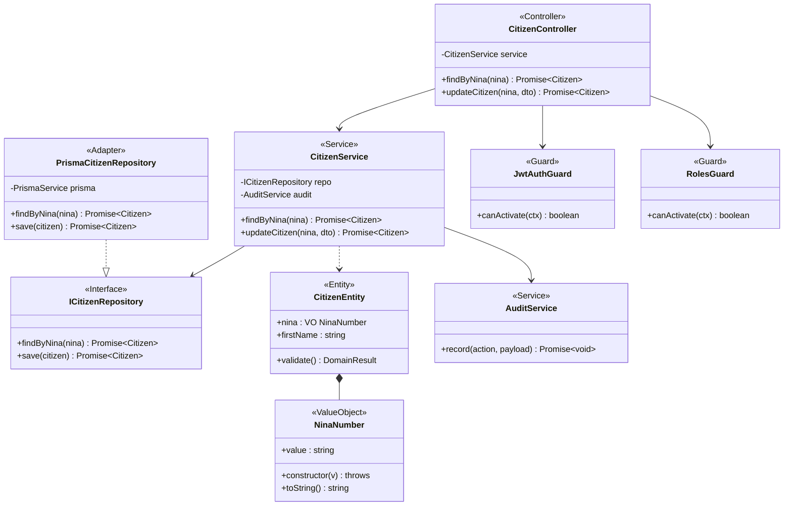
```mermaid
classDiagram
    class CitizenController {
        <<Controller>>
        -CitizenService service
        +findByNina(nina) Promise~Citizen~
        +updateCitizen(nina, dto) Promise~Citizen~
    }

    class CitizenService {
        <<Service>>
        -ICitizenRepository repo
        -AuditService audit
        +findByNina(nina) Promise~Citizen~
        +updateCitizen(nina, dto) Promise~Citizen~
    }

    class ICitizenRepository {
        <<Interface>>
        +findByNina(nina) Promise~Citizen~
        +save(citizen) Promise~Citizen~
    }

    class PrismaCitizenRepository {
        <<Adapter>>
        -PrismaService prisma
        +findByNina(nina) Promise~Citizen~
        +save(citizen) Promise~Citizen~
    }

    class CitizenEntity {
        <<Entity>>
        +nina : VO NinaNumber
        +firstName : string
        +validate() DomainResult
    }

    class NinaNumber {
        <<ValueObject>>
        +value : string
        +constructor(v) throws
        +toString() string
    }

    class AuditService {
        <<Service>>
        +record(action, payload) Promise~void~
    }

    class JwtAuthGuard {
        <<Guard>>
        +canActivate(ctx) boolean
    }

    class RolesGuard {
        <<Guard>>
        +canActivate(ctx) boolean
    }

    CitizenController --> CitizenService
    CitizenController --> JwtAuthGuard
    CitizenController --> RolesGuard
    CitizenService --> ICitizenRepository
    CitizenService --> AuditService
    PrismaCitizenRepository ..|> ICitizenRepository
    CitizenService ..> CitizenEntity
    CitizenEntity *-- NinaNumber
```

---

### 3 — Diagramme de classes — Packages partagés `@nina-aes/*`

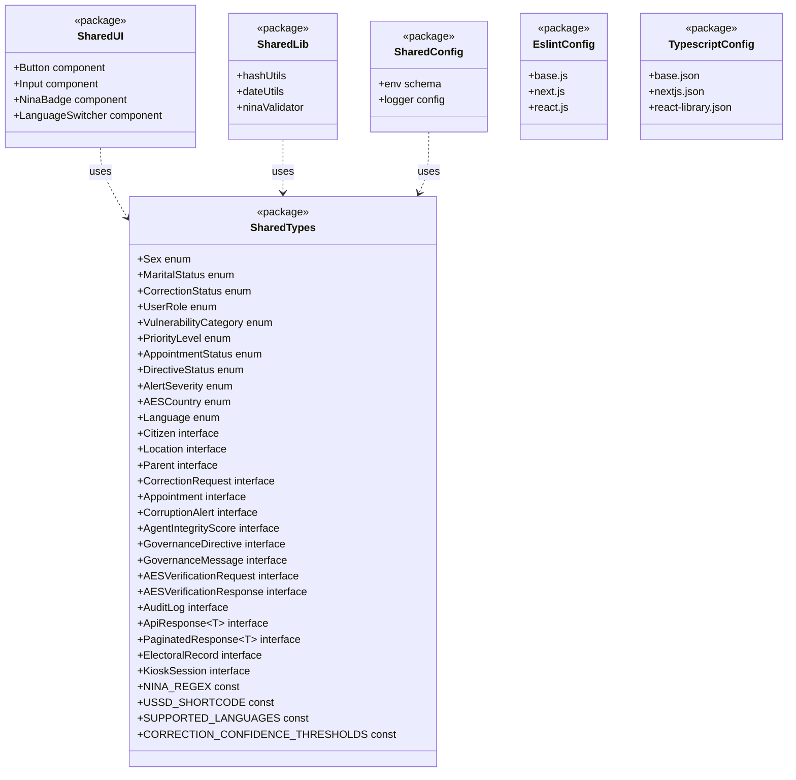
```mermaid
classDiagram
    class SharedTypes {
        <<package>>
        +Sex enum
        +MaritalStatus enum
        +CorrectionStatus enum
        +UserRole enum
        +VulnerabilityCategory enum
        +PriorityLevel enum
        +AppointmentStatus enum
        +DirectiveStatus enum
        +AlertSeverity enum
        +AESCountry enum
        +Language enum
        +Citizen interface
        +Location interface
        +Parent interface
        +CorrectionRequest interface
        +Appointment interface
        +CorruptionAlert interface
        +AgentIntegrityScore interface
        +GovernanceDirective interface
        +GovernanceMessage interface
        +AESVerificationRequest interface
        +AESVerificationResponse interface
        +AuditLog interface
        +ApiResponse~T~ interface
        +PaginatedResponse~T~ interface
        +ElectoralRecord interface
        +KioskSession interface
        +NINA_REGEX const
        +USSD_SHORTCODE const
        +SUPPORTED_LANGUAGES const
        +CORRECTION_CONFIDENCE_THRESHOLDS const
    }

    class SharedUI {
        <<package>>
        +Button component
        +Input component
        +NinaBadge component
        +LanguageSwitcher component
    }

    class SharedLib {
        <<package>>
        +hashUtils
        +dateUtils
        +ninaValidator
    }

    class SharedConfig {
        <<package>>
        +env schema
        +logger config
    }

    class EslintConfig {
        <<package>>
        +base.js
        +next.js
        +react.js
    }

    class TypescriptConfig {
        <<package>>
        +base.json
        +nextjs.json
        +react-library.json
    }

    SharedUI ..> SharedTypes : uses
    SharedLib ..> SharedTypes : uses
    SharedConfig ..> SharedTypes : uses
```

---

### 4 — Diagramme d'objets — Instances à un instant T

Mermaid ne supporte pas nativement l'object diagram. Équivalent via `classDiagram` avec instances
nommées `:Class`.

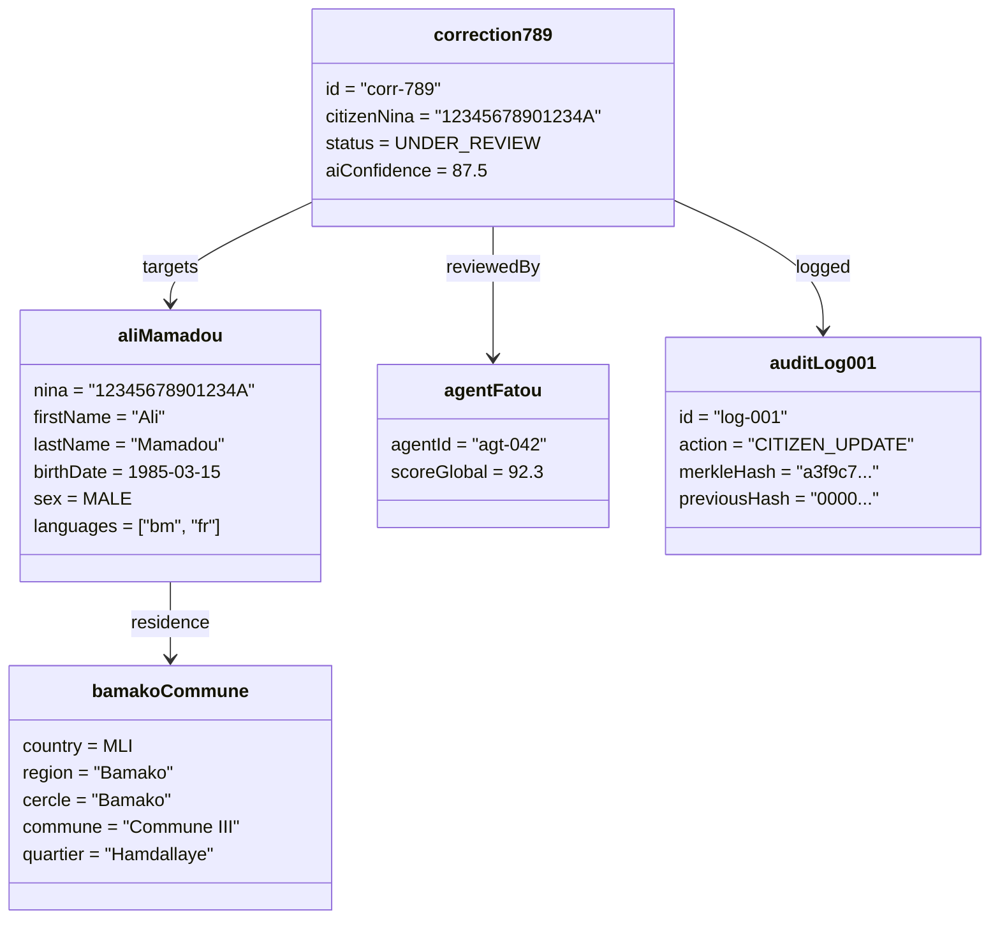
```mermaid
classDiagram
    class aliMamadou {
        nina = "12345678901234A"
        firstName = "Ali"
        lastName = "Mamadou"
        birthDate = 1985-03-15
        sex = MALE
        languages = ["bm", "fr"]
    }

    class bamakoCommune {
        country = MLI
        region = "Bamako"
        cercle = "Bamako"
        commune = "Commune III"
        quartier = "Hamdallaye"
    }

    class correction789 {
        id = "corr-789"
        citizenNina = "12345678901234A"
        status = UNDER_REVIEW
        aiConfidence = 87.5
    }

    class agentFatou {
        agentId = "agt-042"
        scoreGlobal = 92.3
    }

    class auditLog001 {
        id = "log-001"
        action = "CITIZEN_UPDATE"
        merkleHash = "a3f9c7..."
        previousHash = "0000..."
    }

    aliMamadou --> bamakoCommune : residence
    correction789 --> aliMamadou : targets
    correction789 --> agentFatou : reviewedBy
    correction789 --> auditLog001 : logged
```

---

### 5 — Diagramme de composants — Architecture globale NINA-AES

Vue macro : 5 apps frontends + 11 microservices + infra + APIs externes.


```mermaid
flowchart TB
    subgraph Clients["Apps clientes"]
        WebCitoyen[web-citoyen Next.js 16]
        WebAgent[web-agent Next.js 16]
        WebAdmin[web-admin Next.js 16]
        WebGov[web-gouvernance Next.js 16]
        Mobile[mobile-citoyen Expo SDK 55]
        Kiosk[kiosk-agent Electron]
        USSD[USSD Africa's Talking]
    end

    subgraph Edge["Edge / Sécurité"]
        Traefik[Traefik v3 mTLS]
        Keycloak[Keycloak 26.5 OIDC]
        Vault[HashiCorp Vault]
    end

    subgraph Core["Core Services NestJS 11"]
        AuthSvc[auth-service :3002]
        IdentitySvc[identity-service :3001]
        CorrSvc[correction-service :3003]
        AppSvc[appointment-service :3004]
        GovSvc[governance-service :3005]
        AuditSvc[audit-service :3006]
        NotifSvc[notification-service :3007]
        InteropSvc[interop-aes-service :3008]
        ElectoralSvc[electoral-service :3009]
        KioskSvc[kiosk-service :3010]
        FileSvc[file-service :3011]
    end

    subgraph AI["IA Python FastAPI"]
        AIService[ai-service :8001]
        AntiCorr[anticorruption-service :8002]
    end

    subgraph Data["Stockage"]
        Postgres[(PostgreSQL 18)]
        Redis[(Redis 8.6)]
        Elastic[(Elasticsearch 9.3)]
        MinIO[(MinIO)]
        RabbitMQ[RabbitMQ 4.2]
    end

    subgraph Obs["Observabilité"]
        Prometheus
        Grafana
        Loki
        Jaeger
    end

    WebCitoyen --> Traefik
    WebAgent --> Traefik
    WebAdmin --> Traefik
    WebGov --> Traefik
    Mobile --> Traefik
    Kiosk --> Traefik
    USSD --> Traefik

    Traefik --> Keycloak
    Traefik --> AuthSvc
    Traefik --> IdentitySvc
    Traefik --> CorrSvc
    Traefik --> AppSvc
    Traefik --> GovSvc
    Traefik --> InteropSvc

    AuthSvc --> Keycloak
    AuthSvc --> Redis
    IdentitySvc --> Postgres
    IdentitySvc --> Elastic
    CorrSvc --> AIService
    CorrSvc --> Postgres
    CorrSvc --> RabbitMQ
    AppSvc --> Postgres
    GovSvc --> Postgres
    AuditSvc --> Postgres
    AuditSvc --> RabbitMQ
    NotifSvc --> RabbitMQ
    InteropSvc --> Postgres
    ElectoralSvc --> Postgres
    KioskSvc --> Postgres
    FileSvc --> MinIO
    AntiCorr --> Postgres
    AntiCorr --> Elastic

    Core --> Vault
    Core --> Prometheus
    Core --> Loki
    Core --> Jaeger
```

---

### 6 — Diagramme de composants — interne AI Service (pipeline 5 étapes)

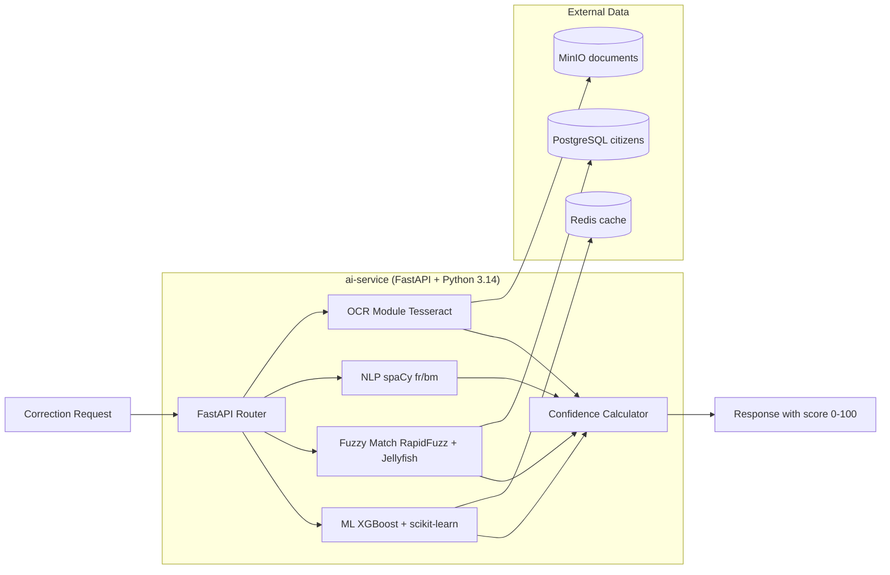
```mermaid
flowchart LR
    subgraph AIService["ai-service (FastAPI + Python 3.14)"]
        Router[FastAPI Router]
        OCRModule[OCR Module Tesseract]
        NLPModule[NLP spaCy fr/bm]
        FuzzyModule[Fuzzy Match RapidFuzz + Jellyfish]
        MLModule[ML XGBoost + scikit-learn]
        ConfidenceCalc[Confidence Calculator]
    end

    subgraph External["External Data"]
        Postgres[(PostgreSQL citizens)]
        Redis[(Redis cache)]
        MinIO[(MinIO documents)]
    end

    Request[Correction Request] --> Router
    Router --> OCRModule
    OCRModule --> MinIO
    Router --> NLPModule
    Router --> FuzzyModule
    FuzzyModule --> Postgres
    Router --> MLModule
    MLModule --> Redis
    OCRModule --> ConfidenceCalc
    NLPModule --> ConfidenceCalc
    FuzzyModule --> ConfidenceCalc
    MLModule --> ConfidenceCalc
    ConfidenceCalc --> Response[Response with score 0-100]
```

---

### 7 — Diagramme de composants — Interne Auth Service (Keycloak + Passport)

```mermaid
flowchart TB
    subgraph AuthService["auth-service (NestJS 11 :3002)"]
        AuthController[AuthController]
        AuthService[AuthService]
        subgraph Strategies["Passport Strategies"]
            JwtStrategy[JwtStrategy RS256]
            LocalStrategy[LocalStrategy]
            RefreshStrategy[RefreshStrategy]
        end
        subgraph Guards["Guards"]
            JwtGuard[JwtAuthGuard]
            RolesGuard[RolesGuard]
            MfaGuard[MfaGuard]
        end
        JwksService[JwksService]
        RefreshTokenRepo[RefreshTokenRepo Redis]
    end

    subgraph External
        Keycloak[Keycloak 26.5]
        Redis[(Redis refresh_tokens)]
        Vault[Vault JWT secret]
    end

    Client[Client App] --> AuthController
    AuthController --> AuthService
    AuthService --> Strategies
    AuthService --> Guards
    AuthService --> JwksService
    AuthService --> RefreshTokenRepo
    JwksService --> Keycloak
    RefreshTokenRepo --> Redis
    AuthService --> Vault
    AuthController --> Keycloak
```

---

### 8 — Diagramme de déploiement — Production K3s (CTDEC on-premise)

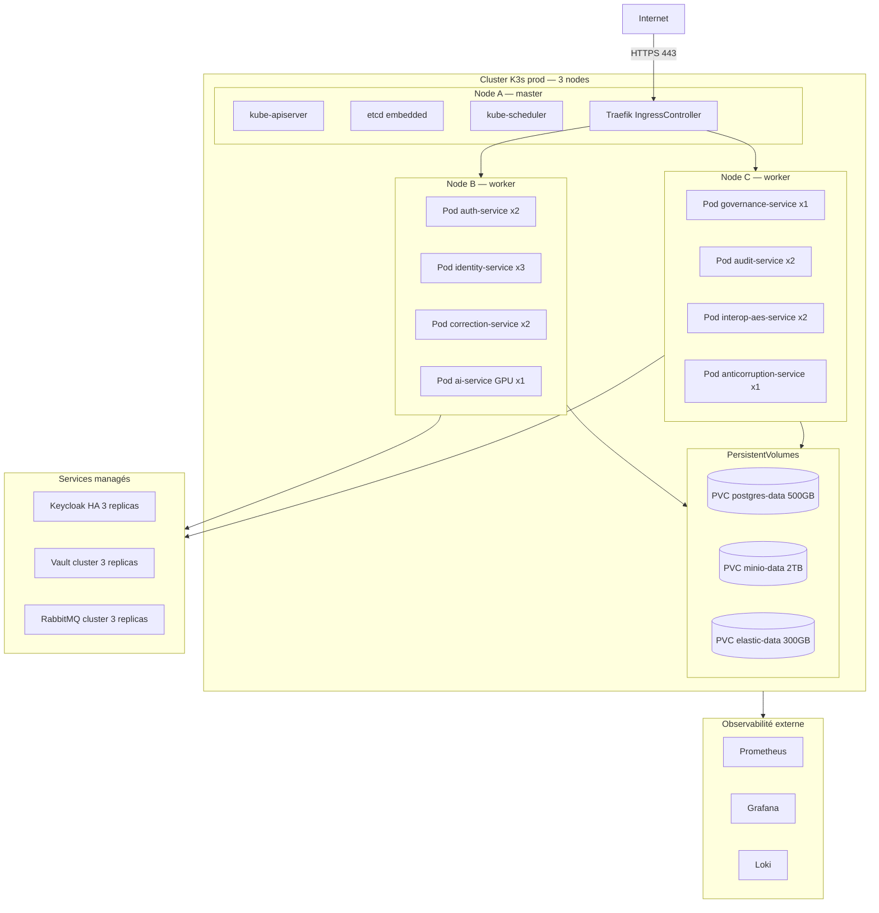
```mermaid
flowchart TB
    subgraph Cloud["Cluster K3s prod — 3 nodes"]
        subgraph NodeA["Node A — master"]
            CPApi[kube-apiserver]
            CPEtcd[etcd embedded]
            CPScheduler[kube-scheduler]
            Traefik2[Traefik IngressController]
        end
        subgraph NodeB["Node B — worker"]
            PodAuth[Pod auth-service x2]
            PodIdentity[Pod identity-service x3]
            PodCorr[Pod correction-service x2]
            PodAI[Pod ai-service GPU x1]
        end
        subgraph NodeC["Node C — worker"]
            PodGov[Pod governance-service x1]
            PodAudit[Pod audit-service x2]
            PodInterop[Pod interop-aes-service x2]
            PodAntiCorr[Pod anticorruption-service x1]
        end
        subgraph Storage["PersistentVolumes"]
            PvcPostgres[(PVC postgres-data 500GB)]
            PvcMinio[(PVC minio-data 2TB)]
            PvcElastic[(PVC elastic-data 300GB)]
        end
    end

    subgraph Managed["Services managés"]
        KeycloakMgd[Keycloak HA 3 replicas]
        VaultMgd[Vault cluster 3 replicas]
        MQ[RabbitMQ cluster 3 replicas]
    end

    subgraph Monitor["Observabilité externe"]
        PromExt[Prometheus]
        GrafanaExt[Grafana]
        LokiExt[Loki]
    end

    Internet[Internet] -- HTTPS 443 --> Traefik2
    Traefik2 --> NodeB
    Traefik2 --> NodeC
    NodeB --> Storage
    NodeC --> Storage
    NodeB --> Managed
    NodeC --> Managed
    Cloud --> Monitor
```

---

### 9 — Diagramme de déploiement — Docker Compose dev local (Windows)

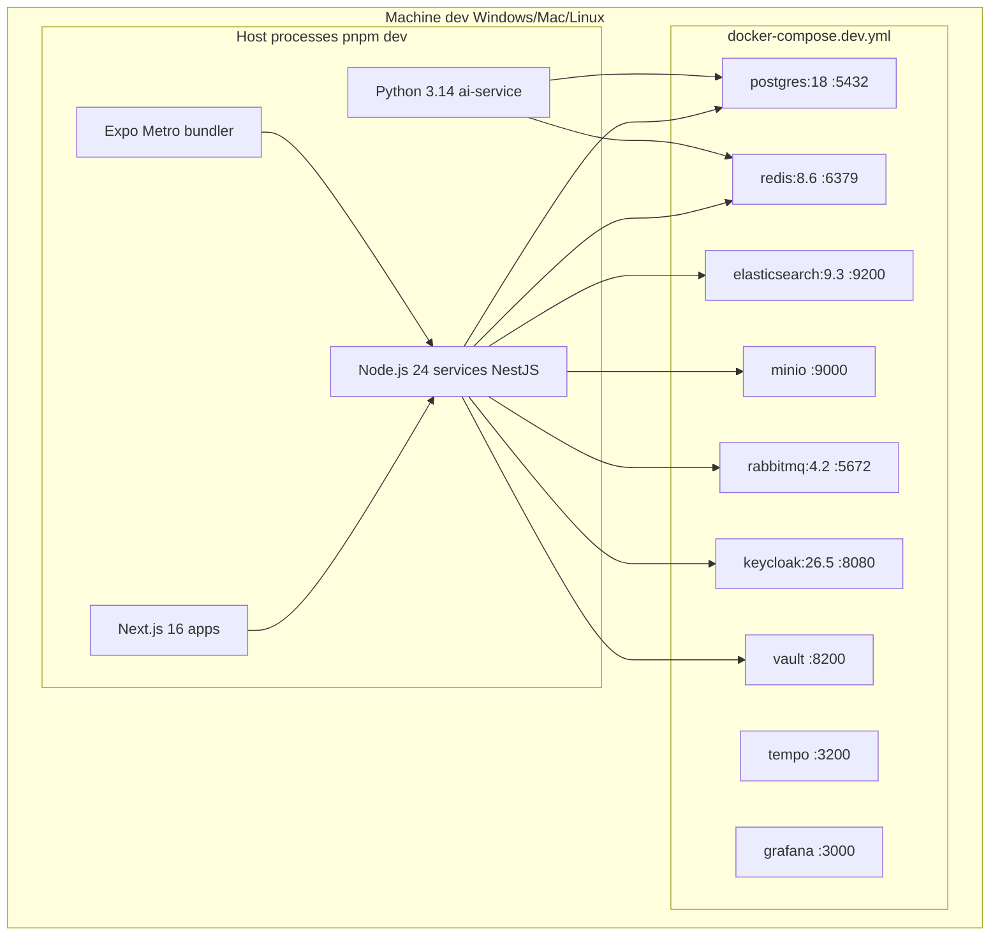
```mermaid
flowchart TB
    subgraph Laptop["Machine dev Windows/Mac/Linux"]
        subgraph Dc["docker-compose.dev.yml"]
            PgDev[postgres:18 :5432]
            RedisDev[redis:8.6 :6379]
            ElasticDev[elasticsearch:9.3 :9200]
            MinioDev[minio :9000]
            RmqDev[rabbitmq:4.2 :5672]
            KcDev[keycloak:26.5 :8080]
            VaultDev[vault :8200]
            TempoDev[tempo :3200]
            GrafDev[grafana :3000]
        end
        subgraph Host["Host processes pnpm dev"]
            NodeProcs[Node.js 24 services NestJS]
            PythonProcs[Python 3.14 ai-service]
            NextProcs[Next.js 16 apps]
            ExpoProcs[Expo Metro bundler]
        end
    end

    NodeProcs --> PgDev
    NodeProcs --> RedisDev
    NodeProcs --> ElasticDev
    NodeProcs --> MinioDev
    NodeProcs --> RmqDev
    NodeProcs --> KcDev
    NodeProcs --> VaultDev
    PythonProcs --> PgDev
    PythonProcs --> RedisDev
    NextProcs --> NodeProcs
    ExpoProcs --> NodeProcs
```

---

### 10 — Diagramme de packages — Monorepo Turborepo

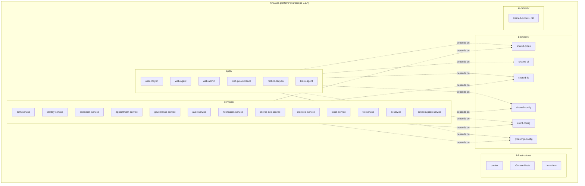
```mermaid
flowchart TB
    subgraph Root["nina-aes-platform/ (Turborepo 2.9.4)"]
        subgraph Apps["apps/"]
            WebC[web-citoyen]
            WebAg[web-agent]
            WebAd[web-admin]
            WebGv[web-gouvernance]
            Mob[mobile-citoyen]
            Ksk[kiosk-agent]
        end
        subgraph Svc["services/"]
            Auth[auth-service]
            Iden[identity-service]
            Corr[correction-service]
            App[appointment-service]
            Gov[governance-service]
            Aud[audit-service]
            Not[notification-service]
            Int[interop-aes-service]
            Ele[electoral-service]
            Kio[kiosk-service]
            Fil[file-service]
            AI[ai-service]
            AntiC[anticorruption-service]
        end
        subgraph Pkg["packages/"]
            ST[shared-types]
            SU[shared-ui]
            SL[shared-lib]
            SC[shared-config]
            EC[eslint-config]
            TC[typescript-config]
        end
        subgraph Infra["infrastructure/"]
            Dkr[docker]
            K3s[k3s-manifests]
            Tfm[terraform]
        end
        subgraph Ai["ai-models/"]
            Mdl[trained-models .pkl]
        end
    end

    Apps -. depends on .-> ST
    Apps -. depends on .-> SU
    Apps -. depends on .-> SL
    Apps -. depends on .-> SC
    Apps -. depends on .-> EC
    Apps -. depends on .-> TC
    Svc -. depends on .-> ST
    Svc -. depends on .-> SL
    Svc -. depends on .-> SC
    Svc -. depends on .-> EC
    Svc -. depends on .-> TC
```

---

### 11 — Diagramme de structure composite — identity-service interne

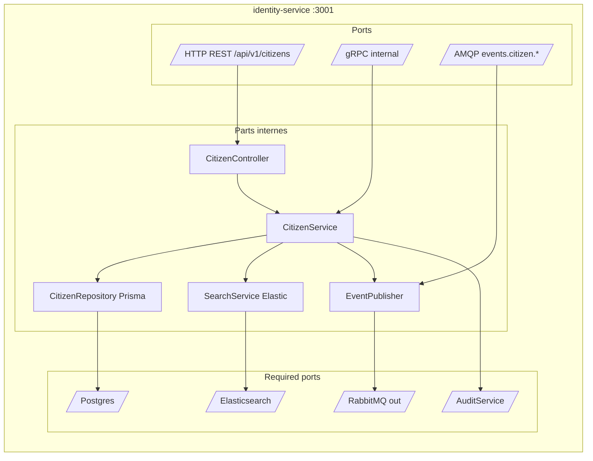
```mermaid
flowchart TB
    subgraph IS["identity-service :3001"]
        direction TB
        subgraph Ports["Ports"]
            PHttp[/HTTP REST /api/v1/citizens/]
            PGrpc[/gRPC internal/]
            PMQ[/AMQP events.citizen.*/]
        end
        subgraph Internal["Parts internes"]
            CitCtrl[CitizenController]
            CitSvc[CitizenService]
            CitRepo[CitizenRepository Prisma]
            SearchSvc[SearchService Elastic]
            EventPub[EventPublisher]
        end
        subgraph ReqPorts["Required ports"]
            ROut[/Postgres/]
            REl[/Elasticsearch/]
            RMq[/RabbitMQ out/]
            RAudit[/AuditService/]
        end
    end

    PHttp --> CitCtrl
    PGrpc --> CitSvc
    PMQ --> EventPub
    CitCtrl --> CitSvc
    CitSvc --> CitRepo
    CitSvc --> SearchSvc
    CitSvc --> EventPub
    CitRepo --> ROut
    SearchSvc --> REl
    EventPub --> RMq
    CitSvc --> RAudit
```

---

### 12 — Diagramme de profil — Stéréotypes/tags sécurité

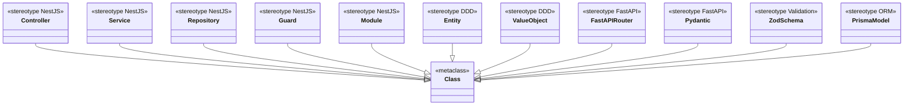
```mermaid
classDiagram
    class Class {
        <<metaclass>>
    }
    class Controller {
        <<stereotype NestJS>>
    }
    class Service {
        <<stereotype NestJS>>
    }
    class Repository {
        <<stereotype NestJS>>
    }
    class Guard {
        <<stereotype NestJS>>
    }
    class Module {
        <<stereotype NestJS>>
    }
    class Entity {
        <<stereotype DDD>>
    }
    class ValueObject {
        <<stereotype DDD>>
    }
    class FastAPIRouter {
        <<stereotype FastAPI>>
    }
    class Pydantic {
        <<stereotype FastAPI>>
    }
    class ZodSchema {
        <<stereotype Validation>>
    }
    class PrismaModel {
        <<stereotype ORM>>
    }

    Controller --|> Class
    Service --|> Class
    Repository --|> Class
    Guard --|> Class
    Module --|> Class
    Entity --|> Class
    ValueObject --|> Class
    FastAPIRouter --|> Class
    Pydantic --|> Class
    ZodSchema --|> Class
    PrismaModel --|> Class
```

---

## II. UML COMPORTEMENTAUX

### 13 — Use case — Citoyen

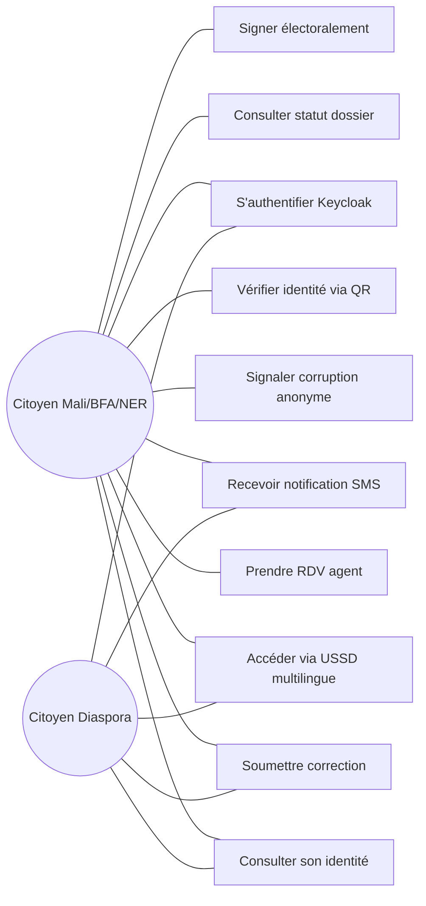
```mermaid
flowchart LR
    Citoyen((Citoyen Mali/BFA/NER))
    Diaspora((Citoyen Diaspora))

    UC1[Consulter son identité]
    UC2[Soumettre correction]
    UC3[Prendre RDV agent]
    UC4[Signaler corruption anonyme]
    UC5[Vérifier identité via QR]
    UC6[Accéder via USSD multilingue]
    UC7[Recevoir notification SMS]
    UC8[Consulter statut dossier]
    UC9[Signer électoralement]
    UC10[S'authentifier Keycloak]

    Citoyen --- UC1
    Citoyen --- UC2
    Citoyen --- UC3
    Citoyen --- UC4
    Citoyen --- UC5
    Citoyen --- UC6
    Citoyen --- UC7
    Citoyen --- UC8
    Citoyen --- UC9
    Citoyen --- UC10
    Diaspora --- UC1
    Diaspora --- UC2
    Diaspora --- UC6
    Diaspora --- UC7
    Diaspora --- UC10
```

---

### 14 — Use case — Agent, Superviseur, Admin, Auditeur

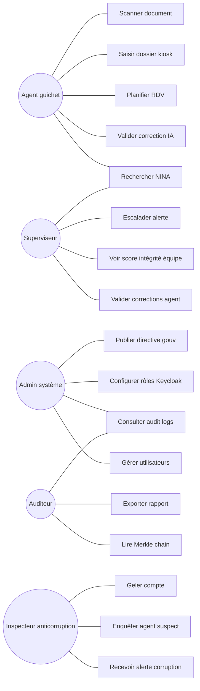
```mermaid
flowchart LR
    Agent((Agent guichet))
    Sup((Superviseur))
    Admin((Admin système))
    Aud((Auditeur))
    Insp((Inspecteur anticorruption))

    A1[Rechercher NINA]
    A2[Valider correction IA]
    A3[Planifier RDV]
    A4[Saisir dossier kiosk]
    A5[Scanner document]

    S1[Valider corrections agent]
    S2[Voir score intégrité équipe]
    S3[Escalader alerte]

    Ad1[Gérer utilisateurs]
    Ad2[Configurer rôles Keycloak]
    Ad3[Consulter audit logs]
    Ad4[Publier directive gouv]

    Au1[Lire Merkle chain]
    Au2[Exporter rapport]

    I1[Recevoir alerte corruption]
    I2[Enquêter agent suspect]
    I3[Geler compte]

    Agent --- A1
    Agent --- A2
    Agent --- A3
    Agent --- A4
    Agent --- A5
    Sup --- S1
    Sup --- S2
    Sup --- S3
    Sup --- A1
    Admin --- Ad1
    Admin --- Ad2
    Admin --- Ad3
    Admin --- Ad4
    Aud --- Au1
    Aud --- Au2
    Aud --- Ad3
    Insp --- I1
    Insp --- I2
    Insp --- I3
```

---

### 15 — Use case — Acteurs Interop AES

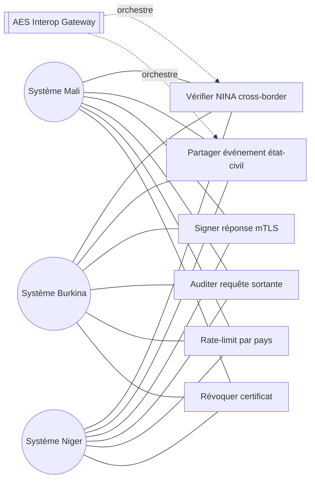
```mermaid
flowchart LR
    SysMali((Système Mali))
    SysBfa((Système Burkina))
    SysNer((Système Niger))
    Gateway[[AES Interop Gateway]]

    V1[Vérifier NINA cross-border]
    V2[Partager événement état-civil]
    V3[Signer réponse mTLS]
    V4[Auditer requête sortante]
    V5[Rate-limit par pays]
    V6[Révoquer certificat]

    SysMali --- V1
    SysMali --- V2
    SysMali --- V3
    SysMali --- V4
    SysMali --- V5
    SysMali --- V6
    SysBfa --- V1
    SysBfa --- V2
    SysBfa --- V3
    SysBfa --- V4
    SysBfa --- V5
    SysBfa --- V6
    SysNer --- V1
    SysNer --- V2
    SysNer --- V3
    SysNer --- V4
    SysNer --- V5
    SysNer --- V6
    Gateway -.orchestre.-> V1
    Gateway -.orchestre.-> V2
```

---

### 16 — Activité — Correction identité

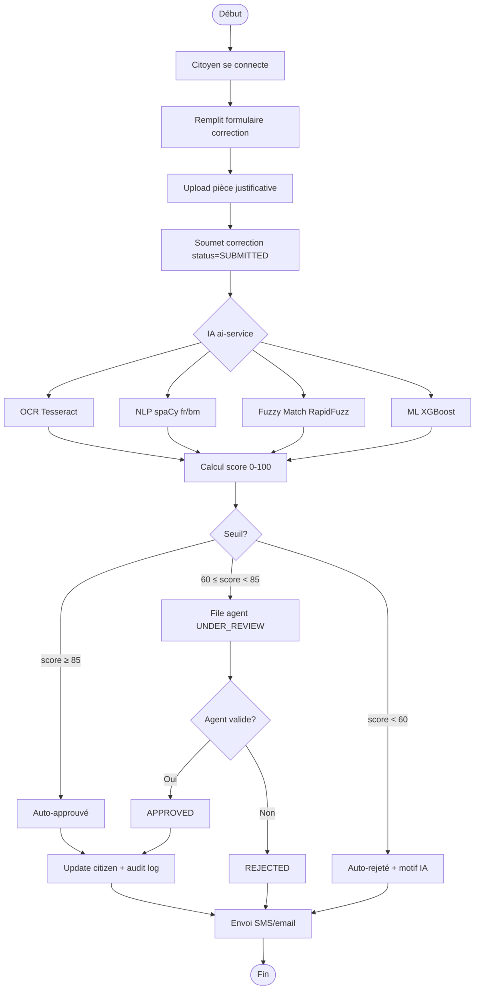
```mermaid
flowchart TD
    Start([Début]) --> Login[Citoyen se connecte]
    Login --> Fill[Remplit formulaire correction]
    Fill --> Upload[Upload pièce justificative]
    Upload --> Submit[Soumet correction status=SUBMITTED]
    Submit --> AI{IA ai-service}
    AI --> OCR[OCR Tesseract]
    AI --> NLP[NLP spaCy fr/bm]
    AI --> Fuzzy[Fuzzy Match RapidFuzz]
    AI --> ML[ML XGBoost]
    OCR --> Score[Calcul score 0-100]
    NLP --> Score
    Fuzzy --> Score
    ML --> Score
    Score --> Dec{Seuil?}
    Dec -- "score ≥ 85" --> AutoApprove[Auto-approuvé]
    Dec -- "60 ≤ score < 85" --> Queue[File agent UNDER_REVIEW]
    Dec -- "score < 60" --> AutoReject[Auto-rejeté + motif IA]
    Queue --> Agent{Agent valide?}
    Agent -- Oui --> Approved[APPROVED]
    Agent -- Non --> Rejected[REJECTED]
    AutoApprove --> UpdateDb[Update citizen + audit log]
    Approved --> UpdateDb
    UpdateDb --> Notif[Envoi SMS/email]
    AutoReject --> Notif
    Rejected --> Notif
    Notif --> End([Fin])
```

---

### 17 — Activité — Interop cross-border

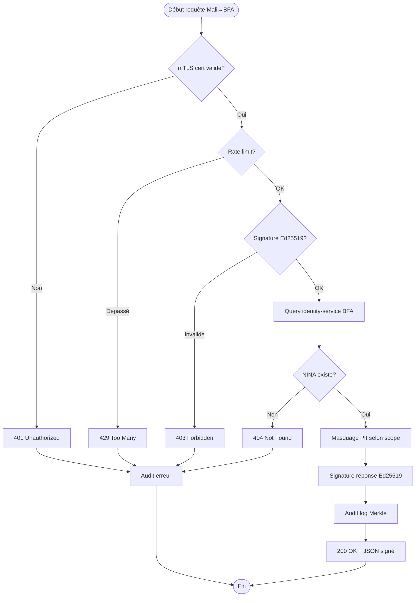
```mermaid
flowchart TD
    Start([Début requête Mali→BFA]) --> Auth{mTLS cert valide?}
    Auth -- Non --> Err1[401 Unauthorized]
    Auth -- Oui --> Rate{Rate limit?}
    Rate -- Dépassé --> Err2[429 Too Many]
    Rate -- OK --> Sig{Signature Ed25519?}
    Sig -- Invalide --> Err3[403 Forbidden]
    Sig -- OK --> Query[Query identity-service BFA]
    Query --> Found{NINA existe?}
    Found -- Non --> R404[404 Not Found]
    Found -- Oui --> Mask[Masquage PII selon scope]
    Mask --> SignResp[Signature réponse Ed25519]
    SignResp --> Audit[Audit log Merkle]
    Audit --> Return[200 OK + JSON signé]
    Err1 --> AuditErr[Audit erreur]
    Err2 --> AuditErr
    Err3 --> AuditErr
    R404 --> AuditErr
    Return --> End([Fin])
    AuditErr --> End
```

---

### 18 — Activité — USSD

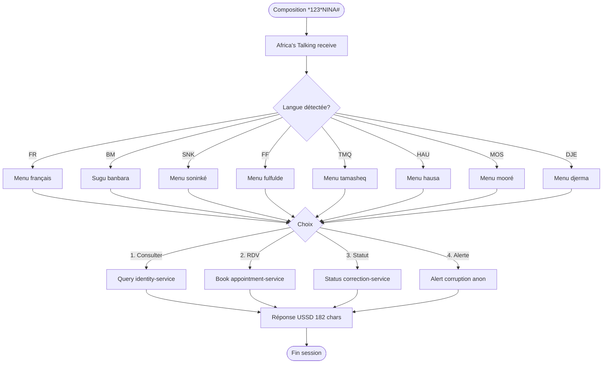
```mermaid
flowchart TD
    Start([Composition *123*NINA#]) --> AT[Africa's Talking receive]
    AT --> Lang{Langue détectée?}
    Lang -- FR --> MenuFR[Menu français]
    Lang -- BM --> MenuBM[Sugu banbara]
    Lang -- SNK --> MenuSNK[Menu soninké]
    Lang -- FF --> MenuFF[Menu fulfulde]
    Lang -- TMQ --> MenuTMQ[Menu tamasheq]
    Lang -- HAU --> MenuHAU[Menu hausa]
    Lang -- MOS --> MenuMOS[Menu mooré]
    Lang -- DJE --> MenuDJE[Menu djerma]
    MenuFR --> Choice{Choix}
    MenuBM --> Choice
    MenuSNK --> Choice
    MenuFF --> Choice
    MenuTMQ --> Choice
    MenuHAU --> Choice
    MenuMOS --> Choice
    MenuDJE --> Choice
    Choice -- "1. Consulter" --> Query[Query identity-service]
    Choice -- "2. RDV" --> Book[Book appointment-service]
    Choice -- "3. Statut" --> Status[Status correction-service]
    Choice -- "4. Alerte" --> Alert[Alert corruption anon]
    Query --> Resp[Réponse USSD 182 chars]
    Book --> Resp
    Status --> Resp
    Alert --> Resp
    Resp --> End([Fin session])
```

---

### 19 — État — CorrectionRequest

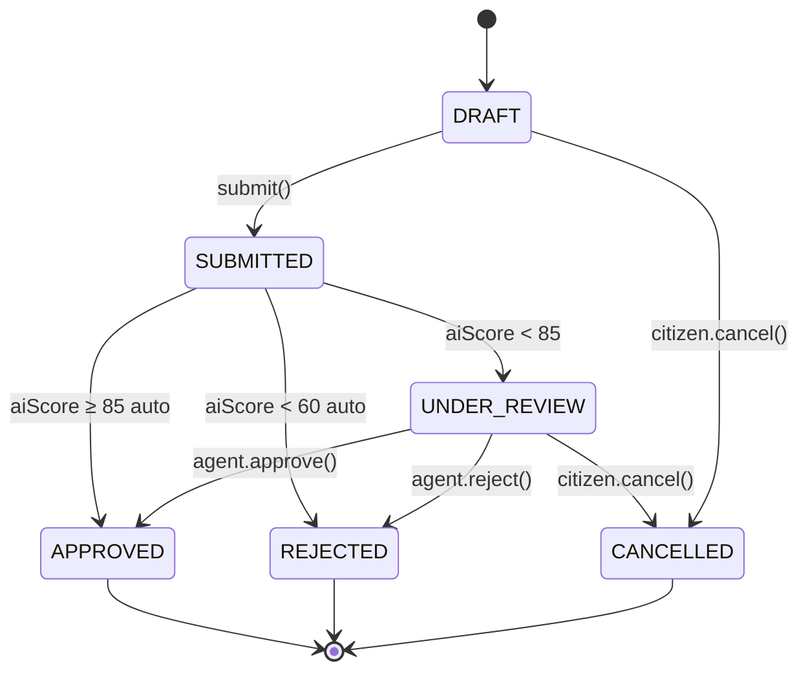
```mermaid
stateDiagram-v2
    [*] --> DRAFT
    DRAFT --> SUBMITTED : submit()
    SUBMITTED --> UNDER_REVIEW : aiScore < 85
    SUBMITTED --> APPROVED : aiScore ≥ 85 auto
    SUBMITTED --> REJECTED : aiScore < 60 auto
    UNDER_REVIEW --> APPROVED : agent.approve()
    UNDER_REVIEW --> REJECTED : agent.reject()
    UNDER_REVIEW --> CANCELLED : citizen.cancel()
    DRAFT --> CANCELLED : citizen.cancel()
    APPROVED --> [*]
    REJECTED --> [*]
    CANCELLED --> [*]
```

---

### 20 — État — Appointment

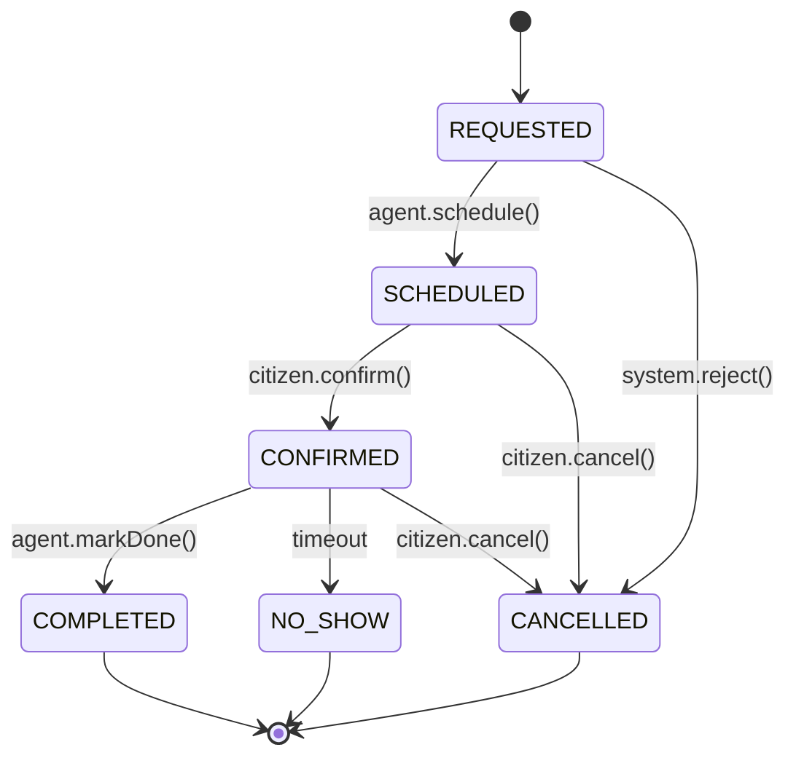
```mermaid
stateDiagram-v2
    [*] --> REQUESTED
    REQUESTED --> SCHEDULED : agent.schedule()
    SCHEDULED --> CONFIRMED : citizen.confirm()
    CONFIRMED --> COMPLETED : agent.markDone()
    CONFIRMED --> NO_SHOW : timeout
    CONFIRMED --> CANCELLED : citizen.cancel()
    SCHEDULED --> CANCELLED : citizen.cancel()
    REQUESTED --> CANCELLED : system.reject()
    COMPLETED --> [*]
    NO_SHOW --> [*]
    CANCELLED --> [*]
```

---

### 21 — État — GovernanceDirective

```mermaid
stateDiagram-v2
    [*] --> DRAFT
    DRAFT --> PUBLISHED : minister.publish()
    PUBLISHED --> IN_PROGRESS : recipient.acknowledge()
    IN_PROGRESS --> ESCALATED : deadline exceeded
    IN_PROGRESS --> CLOSED : task.complete()
    ESCALATED --> CLOSED : superior.resolve()
    CLOSED --> ARCHIVED : after 90d
    ARCHIVED --> [*]
```

---

### 22 — État — CorruptionAlert

```mermaid
stateDiagram-v2
    [*] --> DETECTED
    DETECTED --> TRIAGED : inspector.assigns()
    TRIAGED --> INVESTIGATING : inspector.open()
    INVESTIGATING --> EVIDENCE_COLLECTED : add evidences
    EVIDENCE_COLLECTED --> CONFIRMED : prove()
    EVIDENCE_COLLECTED --> DISMISSED : not enough
    CONFIRMED --> ACCOUNT_FROZEN : suspend agent
    CONFIRMED --> LEGAL_ESCALATION : criminal level
    ACCOUNT_FROZEN --> CLOSED
    LEGAL_ESCALATION --> CLOSED
    DISMISSED --> CLOSED
    CLOSED --> [*]
```

---

### 23 — État — Cycle de vie JWT

```mermaid
stateDiagram-v2
    [*] --> ISSUED : Keycloak issues RS256
    ISSUED --> ACTIVE : client receives
    ACTIVE --> VALIDATED : guard checks sig+exp
    VALIDATED --> ACTIVE : success
    ACTIVE --> EXPIRED : exp time reached
    EXPIRED --> REFRESHED : refresh_token used
    REFRESHED --> ACTIVE
    ACTIVE --> REVOKED : admin.revoke()
    EXPIRED --> BLACKLISTED : after grace
    REVOKED --> [*]
    BLACKLISTED --> [*]
```

---

## III. UML INTERACTIONS

### 24 — Séquence — Login Keycloak

```mermaid
sequenceDiagram
    actor User as Citoyen
    participant Web as web-citoyen
    participant Auth as auth-service :3002
    participant KC as Keycloak 26.5
    participant Redis as Redis
    participant Vault as Vault

    User->>Web: Click "Se connecter"
    Web->>KC: OIDC /auth?response_type=code
    KC-->>User: Formulaire login
    User->>KC: email+pwd+MFA
    KC-->>Web: redirect?code=XYZ
    Web->>Auth: POST /auth/token {code}
    Auth->>KC: POST /token {code, client_secret}
    KC-->>Auth: {id_token, access_token RS256, refresh_token}
    Auth->>Vault: get JWT public key
    Vault-->>Auth: pubKey
    Auth->>Auth: verify RS256 signature
    Auth->>Redis: SET refresh:userId TTL=7d
    Auth-->>Web: {access_token, expires_in=900}
    Web->>Web: store in httpOnly cookie
    Web-->>User: Dashboard
```

---

### 25 — Séquence — Recherche NINA

```mermaid
sequenceDiagram
    actor Agent
    participant Web as web-agent
    participant Gw as Traefik
    participant Auth as auth-service
    participant Iden as identity-service
    participant Pg as PostgreSQL
    participant Els as Elasticsearch
    participant Aud as audit-service

    Agent->>Web: Saisit NINA "12345...A"
    Web->>Gw: GET /api/v1/citizens/{nina} +Bearer JWT
    Gw->>Auth: verify JWT
    Auth-->>Gw: OK role=AGENT
    Gw->>Iden: GET /citizens/{nina}
    Iden->>Iden: validate NINA regex
    Iden->>Pg: SELECT * WHERE nina=?
    Pg-->>Iden: Citizen row
    Iden->>Els: logAccess {nina, agentId}
    Iden->>Aud: emit event access.citizen.read
    Aud->>Aud: append Merkle chain
    Iden-->>Gw: Citizen JSON
    Gw-->>Web: 200 OK
    Web-->>Agent: Display fiche
```

---

### 26 — Séquence — Scan QR

```mermaid
sequenceDiagram
    actor Citizen
    participant Mobile as mobile-citoyen
    participant Cam as Caméra
    participant Iden as identity-service
    participant Aud as audit-service

    Citizen->>Mobile: Ouvre onglet "Vérifier QR"
    Mobile->>Cam: request permission
    Cam-->>Mobile: permission granted
    Citizen->>Cam: scan QR code d'un agent
    Cam-->>Mobile: QR payload signé
    Mobile->>Mobile: verify signature Ed25519 locally
    Mobile->>Iden: POST /verify-qr {payload}
    Iden->>Iden: check QR not expired (<5min)
    Iden->>Aud: log verification event
    Iden-->>Mobile: {valid=true, agentName, office}
    Mobile-->>Citizen: "✓ Agent vérifié : Fatou D., Bureau Bamako III"
```

---

### 27 — Séquence — Correction IA

```mermaid
sequenceDiagram
    actor Citizen
    participant Web as web-citoyen
    participant Corr as correction-service :3003
    participant AI as ai-service :8001
    participant Minio
    participant MQ as RabbitMQ
    participant AntiC as anticorruption-service

    Citizen->>Web: Soumet correction + photo CNI
    Web->>Corr: POST /corrections {dto, file}
    Corr->>Minio: PUT /corrections/{id}.jpg
    Minio-->>Corr: object URL
    Corr->>AI: POST /analyze {citizenId, objectUrl, proposed}
    AI->>AI: OCR Tesseract
    AI->>AI: NLP spaCy + langdetect
    AI->>AI: Fuzzy match RapidFuzz
    AI->>AI: XGBoost confidence
    AI-->>Corr: {score=87.3, anomalies=[]}
    Corr->>Corr: auto-approve (≥85)
    Corr->>MQ: publish correction.approved
    MQ->>AntiC: consume → check agent pattern
    AntiC->>AntiC: if suspicious → create alert
    Corr-->>Web: {status=APPROVED, score=87.3}
    Web-->>Citizen: "✓ Correction approuvée"
```

---

### 28 — Séquence — Interop cross-border

```mermaid
sequenceDiagram
    participant SysBFA as Système BFA
    participant GwM as Gateway Mali
    participant Auth as auth-service
    participant Interop as interop-aes-service :3008
    participant Iden as identity-service
    participant Aud as audit-service

    SysBFA->>GwM: POST /aes/v1/verify {nina, countryRequest=BFA} + mTLS cert + Ed25519 sig
    GwM->>GwM: verify mTLS chain
    GwM->>Auth: verify scope=aes.verify
    Auth-->>GwM: OK
    GwM->>Interop: forward with origin=BFA
    Interop->>Interop: rate-limit check (100/min BFA)
    Interop->>Interop: verify Ed25519 payload signature
    Interop->>Iden: GET /citizens/{nina} scope=interop
    Iden-->>Interop: Citizen (PII masked per treaty)
    Interop->>Interop: sign response Ed25519
    Interop->>Aud: log {originCountry=BFA, nina, timestamp}
    Aud->>Aud: append Merkle hash chain
    Interop-->>GwM: {valid=true, maskedData, sig}
    GwM-->>SysBFA: 200 OK signed JSON
```

---

### 29 — Séquence — USSD

```mermaid
sequenceDiagram
    actor Citoyen
    participant Tel as Téléphone
    participant AT as Africa's Talking
    participant NotifSvc as notification-service
    participant Iden as identity-service

    Citoyen->>Tel: *123*NINA#
    Tel->>AT: USSD request
    AT->>NotifSvc: POST /ussd/callback {sessionId, phoneNumber, text=""}
    NotifSvc->>NotifSvc: detect language from phone prefix
    NotifSvc-->>AT: CON 1.Consulter 2.RDV 3.Statut 4.Alerte
    AT-->>Tel: Display menu (bm)
    Citoyen->>Tel: "1"
    Tel->>AT: text="1"
    AT->>NotifSvc: callback text="1"
    NotifSvc-->>AT: CON Entrez votre NINA
    Citoyen->>Tel: "12345678901234A"
    AT->>NotifSvc: callback text="1*12345678901234A"
    NotifSvc->>Iden: GET /citizens/12345678901234A
    Iden-->>NotifSvc: {firstName, lastName, birthDate}
    NotifSvc-->>AT: END Ali Mamadou, né 1985-03-15
    AT-->>Tel: Display response
```

---

### 30 — Séquence — Audit Merkle

```mermaid
sequenceDiagram
    participant Svc as Any microservice
    participant MQ as RabbitMQ
    participant Aud as audit-service :3006
    participant Pg as PostgreSQL audit_logs

    Svc->>MQ: publish event.audit {actor, action, payload}
    MQ->>Aud: consume from audit.queue
    Aud->>Pg: SELECT merkle_hash FROM audit_logs ORDER BY id DESC LIMIT 1
    Pg-->>Aud: previousHash
    Aud->>Aud: merkleHash = SHA256(previousHash + payload + timestamp)
    Aud->>Pg: INSERT INTO audit_logs {..., previousHash, merkleHash}
    Pg-->>Aud: inserted id
    Aud->>Aud: periodic: sign chain root Ed25519 (every 1h)
    Aud->>Pg: UPDATE audit_root SET signed_at, signature
```

---

### 31 — Interaction overview

```mermaid
flowchart TB
    Start([Début session citoyen]) --> Login{Authentification}
    Login -- Succès --> Home[Dashboard]
    Login -- Échec --> End1([Fin])
    Home --> Choice{Action ?}
    Choice -- Consulter --> SeqFetch[/sd ref: Séquence 25 Recherche NINA/]
    Choice -- Correction --> SeqAI[/sd ref: Séquence 27 Correction IA/]
    Choice -- QR --> SeqQR[/sd ref: Séquence 26 Scan QR/]
    Choice -- USSD --> SeqUSSD[/sd ref: Séquence 29 USSD/]
    SeqFetch --> Choice
    SeqAI --> Choice
    SeqQR --> Choice
    SeqUSSD --> Choice
    Choice -- Déconnexion --> Logout[Clear tokens]
    Logout --> End2([Fin])
```

---

### 32 — Timing (Gantt)

```mermaid
gantt
    title Chaîne de traitement d'une correction identité (ms)
    dateFormat X
    axisFormat %L ms
    section Réseau
    Upload fichier        :a1, 0, 400
    Transfert Minio       :a2, after a1, 200
    section Backend
    Validation Zod        :b1, after a1, 15
    Routing Nest          :b2, after b1, 10
    section IA
    OCR Tesseract         :c1, after a2, 800
    NLP spaCy             :c2, after a2, 300
    Fuzzy RapidFuzz       :c3, after a2, 150
    ML XGBoost            :c4, after a2, 100
    Agrégation score      :c5, after c1, 20
    section Persistance
    Update Postgres       :d1, after c5, 50
    Index Elastic         :d2, after c5, 100
    Publish RabbitMQ      :d3, after c5, 30
    section Notif
    SMS via AT            :e1, after d3, 600
```

---

## IV. BONUS — SCHÉMAS ADDITIONNELS

### 33 — ER — Identité

```mermaid
erDiagram
    CITIZEN ||--o{ CITIZEN_PARENT : has
    CITIZEN ||--|| LOCATION : birthPlace
    CITIZEN ||--|| LOCATION : residence
    CITIZEN ||--o{ CORRECTION_REQUEST : submits
    CITIZEN ||--o{ APPOINTMENT : books
    AGENT ||--o{ APPOINTMENT : handles
    AGENT ||--|| INTEGRITY_SCORE : has
    AGENT ||--o{ CORRUPTION_ALERT : flagged
    CORRECTION_REQUEST ||--o{ AUDIT_LOG : generates

    CITIZEN {
        string nina PK
        string firstName
        string lastName
        date birthDate
        enum sex
        enum maritalStatus
        uuid birthPlaceId FK
        uuid residenceId FK
        string[] languages
        datetime createdAt
    }

    LOCATION {
        uuid id PK
        enum country
        string region
        string cercle
        string commune
        string quartier
        string fraction
        string village
        string hameau
    }

    CITIZEN_PARENT {
        string citizenNina FK
        string parentNina
        enum relation
    }

    CORRECTION_REQUEST {
        uuid id PK
        string citizenNina FK
        string submittedBy
        enum status
        jsonb proposedChanges
        float aiConfidence
        datetime submittedAt
    }

    APPOINTMENT {
        uuid id PK
        string citizenNina FK
        string agentId FK
        datetime scheduledAt
        enum status
        enum[] vulnerabilities
        enum priority
    }

    AGENT {
        string id PK
        string keycloakSub
        string office
    }

    INTEGRITY_SCORE {
        string agentId PK,FK
        float scoreGlobal
        float factorRejections
        float factorDelays
        float factorComplaints
        float factorUnusualPatterns
        float factorPeerReview
    }

    CORRUPTION_ALERT {
        uuid id PK
        string agentId FK
        enum severity
        jsonb signals
        datetime detectedAt
    }

    AUDIT_LOG {
        uuid id PK
        string actorId
        string action
        jsonb payload
        string merkleHash
        string previousHash
        datetime timestamp
    }
```

---

### 34 — ER — Audit

```mermaid
erDiagram
    AUDIT_LOG ||--o| AUDIT_ROOT : anchored_to
    AUDIT_LOG {
        uuid id PK
        string actorId
        string action
        jsonb payload
        string merkleHash UK
        string previousHash
        datetime timestamp
    }
    AUDIT_ROOT {
        uuid id PK
        string chainRootHash
        datetime signedAt
        string ed25519Signature
        int logCountCovered
    }
```

---

### 35 — User journey

```mermaid
journey
    title Parcours d'un citoyen malien — Correction identité
    section Découverte
      Entend parler via radio rurale : 3 : Citoyen
      Se rend au cyber du village : 3 : Citoyen
    section USSD
      Compose *123*NINA# : 4 : Citoyen
      Choisit bambara : 5 : Citoyen
      Consulte son NINA : 5 : Citoyen
    section Web citoyen
      Se connecte via mobile : 4 : Citoyen
      Scanne sa CNI : 4 : Citoyen
      Soumet correction : 5 : Citoyen
    section Attente IA
      Reçoit score 87 auto-approuvé : 5 : Citoyen
      SMS de confirmation : 5 : Citoyen
    section Agent
      Retire duplicata au bureau : 4 : Citoyen, Agent
      Scanne QR de l'agent : 5 : Citoyen
      Confirme identité : 5 : Citoyen
```

---

### 36 — Gantt — Phases

```mermaid
gantt
    title NINA-AES Platform — Feuille de route P0 → P3
    dateFormat YYYY-MM-DD
    axisFormat %b %Y

    section P0 Bloc A — NINA Mali
    Setup monorepo          :done, a1, 2026-04-01, 30d
    Infra Docker + K3s      :active, a2, after a1, 20d
    Auth Keycloak           :a3, after a2, 25d
    identity-service        :a4, after a2, 40d
    correction-service + IA :a5, after a4, 45d
    Web citoyen/agent       :a6, after a4, 50d
    Mobile Expo             :a7, after a6, 30d
    USSD 8 langues          :a8, after a4, 35d

    section P1 Bloc B — Interop AES
    interop-aes-service     :b1, after a5, 40d
    mTLS + Ed25519 gateway  :b2, after b1, 20d
    Tests cross-border      :b3, after b2, 25d

    section P1 Bloc C — Gouvernance
    governance-service      :c1, after a5, 35d
    web-gouvernance         :c2, after c1, 30d
    Directives signées      :c3, after c2, 20d

    section P2 Bloc D — SIGAC
    anticorruption-service  :d1, after b3, 45d
    Score intégrité agents  :d2, after d1, 30d
    Alertes ML              :d3, after d2, 25d

    section P2 Bloc E — Kiosk
    kiosk-service           :e1, after b3, 25d
    Electron app            :e2, after e1, 30d

    section P3 Bloc F — Biométrie
    Empreintes digitales    :f1, after d3, 50d
    Reconnaissance faciale  :f2, after f1, 40d
```

---

### 37 — Mindmap

```mermaid
mindmap
  root((NINA-AES Platform))
    Identité
      Citoyens
        NINA 14 chiffres + lettre
        Localisation hiérarchique
        Multi-langues
      Parents
      Historique
    Corrections
      IA auto-approve
        OCR Tesseract
        NLP spaCy
        Fuzzy RapidFuzz
        ML XGBoost
      Validation agent
      Seuils 85/60
    Gouvernance
      Directives ministères
      Messages signés Ed25519
      Escalades
    Anticorruption
      Score agent 5 facteurs
      Alertes temps réel
      Merkle chain immutable
    Interop AES
      Mali
      Burkina Faso
      Niger
      mTLS + Ed25519
    Accessibilité
      USSD 8 langues
        Français
        Bambara
        Soninké
        Fulfulde
        Tamasheq
        Haoussa
        Mooré
        Djerma
      SMS
      Kiosk agent
      Mobile offline
    Sécurité
      Keycloak OIDC
      JWT RS256
      Vault secrets
      Argon2id
      Audit Merkle
```

---

### 38 — Timeline

```mermaid
timeline
    title Jalons NINA-AES Platform
    2026 Q2 : Démarrage monorepo
            : Setup Docker dev
            : ADR-001 à ADR-013
    2026 Q3 : identity-service MVP
            : auth-service Keycloak
            : Web citoyen alpha
    2026 Q4 : Correction IA v1
            : USSD 8 langues
            : Mobile beta
            : Release P0 Bloc A
    2027 Q1 : Interop AES mTLS
            : Gouvernance ministères
            : Release P1 Blocs B+C
    2027 Q2 : SIGAC anticorruption
            : Kiosk Electron
            : Release P2 Blocs D+E
    2027 Q3 : Biométrie empreintes
            : Reconnaissance faciale
            : Release P3 Bloc F
    2027 Q4 : Audit externe
            : Certification ISO
            : Production stable
```

---

### 39 — Architecture-beta

```mermaid
architecture-beta
    group edge(cloud)[Edge]
    group core(server)[Core NestJS]
    group ai(server)[IA FastAPI]
    group data(database)[Stockage]

    service traefik(internet)[Traefik] in edge
    service keycloak(server)[Keycloak] in edge

    service auth(server)[auth-service] in core
    service identity(server)[identity-service] in core
    service correction(server)[correction-service] in core
    service interop(server)[interop-aes-service] in core

    service aisvc(server)[ai-service] in ai
    service anti(server)[anticorruption-service] in ai

    service pg(database)[PostgreSQL] in data
    service redis(database)[Redis] in data
    service elastic(database)[Elasticsearch] in data
    service minio(disk)[MinIO] in data

    traefik:B -- T:auth
    traefik:B -- T:identity
    traefik:B -- T:correction
    traefik:B -- T:interop
    auth:R -- L:keycloak
    auth:B -- T:redis
    identity:B -- T:pg
    identity:B -- T:elastic
    correction:B -- T:aisvc
    correction:B -- T:pg
    correction:B -- T:minio
    anti:B -- T:pg
    anti:L -- R:elastic
```

---

### 40 — Requirement diagram

```mermaid
requirementDiagram
    requirement SR1 {
        id: "SR-001"
        text: "NINA format 14 chiffres + 1 lettre, unique"
        risk: high
        verifymethod: test
    }

    requirement SR2 {
        id: "SR-002"
        text: "USSD doit supporter 8 langues nationales"
        risk: medium
        verifymethod: demonstration
    }

    requirement SR3 {
        id: "SR-003"
        text: "Correction auto-approuvée si score IA ≥ 85"
        risk: high
        verifymethod: test
    }

    requirement SR4 {
        id: "SR-004"
        text: "Interop AES avec mTLS + Ed25519"
        risk: high
        verifymethod: inspection
    }

    requirement SR5 {
        id: "SR-005"
        text: "Audit logs inviolables via Merkle chain"
        risk: high
        verifymethod: analysis
    }

    functionalRequirement FR1 {
        id: "FR-NINA-01"
        text: "Rechercher citoyen par NINA"
        risk: low
        verifymethod: test
    }

    performanceRequirement PR1 {
        id: "PR-001"
        text: "Latence < 500ms p95 sur recherche"
        risk: medium
        verifymethod: test
    }

    element IdentityService {
        type: "NestJS microservice"
    }

    element AIService {
        type: "FastAPI microservice"
    }

    element InteropService {
        type: "NestJS microservice"
    }

    element AuditService {
        type: "NestJS microservice"
    }

    IdentityService - satisfies -> SR1
    IdentityService - satisfies -> FR1
    IdentityService - satisfies -> PR1
    AIService - satisfies -> SR3
    InteropService - satisfies -> SR4
    AuditService - satisfies -> SR5
    FR1 - deriveReqt -> SR1
```

---

## Notes

- **Exécution** : copier chaque bloc de code (sans les ```) dans
  [mermaid.live](https://mermaid.live).
- **Versions Mermaid requises** : v10+ pour `architecture-beta`, v10+ pour `timeline`, v9+ pour
  `mindmap`, v8.14+ pour `requirementDiagram`.
- **Limites** : certains diagrammes (composite structure, profile, communication) n'ont pas
  d'équivalent natif strict en Mermaid → ils sont approximés par `classDiagram` et `flowchart`.
- **Voir aussi** : [`99-DIAGRAMMES-PLANTUML.md`](./99-DIAGRAMMES-PLANTUML.md) pour la version
  PlantUML (exécutable sur [plantuml.com/plantuml](https://www.plantuml.com/plantuml)).
