# 99 — Diagrammes UML complets (PlantUML)

> **Projet** : NINA-AES Platform — Plateforme de gestion d'identité numérique pour l'Alliance des
> États du Sahel (Mali, Burkina Faso, Niger) **Format** : PlantUML (exécutable sur
> [plantuml.com/plantuml](https://www.plantuml.com/plantuml) ou via l'extension VS Code) **Total** :
> 40 diagrammes — équivalents PlantUML des diagrammes Mermaid du fichier
> [`99-DIAGRAMMES-MERMAID.md`](./99-DIAGRAMMES-MERMAID.md) **Date** : 2026-04-15

---

## Table des matières

### I. UML Structurels (1–12)

1. [Diagramme de classes — Domaine métier](#1--diagramme-de-classes--domaine-métier)
2. [Diagramme de classes — Couches NestJS](#2--diagramme-de-classes--couches-nestjs)
3. [Diagramme de classes — Packages partagés](#3--diagramme-de-classes--packages-partagés)
4. [Diagramme d'objets](#4--diagramme-dobjets)
5. [Diagramme de composants — Global](#5--diagramme-de-composants--global)
6. [Diagramme de composants — AI Service](#6--diagramme-de-composants--ai-service)
7. [Diagramme de composants — Auth Service](#7--diagramme-de-composants--auth-service)
8. [Diagramme de déploiement — Production K3s](#8--diagramme-de-déploiement--production-k3s)
9. [Diagramme de déploiement — Dev Docker Compose](#9--diagramme-de-déploiement--dev)
10. [Diagramme de packages — Monorepo](#10--diagramme-de-packages--monorepo)
11. [Diagramme de structure composite](#11--diagramme-de-structure-composite)
12. [Diagramme de profil](#12--diagramme-de-profil)

### II. UML Comportementaux (13–23)

13. [Use case — Citoyen](#13--use-case--citoyen)
14. [Use case — Agent / Superviseur / Admin / Auditeur](#14--use-case--agent-superviseur-admin-auditeur)
15. [Use case — Interop AES](#15--use-case--interop-aes)
16. [Activité — Correction identité](#16--activité--correction-identité)
17. [Activité — Interop cross-border](#17--activité--interop-cross-border)
18. [Activité — USSD](#18--activité--ussd)
19. [État — CorrectionRequest](#19--état--correctionrequest)
20. [État — Appointment](#20--état--appointment)
21. [État — GovernanceDirective](#21--état--governancedirective)
22. [État — CorruptionAlert](#22--état--corruptionalert)
23. [État — Cycle de vie JWT](#23--état--cycle-de-vie-jwt)

### III. UML Interactions (24–32)

24. [Séquence — Login Keycloak](#24--séquence--login-keycloak)
25. [Séquence — Recherche NINA](#25--séquence--recherche-nina)
26. [Séquence — Scan QR](#26--séquence--scan-qr)
27. [Séquence — Correction IA](#27--séquence--correction-ia)
28. [Séquence — Interop cross-border](#28--séquence--interop-cross-border)
29. [Séquence — USSD](#29--séquence--ussd)
30. [Séquence — Audit Merkle](#30--séquence--audit-merkle)
31. [Communication — Vue d'ensemble](#31--communication--vue-densemble)
32. [Timing — Chaîne de traitement](#32--timing)

### IV. Bonus — Schémas additionnels (33–40)

33. [ER — Identité](#33--er--identité)
34. [ER — Audit](#34--er--audit)
35. [Activité — User journey citoyen](#35--activité--user-journey)
36. [Gantt — Phases P0→P3](#36--gantt--phases)
37. [Mindmap — Fonctionnalités](#37--mindmap)
38. [Work Breakdown — Jalons](#38--work-breakdown-jalons)
39. [Composants — Vue cloud](#39--composants--vue-cloud)
40. [SysML Requirement](#40--sysml-requirement)

---

## I. UML STRUCTURELS

### 1 — Diagramme de classes — Domaine métier

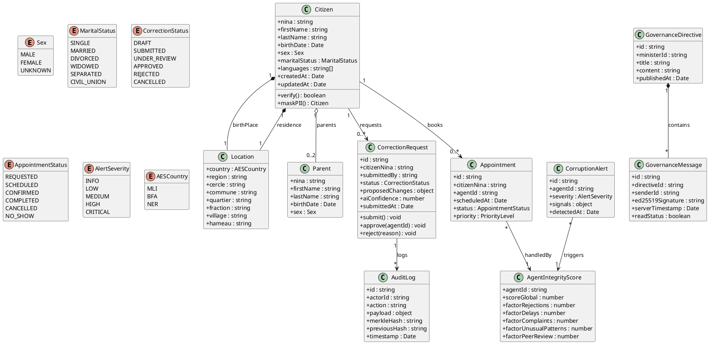

---

### 2 — Diagramme de classes — Couches NestJS

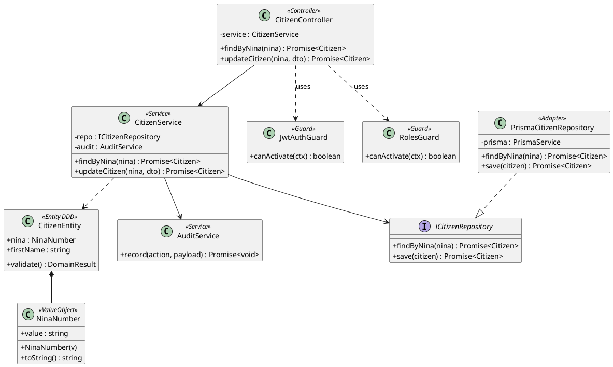

---

### 3 — Diagramme de classes — Packages partagés

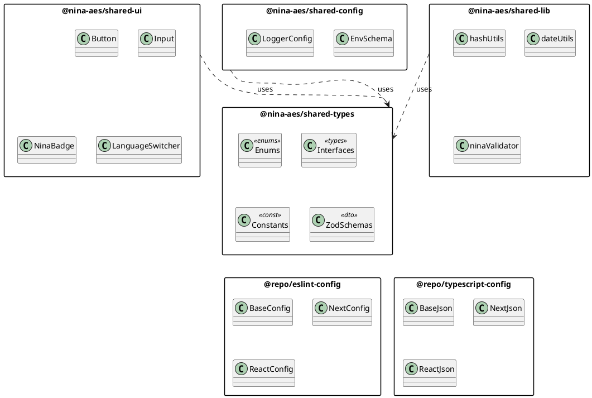

---

### 4 — Diagramme d'objets

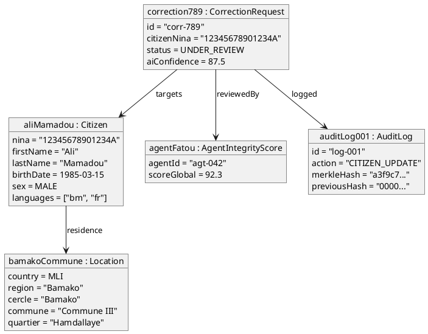

---

### 5 — Diagramme de composants — Global

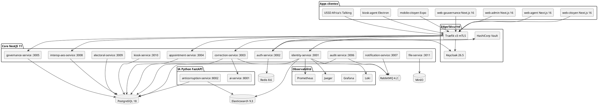

---

### 6 — Diagramme de composants — AI Service

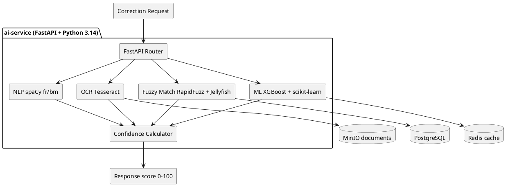

---

### 7 — Diagramme de composants — Auth Service

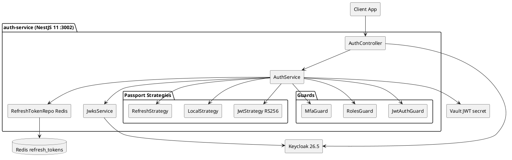

---

### 8 — Diagramme de déploiement — Production K3s

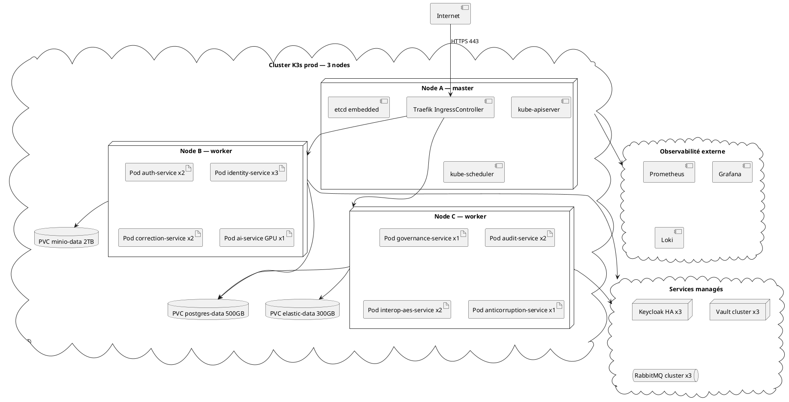

---

### 9 — Diagramme de déploiement — Dev

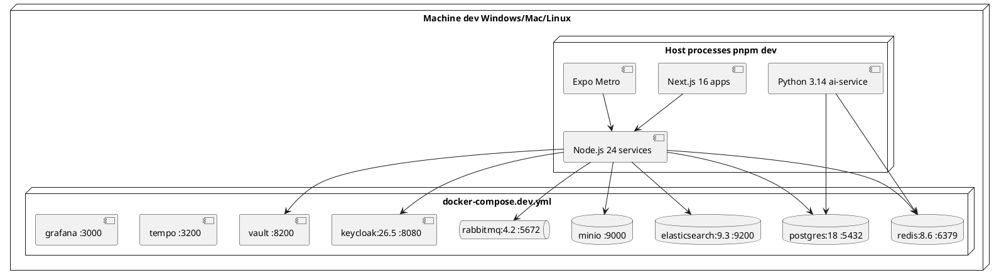

---

### 10 — Diagramme de packages — Monorepo

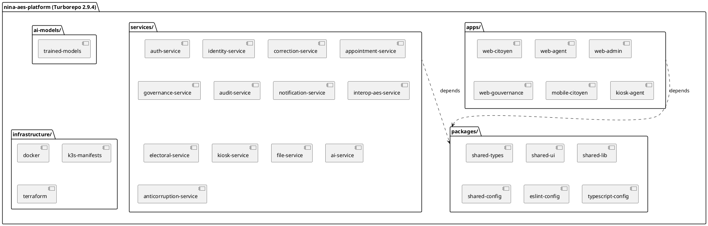

---

### 11 — Diagramme de structure composite

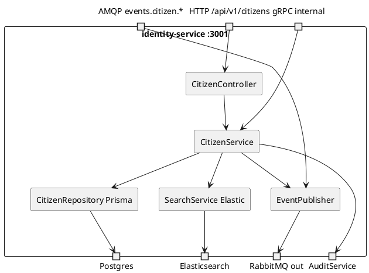

---

### 12 — Diagramme de profil

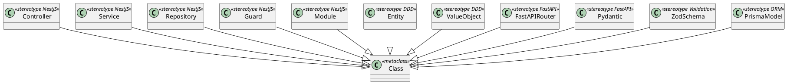

---

## II. UML COMPORTEMENTAUX

### 13 — Use case — Citoyen

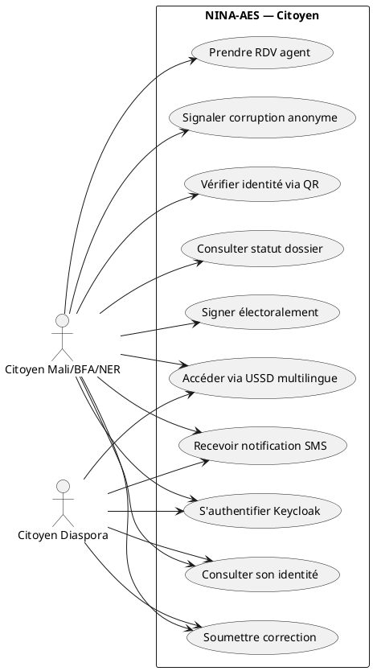

---

### 14 — Use case — Agent, Superviseur, Admin, Auditeur

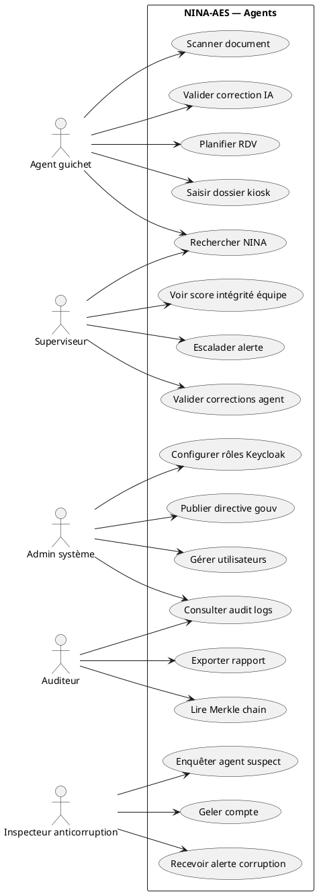

---

### 15 — Use case — Interop AES

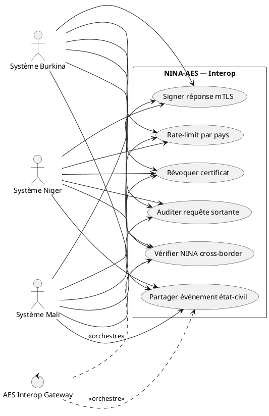

---

### 16 — Activité — Correction identité

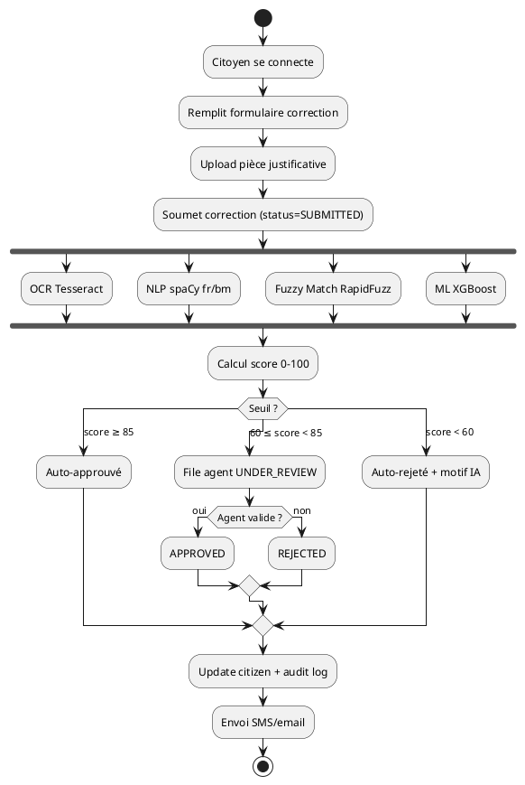

---

### 17 — Activité — Interop cross-border

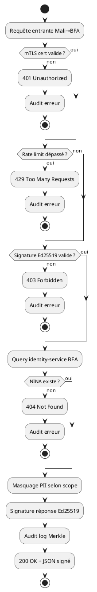

---

### 18 — Activité — USSD

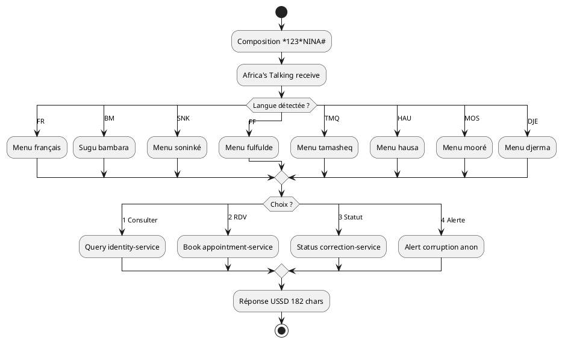

---

### 19 — État — CorrectionRequest

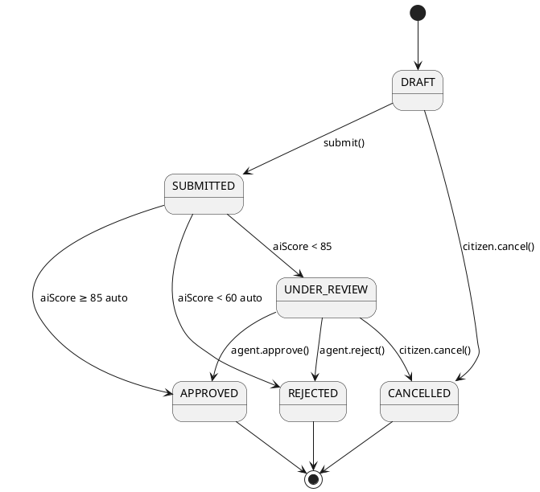

---

### 20 — État — Appointment

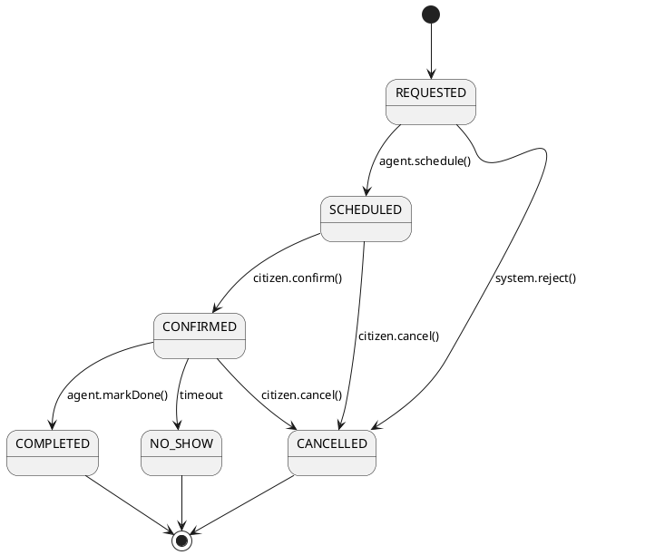

---

### 21 — État — GovernanceDirective

```plantuml
@startuml
[*] --> DRAFT
DRAFT --> PUBLISHED : minister.publish()
PUBLISHED --> IN_PROGRESS : recipient.acknowledge()
IN_PROGRESS --> ESCALATED : deadline exceeded
IN_PROGRESS --> CLOSED : task.complete()
ESCALATED --> CLOSED : superior.resolve()
CLOSED --> ARCHIVED : after 90d
ARCHIVED --> [*]
@enduml
```

---

### 22 — État — CorruptionAlert

```plantuml
@startuml
[*] --> DETECTED
DETECTED --> TRIAGED : inspector.assigns()
TRIAGED --> INVESTIGATING : inspector.open()
INVESTIGATING --> EVIDENCE_COLLECTED : add evidences
EVIDENCE_COLLECTED --> CONFIRMED : prove()
EVIDENCE_COLLECTED --> DISMISSED : not enough
CONFIRMED --> ACCOUNT_FROZEN : suspend agent
CONFIRMED --> LEGAL_ESCALATION : criminal level
ACCOUNT_FROZEN --> CLOSED
LEGAL_ESCALATION --> CLOSED
DISMISSED --> CLOSED
CLOSED --> [*]
@enduml
```

---

### 23 — État — Cycle de vie JWT

```plantuml
@startuml
[*] --> ISSUED : Keycloak issues RS256
ISSUED --> ACTIVE : client receives
ACTIVE --> VALIDATED : guard checks sig+exp
VALIDATED --> ACTIVE : success
ACTIVE --> EXPIRED : exp time reached
EXPIRED --> REFRESHED : refresh_token used
REFRESHED --> ACTIVE
ACTIVE --> REVOKED : admin.revoke()
EXPIRED --> BLACKLISTED : after grace
REVOKED --> [*]
BLACKLISTED --> [*]
@enduml
```

---

## III. UML INTERACTIONS

### 24 — Séquence — Login Keycloak

```plantuml
@startuml
actor "Citoyen" as User
participant "web-citoyen" as Web
participant "auth-service :3002" as Auth
participant "Keycloak 26.5" as KC
database "Redis" as Redis
control "Vault" as Vault

User -> Web : Click "Se connecter"
Web -> KC : OIDC /auth?response_type=code
KC --> User : Formulaire login
User -> KC : email+pwd+MFA
KC --> Web : redirect?code=XYZ
Web -> Auth : POST /auth/token {code}
Auth -> KC : POST /token {code, client_secret}
KC --> Auth : {id_token, access_token RS256, refresh_token}
Auth -> Vault : get JWT public key
Vault --> Auth : pubKey
Auth -> Auth : verify RS256 signature
Auth -> Redis : SET refresh:userId TTL=7d
Auth --> Web : {access_token, expires_in=900}
Web -> Web : store in httpOnly cookie
Web --> User : Dashboard
@enduml
```

---

### 25 — Séquence — Recherche NINA

```plantuml
@startuml
actor "Agent" as Agent
participant "web-agent" as Web
participant "Traefik" as Gw
participant "auth-service" as Auth
participant "identity-service" as Iden
database "PostgreSQL" as Pg
database "Elasticsearch" as Els
participant "audit-service" as Aud

Agent -> Web : Saisit NINA "12345...A"
Web -> Gw : GET /api/v1/citizens/{nina} +Bearer JWT
Gw -> Auth : verify JWT
Auth --> Gw : OK role=AGENT
Gw -> Iden : GET /citizens/{nina}
Iden -> Iden : validate NINA regex
Iden -> Pg : SELECT * WHERE nina=?
Pg --> Iden : Citizen row
Iden -> Els : logAccess {nina, agentId}
Iden -> Aud : emit event access.citizen.read
Aud -> Aud : append Merkle chain
Iden --> Gw : Citizen JSON
Gw --> Web : 200 OK
Web --> Agent : Display fiche
@enduml
```

---

### 26 — Séquence — Scan QR

```plantuml
@startuml
actor "Citizen" as Citizen
participant "mobile-citoyen" as Mobile
participant "Caméra" as Cam
participant "identity-service" as Iden
participant "audit-service" as Aud

Citizen -> Mobile : Ouvre "Vérifier QR"
Mobile -> Cam : request permission
Cam --> Mobile : permission granted
Citizen -> Cam : scan QR code d'un agent
Cam --> Mobile : QR payload signé
Mobile -> Mobile : verify signature Ed25519 locally
Mobile -> Iden : POST /verify-qr {payload}
Iden -> Iden : check QR not expired (<5min)
Iden -> Aud : log verification event
Iden --> Mobile : {valid=true, agentName, office}
Mobile --> Citizen : ✓ Agent vérifié
@enduml
```

---

### 27 — Séquence — Correction IA

```plantuml
@startuml
actor "Citizen" as Citizen
participant "web-citoyen" as Web
participant "correction-service :3003" as Corr
participant "ai-service :8001" as AI
database "MinIO" as Minio
queue "RabbitMQ" as MQ
participant "anticorruption-service" as AntiC

Citizen -> Web : Soumet correction + photo CNI
Web -> Corr : POST /corrections {dto, file}
Corr -> Minio : PUT /corrections/{id}.jpg
Minio --> Corr : object URL
Corr -> AI : POST /analyze {citizenId, objectUrl, proposed}
AI -> AI : OCR Tesseract
AI -> AI : NLP spaCy + langdetect
AI -> AI : Fuzzy match RapidFuzz
AI -> AI : XGBoost confidence
AI --> Corr : {score=87.3, anomalies=[]}
Corr -> Corr : auto-approve (≥85)
Corr -> MQ : publish correction.approved
MQ -> AntiC : consume → check agent pattern
AntiC -> AntiC : if suspicious → create alert
Corr --> Web : {status=APPROVED, score=87.3}
Web --> Citizen : ✓ Correction approuvée
@enduml
```

---

### 28 — Séquence — Interop cross-border

```plantuml
@startuml
participant "Système BFA" as BFA
participant "Gateway Mali" as GwM
participant "auth-service" as Auth
participant "interop-aes-service :3008" as Int
participant "identity-service" as Iden
participant "audit-service" as Aud

BFA -> GwM : POST /aes/v1/verify + mTLS + Ed25519
GwM -> GwM : verify mTLS chain
GwM -> Auth : verify scope=aes.verify
Auth --> GwM : OK
GwM -> Int : forward with origin=BFA
Int -> Int : rate-limit (100/min BFA)
Int -> Int : verify Ed25519 payload
Int -> Iden : GET /citizens/{nina} scope=interop
Iden --> Int : Citizen (PII masked per treaty)
Int -> Int : sign response Ed25519
Int -> Aud : log {origin=BFA, nina, ts}
Aud -> Aud : append Merkle hash
Int --> GwM : {valid=true, maskedData, sig}
GwM --> BFA : 200 OK signed JSON
@enduml
```

---

### 29 — Séquence — USSD

```plantuml
@startuml
actor "Citoyen" as C
participant "Téléphone" as Tel
participant "Africa's Talking" as AT
participant "notification-service" as NotifSvc
participant "identity-service" as Iden

C -> Tel : *123*NINA#
Tel -> AT : USSD request
AT -> NotifSvc : POST /ussd/callback {sessionId, phone, text=""}
NotifSvc -> NotifSvc : detect language from prefix
NotifSvc --> AT : CON 1.Consulter 2.RDV 3.Statut 4.Alerte
AT --> Tel : Display menu (bm)
C -> Tel : "1"
Tel -> AT : text="1"
AT -> NotifSvc : callback text="1"
NotifSvc --> AT : CON Entrez votre NINA
C -> Tel : "12345678901234A"
AT -> NotifSvc : callback text="1*12345678901234A"
NotifSvc -> Iden : GET /citizens/12345678901234A
Iden --> NotifSvc : {firstName, lastName, birthDate}
NotifSvc --> AT : END Ali Mamadou, né 1985-03-15
AT --> Tel : Display response
@enduml
```

---

### 30 — Séquence — Audit Merkle

```plantuml
@startuml
participant "Any microservice" as Svc
queue "RabbitMQ" as MQ
participant "audit-service :3006" as Aud
database "PostgreSQL audit_logs" as Pg

Svc -> MQ : publish event.audit {actor, action, payload}
MQ -> Aud : consume from audit.queue
Aud -> Pg : SELECT merkle_hash FROM audit_logs ORDER BY id DESC LIMIT 1
Pg --> Aud : previousHash
Aud -> Aud : merkleHash = SHA256(previousHash + payload + ts)
Aud -> Pg : INSERT INTO audit_logs {..., prev, merkle}
Pg --> Aud : inserted id
note right of Aud
  Toutes les heures :
  sign chain root Ed25519
end note
Aud -> Pg : UPDATE audit_root SET signed_at, signature
@enduml
```

---

### 31 — Communication — Vue d'ensemble

```plantuml
@startuml
object "Citoyen" as C
object "web-citoyen" as W
object "auth-service" as A
object "identity-service" as I
object "correction-service" as Co
object "ai-service" as AI
object "audit-service" as Au
object "RabbitMQ" as MQ

C --> W : 1 : login()
W --> A : 2 : authenticate()
A --> C : 3 : JWT token
C --> W : 4 : submitCorrection()
W --> Co : 5 : POST /corrections
Co --> AI : 6 : analyze()
AI --> Co : 7 : score
Co --> MQ : 8 : publish event
MQ --> Au : 9 : consume → Merkle
Co --> I : 10 : update citizen
I --> Au : 11 : audit log
@enduml
```

---

### 32 — Timing

```plantuml
@startuml
robust "Réseau" as R
robust "Backend NestJS" as B
robust "IA Python" as A
robust "Persistance" as P
robust "Notification" as N

@0
R is Upload
B is Idle
A is Idle
P is Idle
N is Idle

@400
R is Transfert
B is Validation
A is Idle

@600
B is Routing
A is OCR

@800
R is Idle
A is NLP

@1100
A is Fuzzy

@1400
A is ML

@1500
A is Scoring

@1520
A is Idle
P is UpdatePg

@1570
P is IndexEls

@1670
P is PublishMQ

@1700
P is Idle
N is SendSMS

@2300
N is Idle
@enduml
```

---

## IV. BONUS — SCHÉMAS ADDITIONNELS

### 33 — ER — Identité

```plantuml
@startuml
!define PK(x) <b>x</b>
!define FK(x) <i>x</i>
hide circle
skinparam linetype ortho

entity "CITIZEN" as cit {
  PK(nina) : string
  --
  firstName : string
  lastName : string
  birthDate : date
  sex : enum
  maritalStatus : enum
  FK(birthPlaceId) : uuid
  FK(residenceId) : uuid
  languages : string[]
  createdAt : datetime
}

entity "LOCATION" as loc {
  PK(id) : uuid
  --
  country : enum
  region : string
  cercle : string
  commune : string
  quartier : string
  fraction : string
  village : string
  hameau : string
}

entity "CITIZEN_PARENT" as cp {
  FK(citizenNina) : string
  parentNina : string
  relation : enum
}

entity "CORRECTION_REQUEST" as corr {
  PK(id) : uuid
  --
  FK(citizenNina) : string
  submittedBy : string
  status : enum
  proposedChanges : jsonb
  aiConfidence : float
  submittedAt : datetime
}

entity "APPOINTMENT" as appt {
  PK(id) : uuid
  --
  FK(citizenNina) : string
  FK(agentId) : string
  scheduledAt : datetime
  status : enum
  vulnerabilities : enum[]
  priority : enum
}

entity "AGENT" as agt {
  PK(id) : string
  --
  keycloakSub : string
  office : string
}

entity "INTEGRITY_SCORE" as isc {
  PK(agentId) : string
  --
  scoreGlobal : float
  factorRejections : float
  factorDelays : float
  factorComplaints : float
  factorUnusualPatterns : float
  factorPeerReview : float
}

entity "CORRUPTION_ALERT" as alrt {
  PK(id) : uuid
  --
  FK(agentId) : string
  severity : enum
  signals : jsonb
  detectedAt : datetime
}

entity "AUDIT_LOG" as aud {
  PK(id) : uuid
  --
  actorId : string
  action : string
  payload : jsonb
  merkleHash : string
  previousHash : string
  timestamp : datetime
}

cit ||--o{ cp
cit ||--|| loc : birthPlace
cit ||--|| loc : residence
cit ||--o{ corr
cit ||--o{ appt
agt ||--o{ appt
agt ||--|| isc
agt ||--o{ alrt
corr ||--o{ aud
@enduml
```

---

### 34 — ER — Audit

```plantuml
@startuml
hide circle
skinparam linetype ortho

entity "AUDIT_LOG" as al {
  PK : uuid id
  --
  actorId : string
  action : string
  payload : jsonb
  UK merkleHash : string
  previousHash : string
  timestamp : datetime
}

entity "AUDIT_ROOT" as ar {
  PK : uuid id
  --
  chainRootHash : string
  signedAt : datetime
  ed25519Signature : string
  logCountCovered : int
}

al ||--o| ar : anchored_to
@enduml
```

---

### 35 — Activité — User journey

```plantuml
@startuml
start
partition "Découverte" {
  :Entend parler via radio rurale;
  :Se rend au cyber du village;
}
partition "USSD" {
  :Compose *123*NINA#;
  :Choisit bambara;
  :Consulte son NINA;
}
partition "Web citoyen" {
  :Se connecte via mobile;
  :Scanne sa CNI;
  :Soumet correction;
}
partition "Attente IA" {
  :Reçoit score 87 auto-approuvé;
  :SMS de confirmation;
}
partition "Agent" {
  :Retire duplicata au bureau;
  :Scanne QR de l'agent;
  :Confirme identité;
}
stop
@enduml
```

---

### 36 — Gantt — Phases

```plantuml
@startgantt
project starts 2026-04-01

-- P0 Bloc A — NINA Mali --
[Setup monorepo] lasts 30 days
[Infra Docker + K3s] lasts 20 days
[Infra Docker + K3s] starts at [Setup monorepo]'s end
[Auth Keycloak] lasts 25 days
[Auth Keycloak] starts at [Infra Docker + K3s]'s end
[identity-service] lasts 40 days
[identity-service] starts at [Infra Docker + K3s]'s end
[correction-service + IA] lasts 45 days
[correction-service + IA] starts at [identity-service]'s end
[Web citoyen/agent] lasts 50 days
[Web citoyen/agent] starts at [identity-service]'s end
[Mobile Expo] lasts 30 days
[Mobile Expo] starts at [Web citoyen/agent]'s end
[USSD 8 langues] lasts 35 days
[USSD 8 langues] starts at [identity-service]'s end

-- P1 Bloc B — Interop AES --
[interop-aes-service] lasts 40 days
[interop-aes-service] starts at [correction-service + IA]'s end
[mTLS + Ed25519 gateway] lasts 20 days
[mTLS + Ed25519 gateway] starts at [interop-aes-service]'s end
[Tests cross-border] lasts 25 days
[Tests cross-border] starts at [mTLS + Ed25519 gateway]'s end

-- P1 Bloc C — Gouvernance --
[governance-service] lasts 35 days
[governance-service] starts at [correction-service + IA]'s end
[web-gouvernance] lasts 30 days
[web-gouvernance] starts at [governance-service]'s end
[Directives signées] lasts 20 days
[Directives signées] starts at [web-gouvernance]'s end

-- P2 Bloc D — SIGAC --
[anticorruption-service] lasts 45 days
[anticorruption-service] starts at [Tests cross-border]'s end
[Score intégrité agents] lasts 30 days
[Score intégrité agents] starts at [anticorruption-service]'s end
[Alertes ML] lasts 25 days
[Alertes ML] starts at [Score intégrité agents]'s end

-- P2 Bloc E — Kiosk --
[kiosk-service] lasts 25 days
[kiosk-service] starts at [Tests cross-border]'s end
[Electron app] lasts 30 days
[Electron app] starts at [kiosk-service]'s end

-- P3 Bloc F — Biométrie --
[Empreintes digitales] lasts 50 days
[Empreintes digitales] starts at [Alertes ML]'s end
[Reconnaissance faciale] lasts 40 days
[Reconnaissance faciale] starts at [Empreintes digitales]'s end
@endgantt
```

---

### 37 — Mindmap

```plantuml
@startmindmap
* NINA-AES Platform
** Identité
*** Citoyens
**** NINA 14 chiffres + lettre
**** Localisation hiérarchique
**** Multi-langues
*** Parents
*** Historique
** Corrections
*** IA auto-approve
**** OCR Tesseract
**** NLP spaCy
**** Fuzzy RapidFuzz
**** ML XGBoost
*** Validation agent
*** Seuils 85/60
** Gouvernance
*** Directives ministères
*** Messages signés Ed25519
*** Escalades
** Anticorruption
*** Score agent 5 facteurs
*** Alertes temps réel
*** Merkle chain immutable
** Interop AES
*** Mali
*** Burkina Faso
*** Niger
*** mTLS + Ed25519
** Accessibilité
*** USSD 8 langues
**** Français
**** Bambara
**** Soninké
**** Fulfulde
**** Tamasheq
**** Haoussa
**** Mooré
**** Djerma
*** SMS
*** Kiosk agent
*** Mobile offline
** Sécurité
*** Keycloak OIDC
*** JWT RS256
*** Vault secrets
*** Argon2id
*** Audit Merkle
@endmindmap
```

---

### 38 — Work Breakdown (Jalons)

```plantuml
@startwbs
* NINA-AES Platform
** 2026 Q2 — Démarrage
*** Monorepo Turborepo
*** Docker dev
*** ADR-001..013
** 2026 Q3 — Core services
*** identity-service MVP
*** auth-service Keycloak
*** Web citoyen alpha
** 2026 Q4 — Release P0 Bloc A
*** Correction IA v1
*** USSD 8 langues
*** Mobile beta
** 2027 Q1 — Release P1 Blocs B+C
*** Interop AES mTLS
*** Gouvernance ministères
** 2027 Q2 — Release P2 Blocs D+E
*** SIGAC anticorruption
*** Kiosk Electron
** 2027 Q3 — Release P3 Bloc F
*** Biométrie empreintes
*** Reconnaissance faciale
** 2027 Q4 — Production stable
*** Audit externe
*** Certification ISO
@endwbs
```

---

### 39 — Composants — Vue cloud

```plantuml
@startuml
skinparam componentStyle rectangle

cloud "Edge" {
  [Traefik] as tr
  [Keycloak] as kc
}

cloud "Core NestJS" {
  [auth-service] as auth
  [identity-service] as iden
  [correction-service] as corr
  [interop-aes-service] as int
}

cloud "IA FastAPI" {
  [ai-service] as ai
  [anticorruption-service] as anti
}

cloud "Stockage" {
  database "PostgreSQL" as pg
  database "Redis" as rds
  database "Elasticsearch" as els
  database "MinIO" as minio
}

tr --> auth
tr --> iden
tr --> corr
tr --> int
auth --> kc
auth --> rds
iden --> pg
iden --> els
corr --> ai
corr --> pg
corr --> minio
anti --> pg
anti --> els
@enduml
```

---

### 40 — SysML Requirement

```plantuml
@startuml
skinparam classAttributeIconSize 0

class "SR-001 NINA format" as SR1 <<requirement>> {
  id = "SR-001"
  text = "NINA 14 chiffres + 1 lettre, unique"
  risk = high
  verifymethod = test
}

class "SR-002 USSD 8 langues" as SR2 <<requirement>> {
  id = "SR-002"
  risk = medium
  verifymethod = demonstration
}

class "SR-003 Auto-approve ≥85" as SR3 <<requirement>> {
  id = "SR-003"
  risk = high
  verifymethod = test
}

class "SR-004 mTLS + Ed25519" as SR4 <<requirement>> {
  id = "SR-004"
  risk = high
  verifymethod = inspection
}

class "SR-005 Merkle chain" as SR5 <<requirement>> {
  id = "SR-005"
  risk = high
  verifymethod = analysis
}

class "FR-NINA-01 Recherche" as FR1 <<functionalRequirement>> {
  id = "FR-NINA-01"
  risk = low
}

class "PR-001 Latence <500ms p95" as PR1 <<performanceRequirement>> {
  id = "PR-001"
  risk = medium
}

class "IdentityService" as IS <<block>>
class "AIService" as AI <<block>>
class "InteropService" as IntS <<block>>
class "AuditService" as AS <<block>>

IS ..> SR1 : <<satisfies>>
IS ..> FR1 : <<satisfies>>
IS ..> PR1 : <<satisfies>>
AI ..> SR3 : <<satisfies>>
IntS ..> SR4 : <<satisfies>>
AS ..> SR5 : <<satisfies>>
FR1 ..> SR1 : <<deriveReqt>>
@enduml
```

---

## Notes

- **Exécution** :
  - En ligne : coller chaque bloc (y compris `@startuml`/`@enduml`) sur
    [plantuml.com/plantuml](https://www.plantuml.com/plantuml).
  - En local : installer `plantuml.jar` + Graphviz, puis `java -jar plantuml.jar diagramme.puml`.
  - VS Code : extension "PlantUML" de jebbs — rendu à la volée avec `Alt+D`.
- **Particularités PlantUML** :
  - Supporte nativement **tous les 14 diagrammes UML 2.5** (contrairement à Mermaid).
  - Syntaxes dédiées : `@startgantt`, `@startmindmap`, `@startwbs`, `@startyaml`, `@startjson`,
    `@startnwdiag`.
  - Le diagramme de timing (#32) utilise `robust`/`concise` avec la syntaxe `@<temps>`.
  - Le diagramme de communication (#31) utilise `object` + flèches numérotées (`1 :`, `2 :`, ...).
- **Voir aussi** : [`99-DIAGRAMMES-MERMAID.md`](./99-DIAGRAMMES-MERMAID.md) pour la version Mermaid
  (exécutable sur [mermaid.live](https://mermaid.live)).
