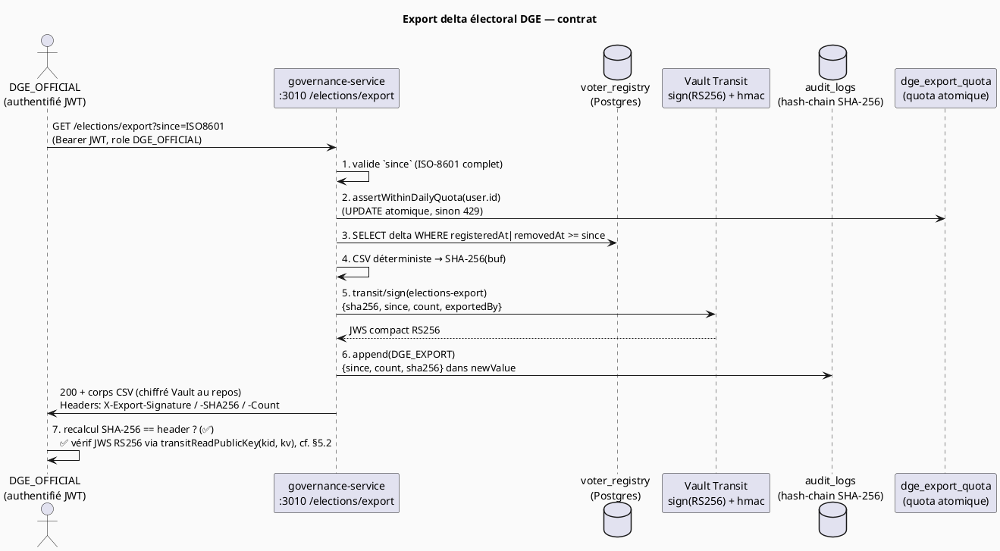

# ELECTIONS-EXPORT-CONTRACT — Contrat technique d'export du fichier électoral vers la DGE

> **Statut** : contrat normatif (référencé par `docs/22-BLOC-C-MODULES-GOUVERNEMENTAUX.md` §7).
> **Périmètre** : export du **delta** du registre électoral (`voter_registry`) depuis la dernière
> extraction, du `governance-service` (port 3010, module Élections) vers la **DGE** (Délégation
> Générale aux Élections). **Public** : intégrateur DGE (consommateur), ingénieur
> `governance-service` (producteur), auditeur / DPO, OCLEI. **Canon de sécurité** : aligné sur
> ADR-007 (audit hash-chain SHA-256), ADR-022 (scope modules gouvernementaux), ADR-026 / ADR-034
> (Vault Transit ne supporte PAS Ed25519 → signature **RS256**).
>
> **Marqueurs d'honnêteté** employés dans ce document :
>
> - ✅ **implémenté / spécifié dans le code de référence** (doc 22, services existants).
> - ⏳ **conçu, Phase 2** — décidé mais pas encore livré dans le dépôt.
> - ⛔ **prérequis bloquant** — sans cet élément, le flux ne fonctionne pas.
>
> **✅ AS-BUILT (mise à jour) — les prérequis jadis ⛔/⏳ sont DÉSORMAIS LIVRÉS** dans
> `governance-service` + `@nina-aes/vault-client` (les marqueurs ⛔/⏳ résiduels ci-dessous sont
> conservés pour l'historique mais NE bloquent plus) :
>
> - **`transitHmac(keyName, payloadBase64, { algorithm })`** — pseudonyme HMAC calculé DANS Vault
>   (`PseudonymService`). ✅
> - **`JwsSigner`** (`src/crypto/jws.signer.ts`) — signe le **manifeste** d'export (RS256/pkcs1v15)
>   et compose un JWS RFC 7515 ; l'en-tête porte un champ **`kv`** épinglant la **version** de la
>   clé `elections-export` → la vérification DGE résout la bonne clé publique **après rotation**. ✅
> - **`transitReadPublicKey(keyName, version?)`** — extrait `keys[v].public_key` (PEM) ⇒ la **DGE
>   vérifie le JWS hors Vault**, à la version épinglée. ✅
>
> Restent **⏳ Phase 2** : le **DPA** juridique, l'**ancrage tiers** de l'audit, l'option Parquet,
> le chiffrement asymétrique de livraison, et les endpoints citoyens `/voter/me`.

---

## 1. POURQUOI ce contrat existe (avant le COMMENT)

La DGE a besoin, à intervalles réguliers, de la **liste des électeurs** pour tenir à jour ses listes
de vote. Le registre `voter_registry` du `governance-service` est la **source d'autorité** (chaque
citoyen y est inscrit automatiquement à 18 ans, cf. doc 22 §4.4). Trois tensions structurent ce
contrat :

1. **Minimisation vs utilité.** La DGE a besoin d'une clé stable pour suivre un électeur d'un export
   à l'autre (inscription → transfert → retrait), mais **n'a pas besoin du NINA en clair**. On
   transmet donc un **pseudonyme** (`pseudonymousId`), jamais le NINA ni le N°CNI. Voir §4.

2. **Intégrité vérifiable de bout en bout.** Un fichier électoral altéré (ligne supprimée,
   pseudonyme falsifié) pourrait fausser une élection. La DGE DOIT pouvoir **prouver
   cryptographiquement** que le fichier reçu est exactement celui produit par le
   `governance-service` et n'a pas été modifié en transit. D'où **signature RS256 + SHA-256**
   transmis dans de **vrais en-têtes HTTP**. Voir §5. **✅ Mise à jour :** le volet **intégrité**
   (SHA-256) ET le volet **authenticité par signature** (vérification du JWS via clé publique
   extraite par `transitReadPublicKey(kid, kv)`) sont **livrés** (cf. §5.2) — la preuve
   cryptographique **complète** est **opérationnelle**, et **robuste à la rotation** de la clé
   `elections-export` grâce à l'épinglage de version `kv`.

3. **Anti-exfiltration.** Un compte `DGE_OFFICIAL` **compromis** est le pire scénario : il a un
   accès légitime à l'export. Il ne doit PAS pouvoir **siphonner tout le registre** (11 M de lignes)
   en boucle. D'où **rate-limit + quota par compte + journalisation de chaque export + anti-IDOR**.
   Voir §6, §7, §8.

Le fil rouge : **un export est un événement engageant, daté, signé, audité et borné**, pas un simple
`SELECT *`.

---

## 1.bis Base légale & finalité (transfert de données à caractère personnel)

Cet export transfère des données à caractère personnel d'environ **11 M de personnes** d'un
organisme (`governance-service`) vers un organisme d'État externe (**DGE**). Un tel transfert exige
un **fondement juridique explicite**, une **finalité limitée** et un **accord de partage de
données**. Le tableau ci-dessous formalise ce socle dans le cadre RGPD-like du projet (cf. canon de
sécurité : base légale **RGPD-like**, **PAS** de loi 2024-XX non adoptée — on ne cite ici **aucune**
référence législative nationale non vérifiée).

| Dimension                               | Position du contrat                                                                                                                                                                                                                                                                                                  |
| --------------------------------------- | -------------------------------------------------------------------------------------------------------------------------------------------------------------------------------------------------------------------------------------------------------------------------------------------------------------------- |
| **Base légale (RGPD-like)**             | **Mission d'intérêt public** + **obligation légale** de tenue et de mise à jour des **listes électorales** confiée à la DGE. Ce traitement n'est **PAS** fondé sur le consentement (l'inscription électorale est obligatoire et automatique à 18 ans, cf. doc 22 §4.4) ni sur l'intérêt légitime.                    |
| **Finalité (limitée)**                  | **Tenue et mise à jour des listes électorales** par la DGE (inscriptions, transferts, retraits). Tout autre usage (profilage, recoupement non électoral, transmission à un tiers) est **hors finalité** et **interdit**.                                                                                             |
| **Minimisation**                        | Seules les colonnes du §9.2 sont transmises ; **aucune PII directe** (pas de NINA / N°CNI / nom / date de naissance / biométrie, cf. §4.3). Le pseudonyme `pseudonymousId` remplace l'identifiant direct.                                                                                                            |
| **Limitation de conservation**          | La DGE conserve l'export le temps **strictement nécessaire** à la mise à jour des listes électorales, puis le purge (durée de conservation fixée dans l'accord de partage, **alignée sur la durée légale de tenue des listes**, non au-delà). Côté producteur, les artefacts d'export sont chiffrés au repos (§11).  |
| **Accord de partage de données (DPA)**  | ⏳ Un **accord de partage de données DGE ↔ `governance-service`** formalise responsable / sous-traitant, finalité, durée de conservation, mesures de sécurité (RBAC, chiffrement, audit), et obligations de purge. **Référence : à rédiger et à annexer** (Phase 2) — ce contrat technique en est le volet sécurité. |
| **Responsabilité & traçabilité**        | Chaque export est journalisé `DGE_EXPORT` (§8) : la **traçabilité du transfert** (qui / quand / quelle fenêtre / combien de lignes) est une exigence de redevabilité, pas seulement de sécurité.                                                                                                                     |
| **Risque résiduel (ré-identification)** | Documenté en §10 : l'export est pseudonyme mais **linkable** ; mitigations obligatoires (k-anonymité / bruit de Laplace avant tout partage au-delà de la DGE).                                                                                                                                                       |

> **Honnêteté.** Le **DPA formel** (accord de partage de données) et la **durée de conservation
> chiffrée** côté DGE relèvent d'un acte juridico-organisationnel **⏳ à formaliser** : ce document
> technique en pose les exigences de sécurité mais **ne se substitue pas** à l'accord signé entre la
> DGE et l'autorité responsable du `governance-service`.

---

## 2. Vue d'ensemble du flux



---

## 3. Endpoint, méthode, en-têtes

### 3.1 Requête

| Élément      | Valeur                                                                        |
| ------------ | ----------------------------------------------------------------------------- |
| Méthode      | `GET`                                                                         |
| Chemin       | `/elections/export`                                                           |
| Query        | `since` — **timestamp ISO-8601 complet OBLIGATOIRE** (`2026-01-01T00:00:00Z`) |
| Auth         | `Authorization: Bearer <jwt>` — rôle **`DGE_OFFICIAL`** exigé (RBAC)          |
| Rate-limit   | `@Throttle({ dge: { ttl: 3_600_000, limit: 5 } })` — 5 req/h **PAR IP**       |
| Réponse type | `text/csv` (⏳ Parquet en option Phase 2)                                     |
| Disposition  | `attachment; filename="voter-delta-<since>.csv"`                              |

> **Pourquoi `since` doit être un ISO-8601 COMPLET.** Une date sans heure (`2026-01-01`) est parsée
> de façon ambiguë selon le fuseau et fait silencieusement retourner **0 ligne** (piège connu, cf.
> doc 22 §6). Le service rejette toute valeur dont `parseISO(...).getTime()` est `NaN` avec une
> **400 Bad Request**.

### 3.2 En-têtes de réponse (intégrité)

| En-tête HTTP         | Contenu                                         | Rôle                                             |
| -------------------- | ----------------------------------------------- | ------------------------------------------------ |
| `X-Export-Signature` | JWS compact **RS256** (signé via Vault Transit) | Authenticité + non-répudiation du producteur     |
| `X-Export-SHA256`    | `SHA-256(corps CSV)` en hexadécimal             | Intégrité octet-à-octet du fichier               |
| `X-Export-Count`     | Nombre de lignes du delta                       | Contrôle de cohérence grossier (anti-troncature) |

> **⚠️ PIÈGE NestJS — `StreamableFile.setMetadata()` N'EXISTE PAS.** L'API publique de
> `StreamableFile` n'expose que `getStream()`, `getHeaders()` et un constructeur d'options (`type` /
> `disposition` / `length`). Il n'y a **aucune** méthode `setMetadata()`. Les en-têtes d'intégrité
> ci-dessus DOIVENT être posés via `@Res({ passthrough: true })` + `res.setHeader(...)` **avant** de
> retourner le `StreamableFile`. Tout code qui « pose » la signature via `setMetadata()` compile par
> illusion et **plante à l'exécution** (cf. doc 22 §4.4).

---

## 4. Pseudonymisation — HMAC calculé DANS Vault (PAS `SHA-256(NINA+sel)`)

### 4.1 La règle

Le champ d'identité transmis à la DGE est **`pseudonymousId`**. Il est calculé par un **HMAC-SHA256
exécuté DANS Vault** (engine Transit, endpoint `transit/hmac/<key>`), avec une **clé HMAC non
exportable**. La **SEULE valeur secrète** du dispositif est cette clé HMAC Transit.

```ts
/**
 * Génère un pseudonyme électoral STABLE et NON-RÉVERSIBLE hors de Vault.
 *
 * POURQUOI un HMAC Vault et PAS `SHA-256(NINA + sel)` :
 *  - Le NINA a un FORMAT PUBLIC (longueur + structure connues) : l'espace des
 *    entrées est petit. Un `SHA-256(NINA + sel)` calculé localement est
 *    BRUTEFORÇABLE TRIVIALEMENT dès que le sel fuit (un admin DB ou une fuite de
 *    config suffit à reconstruire toute la table NINA → pseudonyme, ré-identifiant
 *    l'électorat entier).
 *  - Avec `transit/hmac`, la clé HMAC est GÉNÉRÉE ET CONSERVÉE PAR VAULT, NON
 *    EXPORTABLE : même un admin DB + le code source ne peuvent PAS recalculer les
 *    pseudonymes hors de Vault. Chaque appel HMAC est lui-même audité par Vault.
 *  - `saltVersion` n'est PAS un sel secret : c'est un TAG DE SÉPARATION DE DOMAINE
 *    PUBLIC (version de contexte), stocké EN CLAIR dans `voter_registry.saltVersion`,
 *    journalisé, et préfixé à l'entrée HMAC. Le faire tourner produit des pseudonymes
 *    différents (rotation sans casser l'historique) ; sa fuite n'affaiblit RIEN tant
 *    que la clé HMAC Transit reste non-exportable.
 */
private async generatePseudonymousId(nina: string, saltVersion: number): Promise<string> {
  // `v<saltVersion>:` = préfixe de séparation de domaine PUBLIC (pas un secret).
  const input = Buffer.from(`v${saltVersion}:${nina}`, 'utf8').toString('base64');

  // POST transit/hmac/elections-pseudonym  { input: <base64>, algorithm: "sha2-256" }
  // → renvoie "vault:v1:<hmac-base64>" ; on strip le préfixe de version Vault.
  const vaultHmac = await this.vault.transitHmac('elections-pseudonym', input, {
    algorithm: 'sha2-256',
  });
  return vaultHmac.replace(/^vault:v\d+:/, '');
}
```

> **✅ Implémenté — `transitHmac()` est livré dans le vault-client.**
> `packages/vault-client/src/index.ts` expose désormais
> `transitHmac(keyName, payloadBase64, { algorithm })` (en sus de
> `transitSign / transitVerify / transitReadPublicKey / transitEncrypt / transitDecrypt / rotateTransitKey`).
> La pseudonymisation `PseudonymService` calcule le `pseudonymousId` DANS Vault (clé non-exportable
> `elections-pseudonym`) — plus aucun blocage.

### 4.2 Le `saltVersion` (sel par-élection versionné, PUBLIC)

| Propriété         | Valeur                                                                              |
| ----------------- | ----------------------------------------------------------------------------------- |
| Nature            | Tag de **séparation de domaine PUBLIC** (PAS un secret)                             |
| Stockage          | `voter_registry.saltVersion` (en clair) + `vault kv elections/salt-meta`            |
| Rôle              | Versionner le contexte HMAC → rotation **sans casser l'historique** des pseudonymes |
| Effet d'une fuite | **Aucun** affaiblissement tant que la clé HMAC Transit reste non-exportable         |

> Ne JAMAIS qualifier `saltVersion` de « sel secret ». Le secret unique est la **clé HMAC Transit
> `elections-pseudonym`**, non exportable.

### 4.3 Ce que l'export NE contient JAMAIS

- ❌ NINA en clair, ❌ N°CNI, ❌ nom / prénom / date de naissance, ❌ données biométriques, ❌ clé
  HMAC ou sel secret (il n'existe pas de « sel secret » ici).
- ✅ Uniquement : `pseudonymousId`, géo administrative, statut, horodatages, `removedReason` (cf. §9
  schéma).

---

## 5. Intégrité du flux — SIGNÉ (RS256) + SHA-256 via en-têtes réels

### 5.1 Côté producteur (`governance-service`) — ✅ implémenté

```ts
// 1) Sérialisation CSV DÉTERMINISTE (ordre de colonnes fixe) + empreinte d'intégrité.
const csv = papaparse.unparse(delta);
const buf = Buffer.from(csv, 'utf8');
const sha256 = crypto.createHash('sha256').update(buf).digest('hex');

// 2) ✅ Signature d'un MANIFESTE JSON incluant le SHA-256, via Vault Transit (RS256 / pkcs1v15).
//    Transit ne supporte PAS Ed25519 (ADR-026 / ADR-034) → RS256.
//    La clé privée `elections-export` reste DANS Vault (non exportable) ;
//    le service ne manipule jamais le secret. L'en-tête JWS porte `kv` (version de
//    clé épinglée) → la DGE vérifie à la bonne version même après rotation.
const jws = await this.signer.sign(
  {
    sha256,
    since: sinceIso,
    count: delta.length,
    exportedBy: req.user.id,
    saltVersion,
    exportedAt,
  },
  'elections-export',
);

// 3) VRAIS en-têtes HTTP (PAS le fantôme setMetadata).
res.setHeader('X-Export-Signature', jws);
res.setHeader('X-Export-SHA256', sha256);
res.setHeader('X-Export-Count', String(delta.length));

// 4) Le corps CSV est streamé via StreamableFile (type/disposition/length ici).
return new StreamableFile(buf, {
  type: 'text/csv',
  disposition: `attachment; filename="voter-delta-${sinceIso}.csv"`,
  length: buf.length,
});
```

> **✅ Implémenté — `JwsSigner` (`src/crypto/jws.signer.ts`).** L'enveloppe `signer.sign(...)`
> ci-dessus s'appuie sur
> `transitSign(keyName, payloadBase64, { signatureAlgorithm: 'pkcs1v15', hashAlgorithm: 'sha2-256' })`
> et assemble le **JWS compact** (en-tête `{ alg: RS256, typ, kid, kv }`, encodage base64url du
> payload, conversion de l'enveloppe Transit `vault:vN:<base64>` → 3ᵉ segment JWS conforme RFC
> 7515). L'en-tête `X-Export-Signature` est **produit et opérationnel**. Le champ `kv` épingle la
> version de la clé `elections-export` utilisée (robustesse à la rotation).

> **Pourquoi signer un manifeste JSON et pas le corps entier.** Le delta peut peser plusieurs Mo ;
> signer un **manifeste JSON court incluant le SHA-256** (`{ sha256, since, count, exportedBy }`)
> est suffisant et borné en coût. Inclure `since`, `count` et `exportedBy` ancre la signature à un
> **export précis** (anti-rejeu d'une signature sur un autre fichier).
>
> **Précision crypto.** Ce n'est PAS le digest brut préhashé qui est signé : RS256 signe l'objet
> **en-tête + payload JWS** (lui-même base64url-encodé puis hashé EN INTERNE par RS256/PKCS1v15).
> L'option `prehashed=true` de `transitSign` **ne s'applique donc PAS ici**, puisque ce que Transit
> reçoit à signer est l'entrée JWS (`base64url(header).base64url(payload)`), pas le SHA-256 du CSV.
> Le `sha256` du CSV est une **donnée transportée à l'intérieur** du payload signé, pas l'entrée de
> signature.

### 5.2 Côté consommateur (DGE) — procédure de vérification

```bash
# 1) Recalculer le SHA-256 du fichier reçu et le comparer à l'en-tête.
sha256sum voter-delta-2026-01-01T00:00:00Z.csv      # → doit == X-Export-SHA256

# 2) ✅ Récupérer la clé PUBLIQUE de la clé Transit `elections-export` À LA VERSION `kv`
#    de l'en-tête JWS (transit/keys/elections-export → keys[kv].public_key, via
#    transitReadPublicKey). Épinglage de version → robuste à la rotation.
# 3) ✅ Vérifier le JWS RS256 (X-Export-Signature) avec cette clé publique.
#    Le `sha256` interne au JWS doit == le SHA-256 recalculé en (1).
# 4) Contrôle de cohérence : nombre de lignes du CSV == X-Export-Count.
```

> **✅ Implémenté — la vérification JWS par clé publique côté DGE est réalisable.** Les étapes **2
> et 3** ci-dessus — **le cœur de la promesse §1.2 (« la DGE DOIT pouvoir prouver
> cryptographiquement »)** — sont livrées : le helper **`transitReadPublicKey(keyName, version?)`**
> de `packages/vault-client/src/index.ts` extrait `keys[<version>].public_key` (PEM) de
> `GET transit/keys/elections-export` ; la version à lire est fournie par le champ **`kv`** de
> l'en-tête JWS (épinglage anti-rotation). La DGE vérifie ainsi **intégrité** (étapes 1 et 4,
> SHA-256
>
> - count) **ET authenticité / non-répudiation** (étapes 2 et 3) — preuve cryptographique de bout en
>   bout opérationnelle. Une publication JWKS reste une option de confort (non requise).

| Écart constaté                          | Décision DGE                             |
| --------------------------------------- | ---------------------------------------- |
| `SHA-256` recalculé ≠ `X-Export-SHA256` | **Rejet** (octet altéré)                 |
| Signature JWS invalide                  | **Rejet** (non authentique / clé fausse) |
| `count` ≠ lignes réelles                | **Rejet** (troncature suspectée)         |
| Tout concordant                         | Export accepté                           |

> **Pourquoi RS256 et pas Ed25519.** Vault Transit **ne supporte PAS Ed25519** (ADR-026 / ADR-034).
> La signature asymétrique disponible côté Transit est RSA (`rsa-4096`, schéma `pkcs1v15`) → JWS
> **RS256**. Ed25519 dans le projet NINA-AES est réservé au **scellement horaire in-process de
> l'audit** (`@noble/ed25519`, doc 09) — un usage différent, hors de Transit.

---

## 6. Anti-IDOR & RBAC

| Contrôle                            | Règle                                                                                                                                                     |
| ----------------------------------- | --------------------------------------------------------------------------------------------------------------------------------------------------------- |
| **RBAC**                            | `@Roles('DGE_OFFICIAL')` — seul ce rôle atteint `/elections/export`                                                                                       |
| **Anti-IDOR (lecture par citoyen)** | Sur les endpoints citoyens (`/voter/me`, ⏳ Phase 2), un citoyen ne lit QUE sa propre ligne : refus si `citizenId !== req.user.id` (`ForbiddenException`) |
| **Acteur = identité authentifiée**  | L'export est attribué à `req.user.id` (UUID JWT vérifié), jamais à une valeur fournie par le client                                                       |

> **POURQUOI l'anti-IDOR ici.** OWASP **A01:2021 — Broken Access Control**. L'`exportedBy` et le
> `userId` d'audit proviennent **toujours** du token vérifié (`req.user.id`), jamais d'un paramètre
> client. Un client ne peut donc pas se faire passer pour un autre `DGE_OFFICIAL` ni masquer son
> identité dans le journal d'export. Le même principe protège les endpoints de consultation
> individuelle (un électeur ne consulte pas la ligne d'un tiers).

---

## 7. Quotas + rate-limit — un compte DGE compromis ne doit pas exfiltrer tout le registre

Deux mécanismes **complémentaires** (et NON interchangeables) :

### 7.1 Rate-limit `@nestjs/throttler` — PAR IP (défense en profondeur)

```ts
// services/governance-service/src/app.module.ts — throttler NOMMÉ `dge`
ThrottlerModule.forRoot([
  { ttl: 60_000, limit: 100 }, // global anonyme
  { name: 'dge', ttl: 3_600_000, limit: 5 }, // 5 exports / h PAR IP
]);
```

> **⚠️ PORTÉE — PAR IP, PAS PAR COMPTE.** Par défaut `@nestjs/throttler` clé sa limite sur `req.ip`
> (`getTracker()`). Aucun override `getTracker()` n'existe dans le dépôt (vérifié). Le throttler
> `dge` limite donc **par IP** : utile contre la **rafale**, mais un compte compromis peut **changer
> d'IP** pour contourner, ou être **faussement bloqué derrière un NAT partagé**. La garantie **PAR
> COMPTE** est portée par le quota applicatif (§7.2). Rendre le throttler per-compte exigerait un
> `ThrottlerGuard` dérivé (`getTracker(req) => req.user.id`) — ⏳ **Phase 2**.

> **⚠️ PIÈGE — throttler NOMMÉ doit être DÉCLARÉ.** `@Throttle({ dge: … })` n'a d'effet que si le
> nom `dge` est enregistré dans `ThrottlerModule.forRoot([...])`. Sinon le décorateur pointe vers un
> nom inexistant et **ne limite RIEN silencieusement** (contrôle annoncé mais creux).

### 7.2 Quota applicatif PAR COMPTE — ATOMIQUE (la vraie garantie)

```ts
// Garantit « N exports / jour PAR COMPTE DGE ». DOIT être atomique : réservation
// AVANT de streamer, jamais un read-then-act dérivé d'un comptage `audit_logs`
// (sinon TOCTOU : deux exports concurrents passent le check avant qu'aucun n'écrive).
await this.exportQuota.assertWithinDailyQuota(req.user.id);
```

Implémentation atomique attendue (au choix) :

```sql
-- Option A — UPDATE conditionnel atomique (échec = 0 ligne ⇒ 429 Too Many Requests).
UPDATE dge_export_quota
   SET count = count + 1
 WHERE account_id = :id AND day = :today AND count < :limit
 RETURNING count;
```

ou un `INCR` Redis avec TTL journalier comparé au plafond.

> **POURQUOI atomique.** Un `SELECT count(*) FROM audit_logs WHERE … ; if (count < limit) export()`
> est un **TOCTOU** : deux requêtes concurrentes lisent toutes deux `count = 4` avant qu'aucune
> n'écrive, et le cap de 5 est défait. La ligne `DGE_EXPORT` dans `audit_logs` (§8) est une **preuve
> a posteriori**, **PAS** la source de comptage du quota.

| Mécanisme                | Clé           | Garantit                            | Limite                           |
| ------------------------ | ------------- | ----------------------------------- | -------------------------------- |
| `@Throttle({ dge })`     | IP            | Anti-rafale (défense en profondeur) | Contournable par changement d'IP |
| `assertWithinDailyQuota` | `req.user.id` | **Cap réel par compte DGE**         | Doit être ATOMIQUE (anti-TOCTOU) |

---

## 8. Audit — chaque export est journalisé (hash-chain SHA-256)

```ts
// JOURNALISATION OBLIGATOIRE : c'est ce qui rend un compte DGE compromis DÉTECTABLE.
// Chaque exfiltration laisse une trace immuable (qui / quand / fenêtre / nb lignes / IP).
await this.auditService.append({
  action: 'DGE_EXPORT',
  entityType: 'VoterRegistry',
  entityId: `export:${sinceIso}`,
  userId: req.user.id, // UUID réel du DGE_OFFICIAL (@IsUUID())
  ipAddress: req.ip,
  newValue: { since: sinceIso, count: delta.length, sha256 },
});
```

> **⚠️ FORME DU DTO — conforme au contrat d'ingestion réel.** Le DTO d'ingestion
> (`services/audit-service/src/audit/dtos/ingest.dto.ts`) accepte uniquement :
> `action, entityType, entityId, userId (@IsUUID), actorType, oldValue, newValue, ipAddress, correlationId, sourceEventId, occurredAt`.
> **Il n'y a PAS de champ `payload`, `resourceType`, `resourceId`, ni `actorId`.** Le
> `ValidationPipe` global de l'audit-service est
> `{ whitelist: true, forbidNonWhitelisted: true, transform: true }` (vérifié, `main.ts`) : toute
> clé hors contrat déclenche une **400 Bad Request** — l'événement n'est **NI persisté NI chaîné**,
> donc le contrôle « journaliser chaque export » serait **annoncé mais creux**. On range la
> métadonnée d'exfiltration EXIGÉE (since / count / sha256) dans **`newValue`** — seul champ JSON
> libre accepté ET hashé par `computePayloadHash` (`chain.ts`).

> **Nature de l'audit (ADR-007 / doc 09).** L'audit est une **hash-chain SHA-256 LINÉAIRE**, PAS un
> arbre de Merkle. La colonne `merkleHash` côté audit-service est un nom **historique** ; la
> structure réelle reste une chaîne (`previousHash → hash`). Le scellement horaire est **Ed25519
> in-process** (`@noble/ed25519`, doc 09). La chaîne n'est **inviolable que si sa racine est ancrée
> chez un tiers** (registre signé OCLEI / Vérificateur Général) — cet **ancrage est conçu, non
> encore implémenté** (⏳). Ne JAMAIS qualifier l'audit d'« inaltérable » sans cette réserve.

| Champ audité (`DGE_EXPORT`)   | Source                      | Pourquoi                                             |
| ----------------------------- | --------------------------- | ---------------------------------------------------- |
| Acteur (`userId`)             | `req.user.id` (JWT vérifié) | Qui a exporté (non répudiable)                       |
| Horodatage                    | chaîne (`occurredAt`/now)   | Quand                                                |
| Fenêtre (`newValue.since`)    | query validée               | Quel périmètre temporel                              |
| Volume (`newValue.count`)     | `delta.length`              | Combien de lignes (détecte un export massif anormal) |
| Empreinte (`newValue.sha256`) | digest du corps             | Quel fichier exact (corrélable au flux signé)        |
| IP (`ipAddress`)              | `req.ip`                    | D'où                                                 |

---

## 9. Format & schéma de l'export

### 9.1 Sélection (delta)

```ts
const delta = await this.prisma.voterRegistry.findMany({
  where: { OR: [{ registeredAt: { gte: since } }, { removedAt: { gte: since } }] },
  select: {
    pseudonymousId: true,
    region: true,
    cercle: true,
    commune: true,
    status: true,
    registeredAt: true,
    removedAt: true,
    removedReason: true,
  },
});
```

### 9.2 Colonnes du fichier CSV (ordre déterministe)

| Colonne          | Type / valeurs                                                                  | PII ?        | Note                                             |
| ---------------- | ------------------------------------------------------------------------------- | ------------ | ------------------------------------------------ |
| `pseudonymousId` | HMAC-SHA256 base64 (Vault)                                                      | pseudo       | **STABLE entre exports** (linkable, cf. §10)     |
| `region`         | texte                                                                           | non          | Géo administrative                               |
| `cercle`         | texte                                                                           | non          | Géo administrative                               |
| `commune`        | texte (nullable)                                                                | **fine**     | Géo fine → risque de ré-identification (cf. §10) |
| `status`         | `ACTIVE` \| `REMOVED_DECEASED` \| `REMOVED_RELOCATED` \| `REMOVED_DISQUALIFIED` | non          | Statut électoral                                 |
| `registeredAt`   | ISO-8601                                                                        | indir.       | Horodatage exact (cf. §10)                       |
| `removedAt`      | ISO-8601 (nullable)                                                             | indir.       | Horodatage exact (cf. §10)                       |
| `removedReason`  | texte en clair (« décès », « déménagement étranger », « déchéance »)            | **sensible** | Motif → risque de ré-identification (cf. §10)    |

### 9.3 Validation JSON Schema du manifeste d'export (⏳ Phase 2)

```jsonc
// Manifeste accompagnant le CSV (conçu, Phase 2) — facilite la vérif côté DGE.
{
  "$schema": "https://json-schema.org/draft/2020-12/schema",
  "type": "object",
  "required": ["since", "count", "sha256", "saltVersion", "exportedAt"],
  "properties": {
    "since": { "type": "string", "format": "date-time" },
    "count": { "type": "integer", "minimum": 0 },
    "sha256": { "type": "string", "pattern": "^[0-9a-f]{64}$" },
    "saltVersion": { "type": "integer", "minimum": 1 },
    "exportedAt": { "type": "string", "format": "date-time" },
  },
}
```

---

## 10. ⚠️ AVERTISSEMENT RÉ-IDENTIFICATION — l'export est pseudonyme mais LINKABLE

> Repris **à l'identique** depuis `docs/22-BLOC-C-MODULES-GOUVERNEMENTAUX.md` §4.4 (exigence §7 de
> doc 22).

Le `pseudonymousId` est **STABLE** d'un export à l'autre (même clé Transit + même `saltVersion` ⇒
valeur identique). C'est **délibéré** : la DGE doit pouvoir corréler un retrait avec l'inscription
correspondante entre deux deltas. **Conséquence de sécurité** : l'export n'offre PAS l'unlinkabilité
entre exports. Un `DGE_OFFICIAL` compromis ou curieux peut **suivre un individu précis** à travers
les deltas (attaque par linkage), d'autant que chaque ligne porte une **géo fine** (`commune`), des
**horodatages exacts** (`registeredAt`/`removedAt`) et un `removedReason` **en clair** (« décès », «
déménagement étranger », « déchéance »). En **commune peu peuplée**, la combinaison
`commune + horodatages + removedReason` rend la ré-identification **triviale**, ce qui touche
directement la protection des personnes (y compris profils sensibles / lanceurs d'alerte).

**Mitigations OBLIGATOIRES** (pas optionnelles) :

- L'export DGE est lui-même **classifié et accès-contrôlé** (RBAC `DGE_OFFICIAL` + chiffrement au
  repos + journalisation `DGE_EXPORT`) : il ne quitte JAMAIS le périmètre DGE en clair.
- Avant **tout partage externe** (au-delà de la DGE), appliquer une **k-anonymité** (regroupement
  géo : remonter `commune` → `cercle` sous un seuil de population) **ou** du **bruit de Laplace**
  (anonymisation différentielle). Tant que ce traitement n'est pas appliqué, l'export est réputé
  **ré-identifiant** et ne doit pas franchir la frontière DGE.

---

## 11. Chiffrement Vault de la livraison

| Surface                               | Protection                                                                                                                                                                                                    |
| ------------------------------------- | ------------------------------------------------------------------------------------------------------------------------------------------------------------------------------------------------------------- |
| **Transport**                         | TLS (HTTPS) bout-à-bout entre DGE et `governance-service`                                                                                                                                                     |
| **Authenticité du flux**              | JWS **RS256** via Vault Transit `sign` (clé `elections-export` non exportable)                                                                                                                                |
| **Intégrité du flux**                 | `X-Export-SHA256` (digest du corps) vérifié côté DGE                                                                                                                                                          |
| **Au repos (côté producteur)**        | Tout artefact d'export stocké est chiffré via **Vault Transit `encrypt`** (`transitEncrypt`) avant écriture — **pas de fallback clair**                                                                       |
| **Confidentialité forte (option ⏳)** | Pour une livraison asymétrique au-delà de Transit, chiffrement vers la **clé publique DGE** via **age / libsodium sealed box (X25519 + XSalsa20-Poly1305)** ou **RSA-OAEP (Transit `rsa-4096`)** — ⏳ Phase 2 |

> **Rappel CANON crypto.** Ed25519 = **signature uniquement**, **ne chiffre PAS**. Le chiffrement
> asymétrique réel (si requis hors TLS) = **age/libsodium sealed box** ou **RSA-OAEP**. Vault
> Transit ne fait pas d'Ed25519 (ADR-026 / ADR-034).

---

## 12. Tests de conformité (extraits)

```powershell
# Export delta (ISO-8601 COMPLET requis) + capture des en-têtes d'intégrité (-D).
curl -O -J -D ./voter-delta.headers.txt `
  "https://localhost:3010/elections/export?since=2026-01-01T00:00:00Z" `
  -H "Authorization: Bearer <dge-jwt>"

# Vérifier l'intégrité : SHA-256 local == X-Export-SHA256 capturé.
Get-FileHash .\voter-delta-2026-01-01T00:00:00Z.csv -Algorithm SHA256

# Vérifier que CHAQUE export est journalisé (hash-chain d'audit).
docker exec nina-postgres psql -U nina_admin -d nina_aes_db `
  -c "SELECT action, user_id, entity_id, ip_address, new_value FROM audit_logs WHERE action = 'DGE_EXPORT' ORDER BY id DESC LIMIT 5;"

# Vérifier que le 6e export dans l'heure est refusé (429 — quota/rate-limit).
for ($i=1; $i -le 6; $i++) { curl -s -o NUL -w "%{http_code}`n" `
  "https://localhost:3010/elections/export?since=2026-01-01T00:00:00Z" `
  -H "Authorization: Bearer <dge-jwt>" }
```

| Vérification                                                                                           | Attendu                           |
| ------------------------------------------------------------------------------------------------------ | --------------------------------- |
| `since` sans heure                                                                                     | **400** (ISO-8601 complet exigé)  |
| Rôle ≠ `DGE_OFFICIAL`                                                                                  | **403**                           |
| 6ᵉ export dans la fenêtre / quota dépassé                                                              | **429**                           |
| `SHA-256` local ≠ header                                                                               | DGE **rejette**                   |
| JWS invalide / clé publique fausse (✅ vérifiable via `transitReadPublicKey(kid, kv)` — cf. §5.2)      | DGE **rejette**                   |
| JWS d'un export antérieur après **rotation** de `elections-export` (vérif. à la version `kv` épinglée) | DGE **accepte** (toujours valide) |
| Ligne `DGE_EXPORT` présente après chaque export réussi                                                 | **oui**, dans `audit_logs`        |
| NINA / N°CNI / nom présent dans le CSV                                                                 | **JAMAIS** (échec de conformité)  |

---

## 13. Checklist de conformité du contrat

- [x] ✅ `pseudonymousId` = **`transit/hmac`** (clé non exportable) + `saltVersion` versionné PUBLIC
      — `transitHmac()` livré
- [ ] Aucune PII directe dans l'export (pas de NINA / N°CNI / nom / date de naissance / biométrie)
- [x] ✅ Signature **RS256** (Vault Transit) d'un **manifeste JSON incluant le SHA-256** +
      `since`/`count`/`exportedBy`/`saltVersion`/`exportedAt` — `JwsSigner` livré (en-tête `kv`
      épinglant la version de clé)
- [x] ✅ **Vérification consommateur** par clé publique côté DGE — `transitReadPublicKey(kid, kv)`
      (extraction `keys[v].public_key` à la version épinglée) livré (cf. §5.2)
- [ ] En-têtes **réels** `X-Export-Signature` / `X-Export-SHA256` / `X-Export-Count` via
      `res.setHeader` (PAS `setMetadata`)
- [ ] RBAC `DGE_OFFICIAL` + acteur = `req.user.id` (anti-IDOR, A01)
- [ ] Throttler **nommé `dge` DÉCLARÉ** dans `ThrottlerModule.forRoot([...])` (sinon inerte)
- [ ] Quota **par compte ATOMIQUE** (`assertWithinDailyQuota`) — pas de comptage TOCTOU sur
      `audit_logs`
- [ ] **Chaque** export journalisé `DGE_EXPORT` dans la hash-chain (métadonnée dans `newValue`,
      conforme `ingest.dto.ts`)
- [ ] Chiffrement Vault Transit au repos des artefacts d'export (pas de fallback clair)
- [ ] Avertissement **ré-identification** (§10) présent et identique à doc 22 §4.4
- [ ] Réserve d'honnêteté audit : hash-chain SHA-256 linéaire, « inviolable » seulement si racine
      ancrée chez un tiers (⏳ ancrage non implémenté)
- [ ] **Base légale & finalité** documentées (§1.bis) : mission d'intérêt public / obligation légale
      (listes électorales), finalité limitée, durée de conservation, accord de partage DGE ↔
      `governance-service` (⏳ DPA à formaliser)

---

## 14. Références

- `docs/22-BLOC-C-MODULES-GOUVERNEMENTAUX.md` — spécification source (§4.4 export DGE, §7
  livrables).
- `docs/governance/SGOGT-PROTOCOL.md` — protocole de signature JWS RS256 frère (messagerie SGOGT).
- `docs/09-*` — audit hash-chain SHA-256 + scellement horaire Ed25519 in-process.
- `docs/adr/ADR-007-*` — audit hash-chain (PAS Merkle).
- `docs/adr/ADR-022-modules-gouvernementaux-scope.md` — scope Bloc C.
- `docs/adr/ADR-026-*`, `docs/adr/ADR-034-*` — Vault Transit sans Ed25519 → RS256 ; canon crypto.
- `services/audit-service/src/audit/dtos/ingest.dto.ts` — contrat d'ingestion d'audit (champs
  autorisés).
- `packages/vault-client/src/index.ts` — client Vault (✅ `transitHmac()` + `transitReadPublicKey()`
  livrés).
- `services/governance-service/src/crypto/jws.signer.ts` — `JwsSigner` (signe/vérifie le manifeste,
  en-tête `kv` épinglant la version de clé Transit).

---

_ELECTIONS-EXPORT-CONTRACT — Version 1.0 — NINA-AES Platform — UQAR — CONFIDENTIEL_
