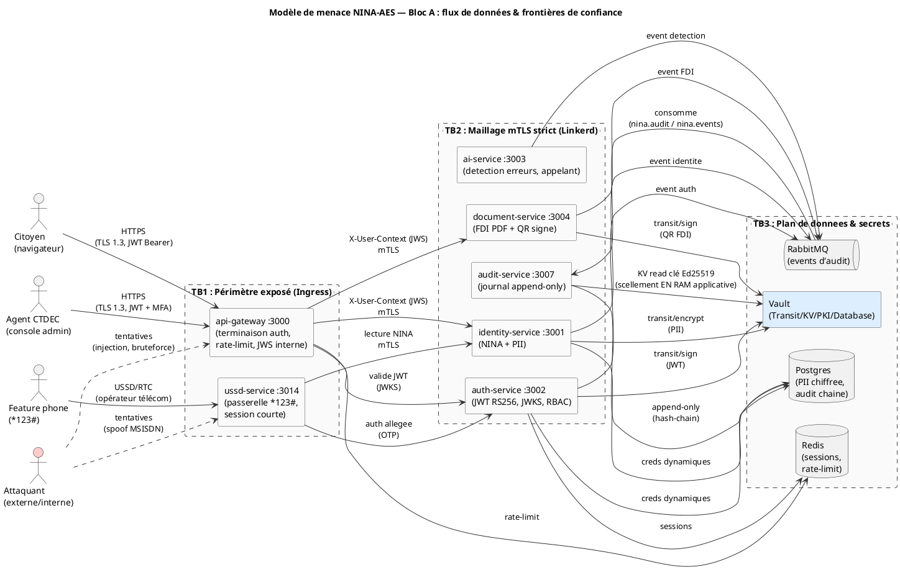

# THREAT-MODEL.md — Modèle de menace STRIDE (Bloc A : identity / auth / audit / document + frontends + USSD)

> **Document de conception sécurité** (analyse de menace, à relire avant chaque évolution d'un
> service du Bloc A). Compagnon de :
>
> - `docs/adr/ADR-034-security-hardening-vault-mtls-owasp.md` — décision d'architecture sécurité
>   (les 8 piliers de durcissement ; le **Pilier 8** rend ce fichier obligatoire) ;
> - `docs/security/SECURITY-RUNBOOK.md` — quoi faire _quand_ une menace se réalise (rotation,
>   confinement, post-mortem) ;
> - `docs/15-SECURITY-HARDENING.md` — la ligne **A04 Insecure Design** (§4.5, ligne 368) et le
>   livrable §7 (ligne 474, checklist ligne 510) pointent explicitement vers **ce fichier**.
>
> **Audience** : l'étudiant UQAR (concepteur solo), futur CISO CTDEC, auditeur ANSSI Mali / OCLEI,
> jury UQAR.
>
> **Classification** : `INTERNE — REVUE DE CONCEPTION`. Aucun secret réel ici (seulement des
> chemins, des identifiants logiques et des contre-mesures).

---

## 0. Pourquoi un modèle de menace (et pas seulement une checklist OWASP)

**Le POURQUOI avant le COMMENT.** Une checklist OWASP répond à « ai-je coché les 10 cases ? ». Un
**modèle de menace** répond à une question plus profonde : _« qui veut quoi, par où peut-il
l'atteindre, et qu'est-ce qui l'en empêche ? »_. C'est exactement ce qu'exige la catégorie **A04 —
Insecure Design** d'OWASP : la sécurité doit être pensée _au niveau de la conception_, pas ajoutée
après coup comme un pansement.

NINA-AES manipule des **données d'identité d'État** (numéros NINA, PII de citoyens, gabarits
biométriques hashés, journaux d'audit régaliens). La grille de lecture n'est donc pas celle d'un
SaaS commercial : une fuite y est un **risque de souveraineté nationale** (usurpation de masse,
ciblage de minorités, détournement électoral, mise en danger physique de lanceurs d'alerte). Le coût
d'une défaillance n'est pas un churn client : c'est une atteinte aux personnes.

On utilise **STRIDE** (Microsoft), une taxonomie de 6 familles de menaces, parce qu'elle se mappe
proprement sur les propriétés de sécurité qu'on veut garantir :

| Lettre | Menace (anglais)       | En clair                                           | Propriété violée         |
| ------ | ---------------------- | -------------------------------------------------- | ------------------------ |
| **S**  | Spoofing               | Se faire passer pour quelqu'un / quelque chose     | Authentification         |
| **T**  | Tampering              | Altérer une donnée ou un message                   | Intégrité                |
| **R**  | Repudiation            | Nier avoir fait une action (sans preuve contraire) | Non-répudiation / preuve |
| **I**  | Information disclosure | Exfiltrer une donnée confidentielle                | Confidentialité          |
| **D**  | Denial of service      | Rendre le service indisponible                     | Disponibilité            |
| **E**  | Elevation of privilege | Obtenir des droits qu'on ne devrait pas avoir      | Autorisation             |

**Honnêteté (concu ≠ implementé).** Ce document décrit la **conception cible** de la défense.
Lorsqu'une contre-mesure est _spécifiée mais pas encore déployée_, c'est écrit explicitement
(marqueur ⏳). On ne sur-vend rien : un auditeur doit distinguer ce qui _protège déjà_ de ce qui
_protégera_. Les dettes connues sont rappelées au §11.

---

## 1. Périmètre, hypothèses et zones hors-périmètre

### 1.1 Dans le périmètre (services analysés)

| Service               | Port | Techno  | Rôle régalien                                              |
| --------------------- | ---- | ------- | ---------------------------------------------------------- |
| `api-gateway`         | 3000 | NestJS  | Point d'entrée HTTP unique, terminaison d'auth (ADR-029)   |
| `identity-service`    | 3001 | NestJS  | Source de vérité du NINA + PII citoyen (CRUD identité)     |
| `auth-service`        | 3002 | NestJS  | Émission/validation JWT RS256, RBAC, JWKS, MFA             |
| `document-service`    | 3004 | NestJS  | Génération FDI (PDF) + QR signé via Vault Transit          |
| `audit-service`       | 3007 | NestJS  | Journal d'audit append-only chaîné (Merkle/hash-chain)     |
| Frontend `citizen`    | 4001 | Next.js | Portail citoyen (consultation NINA, FDI, rendez-vous)      |
| Frontend `admin`      | 4002 | Next.js | Console agent CTDEC (enrôlement, supervision)              |
| Frontend `governance` | 4003 | Next.js | Tableaux de bord gouvernance / supervision élargie         |
| Canal `USSD`          | 3014 | NestJS  | Accès _feature phone_ (`*123#`) — citoyens sans smartphone |

> ⚠️ **Note de cadrage `audit-service`.** Le brief mentionne « audit-service » et « document-service
> » dans le Bloc A. Conformément à `SERVICE_PORTS` (`packages/config/src/index.ts`), le port réel de
> l'audit est **3007** (et non 3004, qui est `document-service`). `ai-service` (3003, FastAPI) n'est
> **pas** analysé ici (hors Bloc A strict de ce livrable) mais est cité comme acteur appelant.

### 1.2 Hypothèses de confiance (ce qu'on tient pour acquis)

Un modèle de menace n'a de sens que si ses hypothèses sont explicites. On **suppose vrai** :

1. **Le maillage mTLS Linkerd est en mode `strict`** (ADR-034 P2) : tout trafic inter-pods est
   chiffré et mutuellement authentifié. Un pod sans certificat valide ne peut pas parler aux autres.
2. **Vault est la racine de confiance des secrets** (ADR-034 P1) : aucune clé privée ne vit hors de
   Vault Transit ; aucun secret en clair dans le repo / les images / les `.env` (vérifié
   `gitleaks`).
3. **Le `api-gateway` est le seul point d'entrée HTTP exposé** (ADR-029) : les ports 3001–3014 ne
   sont **pas** routables depuis Internet (NetworkPolicy + Ingress unique sur 3000).
4. **L'infrastructure hôte (K3s/nœuds CTDEC) est physiquement sécurisée** au CTDEC (rue Baba Diarra,
   Bamako), accès opérateur tracé.
5. **L'horloge des nœuds est synchronisée** (NTP souverain) — prérequis du scellement horaire
   d'audit et de la validité des TTL JWT/cert.

### 1.3 Zones hors-périmètre (explicitement non couvertes ici)

On ne peut pas tout défendre ; on déclare ce qu'on **ne traite pas** dans CE document (pour ne pas
créer de fausse impression d'exhaustivité) :

- **Sécurité physique des nœuds et du datacenter CTDEC** (caméras, contrôle d'accès, alimentation) —
  relève du plan de sécurité physique CTDEC, pas de ce modèle applicatif.
- **Compromission de la supply-chain amont** (npm/PyPI empoisonné) — atténuée par
  Trivy/`pnpm audit`/ cosign (ADR-034 P5, doc 09 A08) mais l'analyse de menace dédiée vit en CI, pas
  ici.
- **Attaques sur le matériel cryptographique de Vault** (HSM, scellement) — relève du runbook
  break-glass (§0.2 du runbook) et de la note souveraineté d'ADR-034.
- **Bloc B (interop BCID-AES inter-États)** et **modules gouvernementaux** (SIGAC, électoral) —
  périmètres distincts (ADR-021, ADR-022, ADR-023) avec leurs propres analyses.
- **Ingénierie sociale des opérateurs CTDEC** (phishing d'un agent) — traitée par MFA TOTP +
  formation, hors taxonomie technique STRIDE de ce document.

---

## 2. Actifs protégés (ce qui a de la valeur pour l'attaquant)

**Pourquoi commencer par les actifs.** On ne défend pas « le système » en général ; on défend des
**actifs** précis. Identifier ce qui vaut le détour pour un attaquant oriente toute la suite.

| Actif                               | Où il vit                                       | Sensibilité | Conséquence d'une compromission                          |
| ----------------------------------- | ----------------------------------------------- | ----------- | -------------------------------------------------------- |
| **Numéro NINA + PII citoyen**       | Postgres `identity-service`, chiffré Transit    | CRITIQUE    | Usurpation d'identité de masse, ciblage de population    |
| **Clé privée de signature JWT**     | Vault Transit `transit/keys/jwt-signing-rs256`  | CRITIQUE    | Émission de jetons d'accès forgés → accès régalien total |
| **Clé de signature QR / FDI**       | Vault Transit (ADR-026)                         | CRITIQUE    | Faux documents d'identité « valides » à grande échelle   |
| **Gabarits biométriques (hashés)**  | Postgres, salés + chiffrés (ADR-025)            | CRITIQUE    | Ré-identification, attaque par dictionnaire si sel fuité |
| **Journal d'audit append-only**     | Postgres `audit-service`, hash-chaîné (ADR-007) | ÉLEVÉE      | Effacement de traces → impunité d'un attaquant interne   |
| **Credentials Postgres dynamiques** | Vault `database/creds/<service>` (TTL 24 h)     | ÉLEVÉE      | Accès direct DB (mais fenêtre courte par design)         |
| **Sessions / refresh tokens**       | Keycloak + Redis + Postgres `auth-service`      | ÉLEVÉE      | Détournement de session citoyen/agent                    |
| **Certs clients mTLS (PKI)**        | Vault PKI `pki/issue/<service>`                 | ÉLEVÉE      | Usurpation d'un service dans le mesh                     |

---

## 3. Diagramme data-flow avec frontières de confiance (PlantUML)

**Pourquoi un data-flow diagram (DFD).** STRIDE s'applique élément par élément le long des **flux de
données** : chaque flèche qui **traverse une frontière de confiance** (zone de niveau de confiance
différent) est un point où une menace peut s'insérer. Les frontières sont matérialisées par des
cadres `rectangle` pointillés.

> 🧭 **Lecture du diagramme.** Chaque flèche **qui franchit une bordure pointillée** (`TB1` → `TB2`,
> `TB2` → `TB3`) est un point d'analyse STRIDE. Les flèches en pointillés rouges (`..>`) sont les
> chemins d'attaque. Trois frontières de confiance :
>
> - **TB1** (Internet → périmètre exposé) : c'est là que vivent injection, bruteforce, DoS
>   volumétrique.
> - **TB2** (périmètre → maillage interne) : c'est là que mTLS strict empêche le _spoofing_ de
>   service.
> - **TB3** (services → secrets/données) : c'est là que Vault empêche l'_exfiltration de clé_.

---

## 4. Analyse STRIDE par service

Pour chaque service : **actifs**, **surfaces d'attaque**, puis les 6 familles STRIDE avec
**contre-mesure** et **mapping OWASP Top 10:2021**. Le marqueur ⏳ signale une contre-mesure
_spécifiée mais pas (encore) intégralement déployée_ (cf. §11).

### 4.1 `api-gateway` (:3000) — point d'entrée unique

**Actifs en jeu** : le JWT entrant (Bearer), le JWS interne `X-User-Context` qu'il forge, les quotas
de rate-limit. **Surfaces d'attaque** : toutes les routes HTTP publiques, l'allowlist locale
(health/metrics/swagger), la fabrication du JWS interne (ADR-029).

| STRIDE | Menace concrète                                                | Contre-mesure (conception)                                                                                           | OWASP    |
| ------ | -------------------------------------------------------------- | -------------------------------------------------------------------------------------------------------------------- | -------- |
| **S**  | Un client présente un JWT forgé / expiré pour passer le bord   | Vérification RS256 via **JWKS** d'auth-service (clé publique versionnée par `kid`) ; rejet si signature/exp invalide | A07      |
| **T**  | Altération du `X-User-Context` par un service aval malveillant | JWS **HS256 signé**, `iss=nina-aes-api-gateway`, **TTL 60 s** (ADR-029) → un en-tête en clair forgé est rejeté       | A08, A01 |
| **R**  | Le client nie avoir émis une requête sensible                  | Chaque requête authentifiée émet un **event d'audit** (sub/route/ts) vers `audit-service` (append-only)              | A09      |
| **I**  | Fuite d'info via messages d'erreur verbeux / stack traces      | `debug` désactivé en prod, réponses d'erreur normalisées, pas de stack en réponse (ADR-034 P3)                       | A05, A04 |
| **D**  | Bruteforce / flood sur les routes d'auth                       | `@nestjs/throttler` (`RATE_LIMIT_CONFIG.auth` = 5/15 min) + breakers Opossum par service amont (ADR-029)             | A04      |
| **E**  | Bypass de l'auth via une route non protégée par erreur         | **Auth obligatoire par défaut** ; seule une **allowlist explicite** (health/metrics/openapi) est publique            | A01, A04 |

### 4.2 `identity-service` (:3001) — source de vérité NINA + PII

**Actifs en jeu** : numéros NINA, PII citoyen, gabarits biométriques (références). **Surfaces** :
endpoints CRUD identité (derrière le gateway), accès Postgres, appels Vault Transit pour chiffrer
les PII.

| STRIDE | Menace concrète                                                  | Contre-mesure (conception)                                                                                                                               | OWASP    |
| ------ | ---------------------------------------------------------------- | -------------------------------------------------------------------------------------------------------------------------------------------------------- | -------- |
| **S**  | Un pod compromis se fait passer pour `identity-service`          | **mTLS strict** Linkerd — cert X.509 par service, rotation 24 h (ADR-034 P2) ; refus du trafic non authentifié                                           | A07, A05 |
| **T**  | Modification non autorisée d'un dossier NINA (changement de PII) | RBAC par rôle (`@Roles()`), Prisma paramétré, `ValidationPipe` global (DTO Zod, `forbidNonWhitelisted`)                                                  | A03, A01 |
| **R**  | Un agent nie avoir modifié une identité                          | Chaque mutation publie un **event d'audit** horodaté + `sub` agent → journal append-only                                                                 | A09      |
| **I**  | Exfiltration des PII depuis la DB ou un dump                     | PII **chiffrées au repos** via `transit/encrypt` (clé hors-process), TDE Postgres, minimisation des champs exposés                                       | A02      |
| **D**  | Requêtes massives de lecture NINA pour épuiser la DB             | Rate-limit par utilisateur + pagination forcée + index ; circuit breaker côté gateway                                                                    | A04      |
| **E**  | Un citoyen lit le dossier d'un autre citoyen (IDOR)              | ⏳ Contrôle d'accès **objet par objet** (le `sub` du JWS doit correspondre au propriétaire) — **SPÉCIFIÉ, PAS implémenté** (cf. callout ci-dessous, §11) | A01      |

> 🔒 **IDOR (A01) — ⏳ DETTE ACTIVE.** Le risque le plus insidieux ici : changer un `id` (ou un
> `nina`) dans l'URL pour lire le NINA d'autrui. La contre-mesure n'est pas le filtrage côté UI mais
> une **vérification d'appartenance serveur** (`resource.ownerId === ctx.sub`). **Honnêteté : cette
> contre-mesure est ⏳ SPÉCIFIÉE mais PAS encore implémentée.** Dans le code actuel
> (`services/identity-service/src/modules/citizen/citizen.controller.ts`), les routes de lecture
> `GET /:nina`, `GET /by-id/:id` et `GET /` n'ont **ni `@Roles()` ni vérification d'appartenance**,
> et le `RolesGuard` (`roles.guard.ts:57-60`) traite **« pas de `@Roles()` = route ouverte »**. Tout
> appelant authentifié peut donc lire le NINA + PII de n'importe quel citoyen en changeant le
> paramètre d'URL : **le risque IDOR est ACTIF aujourd'hui** (cf. dette §11, matrice #3).

> ⏳ **Autorisation non auto-portée par le service (honnêteté).** L'autorisation serveur revendiquée
> ci-dessus (lignes S/T/E : `@Roles()`, liaison du `sub` JWS) **n'est pas auto-portée** par
> `identity-service` : son `RolesGuard.extractUserFromJwt` (`roles.guard.ts:86-101`) est un **stub
> V1 délibérément simplifié qui retourne `null` pour un vrai Bearer token** — la vérification
> cryptographique RS256 du JWT **n'est PAS implémentée dans le service**. Le service **dépend
> entièrement d'un middleware amont / du gateway** qui poserait `req.user` (ou un en-tête
> `X-User-Context` vérifié). Or, le helper de vérification aval de `X-User-Context` côté services
> **« reste à fournir »** (gateway README §7). Tant que ce helper n'existe pas, l'autorisation
> serveur décrite en §4.2-S/T/E **n'est garantie par aucune brique réellement déployée** (cf. dette
> §11).

### 4.3 `auth-service` (:3002) — émission/validation des jetons

**Actifs en jeu** : clé privée de signature JWT (dans Vault Transit), JWKS public, sessions /
refresh tokens, secrets MFA. **Surfaces** : login, refresh, `/.well-known/jwks.json`, lock-out.

| STRIDE | Menace concrète                                               | Contre-mesure (conception)                                                                                        | OWASP    |
| ------ | ------------------------------------------------------------- | ----------------------------------------------------------------------------------------------------------------- | -------- |
| **S**  | Bruteforce de mot de passe / credential stuffing              | **Argon2id** (hash mémoire-dur), **lock-out 5 essais** Keycloak, throttler `auth` 5/15 min, MFA TOTP agents       | A07      |
| **T**  | Forge d'un JWT par modification du payload                    | Signature **RS256 (RSA-3072 mini)** côté Vault Transit — la clé ne quitte jamais Vault ; vérif via JWKS           | A02, A08 |
| **R**  | Un utilisateur nie une connexion frauduleuse                  | Events de login/échec audités (IP, ts, résultat) → journal append-only ; corrélation possible _sans_ sur-collecte | A09      |
| **I**  | Vol de la clé privée de signature → forge illimitée de jetons | Clé **jamais exportable** (Transit) ; une RCE permet au mieux de _faire signer_ pendant la fenêtre (pic détecté)  | A02      |
| **D**  | Flood de `/login` ou de `/jwks.json` pour saturer l'auth      | Rate-limit dédié, cache JWKS (clé publique cacheable), HPA K3s ; lock-out anti-bruteforce                         | A04      |
| **E**  | Escalade de rôle (citoyen → agent → admin) via claim forgé    | Rôles signés dans le JWT (non modifiables), **RBAC Keycloak** source de vérité ; guards `@Roles()` côté service   | A01      |

> 🧭 **Rotation de clé = contre-mesure active.** Si la clé de signature est _suspectée_ compromise,
> la procédure §1.1 du **SECURITY-RUNBOOK** rote la clé + élève `min_decryption_version` + révoque
> les refresh tokens. Le modèle de menace et le runbook se répondent : ici la _conception_ de la
> défense, là l'_exécution_ sous incident.

### 4.4 `document-service` (:3004) — FDI (PDF) + QR signé

**Actifs en jeu** : clé de signature QR/FDI (Vault Transit, ADR-026), documents générés.
**Surfaces** : endpoint de génération FDI, appel `transit/sign`, rendu PDF.

| STRIDE | Menace concrète                                                 | Contre-mesure (conception)                                                                                         | OWASP    |
| ------ | --------------------------------------------------------------- | ------------------------------------------------------------------------------------------------------------------ | -------- |
| **S**  | Génération d'un FDI au nom d'un autre citoyen                   | Auth + IDOR check (le demandeur doit être le propriétaire ou un agent habilité) ; mTLS pour l'appel inter-services | A01, A07 |
| **T**  | Falsification d'un FDI / d'un QR après émission                 | QR **signé RS256 via Transit** (ADR-026) → un vérifieur (police, consulat) détecte toute altération via la clé pub | A08, A02 |
| **R**  | « Je n'ai pas émis ce FDI »                                     | `transit/sign` **audité côté Vault** (qui/quand/quelle clé) + event d'audit applicatif                             | A09      |
| **I**  | Fuite de PII via les métadonnées du PDF ou un cache mal protégé | Minimisation des champs imprimés, pas de cache public, suppression des métadonnées sensibles à la génération       | A02, A05 |
| **D**  | Génération massive de PDF pour épuiser CPU/mémoire              | Rate-limit + file d'attente bornée + timeout de rendu ; breaker côté gateway                                       | A04      |
| **E**  | Détourner `transit/sign` pour signer un payload arbitraire      | **Politique Vault de moindre privilège** : `document-service` ne peut signer **que** sur la clé FDI, pas exporter  | A01, A02 |

### 4.5 `audit-service` (:3007) — journal append-only chaîné

**Actifs en jeu** : l'intégrité du journal lui-même (c'est _la preuve_ en cas de litige).
**Surfaces** : consommateur RabbitMQ (`nina.audit` / `nina.events`), écriture Postgres append-only,
scellement horaire.

| STRIDE | Menace concrète                                                 | Contre-mesure (conception)                                                                                                                                                                                                                     | OWASP    |
| ------ | --------------------------------------------------------------- | ---------------------------------------------------------------------------------------------------------------------------------------------------------------------------------------------------------------------------------------------- | -------- |
| **S**  | Injection de faux events d'audit par un producteur illégitime   | mTLS strict + topologie RabbitMQ contrôlée ; seuls les services du mesh publient (binding authentifié)                                                                                                                                         | A07, A05 |
| **T**  | Effacement / réécriture d'une ligne pour masquer une intrusion  | **Hash-chain SHA-256** (chaque entrée référence le hash de la précédente) + scellement **Ed25519 via `@noble/ed25519`, clé privée chargée depuis Vault KV en mémoire au boot** (signing.service.ts ; ADR-007) — ⏳ voir note crypto ci-dessous | A08      |
| **R**  | Nier la chronologie réelle des évènements                       | **Scellement horaire** de la racine Merkle (**signature Ed25519 `@noble/ed25519`, clé chargée depuis Vault KV en RAM**, _pas_ `transit/sign`) + ancrage tiers (Vérificateur Général, doc 09) — ⏳ voir note crypto ci-dessous                  | A08, A09 |
| **I**  | Lecture du journal pour ré-identifier un lanceur d'alerte       | ⏳ **Anti-corrélation PARTIELLE** : pas de log debug additionnel — **mais `ipAddress` + `correlationId` sont persistés EN CLAIR** dans le journal chaîné → désanonymisation possible par un initié (voir note ci-dessous)                      | A02, A04 |
| **D**  | Noyer l'audit sous un flot d'events pour faire perdre les vrais | File RabbitMQ bornée + back-pressure + alerte sur taux anormal ; l'audit ne bloque pas le chemin critique                                                                                                                                      | A04      |
| **E**  | Obtenir un accès en écriture directe à la table d'audit         | Append-only au niveau applicatif **et** DB (révocation `UPDATE/DELETE` sur la table), creds dynamiques courts                                                                                                                                  | A01      |

> ⚠️ **Drift de topologie connu (honnêteté).** L'audit consomme `nina.audit` + `nina.events`, mais
> certains producteurs (ex. `document-service`) publiaient historiquement sur `audit.events` →
> **events potentiellement non captés**. Réconciliation côté _publishers_ en cours (mémoire projet «
> audit RabbitMQ topology drift »). Tant que ce n'est pas réconcilié, le journal peut avoir des
> **angles morts** : un audit de complétude doit le vérifier.

> ⏳ **Note crypto — le scellement audit N'utilise PAS Transit (honnêteté).** Contrairement aux clés
> JWT (§4.3) et QR/FDI (§4.4) qui vivent **hors-process** dans **Vault Transit** (la clé ne quitte
> jamais Vault, signature déléguée à Vault), le scellement du journal d'audit signe **côté
> applicatif** avec `@noble/ed25519` et une **clé privée Ed25519 chargée depuis Vault KV en mémoire
> au démarrage** (`services/audit-service/src/audit/signing.service.ts`, `private_key_hex`). **La
> clé de scellement VIT donc EN RAM applicative** : une RCE sur `audit-service` permet de
> **l'exfiltrer** (puis de re-sceller une chaîne falsifiée hors-ligne). **L'argument « la clé ne
> quitte jamais Vault / non exfiltrable » des §4.3-I / §4.4-E NE s'applique PAS à l'audit.** De
> plus, si Vault est indisponible au boot, le service **génère silencieusement une clé éphémère de
> secours** (`signing.service.ts:79-88`, `keyId=ephemeral-dev`) et scelle avec une clé jetable qui
> **ne survit pas au restart** — un scellement signé par cette clé n'a **aucune valeur probante**.
> _Correctif visé (§11)_ : migrer le scellement vers `transit/sign` (clé hors-process) ou un HSM, et
> **refuser de sceller** plutôt que de basculer sur une clé éphémère en prod.

> ⏳ **Note lanceurs d'alerte — désanonymisation résiduelle (honnêteté).** La ligne **I** ci-dessus
> est partiellement fausse en l'état du code : le schéma d'audit **persiste `ipAddress` EN CLAIR**
> (validé par regex, **pas haché**) **et `correlationId`** par entrée, à l'intérieur du journal
> append-only chaîné (`chain.ts:69-70`, `audit.normalizer.ts:74-116`, `audit.service.ts:335-360`).
> Combiné au **scellement horaire Ed25519 (timing précis)**, un DBA / initié lisant le journal peut
> **désanonymiser un lanceur d'alerte** en croisant **IP + `correlationId` + horodatage** — c'est
> exactement la menace que la ligne I prétendait neutraliser. **Risque RÉSIDUEL réel.** _Correctif
> visé (§11, matrice)_ : **hacher/tronquer l'IP et le `correlationId`** pour les events touchant des
> lanceurs d'alerte (ou **cloisonner** ces events dans un journal séparé à accès restreint).

### 4.6 Frontends `citizen` / `admin` / `governance` (:4001 / :4002 / :4003) — Next.js

**Actifs en jeu** : la session de l'utilisateur, le JWT en mémoire, le rendu SSR. **Surfaces** : le
DOM (XSS), les en-têtes HTTP, le BFF (Backend-for-Frontend), le stockage navigateur.

| STRIDE | Menace concrète                                                   | Contre-mesure (conception)                                                                                          | OWASP    |
| ------ | ----------------------------------------------------------------- | ------------------------------------------------------------------------------------------------------------------- | -------- |
| **S**  | Phishing / clickjacking pour voler une session agent              | MFA TOTP (admin/governance), `X-Frame-Options: DENY`, COOP `same-origin` (Helmet, ADR-034 P3/P6)                    | A07      |
| **T**  | XSS stocké/réfléchi injecte un script dans la page                | ⏳ **CSP à `nonce`** par requête (ADR-034 P6, _prod en cours_) ; encodage de sortie React ; pas de `dangerouslySet` | A03      |
| **R**  | Action sensible non traçable côté client                          | Les actions sensibles transitent par le BFF → event d'audit serveur (le client ne « prouve » rien seul)             | A09      |
| **I**  | Fuite du JWT via `localStorage` accessible au XSS                 | Token en mémoire / cookie `HttpOnly`+`Secure`+`SameSite`, jamais en `localStorage` ; CSP limite l'exfil             | A02, A05 |
| **D**  | Déni de service côté SSR (rendu coûteux non borné)                | Rate-limit BFF, timeouts, pagination ; l'essentiel du DoS est absorbé au gateway                                    | A04      |
| **E**  | Un citoyen accède à des écrans admin (autorisation côté UI seule) | Autorisation **vérifiée serveur** (le rôle du JWT décide), pas seulement masquage d'UI → pas de privilège implicite | A01, A04 |

> 🧭 **CORS / HSTS / CSP liste blanche.** L'`origin` CORS est lue depuis `@nina-aes/config` (liste
> blanche stricte, jamais `*`), HSTS `maxAge` 1 an + `preload`, CSP basée `nonce` (ADR-034 P3/P6).
> La dette honnête : la CSP `nonce` **prod** est _spécifiée, en cours_ (§11).

### 4.7 Canal `USSD` (:3014) — accès _feature phone_ (`*123#`)

**Pourquoi un traitement à part.** L'USSD est le canal d'**inclusion** : il sert les citoyens sans
smartphone (majorité rurale). Mais c'est aussi le canal le **moins protégé cryptographiquement** :
il transite par le réseau de l'opérateur télécom (hors du contrôle CTDEC), sans TLS de bout en bout,
et identifie l'usager par son **MSISDN** (numéro de téléphone), facilement _spoofable_.

**Actifs en jeu** : la session USSD courte, l'OTP, le numéro NINA consulté. **Surfaces** : la
passerelle opérateur, le MSISDN entrant, la session USSD (stateful, courte).

| STRIDE | Menace concrète                                     | Contre-mesure (conception)                                                                                                                                                                                                                                                                                                                                   | OWASP    |
| ------ | --------------------------------------------------- | ------------------------------------------------------------------------------------------------------------------------------------------------------------------------------------------------------------------------------------------------------------------------------------------------------------------------------------------------------------ | -------- |
| **S**  | _Spoofing_ du MSISDN pour usurper un citoyen        | **OTP** envoyé sur le numéro déclaré + binding MSISDN↔NINA pré-enregistré ; pas d'action sensible sur MSISDN seul                                                                                                                                                                                                                                            | A07      |
| **T**  | Manipulation de la session USSD (injection de menu) | Session stateful **côté serveur** (jamais l'état dans la réponse client), validation stricte des entrées                                                                                                                                                                                                                                                     | A03      |
| **R**  | Un usager nie une opération faite par USSD          | ⏳ Event d'audit par interaction (MSISDN **haché**, ts, action) → journal append-only — **non implémenté** : `ussd-service` ne publie aujourd'hui aucun event d'audit (pas de producteur RabbitMQ dans `src/modules/ussd/`), et le journal d'audit stocke `ipAddress`/`actorId` **en clair** (§4.5-I) ; le hachage MSISDN reste à câbler côté publisher USSD | A09      |
| **I**  | Interception du contenu USSD chez l'opérateur       | **Minimisation** : ne jamais renvoyer la PII complète en USSD (statut « valide/invalide » plutôt que le NINA brut)                                                                                                                                                                                                                                           | A02      |
| **D**  | Flood de sessions USSD pour saturer la passerelle   | Rate-limit par MSISDN + sessions à TTL court + quotas côté passerelle opérateur                                                                                                                                                                                                                                                                              | A04      |
| **E**  | Accès à des opérations réservées via le menu USSD   | Menu restreint aux opérations _à faible sensibilité_ (consultation statut), jamais d'admin par USSD                                                                                                                                                                                                                                                          | A01, A04 |

> 🔒 **Principe USSD : moins on expose, mieux c'est.** Le canal étant le plus faible, sa conception
> **limite délibérément** ce qu'on peut y faire : consultation de statut, prise de rendez-vous,
> notifications — **jamais** de modification d'identité ni de génération de FDI. C'est un choix de
> _réduction de surface_ (A04 Insecure Design).

---

## 5. Mapping de synthèse OWASP Top 10:2021 → couverture Bloc A

**Pourquoi cette table.** Elle ferme la boucle avec `docs/15-SECURITY-HARDENING.md §4.5` : pour
chaque catégorie OWASP, où la défense est-elle conçue dans le Bloc A.

| OWASP 2021                        | Couverture dans ce modèle de menace                                                                                                      | Services principaux                 |
| --------------------------------- | ---------------------------------------------------------------------------------------------------------------------------------------- | ----------------------------------- |
| **A01** Broken Access Control     | RBAC `@Roles()` (mutations), ⏳ IDOR checks objet-par-objet **non implémentés** (lectures identity ouvertes, §4.2), autorisation serveur | identity, document, frontends, USSD |
| **A02** Cryptographic Failures    | Transit (clé hors-process), TDE Postgres, TLS 1.3, mTLS, Argon2id                                                                        | auth, identity, document, audit     |
| **A03** Injection                 | Prisma paramétré, Zod + `ValidationPipe`, validation USSD/SSR                                                                            | tous                                |
| **A04** Insecure Design           | **Ce document** (STRIDE), réduction de surface USSD, défaut « deny »                                                                     | gateway, USSD, frontends            |
| **A05** Security Misconfiguration | `applyHardening()`, mTLS strict, erreurs normalisées, debug off prod                                                                     | tous (⏳ package à créer)           |
| **A06** Vulnerable Components     | Trivy / `pnpm audit` / Bandit / cosign (CI, ADR-034 P5)                                                                                  | CI — hors flux runtime              |
| **A07** Identification & Auth     | Keycloak + MFA TOTP, lock-out, JWKS, OTP USSD                                                                                            | auth, gateway, USSD, frontends      |
| **A08** Software & Data Integrity | Hash-chain audit, QR signé, JWS interne, images signées cosign                                                                           | audit, document, gateway            |
| **A09** Logging & Monitoring      | Audit append-only, events par mutation ; ⏳ anti-corrélation **partielle** (IP+`correlationId` encore en clair, §4.5-I)                  | audit + tous (producteurs)          |
| **A10** SSRF                      | Pas de fetch server-side d'URL utilisateur ; allowlist CORS                                                                              | gateway, frontends (BFF)            |

---

## 6. Matrice de risque (probabilité × impact)

**Pourquoi prioriser.** On ne corrige pas tout en même temps. La matrice classe les menaces
résiduelles (= après contre-mesures conçues) par **probabilité** d'occurrence × **impact** si elle
se réalise. Score = P × I, sur une échelle 1 (faible) à 5 (extrême).

**Échelle.** Probabilité : 1 rare · 2 peu probable · 3 possible · 4 probable · 5 quasi-certain.
Impact : 1 mineur · 2 limité · 3 sérieux · 4 grave · 5 catastrophique (souveraineté).

| #   | Menace résiduelle                                                                                                                                                     | Service        | P   | I   | Score | Priorité    |
| --- | --------------------------------------------------------------------------------------------------------------------------------------------------------------------- | -------------- | --- | --- | ----- | ----------- |
| 1   | Vol de la clé de signature JWT/QR (RCE + exfil Transit)                                                                                                               | auth, document | 1   | 5   | 5     | 🔴 Élevée   |
| 2   | XSS frontend tant que CSP `nonce` prod non déployée                                                                                                                   | frontends      | 3   | 4   | 12    | 🔴 Élevée   |
| 3   | IDOR (lecture du NINA d'autrui) — check d'appartenance ⏳ **PAS implémenté** (routes `GET /:nina`, `/by-id/:id`, `/` sans `@Roles()` ni ownership ; risque **ACTIF**) | identity       | 4   | 5   | 20    | 🔴 Élevée   |
| 4   | Bruteforce d'auth                                                                                                                                                     | auth, gateway  | 4   | 3   | 12    | 🔴 Élevée   |
| 5   | Angle mort d'audit (drift topologie RabbitMQ)                                                                                                                         | audit          | 3   | 4   | 12    | 🔴 Élevée   |
| 6   | Spoofing MSISDN sur USSD                                                                                                                                              | USSD           | 3   | 3   | 9     | 🟠 Moyenne  |
| 7   | Secret lu via `process.env.VAULT_TOKEN` (dette P7)                                                                                                                    | tous           | 2   | 4   | 8     | 🟠 Moyenne  |
| 8   | DoS volumétrique sur le gateway                                                                                                                                       | gateway        | 3   | 3   | 9     | 🟠 Moyenne  |
| 9   | Exfiltration de PII via dump DB                                                                                                                                       | identity       | 1   | 5   | 5     | 🟠 Moyenne  |
| 10  | Spoofing d'un service dans le mesh (sans mTLS)                                                                                                                        | tous (TB2)     | 1   | 5   | 5     | 🟢 Faible\* |
| 11  | Fuite d'info via stack trace en prod                                                                                                                                  | tous           | 2   | 2   | 4     | 🟢 Faible   |
| 12  | **Désanonymisation lanceur d'alerte** via IP + `correlationId` + timing dans l'audit (champs **en clair**, §4.5-I)                                                    | audit          | 3   | 5   | 15    | 🔴 Élevée   |
| 13  | Exfiltration de la clé de scellement audit (Ed25519 **en RAM**, pas Transit) via RCE → re-scellement d'une chaîne falsifiée (§4.5 note crypto)                        | audit          | 2   | 5   | 10    | 🔴 Élevée   |

> \* La menace #10 a un **impact 5** mais une **probabilité 1** _parce que_ mTLS strict est conçu
> pour la neutraliser. Si mTLS passe accidentellement en `permissive`, la probabilité remonte à 4 →
> la matrice se relit. La matrice mesure le **risque résiduel après contre-mesure conçue**, pas le
> risque brut.
>
> **Lecture priorité.** Les lignes **3/12/13/2/5/4** (score ≥ 10, _réellement_ exposées faute de
> déploiement complet) sont les **chantiers prioritaires** : **#3 implémenter d'urgence le check
> IDOR d'appartenance** (`@CurrentUser` + `ownerId === sub` sur `GET /:nina`, `/by-id/:id`, `/` —
> aujourd'hui routes ouvertes, score remonté à **20**) ; **#12 hacher/tronquer IP+`correlationId`**
> (ou cloisonner) pour les lanceurs d'alerte ; **#13 migrer le scellement audit vers
> `transit/sign`** (clé hors-process) + refuser la clé éphémère en prod ; finaliser la CSP `nonce`
> prod (#2) ; réconcilier la topologie RabbitMQ (#5) ; valider les seuils throttler (#4). **Note
> d'honnêteté** : les scores #3/#12 reflètent un risque **ACTIF aujourd'hui** (contre-mesure non
> implémentée), pas un résiduel après défense conçue.

---

## 7. Frontières de confiance — synthèse défensive

| Frontière | Du → Vers                       | Risque dominant       | Garde-frontière conçu                                  |
| --------- | ------------------------------- | --------------------- | ------------------------------------------------------ |
| **TB1**   | Internet/RTC → périmètre exposé | Injection, DoS, spoof | api-gateway (auth + rate-limit), OTP USSD, WAF/Ingress |
| **TB2**   | Périmètre → maillage interne    | Spoofing de service   | **mTLS strict Linkerd** (cert X.509 par service)       |
| **TB3**   | Services → secrets / données    | Exfiltration de clé   | **Vault** (clé hors-process) + creds dynamiques 24 h   |

Chaque frontière a **un** garde-frontière principal et bien identifié : c'est ce qui rend la défense
_auditable_ (un évaluateur vérifie 3 frontières, pas 50 flux).

---

## 8. Liens avec les autres documents sécurité

| Question                                            | Document de référence                                     |
| --------------------------------------------------- | --------------------------------------------------------- |
| _Pourquoi_ ces choix d'architecture sécurité ?      | `docs/adr/ADR-034-security-hardening-vault-mtls-owasp.md` |
| _Quoi faire_ quand une menace se réalise ?          | `docs/security/SECURITY-RUNBOOK.md`                       |
| _Comment_ durcir (checklist OWASP appliquée) ?      | `docs/15-SECURITY-HARDENING.md` (§4.5 — A04 pointe ici)   |
| _Où_ vit chaque secret et que casse sa rotation ?   | `SECURITY-RUNBOOK.md §8` (registre des secrets)           |
| Audit chaîné / non-répudiation                      | `docs/adr/ADR-007-merkle-audit.md`                        |
| Signature QR / FDI hors-process                     | `docs/adr/ADR-026-vault-transit-qr-signing.md`            |
| Terminaison d'auth au bord + JWS interne            | `docs/adr/ADR-029-api-gateway-auth-termination-jws.md`    |
| Protection des lanceurs d'alerte (anti-corrélation) | `docs/adr/ADR-023-sigac-ml-stack-lanceurs-alerte.md`      |

---

## 9. Méthode d'application (comment utiliser ce modèle au quotidien)

**Pourquoi une procédure.** Un modèle de menace qui n'est relu qu'une fois meurt. On l'intègre au
cycle de développement (réponse directe à **A04 Insecure Design**).

1. **Avant de créer un nouveau service** : copier la grille STRIDE (§4) vierge, la remplir pour le
   nouveau service, identifier ses actifs et les frontières qu'il traverse.
2. **Avant d'ajouter un endpoint** : se demander quel actif il expose et quelle ligne STRIDE il
   ouvre (surtout S/I/E). Un endpoint sans auth est un défaut de conception, pas un oubli mineur.
3. **À chaque revue de PR sécurité** : vérifier que la PR ne déplace pas une menace de 🟢 vers 🔴
   (ex. désactiver un check IDOR, passer mTLS en `permissive`, retirer un rate-limit).
4. **Trimestriellement** : relire la matrice de risque (§6), réévaluer P×I à la lumière des dettes
   résolues, mettre à jour les scores.

---

## 10. Acteurs & profils de menace (qui attaque ?)

**Pourquoi modéliser l'attaquant.** Les contre-mesures dépendent de _qui_ on affronte. Un script
kiddie et un service de renseignement étatique n'ont ni les mêmes moyens ni les mêmes cibles.

| Profil                     | Motivation                               | Capacité    | Cible privilégiée                                       |
| -------------------------- | ---------------------------------------- | ----------- | ------------------------------------------------------- |
| Opportuniste externe       | Revente de PII, rançon                   | Faible      | Endpoints exposés, injections triviales                 |
| Fraudeur d'identité        | Faux FDI, usurpation ciblée              | Moyenne     | document-service, IDOR identity                         |
| Initié malveillant (agent) | Abus de privilège, effacement de traces  | Élevée      | audit-service, RBAC, escalade                           |
| Attaquant étatique / APT   | Surveillance de masse, ciblage minorités | Très élevée | clés Transit, PII en masse, lanceurs d'alerte           |
| Chercheur de bonne foi     | Signaler une faille (allié potentiel)    | Variable    | tout — canalisé par responsible disclosure (runbook §7) |

> 🧭 **Conséquence de conception.** Parce que le profil **APT étatique** est dans le modèle
> (réaliste pour une identité nationale), on **ne se contente pas** d'OWASP : d'où
> l'anti-corrélation pour les lanceurs d'alerte, le scellement horaire de l'audit, et le refus
> catégorique de toute dépendance étrangère sur le chemin critique (pas d'AWS KMS, pas de SaaS US —
> cf. ADR-034 note souveraineté).

---

## 11. Dette honnête (concu ≠ implementé)

Conformément au principe d'honnêteté du projet, voici ce qui est **spécifié mais pas (entièrement)
déployé** — donc _des risques résiduels réels aujourd'hui_ :

- ⏳ **`applyHardening()` (`@nina-aes/security`)** : centralise Helmet/CORS/throttler/validation —
  **package pas encore créé** (ADR-034 P3). Tant qu'il n'existe pas, le hardening dépend de chaque
  `main.ts` (risque A05 par divergence).
- ⏳ **CSP à `nonce` en prod** : spécifiée, _en cours_ de déploiement Next.js (ADR-034 P6). Tant
  qu'elle n'est pas active, le risque XSS (#2 matrice) reste réaliste.
- ⏳ **AppRole / ServiceAccount + lease renewal** : certains scaffolds lisent encore
  `process.env.VAULT_TOKEN` (ADR-034 P7, dette §11). Le passage à l'identité courte durée est
  spécifié, pas généralisé (#7 matrice).
- ⏳ **Topologie RabbitMQ d'audit** : drift `audit.events` vs `nina.audit`/`nina.events` à
  réconcilier côté publishers → **angle mort d'audit possible** (#5 matrice). Vérifier la complétude
  avant de considérer le journal comme exhaustif.
- ⏳ **OTP / binding MSISDN↔NINA USSD** : conçu ; la robustesse du binding contre le spoofing MSISDN
  dépend du déploiement effectif (#6 matrice).
- ⏳ **Check IDOR d'appartenance objet-par-objet (`identity-service`)** : **PAS implémenté**. Les
  routes de lecture `GET /:nina`, `GET /by-id/:id`, `GET /` de `citizen.controller.ts` n'ont **ni
  `@Roles()` ni vérification `ownerId === sub`** ; le `RolesGuard` (`roles.guard.ts:57-60`) traite «
  pas de `@Roles()` = route ouverte ». **Risque IDOR ACTIF** (#3 matrice, P×I=20). _Correctif_ :
  ajouter `@CurrentUser` + contrôle d'appartenance (et/ou `@Roles(AGENT…)`) sur ces routes, avec
  tests.
- ⏳ **Vérification JWT auto-portée (`identity-service`)** : `RolesGuard.extractUserFromJwt`
  (`roles.guard.ts:86-101`) est un **stub V1 qui retourne `null`** pour un vrai Bearer token — la
  vérif RS256 **n'est pas dans le service**. L'autorisation dépend d'un middleware amont/gateway,
  mais le helper de vérification aval `X-User-Context` **« reste à fournir »** (gateway README §7).
  Tant que ce helper n'existe pas, l'autorisation serveur (§4.2-S/T/E) **n'est pas garantie**.
- ⏳ **Scellement audit hors-process** : le scellement Ed25519 charge la **clé privée en RAM**
  depuis Vault KV (`signing.service.ts`) au lieu d'utiliser `transit/sign` → **clé exfiltrable via
  RCE** (#13 matrice) ; pire, **fallback silencieux sur clé éphémère** si Vault est down
  (`signing.service.ts:79-88`). _Correctif_ : migrer vers `transit/sign` (ou HSM) et **refuser de
  sceller** en prod plutôt que de générer une clé jetable.
- ⏳ **Anti-corrélation lanceurs d'alerte dans l'audit** : `ipAddress` + `correlationId` sont
  **persistés en clair** dans le journal chaîné (`chain.ts:69-70`, `audit.normalizer.ts:74-116`,
  `audit.service.ts:335-360`) ; couplés au scellement horaire (timing précis), ils permettent une
  **désanonymisation par un initié** (#12 matrice). _Correctif_ : **hacher/tronquer IP et
  `correlationId`** pour les events sensibles, ou **cloisonner** ces events dans un journal à accès
  restreint. Idem côté USSD : le hachage MSISDN dans l'event d'audit (§4.7-R) **n'est pas câblé**
  (`ussd-service` ne publie aucun event aujourd'hui).

> 📋 **Maintenance.** Toute résolution d'une de ces dettes **doit** mettre à jour la matrice de
> risque (§6) et, si elle change un flux, le diagramme (§3) — dans le même changement (cf.
> `MAINTENANCE.md`).

---

_Document — Juin 2026 · NINA-AES Platform · UQAR · INTERNE — REVUE DE CONCEPTION_
